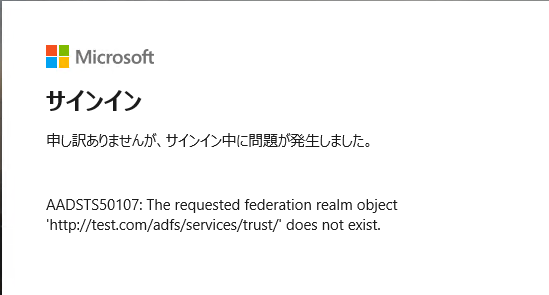

# AADSTS50107 The requested federation realm object 'xxx' does not exist. (Issuer ID / Issuer URI と SupportMultipleDomain)

こんにちは、Azure & Identitiy サポートチームの竹村です。
今回は、多くのお客様からお問合せをいただく AADSTS50107 のエラーについて、その意味や対応方法をご紹介します。

## 1. ADSTS50107  と  Issuer ID、 Issuer URI

最初に、AADSTS50107 のエラーの内容と、その背景にある Issuer ID、および Issuer URI と呼ばれるものについて説明します。<br>
<br>
Issuer ID は、Azure AD と連携する IdP (例えば AD FS など) が発行するクレームです。
AD FS (WS-Federation) の場合は、具体的には以下のクレームになります。<br>

```
http://schemas.microsoft.com/ws/2008/06/identity/claims/issuerid
```
一方、Azure AD のカスタムドメインには、フェデレーションの設定を行う際に Issuer URI というものが設定されます。
AD FS の場合、通常は  Convert-MsolDomainToFederated コマンドレットや、Update-MsolFederatedDomain コマンドレットを使用してフェデレーションの設定を行いますが、この Powershell の処理で Issuer URI が設定されます。<br>
<br>
Azure AD でのフェデレーション認証の要件として、IdP が発行する Issuer ID が、認証されたユーザーのドメインに設定されている Issuer URI と合致している必要があります。
AADSTS50107 は、IdP が発行した Issuer ID と、Azure AD のカスタムドメインにセットされている Issuer URI とが、合致しなかったことを示すエラーです。<br>

 

上記のように、エラー画面には "realm object" と "does not exist." の間に文字列が表示されますが、これが IdP が発行した Issuer ID になります。
そして、Azure AD のカスタムドメインには、ここに表示されている文字列の Issuer URI が存在していないことを示しています。
Azure AD のカスタムドメインに設定されている Issuer URI を確認するためには、Get-MsolDomainFederationSettings コマンドレットなどを使用します。<br>

```
Get-MsolDomainFederationSettings -DomainName "test.com"
```
上記コマンドを実行した結果の IssuerUri の値を確認してください。


## 2. -supportMultipleDomain オプションについて

次に、AADSTS50107 のエラーと密接に関わり合う -supportMultipleDomain オプションについて説明します。
AD FS で Convert-MsolDomainToFederated コマンドレットや、Update-MsolFederatedDomain コマンドレットを使用してフェデレーションの設定を行う時に、-supportMultipleDomain というオプションを指定することがあります。
これは、1 つの AD FS ファームと、複数のカスタムドメインとの間でフェデレーションの設定を行う場合に必要となるオプションです。
この背景には、カスタムドメインに設定する Issuer URI は、重複が許可されず必ず一意にする必要がある、という Azure AD の要件があります。<br>
<br>
AD FS と Azure AD のカスタムドメインが 1 対 1 の場合には、-supportMultipleDomain オプションは必要ありません。
-supportMultipleDomain オプションを指定しない場合、 Convert-MsolDomainToFederated コマンドレットや、Update-MsolFederatedDomain コマンドレットは、AD FS の識別子 (`http://<フェデレーションサービス名>/services/trust`) を Issuer URI としてカスタムドメインに設定します。<br>
AD FS 側では Issuer URI を発行するクレームルールは作成されません。
ルールがない場合、AD FS は既定で Issuer ID として AD FS の識別子 (`http://<フェデレーションサービス名>/services/trust`)  をクレームにセットするため、カスタムドメイン側の Issuer URI と合致し、要件を満たすことができます。<br>
<br>
-supportMultipleDomain オプションを指定すると、Azure AD のカスタムドメイン側には、`http://<カスタムドメイン>/services/trust/`  という値が Issuer URI にセットされます。
例えば、a.com と b.com という 2 つのドメインに対して、-supportMultipleDomain オプションを指定して 1 つの AD FS ファームとフェデレーションを構成すると、それぞれのドメインには以下の Issuer URI がセットされます。<br>

```
a.com
http://a.com/services/trust/

b.com
http://b.com/services/trust/
```
一方で、AD FS 側には -supportMultipleDomain オプションを指定すると、以下のように認証するユーザーの UPN に応じて Issuer ID をを発行するルール (発行変換規則) が作成されます。

```
c:[Type == "http://schemas.xmlsoap.org/claims/UPN"]
 => issue(Type = "http://schemas.microsoft.com/ws/2008/06/identity/claims/issuerid", Value = regexreplace(c.Value, ".+@(?<domain>.+)", "http://${domain}/adfs/services/trust/"));
```
例えば、`user01@a.com` というユーザーで認証した場合、上記のルールによって UPN の @ 以下のドメイン部分が抽出されて、`http://a.com/adfs/services/trust/` という値が Issuer ID にセットされます。
また、`user02@b.com` というユーザーで認証した場合、同様に `http://b.com/adfs/services/trust/` という値が Issuer ID にセットされます。<br>
<br>
このようにして、各ドメインの Issuer ID と IssuerURI の整合性を取ることを意図したものが、-supportMultipleDomain オプションの正体です。<br>
<br>
なお、1 対 1 の場合であっても、-supportMultipleDomain オプションを指定しても問題はありません。
例えば、上記の例で a.com しか存在しない場合でも Issuer ID と Issuer URI の整合性は保たれます。
Azure AD Connect のウィザードで AD FS を構成、管理している場合には、1 対 1 の場合にも -supportMultipleDomain  オプションを指定してフェデレーションが構成されます。<br>

## 3. トップレベルドメインとサブドメイン、エラー発生のシナリオについて

Azure AD では、サブドメインを作成することができます。
例えば、a.com というドメインのサブドメインとして、sub1.a.com を作成することができます。
このサブドメインの取り扱いは少々複雑で、注意が必要です。
具体的には、親子関係が存在する場合と、存在しない場合とに分けられます。<br>

### (1) サブドメインを先に作成した場合
最初に sub1.a.com を作成し、後から a.com を作成した場合、親子関係は結ばれません。
両方がトップレベルドメインとして扱われ、sub1.a.com と  a.com  は別々のドメインとみなされ、それぞれ固有のフェデレーションの設定を保持することができます。
このケースでは、既定のルールでも問題は発生しません。
上述の a.com と b.com の場合と同様の動作になります。
ただし、さらにここから sub2.a.com を作成しますと、sub1.a.com と a.com は別々のドメインですが、a.com と sub2.a.com との間には親子関係が結ばれることになります。
この場合、後述の「4. より複雑な環境におけるルールの作成例」を考慮して、ルールを書き換える必要があります。<br>

### (2) サブドメインを後から作成した場合
最初に a.com を作成し、後から sub1.a.com を作成した場合、a.com と sub1.a.com との間には「親子関係」が結ばれます。
親子関係が結ばれる場合、子 (サブ) ドメインの認証方式は、すべて親ドメインの設定を継承します。
例えば、親ドメインがマネージド ドメインであれば子もマネージドになり、親ドメインがフェデレーション ドメインであれば子もフェデレーションになります。
フェデレーションの設定も親ドメインのものを継承します。
ここで注意が必要なのが、Issuer URI の設定についても親ドメインしか持たないということです。
つまり、子ドメインのユーザーで認証した場合でも、親ドメインに設定されている Issuer URI に合致する Issuer ID を AD FS で発行する必要があります。<br>
<br>
AD FS と 親ドメインが 1 対 1 で、-supportMultipleDomain を指定していない場合には、問題は生じません。
親ドメインであっても、子ドメインであっても、既定の AD FS の識別子 (`http://<フェデレーションサービス名>/services/trust`) が固定で Issuer ID にセットされ、親ドメインにも同一の値が Issuer URI としてセットされているためです。<br>
<br>
-supportMultipleDomain を指定している場合には、既定のルールでは問題が発生します。
例えば、`user01@sub1.a.com` というユーザーで認証した場合を考えます。
この時、既定のルールですと、UPN の @ 以下のドメイン部分が抽出されて、`http://sub1.a.com/adfs/services/trust/` という値が Issuer ID にセットされます。
しかし、親ドメインの Issuer URI は `http://a.com/adfs/services/trust/` ですので合致しません。<br>
<br>
AADSTS50107 のエラーメッセージに、`http://sub1.a.com/adfs/services/trust/` のような、サブドメインの UPN からそのまま抽出して作成された値が表示されている場合、ほとんどがこのケースに該当します。<br>
<br>
以下の既定のルールを削除して<br>

```
c:[Type == "http://schemas.xmlsoap.org/claims/UPN"]
 => issue(Type = "http://schemas.microsoft.com/ws/2008/06/identity/claims/issuerid", Value = regexreplace(c.Value, ".+@(?<domain>.+)", "http://${domain}/adfs/services/trust/"));
```

以下のようなルールに書き換えることで対処することができます。

```
c:[Type == "http://schemas.xmlsoap.org/claims/UPN"]
=> issue(Type = "http://schemas.microsoft.com/ws/2008/06/identity/claims/issuerid", Value = regexreplace(c.Value, "(?i)(^([^@]+)@)(.*)(?<domain>(a\.com))$", "http://${domain}/adfs/services/trust/"));
```

a.com の他にもトップレベルドメインが存在する場合 (-supportMultipleDomain を指定している場合、ほとんどがこちらのケースに該当するかと思います) は、以下のようにルールを記述します。

```
c:[Type == "http://schemas.xmlsoap.org/claims/UPN"]
=> issue(Type = "http://schemas.microsoft.com/ws/2008/06/identity/claims/issuerid", Value = regexreplace(c.Value, "(?i)(^([^@]+)@)(.*)(?<domain>(a\.com|b\.co\.jp|c\.net))$", "http://${domain}/adfs/services/trust/"));
```

上記は、a.com、b.co.jp、c.net というトップレベルドメインと、その子ドメインが存在する環境に対応したルールです。<br>
以下のような構成に対応したものになります。<br>

```
a.com (親 ドメイン)
   sub1.a.com (子ドメイン)
   sub2.a.com (子ドメイン) 

b.co.jp (親 ドメイン)
   sub1.b.co.jp (子ドメイン)
   sub2.b.co.jp (子ドメイン) 

c.net (親 ドメイン)
   sub1.c.net (子ドメイン)
   sub2.c.net (子ドメイン) 
```
ルールに列挙したドメイン  (\ は . をエスケープしています) と、その親子関係のあるサブドメインすべてについて、それぞれの親ドメインに相当する部分を抽出して Issuer ID をセットします。<br>

<br>
なお、Azure AD Connect で AD FS を構成、管理している場合には、自動で以下のようなルールが作成されます。<br>

```
c1:[Type == "http://schemas.xmlsoap.org/claims/UPN"] && c2:[Type == "http://schemas.microsoft.com/ws/2012/01/accounttype", Value == "User"] 
=> issue(Type = "http://schemas.microsoft.com/ws/2008/06/identity/claims/issuerid", Value = regexreplace(c1.Value, "(?i)(^([^@]+)@)(?<domain>(a\.com|b\.co\.jp|c\.net))$", "http://${domain}/adfs/services/trust/"));
```
しかし、この自動的に作成されるルールは、子ドメインに対応していません。
Azure AD Connect で構成、管理している場合で、子ドメインが存在する場合には、以下のように `(?i)(^([^@]+)@)` と `(?<domain>` との間に  `(.*)` を追記してください。

```
c1:[Type == "http://schemas.xmlsoap.org/claims/UPN"] && c2:[Type == "http://schemas.microsoft.com/ws/2012/01/accounttype", Value == "User"] 
=> issue(Type = "http://schemas.microsoft.com/ws/2008/06/identity/claims/issuerid", Value = regexreplace(c1.Value, "(?i)(^([^@]+)@)(.*)(?<domain>(a\.com|b\.co\.jp|c\.net))$", "http://${domain}/adfs/services/trust/"));
```

AADSTS50107 のエラーメッセージに子ドメインのユーザーの UPN がそのまま表示されている場合、ほとんどがこちらのケースに該当します。<br>

## 4. より複雑な環境におけるルールの作成例
例えば、sub1.a.com、a.com、sub2.a.com の順番にドメインを作成し、また他に b.co.jp、sub1.b.co.jp  の順番でドメインを作成したとします。
以下のような構成になります。<br>

```
sub1.a.com (トップレベル ドメイン)

a.com (トップレベル ドメイン)
  sub2.a.com (a.com の 子ドメイン)

b.co.jp (トップレベル ドメイン)
  sub1.b.co.jp (b.co.jp の子ドメイン)
```

この時、それぞれのドメインでセットすべき Issuer ID は以下のようになります。

```
sub1.a.com
http://sub1.a.com/adfs/services/trust/

a.com および sub2.a.com
http://a.com/adfs/services/trust/

b.co.jp および sub1.b.co.jp
http://b.co.jp/adfs/services/trust/
```

このように、親子関係を持たないサブドメインと、親子関係を持つサブドメインの両方が存在する場合には、個別にドメインを判定して適切な Issuer ID を送信するルールが必要になります。
上記のような構成では、以下のようなルールを作成します。<br>

```
@ UPN サフィックスをそのまま "http://domain/upnsuffix" というクレームとして発行
c:[Type == "http://schemas.xmlsoap.org/claims/UPN"]
 => issue(Type = "http://domain/upnsuffix", Value = regexreplace(c.Value, "(^([^@]+)@)(?<domain>(.*))$", "${domain}"));

@ sub1.a.com の場合
c:[Type == "http://domain/upnsuffix", Value =~ "^(?i)sub1\.a\.com$"]
 => issue(Type = "http://schemas.microsoft.com/ws/2008/06/identity/claims/issuerid", Value = "http://sub1.a.com/adfs/services/trust/");

@ a.com およびその子ドメインの場合 (sub1.a.com はトップレベルドメインなので除く)
c1:[Type == "http://domain/upnsuffix", Value =~ "(?i)a\.com$"]  && c2:[Type == "http://domain/upnsuffix", Value =~ "^(?!(?i)sub1.a.com$)"]
 => issue(Type = "http://schemas.microsoft.com/ws/2008/06/identity/claims/issuerid", Value = "http://a.com/adfs/services/trust/");

@ b.co.jp およびその子ドメインの場合
c:[Type == "http://domain/upnsuffix", Value =~ "(?i)b\.co.jp$"]
 => issue(Type = "http://schemas.microsoft.com/ws/2008/06/identity/claims/issuerid", Value = "http://b.co.jp/adfs/services/trust/");
```
以上のように、AADSTS50107 が発生した場合には、AD FS (IdP) が発行している Issuer ID と、Azure AD のカスタムドメインに設定されている Issuer URI に着目し、合致するようにルールを書き換えることで (もしくは正しい Issuer URI をカスタムドメインに設定することで) 対応することができます。<br>
<br>
いかがでしたでしょうか。<br>
上記内容が少しでも参考となりますと幸いです。<br>
<br>
<br>
製品動作に関する正式な見解や回答については、お客様環境などを十分に把握したうえでサポート部門より提供させていただきますので、ぜひ弊社サポート サービスをご利用ください。<br>
<br>
※本情報の内容（添付文書、リンク先などを含む）は、作成日時点でのものであり、予告なく変更される場合があります。
