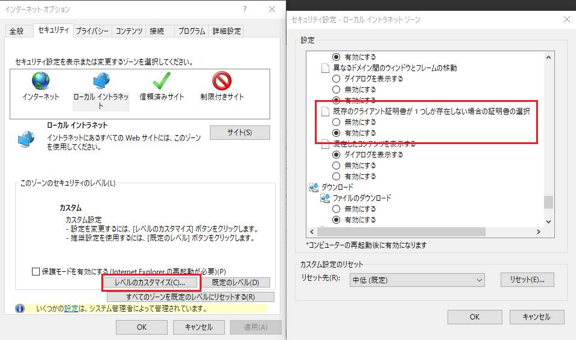
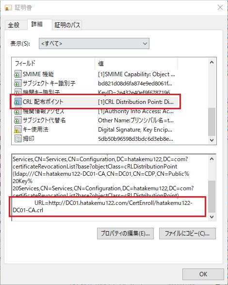
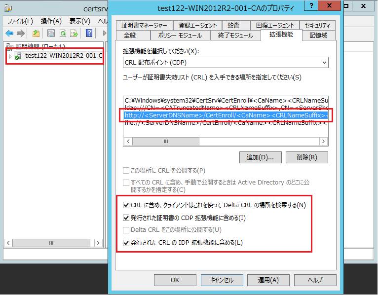
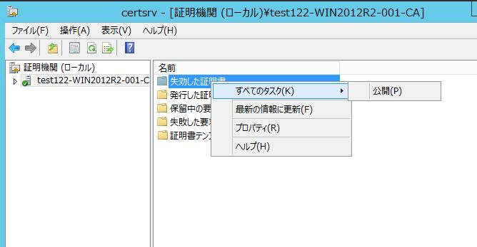

# AD FS 証明書認証のトラブルシューティング

こんにちは、Azure & Identity サポートチームの竹村です。
今回は、多くのお客様からお問合せをいただく AD FS のクライアント証明書認証の問題について、既知の事例や対応方法をご紹介します。

## 最初に行うこと

証明書認証の問題は、大きく 2 つのパターンに分けられます。

- (A) クライアントが証明書を送信しないケース
- (B) クライアントから証明書を選択して送信したものの、正常に動作しないケース

トラブルシューティングを進める際には、まず、どちらのケースに該当するかを確認します。

### ※ 注意

証明書認証では、認証を試みる際に証明書を選択するポップアップが表示されます。しかし、 IE には、有効な証明書が 1 つしか存在しない場合に、自動的に送信する機能があります。
一見 (A) のケースのように見えていても、実際にはバックグラウンドで自動的に証明書を送信している可能性があります。
インターネット オプションの 「セキュリティ」 タブで、各ゾーンの 「レベルのカスタマイズ」 から以下の設定を確認しておきます。
この設定を「無効にする」にしておくことで、有効な証明書が 1 つしか無い場合にもポップアップしてユーザーが選択する動作になりますので、確認が容易になります。



※ 既定では、「ローカル イントラネット」ゾーンのみ有効となっていますが、念のため各ゾーンの設定をご確認ください。

次に、それぞれのケースにおける代表的な問題について説明して行きます。
すでにクライアント側に証明書が表示されている場合には、(A) は飛ばして (B) からご確認ください。

## (A) クライアントが証明書を送信しないケース

このケースの問題は、CTL (Certificate Trust List) に起因していることがほとんどです。
CTL に関する詳細は割愛しますが、簡単に説明しますと、証明書認証では、AD FS / WAP サーバー側が信頼している証明機関のリスト (CTL) をクライアントに送信します。クライアントはそのリストに存在する証明機関から発行された証明書のみをユーザーに表示し、選択させます。
つまり、CTL が正常にクライアントに送信されなかったり、CTL の中にクライアント証明書を発行した証明機関が含まれない場合、クライアント側に証明書が表示されません。
AD FS / WAP では、この CTL を送信する機能が既定で有効です。
以下に、有効な確認ポイントや切り分け方法をいくつかご紹介します。

### (1) AD FS / WAP で、ローカル コンピューター の「信頼されたルート証明機関」に、クライアント証明書を発行した証明機関の証明書が含まれることを確認します。

既定でサーバー側 (AD FS / WAP) は CTL に自身の「信頼されたルート証明機関」を含めます。
したがって、「信頼されたルート証明機関」にクライアント証明書を発行した証明機関が含まれていないと、クライアント側では証明書が表示されません。

### (2) AD FS / WAP で、ローカル コンピューター の「信頼されたルート証明機関」に、「ルート証明書」でないものが含まれていないかどうかを確認します。

サーバー側で CTL を作成する際に、「信頼されたルート証明機関」に含まれるものをリストしますが、その際に「ルート証明書」以外が存在することを検知すると、CTL を正常に生成できず、結果としてクライアント側で証明書が表示されないケースがあります。
「ルート証明書」は、「発行先 (サブジェクト)」 と「発行者」が一致している証明書ですので、それ以外の証明書が信頼されたルート証明機関ストアに含まれていないか確認します。

ルート証明機関のストアは次の手順で確認します。

1. AD FS / WAP サーバーで "ファイル名を指定して実行" から "certlm.msc" を起動します。
2. 左ペインに [証明書 - ローカル コンピューター] と表示されていることを確認のうえ、「信頼されたルート証明機関」 - 「証明書」 を展開し、発行先と発行者が一致しないものが含まれないか確認します。

### (3) CTL の送信を無効にして動作を確認してみます。

サーバー側の設定で、CTL の送信を無効にすることができます。
もし無効にすることで証明書がクライアントに表示される場合、明らかに CTL の問題に起因していることが確認でき、調査、対応をこの一点にフォーカスさせることができますので、有効な切り分けです。上記の (1) や (2) の確認を実施する前にこの切り分けを実施してしまうのも有効です。 (ただし再起動が必要なのでその点についてはご注意ください)
CTL の送信を無効にするには、サーバー側で以下のレジストリ値を 0 に設定し、再起動します。

```reg
レジストリ キー : HKEY_LOCAL_MACHINE\SYSTEM\CurrentControlSet\Control\SecurityProviders\Schannel
名前: SendTrustedIssuerList
型: REG_DWORD
値: 0 (無効) / 1 (有効)
```

なお、複数の AD FS / WAP サーバーが存在する場合、切り分けの際には、hosts ファイルなどで接続先の AD FS / WAP を固定して確認することをお奨めします。
(接続先のサーバーを固定することができない場合には、どのサーバーに接続されるか分かりませんので、すべてのサーバーで設定する必要があります)

### (4) CTL ストアの設定を確認したり、固有の CTL ストアを作成します。

既定 (CTL ストアの設定が null の状態) では、上述のとおり「信頼されたルート証明機関」に含まれる証明機関が CTL にリストされます。
しかし、CTL ストアは個別に設定することも可能です。
CTL ストアの設定状況は、以下の netsh コマンドで確認することができます。

```cmd
netsh http show sslcert
```

管理者権限で上記のコマンドをコマンドプロンプトから実行すると、いくつか SSL のバインドの情報が表示されるかと思います。
その中で、証明書認証に利用する 【フェデレーションサービス名】: 49443 の情報を確認します。
<!-- textlint-disable-->
(AD FS 2016 以降では、環境によっては 49443 ポートではなく、certauth.【フェデレーションサービス名の FQDN】: 443 である可能性もあります。)
<!-- textlint-enable-->

以下は、フェデレーションサービス名が sts.test.com である場合の実行結果例です。

```cmd
netsh http show sslcert

Hostname:port               : sts.test.com:49443 ★<<< ポート49443 に関する設定です。こちらを確認します。
Certificate Hash             : 47b90e1e818ba8cf431d404fff232f1ba17bf078 ★ <<< SSL サーバー証明書に対して一意で、環境によって異なります。
Application ID               : {5d89a20c-beab-4389-9447-324788eb944a} ★ <<< AD FS サービスを示すもので、全環境で同一です。
Certificate Store Name       : MY
Verify Client Certificate Revocation : Enabled
Verify Revocation Using Cached Client Certificate Only : Disabled
Usage Check                 : Enabled
Revocation Freshness Time   : 0
URL Retrieval Timeout       : 0
Ctl Identifier               : (null)
Ctl Store Name               : (null) ★<<< 既定では null です。443 ポートど同様に AdfsTrustedDevices などが設定されている場合、null に戻す必要があります。
DS Mapper Usage             : Disabled
Negotiate Client Certificate : Enabled
```

この CTL ストアを個別に指定して、クライアント証明書を発行した証明機関のみを含めることで、他の証明機関の証明書の影響を取り除くことができます。
以下に、設定手順をご紹介します。

1. 管理者権限でコマンドプロンプトを起動し、以下のように実行します。

```cmd
certutil -f -addstore <任意の証明書ストア名> <クライアント証明書のルート証明書>
```

(例)

```cmd
certutil -f -addstore adfsclient c:\temp\rootca.cer
```

※ c:\temp\rootca.cer は、クライアント証明書を発行したルートCA の証明書をエクスポートした .cer ファイルです。  
※ このコマンドにより、adfsclient という名前のストアが作成され、ルートCA の証明書がインポートされます。

2. 続いて以下のコマンドを実行し、作成したストア内にルート CA の証明書が存在することを確認します。

```cmd
certutil -store adfsclient
```

3. 続いて以下のコマンドを実行し、現状の 49443 ポートの SSL バインドを一旦削除します。

```cmd
netsh http delete sslcert hostnameport=sts.test.com:49443
```

※ hostnameport には、お客様の環境で確認した値を指定します。

4. 続いて以下のコマンドを実行し、CTL ストアを作成したものに指定し、SSL バインドを設定します。

```cmd
netsh http add sslcert hostnameport=sts.testcom:49443 certhash=47b90e1e818ba8cf431d404fff232f1ba17bf078 appid={5d89a20c-beab-4389-9447-324788eb944a} certstorename=MY sslctlstorename=adfsclient
```

※ hostnameport、certhash には、お客様の環境で確認した値を指定します。

5. 続いて以下のコマンドを実行し、CTL ストアが更新されていることをご確認ください。

```cmd
netsh http show sslcert

Hostname:port               : sts.test.com:49443
Certificate Hash             : 47b90e1e818ba8cf431d404fff232f1ba17bf078
Application ID               : {5d89a20c-beab-4389-9447-324788eb944a}
Certificate Store Name       : MY
Verify Client Certificate Revocation : Enabled
Verify Revocation Using Cached Client Certificate Only : Disabled
Usage Check                 : Enabled
Revocation Freshness Time   : 0
URL Retrieval Timeout       : 0
Ctl Identifier               : (null)
Ctl Store Name               : adfsclient ★<<< 個別に作成したストアが設定されています。
DS Mapper Usage             : Disabled
Negotiate Client Certificate : Enabled
```

クライアント側に証明書が表示されないケースは、上記の対応で解決できることが多いので、参考になれば幸いです。

## (B) クライアントから証明書を選択して送信したものの、正常に動作しないケース

このケースでの原因は、WAP サーバー、あるいは AD FS サーバーで失効確認に失敗しているケースがほとんどですが、それ以外を含めて以下に、いくつか確認のポイントをご紹介します。

### (1) 証明書を受信するサーバー (外部接続の場合は WAP サーバー、社内接続の場合は AD FS サーバー) で、49443 ポートが開放されていることを確認します。

稀に証明書を受信するポートが開放されておらず、ネットワーク的に証明書を受け取れないケースがあります。
念のため、ご確認ください。

### (2) 証明書のサブジェクト代替名に認証ユーザーの UPN が設定されていることを確認します。

AD FS の証明書認証では、サブジェクト代替名に認証ユーザーの UPN が設定されている必要があります。
(サブジェクト代替名に設定が存在しない場合には、サブジェクトに認証ユーザーの DN が設定されている必要があります。Windows ではサブジェクト代替名を優先するので、一般的にはサブジェクト代替名に UPN をセットした証明書を利用します)
こちらも、念のためご確認ください。

### (3) ルート CA の証明書、中間 CA の証明書 (存在する場合)  が、適切にインポートされていることを確認します。

AD FS サーバー、WAP サーバー、クライアント端末それぞれで、ローカル コンピューターの「信頼されたルート証明機関」ストアにルート CA の証明書が正しくインポートされていることを確認します。
また、中間 CA が存在する場合には、同様に「中間証明機関」ストアに中間 CA の証明書が正しくインポートされていることを確認してください。
証明書チェーンを正常に検証できる必要があります。

また、AD FS サーバーにおいては、NT Auth ストアにクライアント証明書を発行した CA の証明書 (ルート CA の証明書、もしくは中間 CA から発行している場合には中間 CA の証明書) がインポートされている必要があります。
AD CS のエンタープライズ CA を利用している場合、既定で NT Auth ストアに CA の証明書がインポートされますが、他ドメインの CA や公的な証明機関から発行した証明書を使用する場合、明示的にインポートする必要があります。
NT Auth ストアに証明書をインポートするには、ドメインの管理者権限でコマンドプロンプトを起動し、以下のコマンドを実行します。
AD FS サーバーなど、DC に接続できるサーバー上で実行します。

```cmd
certutil -dspublish -f <クライアント証明書を発行した CA の証明書 (xxxx.cer) のフルパス> NTAuthCA
```

 NT Auth ストアにインポートされている証明書を確認する場合には、以下のコマンドを実行します。

```cmd
certutil -store -enterprise ntauth
```

### (4) AD FS サーバー、WAP サーバーから CDP (失効リスト配布ポイント) にアクセスできることを確認します。

クライアント証明書の 「詳細」 タブから、証明書の CDP を確認することができます。



証明書の CDP を確認し、ADFS / WAP サーバー上で IE を起動し、該当の URL にアクセスできるかどうかを確認します。
IE から正常にアクセスできる場合でも、実際の失効確認の動作時には WinHTTP プロキシを経由するため、 WinHTTP プロキシが構成されていないことで CDP へのアクセスに失敗している可能性があります。

WinHTTP プロキシの設定状況については、次のコマンドで確認が可能です。

```cmd
netsh winhttp show proxy

現在の WinHTTP プロキシ設定:
   直接アクセス (プロキシ サーバーなし)。
```

インターネット接続にプロキシが必要な環境では、適切にプロキシを設定しておく必要があります。
IE のインターネット オプションの設定を合わせるためには、以下のコマンドを実行します。

```cmd
netsh winhttp import proxy source=ie

現在の WinHTTP プロキシ設定:
   プロキシ サーバー: proxy_address:8080
   バイパス一覧     : test.com;*.test.com;sts.federation.com;<local>
```

#### CDP に HTTP のパスが含まれない場合

証明機関として Windows の AD CS で構成したエンタープライズ CA を利用している場合、CDP は証明機関の設定で行いますが、既定では AD 上に格納され、LDAP のパスになります。
この既定の状態ですと、AD FS は必ずドメイン メンバーになりますので問題はありませんが、WAP サーバーをドメインに参加させていない構成では、この LDAP のパスにはアクセスすることができません。

WAP サーバーがドメインに参加していない場合には、http でも CDP にアクセスできるように構成しておく必要があります。
具体的には次のとおり、クライアント証明書を発行する証明機関のプロパティの 「拡張機能」タブで設定します。



注意点として、この設定を行う前に発行された証明書には、ここで設定した http の CDP が含まれていません。
設定変更を行った後に、再度クライアント証明書を発行する必要があります。

#### エンタープライズ CA ではなく、公的機関から発行された証明書を利用する場合

エンタープライズ CA から発行された証明書の場合には、既定の状態であれば AD FS はドメイン メンバーのため、 LDAP で CDP にアクセスできます。
しかし、公的機関から発行された証明書を利用する場合、一般的に CDP にアクセスするためにはインターネット接続が必要です。
その際、AD FS は WinHTTP Proxy 以外にも、AD FS サービスアカウントの WinINET Proxy を利用します。
CDP が AD 上ではなく、インターネット接続が必要になる場合、AD FS サービスアカウントのコンテキストで IE のインターネットオプションから Proxy を適切に設定してください。

### (5) 失効確認を無効化して動作を確認します。

上記を確認しても動作が変わらない場合、一旦失効確認を無効化することは有効な切り分けです。
もし無効化して動作するようになった場合には、明らかに失効確認が問題であることが確認でき、調査、対応を失効確認の動作に絞ることができます。
特に、AD CS のエンタープライズ CA を利用している場合には、 WAP サーバーで失効確認が失敗しやすい (CDP が LDAP パスに設定されているため失敗しているケースが多い) ので、最初に WAP サーバーで無効化することをお奨めします。
(A) の対応でもご紹介しましたが、失効確認は netsh コマンドで確認、無効化 (有効化) することができます。

```cmd
netsh http show sslcert
```

管理者権限で上記のコマンドをコマンドプロンプトから実行すると、いくつか SSL のバインドの情報が表示されるかと思います。
その中で、証明書認証に利用する 【フェデレーションサービス名】:49443 の情報を確認します。
<!-- textlint-disable -->
(AD FS 2016 以降では、環境によっては 49443 ポートではなく、certauth.【フェデレーションサービス名の FQDN】:443】である可能性もあります。)
<!-- textlint-enable -->

以下は、フェデレーションサービス名が sts.test.com である場合の実行結果例です。

```cmd
netsh http show sslcert

Hostname:port               : sts.test.com:49443 ★<<< ポート49443 に関する設定です。こちら確認します。
Certificate Hash             : 47b90e1e818ba8cf431d404fff232f1ba17bf078 ★ <<< SSL サーバー証明書に対して一意で、環境によって異なります。
Application ID               : {5d89a20c-beab-4389-9447-324788eb944a} ★ <<< AD FS サービスを示すもので、全環境で同一です。
Certificate Store Name       : MY
Verify Client Certificate Revocation : Enabled ★ <<< 既定では、クライアント証明書の失効確認が有効 (Enabled) になっています。
Verify Revocation Using Cached Client Certificate Only : Disabled
Usage Check                 : Enabled
Revocation Freshness Time   : 0
URL Retrieval Timeout       : 0
Ctl Identifier               : (null)
Ctl Store Name               : (null)
DS Mapper Usage             : Disabled
Negotiate Client Certificate : Enabled
```

失効確認を無効化する手順を、以下にご紹介します。

1. 管理者権限でコマンドプロンプトを起動し、現状の 49443 ポートの SSL バインドを一旦削除します。

```cmd
netsh http delete sslcert hostnameport=sts.test.com:49443
```

※ hostnameport には、お客様の環境で確認した値を指定します。

2. 続いて以下のコマンドを実行し、失効確認を無効化して SSL バインドを設定します。

```cmd
netsh http add sslcert hostnameport=sts.testcom:49443 certhash=47b90e1e818ba8cf431d404fff232f1ba17bf078 appid={5d89a20c-beab-4389-9447-324788eb944a} certstorename=MY verifyclientcertrevocation=disable
```

※ hostnameport、certhash には、お客様の環境で確認した値を指定します。

3. 続いて以下のコマンドを実行し、クライアント証明書の失効確認が無効化されていることを確認します。

```cmd
netsh http show sslcert

Hostname:port               : sts.test.com:49443
Certificate Hash             : 47b90e1e818ba8cf431d404fff232f1ba17bf078
Application ID               : {5d89a20c-beab-4389-9447-324788eb944a}
Certificate Store Name       : MY
Verify Client Certificate Revocation : Disabled ★ <<< 失効確認が無効化されています。
Verify Revocation Using Cached Client Certificate Only : Disabled
Usage Check                 : Enabled
Revocation Freshness Time   : 0
URL Retrieval Timeout       : 0
Ctl Identifier               : (null)
Ctl Store Name               : (null)
DS Mapper Usage             : Disabled
Negotiate Client Certificate : Enabled
```

もしこの状態で証明書認証が動作するようになった場合、サーバーの失効確認に失敗している状況と明確に判断することができます。

### (6) 失効リストを公開し直し、キャッシュを削除します。

失効リストの有効期限が切れていたり、サーバー上の CRL キャッシュが古く、正常に動作しないケースがあります。
CDP にアクセスできることを確認している場合には、失効リストの更新、キャッシュの削除をお試しください。
AD CS のエンタープライズ CA では、以下の 「失効した証明書」 の 「すべてのタスク」 から公開することができます。



上記手順で CRL を公開しましたら、AD FS、WAP サーバー上で CRL のキャッシュを削除します。
CRL キャッシュには、ストレージ上に保存されるもの、メモリ内に保持されるものの 2 種類があり、それぞれ削除する方法を以下にご紹介します。

ストレージ上のキャッシュを削除するためには、以下の各フォルダー内のファイルを削除してください。
フォルダーは削除しないようにしてください。

```cmd
C:\Windows\ServiceProfiles\NetworkService\AppData\LocalLow\Microsoft\CryptnetFlushCache\MetaData
C:\Windows\ServiceProfiles\NetworkService\AppData\LocalLow\Microsoft\CryptnetUrlCache\Content
C:\Windows\ServiceProfiles\NetworkService\AppData\LocalLow\Microsoft\CryptnetUrlCache\MetaData
C:\Windows\System32\config\systemprofile\AppData\LocalLow\Microsoft\CryptnetFlushCache\MetaData
C:\Windows\System32\config\systemprofile\AppData\LocalLow\Microsoft\CryptnetUrlCache\Content
C:\Windows\System32\config\systemprofile\AppData\LocalLow\Microsoft\CryptnetUrlCache\MetaData
C:\Windows\SysWOW64\config\systemprofile\AppData\LocalLow\Microsoft\CryptnetFlushCache\MetaData
```

※ ファイルが存在しない場合、フォルダーが存在しない場合は、対応不要です。

次にメモリ内に保持されるキャッシュは、以下のコマンドで削除します。

```cmd
certutil -setreg chain\ChainCacheResyncFiletime @now
```

※ コマンドを実行するためには、ローカル管理者権限が必要です。
※ コマンドを実行した後に CertSvc サービスの再起動を求められますが、実際には不要です。サービス再起動の必要はありません。

いかがでしたでしょうか。

AD FS の証明書認証をトラブルシューティングするケースでは、上記のとおり様々な確認観点があり、すべての観点を確認するための資料を一まとめに取得しようとすると、非常に大変です。
今回ご紹介した確認ポイント、切り分けを実施していただくことで、解決に至ったり、調査のポイントを絞り込むことができますので、ぜひ活用いただければ幸いです。

上記内容が少しでも参考となりますと幸いです。

製品動作に関する正式な見解や回答については、お客様環境などを十分に把握したうえでサポート部門より提供させていただきますので、ぜひ弊社サポート サービスをご利用ください。

※本情報の内容（添付文書、リンク先などを含む）は、作成日時点でのものであり、予告なく変更される場合があります。
