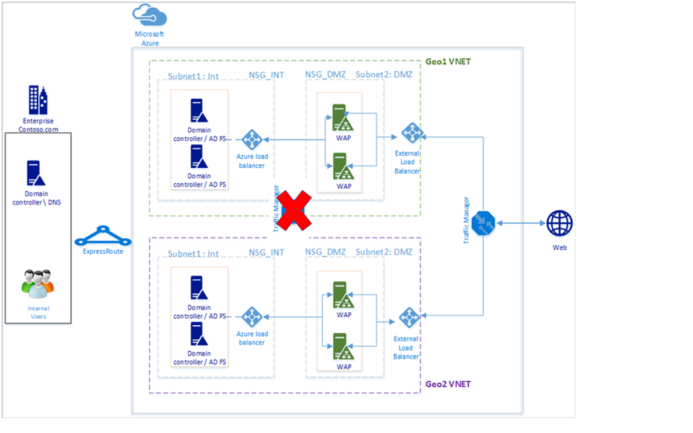
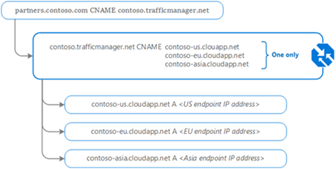

> 本記事は Technet Blog の更新停止に伴い https://blogs.technet.microsoft.com/jpazureid/2018/12/27/adfstrafficmanager/ の内容を移行したものです。
> 元の記事の最新の更新情報については、本内容をご参照ください。

# Azure VM 上の AD FS 構成と Azure トラフィック マネージャーとの構成での非推奨設定について

こんにちは、Azure & Identity サポート チームの 姚 (ヨウ)です。

Azure VM 上に AD FS を構成し、 Azure トラフィック マネージャーと組み合わせることで WAP サーバーと AD FS サーバーのセットを丸ごと冗長化できるメリットがあります。

この具体的な手順を含む詳細な情報を以下で公開しています。

High availability cross-geographic AD FS deployment in Azure with Azure Traffic Manager

https://docs.microsoft.com/en-us/windows-server/identity/ad-fs/deployment/active-directory-adfs-in-azure-with-azure-traffic-manager

今回は、この構成を構築する際に注意していただきたい点についてご紹介します。

公開情報では、インターネットからのアクセスに対してトラフィック マネージャーで通信を受け、 WAP と AD FS のそれぞれでロードバランサーを用意しておく構成について図示されています。

ここでロードバランサーの代わりに Azure トラフィック マネージャーを AD FS のロードバランシングにも利用できるのではと考えるようなケースもあるかと思いますが、そのような構成を取ることはできません。

具体的には、トラフィック マネージャーの背後に以下の構成のように AD FS サーバーを直接配置すると問題が発生します。

Azure トラフィック マネージャーは、DNS ベースの負荷分散をおこなうことを特徴としており、背後にある複数のアプリケーション サーバーをインターネット上の仮想エンド ポイントに公開し、トラフィックを分散する機能です。

一般的に以下の図の仕組みのように、インターネットに構成しているエンド ポイントへのトラフィックを背後のアプリケーション サーバーへ分散します。

Azure トラフィック マネージャーは、通常のロードバランサーの場合とは異なり、DNS レイヤーで動作する負荷分散です。

これを AD FS サーバーに対して構成した場合、上記図の "partners.contoso.com" をフェデレーション サービス名に設定する必要があります。

この場合、AD FS サーバーへの認証処理では、フェデレーション サービス名が Traffic Manager の仮想エンド ポイントの URL (contoso.trafficmanager.net) に解決され、この仮想の URL 名で Kerberos 認証を試みますが、実際の接続先と異なるため Kerberos 認証に失敗します。

AD FS サーバーへ認証する際にはフェデレーション サービス名で Kerberos 認証を実施する必要がありますので Azure トラフィック マネージャーを利用した負荷分散を構成することができません。

また、Azure トラフィック マネージャーはインターネット上に仮想エンド ポイントを公開することになりますが、 WAP ではなく AD FS サーバーをインターネットに公開するということは想定された利用方法ではなく、推奨していません。

Azure トラフィック マネージャーを利用する場合には、公開情報にありますように WAP サーバーへのアクセス部分に限定して利用するように構成をお願いいたします。

このブログの情報がお客様の検証や運用のお役に少しでもお役に立てばと思います。

製品動作に関する正式な見解や回答については、お客様環境などを十分に把握したうえでサポート部門より提供させていただきますので、ぜひ弊社サポート サービスをご利用ください。
※本情報の内容（添付文書、リンク先などを含む）は、作成日時点でのものであり、予告なく変更される場合があります。
