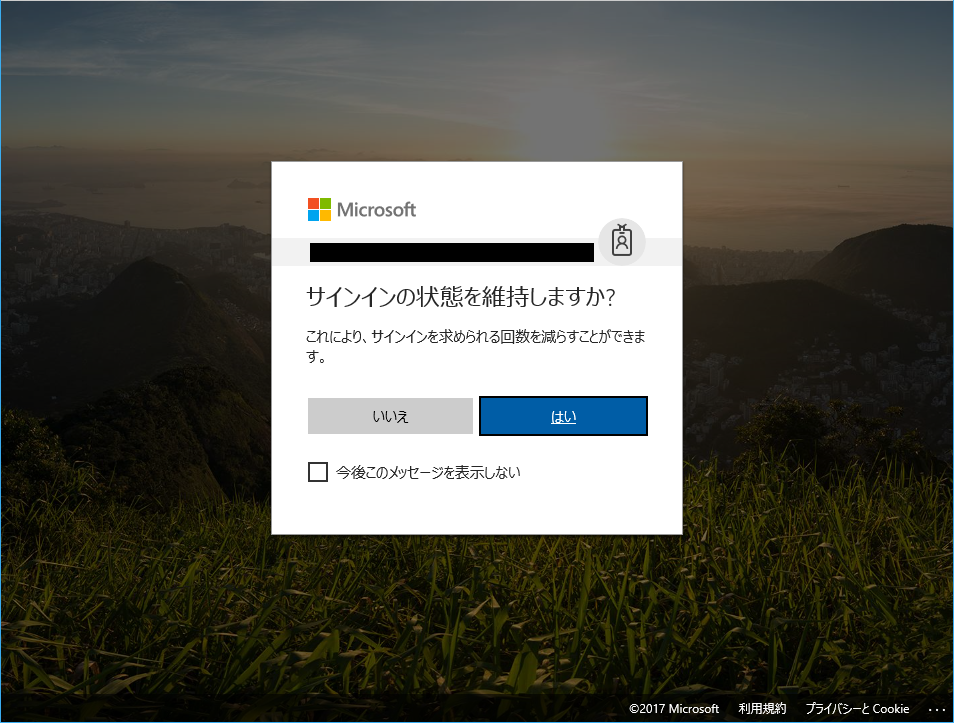

# フェデレーション環境 (Windows 統合認証) で [サインインの状態を維持しますか？] の画面が表示されない

> [!NOTE]
> 2021 年 12 月 11 日更新: 以前のサインイン エクスペリエンスの内容を削除し、条件付きアクセスにて提供されている永続的なブラウザー セッションについて追記しました。

こんにちは、Azure ID サポートチームの高田です。

本日は、Azure AD のサインイン画面の変更とそれに伴うフェデレーション環境への影響についておまとめしました。

## Azure AD にサインインする際の「サインイン状態を維持しますか？」の画面

Azure AD へのサインイン時に以下のような「サインイン状態を維持しますか？」の画面が表示される場合がございます。



この [サインインの状態を維持しますか？] の画面は、基本的に Azure AD の [会社のブランド] から構成できる [サインインしたままにするオプションを表示する] の設定が [はい] の場合に表示されます。既定ではこのオプションは [はい] の状態で、明示的に [いいえ] にしていない限り、基本的に上記の [サインインの状態を維持しますか？] の画面が表示されることとなります (オプションを [いいえ] にした場合、[サインインの状態を維持しますか？] の画面は表示されず、サインイン状態は維持されない動作です)。

※ [会社のブランド] を構成する手順につきましては、下記の公開情報を参照ください。

クイック スタート: Azure AD のサインイン ページに会社のブランドを追加する  
https://docs.microsoft.com/ja-jp/azure/active-directory/customize-branding

この [サインインの状態を維持しますか？] の画面は、 [サインインしたままにするオプションを表示する] オプションを [はい] にしていても、以下の場合に表示されません。

1. Azure AD がユーザーのサインインをリスクのある状態と判断した場合
2. フェデレーション ユーザーにてサインインを試行し、AD FS にて Windows 統合認証が用いられた場合

上記 1 については、同一のマシンを複数人で共有していたり、短時間に長距離を移動したユーザーが該当します。リスクの高いサインインについては以下の資料も参考にしていただければと思います。

Azure Active Directory ポータルのリスクの高いサインイン レポート  
https://docs.microsoft.com/ja-jp/azure/active-directory/active-directory-reporting-security-risky-sign-ins

上記 2 は、社内にいるユーザーが AD FS を利用してサインインする場合を示しています。Windows 統合認証を用いてサインインする場合、ユーザーから見るとアプリケーションへのアクセスから Azure AD へのリダイレクト、さらに AD FS へのリダイレクト後の Windows 統合認証がすべて自動的に完了する流れとなります。[サインインの状態を維持しますか？] の画面は、一連の処理の流れを止めることとなるため、Windows 統合認証の場合に表示されないよう実装されました。AD FS にて Windows 統合認証が用いられたとき、[サインインの状態を維持しますか？] の選択は表示されませんが、選択としては [いいえ] の状態で認証が完了しています。このため、サインインの状態は維持されません (Azure AD から永続的なブラウザー セッションは確立されません)。

AD FS を利用する場合でも、社内からではなく外部から WAP (Web Application Proxy) を介してアクセスするような場合や、社内からのアクセスであっても、Firefox 等、AD FS の標準設定では Windows 統合認証が使用できないブラウザーをお使いの場合は、フォーム認証が用いられます。このときは、上記 1 に合致していない状況であれば [サインインの状態を維持しますか？] の画面が表示されます。

## AD FS で Windows 統合認証が行われた場合もサインインの状態を維持させる方法

フェデレーション環境をお持ちのお客様において、AD FS で Windows 統合認証が行われた場合もサインインの状態を維持したい (Azure AD から永続的なブラウザー セッションを確立したい) とお考えのお客様においては、以下 A もしくは B のいずれかの対応を実施ください。Azure AD 側の構成変更 (条件付きアクセスでの対応) をご要望の場合は A の方法を、AD FS 側の構成変更で対応されたい場合は B の方法をご利用ください。

### A. Azure AD 条件付きアクセス ポリシーを使用した方法

以下では、Azure AD 側の条件付きアクセスポリシーを設定することで、永続的なブラウザー セッションを確立する方法をお知らせします。現在多くのお客様が AD FS の利用を廃止し、Azure AD 上での認証に移行 (フェデレーション ドメインからマネージド ドメインへの移行) を進めていらっしゃいます。これに伴い、AD FS 側には極力手を加えたくないというお客様も多いと思います。本方法では、AD FS 側の変更はなく、Azure AD 側の条件付きアクセス ポリシーを構成することで、AD FS にて Windows 統合認証が利用された時も Azure AD から永続的なブラウザー セッションを確立します。

条件付きアクセス ポリシーを構成するため、以下の手順を実施ください。

1. [Azure ポータル](https://portal.azure.com) に条件付きアクセス管理者ロールに相当するユーザーでサインインします。
2. [Azure Active Directory] のブレードを開き、[セキュリティ] から [条件付きアクセス] を選択します。
3. [ポリシー] ブレードで [+ 新しいポリシー] から [新しいポリシーを作成する] を選択します。
4. ポリシーの名前に KMSI (Keep Me Signed in) などの名前を付けます。
5. [ユーザーまたはワークロード ID] から Azure AD と永続的なブラウザー セッションを確立したいユーザーを選択します。
6. [クラウド アプリまたは操作] にて [すべてのクラウド アプリ] を選択します。
7. [セッション] にて、[永続的なブラウザー セッション] にチェックを付けます。
8. プルダウンメニューから [常に永続的] を選び、画面下の [選択] を押下します。
9. [ポリシーの有効化] を [オン] にして [作成] ボタンを押下します。

以上の操作により、指定されたユーザーについては、AD FS にて Windows 統合認証が利用されていたとしてもユーザーのブラウザーには永続的なブラウザーセッションが確立され、ユーザーのサインイン状態が維持されます。

なお、この設定は [すべてのクラウド アプリ] が選択されている場合に正しく動作します。また、[会社のブランド] の [サインイン状態を維持するためのオプションを表示する] ポリシーは本設定によりオーバーライドされます。さらに、[永続的にしない] を選ぶと、後述する AD FS から渡される永続的 SSO (psso) クレームもオーバーライドされます。つまり、[永続的にしない] を選んだ場合、AD FS 側で psso を発行する発行変換規則が構成されていても、Azure AD 側でそのクレームを無効化することも可能です。

### B. AD FS のクレーム ルールを使用した方法

以下では AD FS 側でクレーム ルールを変更し、組織内からの認証の場合は、永続的 SSO (psso) と呼ばれるクレームをトークンに含めるように構成します。これを受け取った Azure AD は、サインイン状態を維持させるようクライアントと永続的なブラウザー セッションを確立します。この際、「サインイン状態を維持しますか？」画面は表示されませんが、サインイン状態が維持されます ([サインインの状態を維持しますか？] 画面で手動にて [はい] を押下したのと同じ状態となります)。

AD FS サーバー上の手順を以下におまとめいたしましたので、ご確認いただけますと幸いです。

1. AD FS サーバーに管理者でログオンします。
2. AD FS の管理コンソールを開きます。
3. 画面左側のツリーから [証明書利用者信頼] を選択します。
4. [Microsoft Office 365 Identity Platform] を右クリックし、[発行変換規則の編集] から [規則の追加] をクリックします。
6. ウィザードでドロップダウンから [カスタム規則を使用して要求を送信] を選択し、[次へ] をクリックします。
7. [要求規則名] の下のボックスに Keep Users Signed In と入力し、次に進みます。
8. [カスタム規則:] ボックスに次のように入力します。

    ```txt
    c:[Type == "http://schemas.microsoft.com/ws/2012/01/insidecorporatenetwork", Value == "true"]
    => issue(Type = "http://schemas.microsoft.com/2014/03/psso", Value = "true");
    ```

9. [完了]をクリックし、ウィザードを終了します。

上記クレーム ルールを追加しますと、社内からの (WAP を経由しない) アクセスの場合は、http://schemas.microsoft.com/2014/03/psso のクレームが AD FS の発行するトークンに追加されます。トークンを受け取った Azure AD はこのクレームを確認し、永続的なブラウザーセッションをクライアントと確立します。AD FS ファーム全体 (全ユーザー) が対象となるルールですが、新しく psso のクレームを追加するだけですので、既存のクレーム ルールに影響を及ぼすことはありません。また、上記ウィザードの完了後すぐに効果が及びます。

なお、クレームルールの追加により予期しない動作が生じた場合は、追加したルールを削除すれば元に戻すことが可能ですので、その際は、追加したルールを削除することで対応ください。

**2018/02/21 追記:**

上記設定は、発行変換規則に対するものです。アクセス制御に影響する発行承認規則には変更を加えません。このため、上記設定を行っても既存のクレーム ルールでのアクセス制御に影響を及ぼすことはありません。上記設定を実施後に、これまで動作していたアクセスがブロックされるなどの影響が起きることはないとお考えください。影響が及ぶのは Azure AD が永続的なブラウザー セッションをクライアントと確立し、サインイン状態が維持されるという点のみです。

**2018/02/26 追記:**

クレーム ルールを制御することで、http://schemas.microsoft.com/2014/03/psso のクレームを有効にする対象ユーザーを制御することが可能です。例えば以下のようにしてクレーム ルールを指定すれば、社内からのアクセスで、さらに指定したグループにユーザーが含まれている場合のみ psso を有効にできます。

```txt
c1:[Type == "http://schemas.microsoft.com/ws/2012/01/insidecorporatenetwork", Value == "true"]
&& c2:[Type == "http://schemas.microsoft.com/ws/2008/06/identity/claims/groupsid", Value == "S-1-5-21-4118385845-2129555445-158388420-1121"]
=> issue(Type = "http://schemas.microsoft.com/2014/03/psso", Value = "true");
```

上記のうち、S-1-5-21-4118385845-2129555445-158388420-1121 の箇所にご要望のグループの SID を指定ください。グループの SID は、[Active Directory ユーザーとコンピューター] や PowerShell の Get-ADGroup コマンドレットからご確認いただけます。

**2018/03/06 追記:**

以上の内容は、Windows Server 2012 R2 以降の AD FS を対象とした手順です。Windows Server 2008 R2 および 2012 の AD FS をご利用の場合は以下のようにします。

```txt
NOT exists([Type == "http://schemas.microsoft.com/2012/01/requestcontext/claims/x-ms-proxy"])
=> issue(Type = "http://schemas.microsoft.com/2014/03/psso", Value = "true");
```

なお、Windows Server 2008 R2 で x-ms-proxy クレームを利用するには AD FS 2.0 ロールアップ 3 の適用が必要です (要 OS 再起動)。

Description of Update Rollup 3 for Active Directory Federation Services (AD FS) 2.0  
https://support.microsoft.com/ja-jp/help/2790338/description-of-update-rollup-3-for-active-directory-federation-service

上記内容が少しでもお客様の参考となりますと幸いです。
