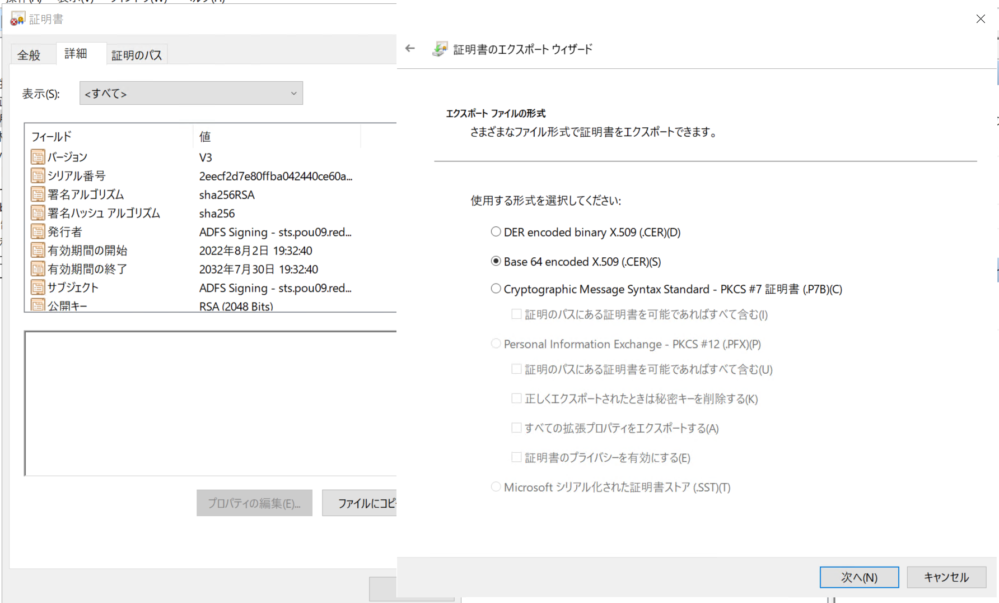

# AD FS のトークン署名証明書を手動でアップデートする方法

皆様、こんにちは。Azure & Identity サポート担当の竹村です。

本ブログでは、AD FS のトークン署名証明書を Azure AD のフェデレーションドメインに手動でアップデートする方法をご案内します。

従来は、MSOnline モジュールの Update-MsolFederatedDomain というコマンドレットが用意されておりましたが、MSOnline モジュールの廃止に伴い、Microsoft Graph PowerShell への移行が進められております。

以下に、新しい Microsoft Graph PowerShell を利用したトークン署名証明書のアップデート方法をご案内します。


## 手順の概要

1. AD FS でセカンダリ証明書を作成する
2. AD FS で既存のプライマリ証明書と、セカンダリ証明書をエクスポートする
3. Azure AD のフェデレーションドメインに、新しいセカンダリ証明書をアップデートする
4. AD FS で新しいセカンダリ証明書をプライマリに変更する

それぞれの詳細を紹介します。

## 1. AD FS でセカンダリ証明書を作成する

AD FS プライマリサーバーで、新しいトークン署名証明書とトークン暗号化解除証明書をセカンダリとして作成します。
PowerShell で以下のように実行します。

```powershell
Update-AdfsCertificate
```

コマンドを実行すると、新しいトークン署名証明書と、トークン暗号化解除証明書がセカンダリとして作成されます。

> [!WARNING]
> Update-AdfsCertificate コマンド実行時に -urgent オプションを付与しないようにご注意ください。付与した場合には、新しい証明書がセカンダリとして作成されるのではなく、プライマリとして作成されて即時に上書きされ、Azure AD 側に新しい証明書がアップデートされるまでの間、認証が失敗するようになります。

> [!NOTE]
> Update-AdfsCertificate を実行するためには、[証明書の自動ロールオーバー](#補足-自動ロール-オーバーの有効化手順) が有効である必要があります。

### 補足: 自動ロール オーバーの有効化手順

証明書の自動ロールオーバーを有効にするには、以下を実行します。

> ```powershell
> Set-AdfsProperties -AutoCertificateRollover $true
> ```
>
> 自動ロールオーバーを無効に戻したい場合には、以下を実行します。
>
> ```powershell
> Set-AdfsProperties -AutoCertificateRollover $false
> ```


## 2. AD FS で既存のプライマリ証明書と、セカンダリ証明書をエクスポートする

既存のプライマリのトークン署名証明書と、新しく作成されたセカンダリのトークン署名証明書を Base64 エンコードでエクスポートします。

AD FS の管理ツールを起動して、左ペインの [サービス] - [証明書] を選択すると、証明書の一覧が表示されますので、[トークン署名] の欄のプライマリ、セカンダリそれぞれについて、右クリックから [証明書の表示] を選択し、[詳細] タブから [ファイルにコピー]を行います。

ウィザードの中で、以下のように "Base 64 encoded X.509" を選択してファイルにエクスポートします。



エクスポートした証明書ファイル (.cer) をメモ帳などのテキスト エディターで開くと、"MIIC4j ... FOO3A==" のような、Base64 エンコードされた文字列が得られます。
この証明書を示す文字列を次の手順 3 で利用します。

## 3. Azure AD のフェデレーションドメインに、新しいセカンダリ証明書をアップデートする

以下の手順で Microsoft Graph PowerShell を利用して、Azure AD のフェデレーションドメインに新しいトークン署名証明書をアップデートします。

手順 2 でエクスポートした、プライマリとセカンダリの証明書ファイル (.cer) を、作業を行う端末の任意のディレクトリにコピーしておいてください。
(AD FS サーバー自身で実行する場合、エクスポートしたファイルをそのままご利用ください。)

#### 3-1. Windows 10 の PC など、任意のインターネットに接続できる端末に、Microsoft Graph PowerShell の必要なモジュールをインストールします。

[Microsoft Graph PowerShell をインストールする](https://learn.microsoft.com/ja-jp/powershell/microsoftgraph/installation?view=graph-powershell-1.0) の手順にあるとおり、動作には以下のいずれかの環境が必要です。

- PowerShell 7 以降 (推奨)
- PowerShell 5.1 以降、および .NET Framework 4.7.2 以降

```powershell
Install-Module -Name "Microsoft.Graph.Identity.DirectoryManagement" -Force
```

#### 3-2. 対象のテナントに接続し、グローバル管理者アカウントでサインインします。

```powershell
Connect-MgGraph -Scopes "Directory.AccessAsUser.All"
```
アクセス許可を要求する画面が表示された場合には、承諾します。

#### 3-3. 接続したテナントに、対象のドメインがあることを確認します。

```powershell
Get-MgDomain
```

### 3-4. 対象のドメインの現在の設定を確認します

```powershell
Get-MgDomainFederationConfiguration -DomainId <対象のドメイン> | FL

(実行結果例)
ActiveSignInUri                       : https://sts.test.com/adfs/services/trust/2005/usernamemixed
DisplayName                           : AD FS
FederatedIdpMfaBehavior               :
Id                                    : b393ece7-895a-436c-9794-787c6d1ae77f
IsSignedAuthenticationRequestRequired :
IssuerUri                             : http://sts.test.com/adfs/services/trust
MetadataExchangeUri                   : https://sts.sts.test.com/adfs/services/trust/mex
NextSigningCertificate                :
PassiveSignInUri                      : https://sts.sts.test.com/adfs/ls/
PreferredAuthenticationProtocol       : wsFed
PromptLoginBehavior                   : 
SignOutUri                            : https://sts.test.com/adfs/ls/
SigningCertificate                    : MIIGFT ... yEzQw==
SigningCertificateUpdateStatus        : 
AdditionalProperties                  : {}

```

SigningCertificate と NextSigningCertificate の値を確認して、「2. 既存のプライマリ証明書と、セカンダリ証明書をエクスポートする」の手順でエクスポートした既存のプライマリ証明書が、どちらに設定されているかを確認します。
証明書ファイル (.cer) をテキスト エディターで開くと、Base64 エンコードされた文字列を確認することができます。
上記の例は、SigningCertificate に既存のプライマリ証明書 ( "MIIGFT ... yEzQw==" 途中省略しています) が設定されていて、NextSigningCertificate には何も設定されていない状態です。
この場合には、次の手順で NextSigningCertificate に新しいセカンダリ証明書を設定します。
ほとんどの環境では SigningCertificate に既存のプライマリ証明書が設定されているはずですが、もし NextSigningCertificate 側に設定されていた場合には、上書きしないように、次の手順で SigningCertificate 側に新しいセカンダリ証明書を設定します。


### 3-5. 対象のドメインに新しいセカンダリの証明書をアップデートします

上記の手順 3-4 の確認で、SigningCertificate 側に既存のプライマリ証明書が設定されていた場合には、以下のように NextSigningCertificate に新しいセカンダリの証明書を設定します。

```powershell
$domainId = "test.com" (対象のドメインを指定します。)

$federationId = "b393ece7-895a-436c-9794-787c6d1ae77f" (上の手順 4 で確認した Id の値を指定します。)

$certObj = New-Object System.Security.Cryptography.X509Certificates.X509Certificate2("C:\tepm\secondary.cer") (作業端末にコピーしたセカンダリの新しい証明書のパスを指定します。)
$certData = [system.convert]::tobase64string($certObj.rawdata)

Update-MgDomainFederationConfiguration -DomainId $domainId -InternalDomainFederationId $federationId -NextSigningCertificate $certData
```

もし上記の手順 3-4 の確認で NextSigningCertificate に既存のプライマリ証明書が設定されていた場合には、以下のように SigningCertificate に新しいセカンダリ証明書を設定します。

```powershell
Update-MgDomainFederationConfiguration -DomainId $domainId -InternalDomainFederationId $federationId -SigningCertificate $certData
```

念のため、設定後に正しく新しいセカンダリの証明書が追加されていること、および既存のプライマリ証明書が消えていないことをお確かめください。

```powershell
Get-MgDomainFederationConfiguration -DomainId <対象のドメイン> | FL

(実行結果例)
ActiveSignInUri                       : https://sts.test.com/adfs/services/trust/2005/usernamemixed
DisplayName                           : AD FS
FederatedIdpMfaBehavior               :
Id                                    : b393ece7-895a-436c-9794-787c6d1ae77f
IsSignedAuthenticationRequestRequired :
IssuerUri                             : http://sts.test.com/adfs/services/trust
MetadataExchangeUri                   : https://sts.sts.test.com/adfs/services/trust/mex
NextSigningCertificate                : MIIC4j ... FOO3A== ★<-- 追加された新しいセカンダリの証明書
PassiveSignInUri                      : https://sts.sts.test.com/adfs/ls/
PreferredAuthenticationProtocol       : wsFed
PromptLoginBehavior                   : 
SignOutUri                            : https://sts.test.com/adfs/ls/
SigningCertificate                    : MIIGFT ... yEzQw== ★<-- 既存のプライマリ証明書
SigningCertificateUpdateStatus        : 
AdditionalProperties                  : {}

```


## 4. AD FS で新しいセカンダリ証明書をプライマリに変更する

AD FS 側にはプライマリとセカンダリの証明書があり、プライマリの証明書を使用してトークンに署名を付与します。
Azure AD 側では、その署名を検証するために SigningCertificate と NextSigningCertificate が使用されますが、プライマリ/セカンダリ という概念はなく、どちらか一方が AD FS のプライマリ証明書と合致していれば検証に成功します。
したがって、上記の手順「3. Azure AD のフェデレーションドメインに、新しいセカンダリ証明書をアップデートする」を実施した時点で、AD FS のプライマリ証明書とセカンダリ証明書の両方に対応できる状態になっています。

この状態で、AD FS 側でセカンダリの新しい証明書をプライマリに変更します。
AD FS 管理ツールで証明書の一覧を開き、セカンダリのトークン署名証明書を選択して右クリックし、「プライマリとして設定」を選択します。
警告ダイアログが表示されますので「はい」を選択し、プライマリに変更します。

併せてトークン暗号化解除証明書も同様の手順でセカンダリをプライマリに変更しておきます。
Azure AD (証明書利用者信頼) との認証連携には関係しませんが、トークン暗号化解除証明書の有効期限が切れることで、AD FS サービスが起動することができなくなります。
また、要求プロバイダー信頼として、ローカルの Active Directory 以外に他の IdP と連携している場合には、新しいトークン暗号化解除証明書をその IdP 側で更新を行う必要がございます。
通常はメタデータを介して更新を行いますが、詳細は IdP の開発元ベンダー様にお問合せください。


手順は以上の通りとなります。
参考となれば幸いです。
