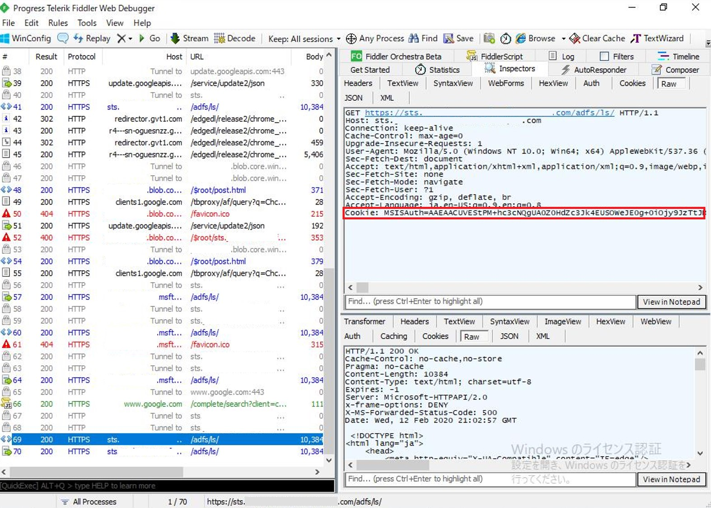
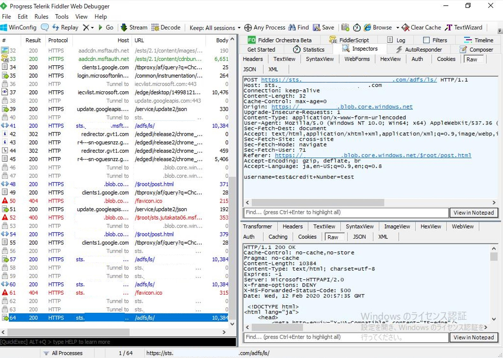

# Google Chrome の version80 へのアップデートにおける AD FS および WAP への影響

皆様、こんにちは。  
Azure & Identity サポート担当の串田です。  

今回は、先日公開された最新版の Google Chrome "Version 80" で導入された Cookie に対する取り扱いが AD FS 環境の認証に及ぼす可能性がある影響についてご紹介します。  

## はじめに
先日、Office 365 をご利用されているお客様に Office 365 ポータルの [メッセージ センター] 内にメッセージ ID が "MC201932" もしくは "MC202944"、そして以下の様なタイトルのメッセージが通達されています。

<Be aware and prepared – web sites you use may not work in Chrome 80>

上記のメッセージは Google Chrome の Version 80 で予定されている仕様変更に対しての注意喚起になります。
概要としては Google Chrome を利用して Web サイト、もしくは Web アプリケーションへアクセスした際に、Web サイトが SameSite という情報を付与せず Cookie を発行した場合、その Cookie を受け取った Google Chrome が強制的に "SameSite=LAX" の情報が付与された Cookie と同様に扱うように変わります。結果として、以下のような問題が発生する可能性があります。

---------------------------------------
1. Authentication in your applications may fail or loop (アプリケーションの認証が失敗、または認証処理がループ状態に陥る可能性がある)
2. Line of Business apps that rely on cross-domain cookies may break (ドメインをまたぐ Cookie に依存したビジネス アプリケーションが正常に動作しなくなる可能性がある)
3. SaaS apps your organization uses run by other companies may stop working (利用している他社の SaaS アプリケーションが正常に動作しなくなる可能性がある)
---------------------------------------

Google 社が今回の仕様に変更した背景としては以下のブログにも記載されているように、セキュリティの強化を目的としており、「セキュリティを高めるための属性」が設定されていない Cookie のドメインをまたいだ利用を制限することで悪意のある追跡やクロスサイト リクエスト フォージェリと呼ばれる攻撃に対するセキュリティを強化することを目的としております。

> 新しい Cookie 設定 SameSite=None; Secure の準備を始めましょう  
> <https://developers-jp.googleblog.com/2019/11/cookie-samesitenone-secure.html>

## Google Chrome の動作変更による認証処理に対する影響と対応策について
Web サイトや Web アプリケーションが認証プロバイダー (IdP) と連携している場合、Web サイトにアクセスする際に IdP から発行された Cookie を渡す処理に依存します。ここで IdP と Web サイトのドメインが異なることが一般的ですので、ドメインを遷移したアクセスが行われます。

そのため、認証連携を行っている環境では、各 Web サイト、 IdP が今回の Google Chrome Version 80 の変更に対応している必要があります。
Office 365、 Azure AD についてはすでに対応を完了しておりますが、 AD FS をご利用の環境、 Third Party IdP を利用している環境では個別の対応が必要です。

以下では Office 365 ご利用環境での対応策についておまとめいたしました。

フェデレーション認証を利用していない (AD FS も Third Party IdP を利用していない) 場合 :  
対処は不要です。

AD FS を利用している場合 :  
AD FS および WAP サーバーを利用されている場合には、以下の公開情報に記載されている Google Chrome の変更に対応した修正を AD FS に適用する必要があります。

> 参考情報   
> AD FS を利用している場合は以下の公開情報にリンクされています修正モジュールを AD FS / WAP サーバーに適用します。  
> <https://docs.microsoft.com/ja-jp/office365/troubleshoot/miscellaneous/chrome-behavior-affects-applications>  

Third Party IdP を利用している場合:  
ご利用の IdP にて対応済みかをご確認いただく必要があります。各 IdP のサポート窓口までお問い合わせください。

## (おまけ) AD FS に修正を適用していないですが事象発生しないですが、、、
Google Chrome の Version 80 における変更では Web サーバーから受け取った Cookie に SameSite の情報が含まれていない場合に SameSite=LAX が付与されている場合と同様にする動きになります。これは別ドメインから遷移して (リダイレクトされて) アクセスする際、 HTTP の POST 処理ではすでに保持している Cookie 情報を付与しないという動作になります。前述の通り IdP と連携した認証処理では Cookie 情報を利用しますが、必ずしも POST 処理で行われるわけではありません。言い換えれば GET 処理であれば、特に SameSite 情報が付与されておらず、 SameSite=LAX として扱われても問題は生じません。しかし、認証処理の中ではサインアウトなどで POST 処理も行われるため、 SameSite の対応を実施しておく必要があります。

次の Fiddler のログは AD FS に修正プログラムが適用されていない場合の動作です。
Azure AD へフェデレーション ユーザーでアクセスし、AD FS サーバーにリダイレクトされた後の要求になりますが、AD FS での認証のために GET 要求をしていますが、Fiddler で確認できる通り、この場合では  Cookie を含めている様子が見られます。

次に別ドメインから遷移したアクセスで POST を実施した場合を確認します。以下は POST の処理を AD FS に対して行っていますが、ここでは Cookie に何も含まれていないことが確認できます。

結果として認証に関する Cookie 情報が含まれていないため Chrome のみで認証処理がループするなどの動作が発生します。
ここで AD FS サーバーに対して修正プログラムを適用しておくと上記の処理のタイミングで  MSISAuth の Cookie が付与されます。

## まとめ
今回の仕様変更に伴う公開情報も既に展開しており、以下の公開情報を抜粋した内容がメッセージ センターで通知された内容であり、より詳細な情報については以下の公開情報の確認をお勧めいたします。

> 参考情報   
> Chrome バージョン 80 以降のお客様の web サイトと Microsoft のサービスおよび製品への影響  
> <https://docs.microsoft.com/ja-jp/office365/troubleshoot/miscellaneous/chrome-behavior-affects-applications>  

上記内容が少しでも参考となりますと幸いです。
なお、製品動作に関する正式な見解や回答については、お客様環境などを十分に把握したうえでサポート部門より提供させていただきますので、ぜひ弊社サポート サービスをご利用ください。

※本情報の内容（添付文書、リンク先などを含む）は、作成日時点でのものであり、予告なく変更される場合があります。