# ハードマッチによる同期ユーザーの切り替え方法 (AD フォレスト移行 編)

皆さん、こんにちは。日本マイクロソフト Azure Identity サポートの金子です。  
  
今回は、オンプレミス AD フォレストの移行を検討されている方々に向けて、既存の AD フォレストと同期している Azure AD ユーザーを新しい AD フォレストに紐付け替える方法についてご紹介したいと思います。
  
図にすると、このようなイメージです。  
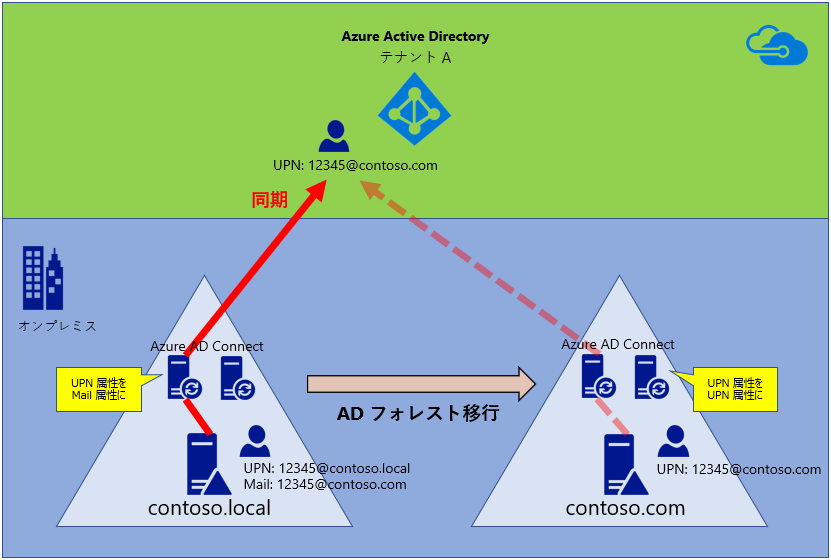  
  
既存の AD フォレスト contoso.local は既に Azure AD と同期しています。  
この図では一つのドメインにしていますが、マルチフォレスト環境の場合、contoso.local や abc.local など複数の AD フォレストがオンプレミスに存在している場合があります。  
そのようなマルチフォレスト環境で、会社間の合併などにより複数のドメインを contoso.com などの一つのドメインに統合する、といったような移行作業では、ここでご紹介する “ハードマッチ” と呼ばれる同期の方法をご利用いただくことをお勧めしています。  
  
上図をご覧いただくと気づくかと思いますが、オンプレミス側のユーザーはフォレスト移行に伴い、別のフォレストの別のユーザーに切り替わります。しかし、Azure AD 側のユーザーは同一のユーザーのままです。
  
したがって、Azure AD 側のユーザーを新規作成したり、Office 365 のライセンスの割り当て直すといった手間を省くことができるとともに、Azure AD Connect (AADC) の機能であるパスワード ハッシュ同期やパススルー認証、シームレス SSO など、ご利用中のオプション機能を継続してご利用いただくことが可能です。
  
なお、今回は移行元/移行先が判別しやすいように別ドメイン名でユーザー名を変更して移行する前提でご案内しておりますが、サーバーのリプレイスなどで同期元 AD フォレスト/ユーザーとしては移行しますが、新規で同名のドメインを別に構築し、そちらを Azure AD の同期元とするような場合も同様の考え方になります。
  
  
## 事前準備  
まず最初に、現在の AADC の設定を確認します。  
以下の手順で現在ソースアンカーを何の属性に設定しているか確認します。  
  
### ソースアンカーの確認
① AADC がインストールされたサーバーで、構成ウィザードを起動します。  
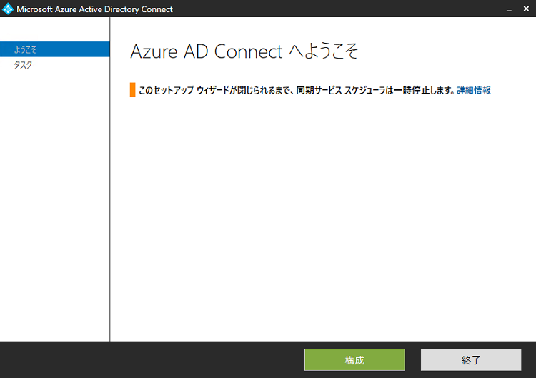  
  
② [現在の構成を表示] を選択し、[次へ] をクリックします。  
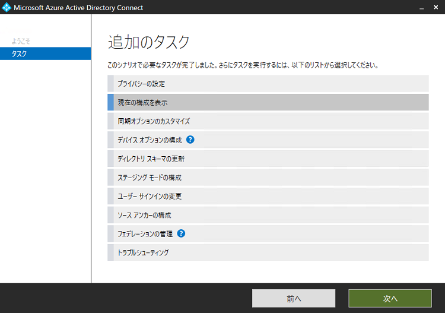  
  
③ [ソースアンカー] に属性が表示されます。  
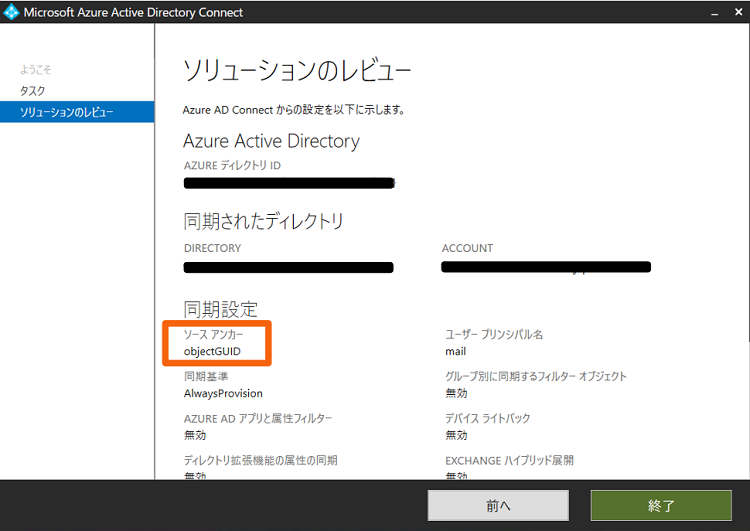  
  
  
ソースアンカーが objectGUID に設定されている場合は、事前に mS-DS-ConsistencyGuid に変更しておく必要があります。  
  
**・なぜ変更する必要があるの？**  
objectGUID はオブジェクト (ここではユーザーのこと) ごとに一意の変更不可の値で、別のユーザー (上図でいうと移行先のフォレストの 12345@contoso.com) には同じ値を設定できません。  
よって、ハードマッチで切り替えを行うことができません。(ハードマッチについては後述します。)  
一方、mS-DS-ConsistencyGUID 属性値は変更が可能なので、移行元の旧同期ユーザー (上図で言うと 12345@contoso.local) で使用している値と同じ値を移行先の新同期ユーザー (上図で言うと移行先のフォレストの 12345@contoso.com) でも保持させることができるため、ハードマッチによる切り替えを行うことができます。  
  
**・ソースアンカーを変更するリスクは？**  
ソースアンカーを変更する場合のリスクを気にされる方も多いと思いますが、AADC は通常 objectGUID の値を Base64 でエンコードし、初回の同期処理で Azure AD の ImmutableID の値にセットします。  
つまり、ソースアンカーを mS-DS-ConsistencyGuid に変更しても、ImmutableID の値は元の objectGUID をエンコードした値のまま変わりません。  
したがって、同じ ImmutableID の値が mS-DS-ConsistencyGuid に書き戻されるため、既存の同期ユーザーが同期できなくなるといった影響は生じません。
  
### ソースアンカーの変更  
では、以下の手順でソースアンカーを mS-DS-ConsistencyGuid に変更します。  
既にソースアンカーを mS-DS-ConsistencyGuid または objectGUID 以外に設定されている方は、この項目はスキップして次に進んでください。  
  
① 構成ウィザードを起動し、 [追加のタスク] で [ソースアンカーの構成] を選択し、[次へ] をクリックします。  
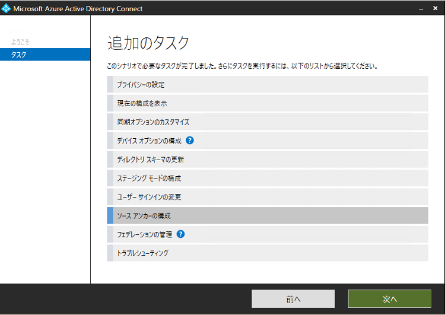  
  
② [Azure AD に接続] で、Azure AD のグローバル管理者のユーザー名とパスワードを入力し、[次へ] をクリックします。  
  
  
③ そのまま [次へ] をクリックします。  
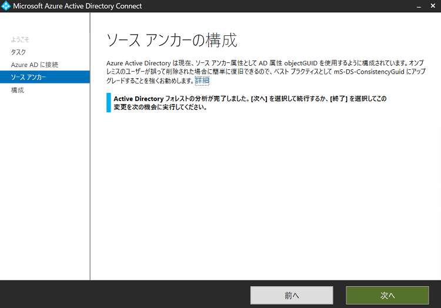  
  
④ [構成] をクリックします。  
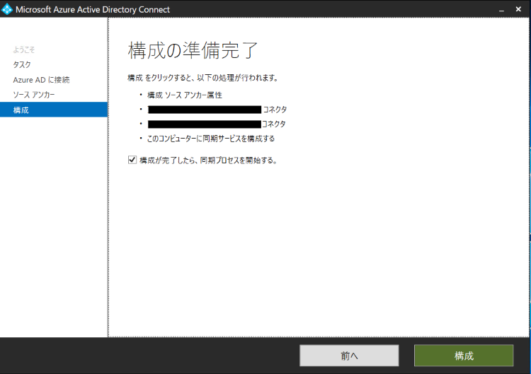  
  
⑤ 既定でソースアンカーの属性が mS-DS-ConsistencyGuid  に設定されるので、[終了] をクリックします。  
  
  
以上でソースアンカーの変更が完了しました。  
構成ウィザード終了後、同期が実行され、オンプレミス AD の  mS-DS-ConsistencyGuid 属性と Azure AD の Immutable ID 属性がハードマッチします。  
  
  
## 同期元ユーザーの切り替え  
次はいよいよ、同期元のフォレストを新フォレストに切り替えます。  
前述のとおり、切り替え方法は AADC の同期機能であるハードマッチを利用します。  
  
ハードマッチとは、オンプレミス AD ユーザーと Azure AD ユーザー間でソースアンカーの値を一致させることで、AADC が双方のオブジェクトを紐付けし、同期を行う処理のことをいいます。  
  
図で表すと、以下のような紐付けが行われます。  
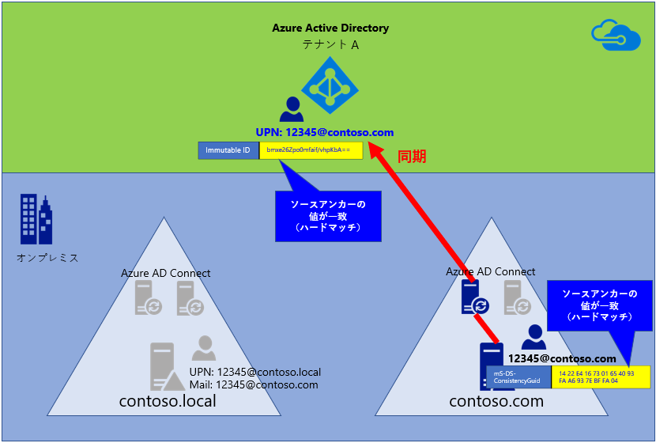  
  
AADC の同期処理には、他にもソフトマッチと呼ばれる ProxyAddresses もしくは UserPrincipalName (UPN) の値を一致させて紐付ける方法がありますが、ハードマッチはソフトマッチよりも優先されます。  
  
つまり、ハードマッチが一番優先度の高いオンプレミス AD と Azure AD 間のオブジェクトの紐付け方法になり、また既に同期済のユーザーの紐付けを変更する場合はソフトマッチによる紐付けは利用できません。  
なぜならば、一度オンプレミス AD と同期した Azure AD 側のオブジェクトは ImmutableID というソースアンカーの属性値を持っているため、AADC が同期済みのオブジェクトと判断し、ソフトマッチによる同期をパスするためです。  
  
それでは、具体的に切り替えの手順を説明していきましょう。  
  
### Step １： AD ユーザーを新フォレストにコピーする  
Active Directory 移行ツール (ADMT) 等を使用して、新フォレスト (contoso.com) にユーザーをコピーします。  
※この手順は一般的なオンプレミス AD における移行方法となりますので、本稿では割愛します。  
  
### Step ２： 既存の AD フォレストの同期を解除  
次に、既存の AD フォレスト contoso.com の AADC をステージング モードに降格します。  
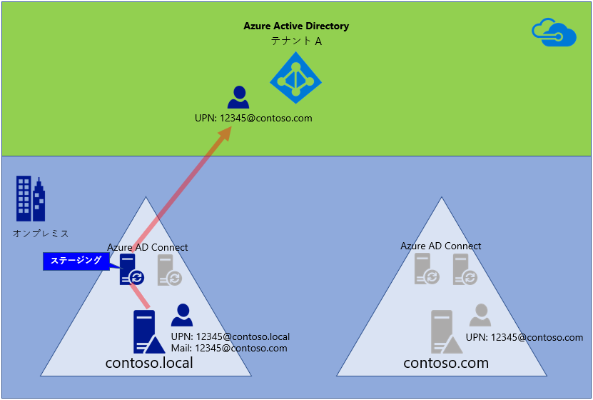  
  
①  構成ウィザードが起動し、[構成] をクリックします。  
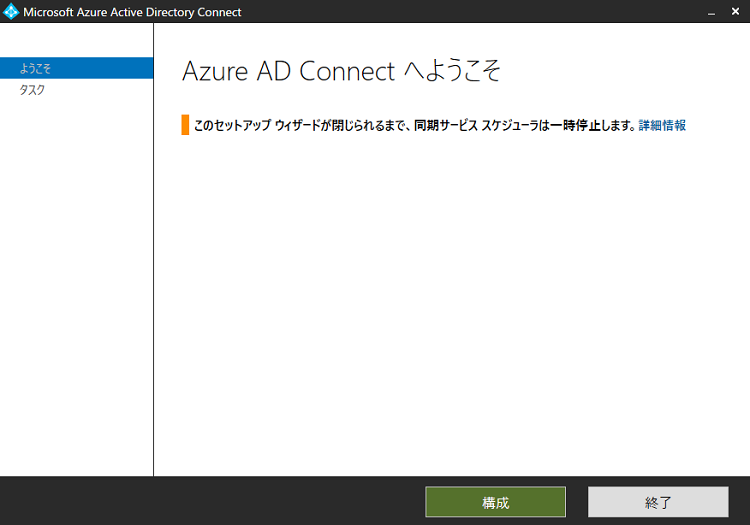  
  
② [ステージング モードの構成] を選択し、[次へ] をクリックします。  
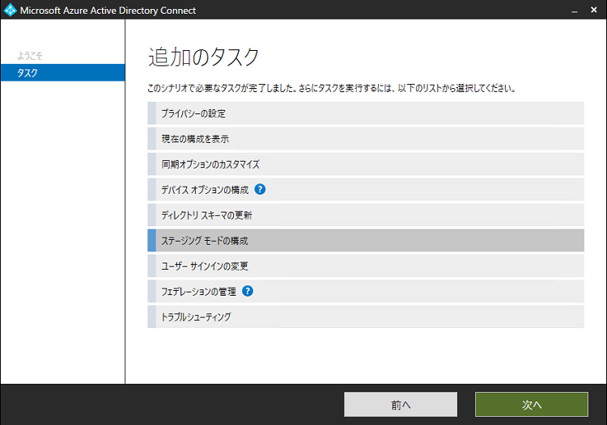  
  
③ [Azure AD に接続] で、Azure AD のグローバル管理者のユーザー名とパスワードを入力し、[次へ] をクリックします。  
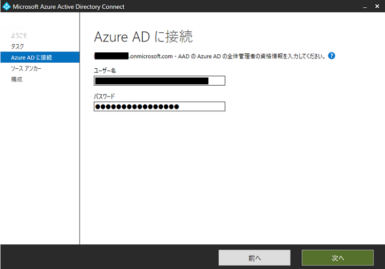  
  
④ [ステージング モードを有効にする] にチェックを入れ、[次へ] をクリックします。  
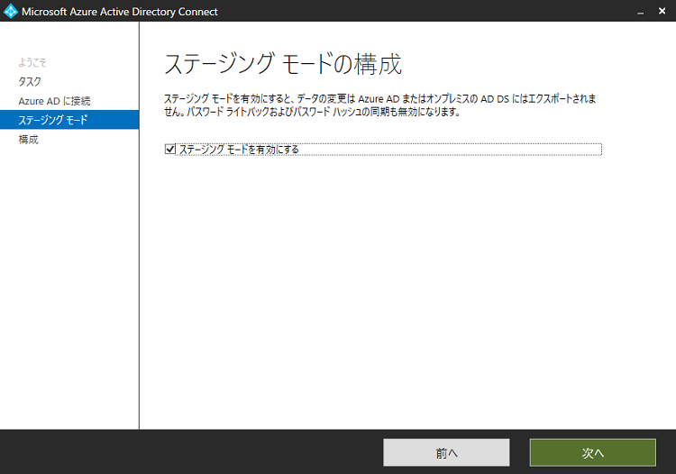  
  
⑤ [構成] をクリックして、構成ウィザードを終了します。  
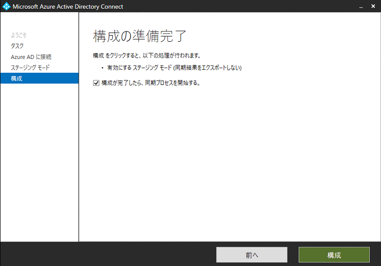  
  
### Step ３： ソースアンカーの値がコピーされていることを確認する  
既存の AD フォレストのユーザーの mS-DS-ConsistencyGuid の値が、新 AD フォレストのユーザーの mS-DS-ConsistencyGuid にコピーされていることを確認します。  
  
もしコピーができていない場合は、以下の手順で値をコピーします。  
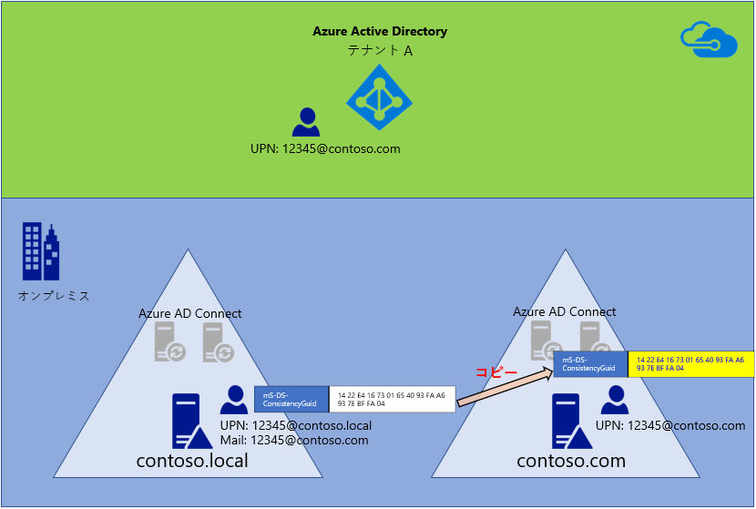  
  
① contoso.local の サーバー マネージャーで、[ツール] ＞ [Active Directory ユーザーとコンピューター] を開きます。  
  
②  同期対象のユーザー (12345@contoso.local) の[属性エディター] で、 mS-DS-ConsistencyGuid を選択し、[編集] をクリックします。  
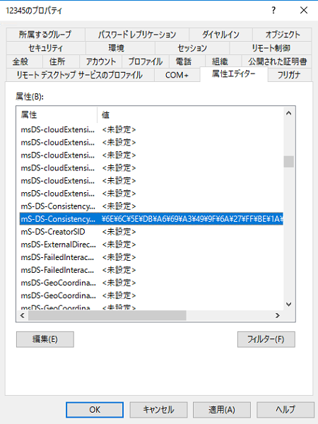  
  
③ 値をコピーし、[OK] をクリックします。  
  
④ メモ帳にコピーした値を貼り付けます。  
  
  
⑤  移行先フォレストの contoso.com の サーバー マネージャーで、[ツール] ＞ [Active Directory ユーザーとコンピューター] を開きます。  
  
⑥ 同期対象のユーザー (12345@contoso.com) の[属性エディター] で、 mS-DS-ConsistencyGuid を選択し、[編集] をクリックします。  
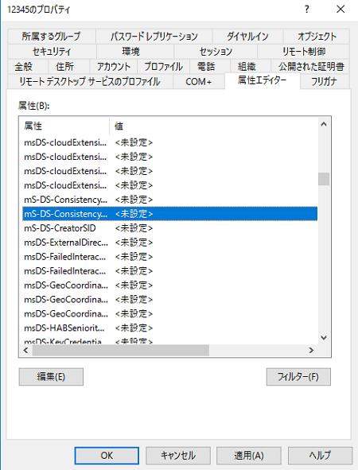  
  
⑦ 値を入れ、[OK] をクリックします。  
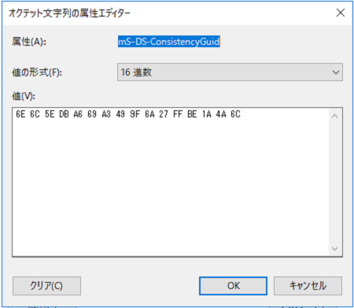  
  
⑧ [OK] を押して、プロパティ画面を閉じます。  
  
すべての同期ユーザーが同様に値がコピーされていることを確認します。  
  
### Step ４： 新 AD フォレストを同期する  
新 AD フォレストの AADC を構成して、ハードマッチによる同期元ユーザーの切り替えを行います。  
  
① 新 AD フォレストの AADC サーバーで .msi ファイルを起動し、AADC をインストールします。  
  
  
② 構成ウィザードが起動しますので、[ライセンス条項 および プライバシーに関する声明に同意します] にチェックを入れ、[続行] をクリックします。  
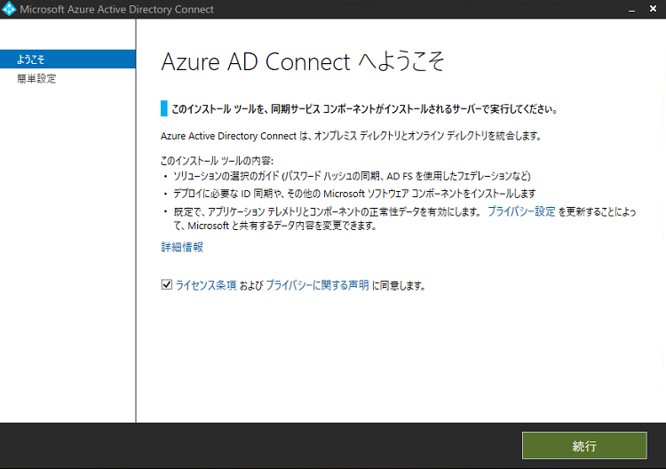  
  
③ [カスタマイズ] をクリックします。  
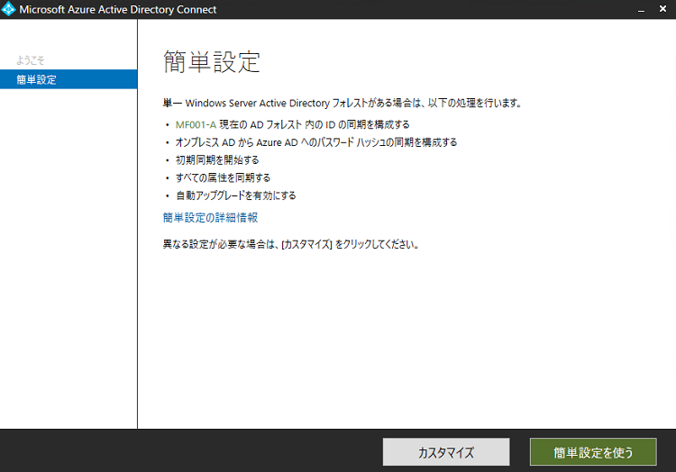  
  
④ 必要項目にチェックを入れて、[インストール] をクリックします。  
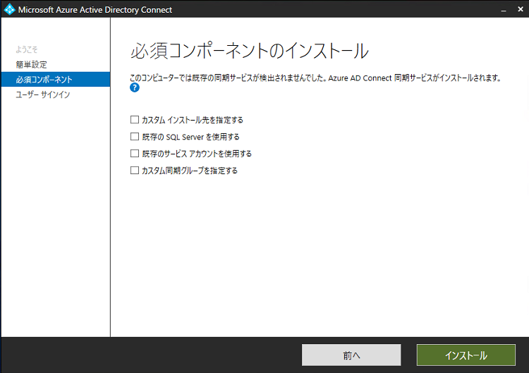  
  
⑤ 必要項目にチェックを入れて、[次へ] をクリックします。  
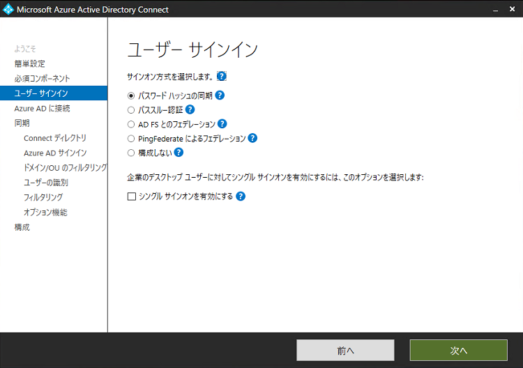  
  
⑥ [Azure AD に接続] で、Azure AD のグローバル管理者のユーザー名とパスワードを入力し、[次へ] をクリックします。  
  
  
⑦ 新フォレストのドメインを設定し、[ディレクトリを追加] して、[次へ] をクリックします。  
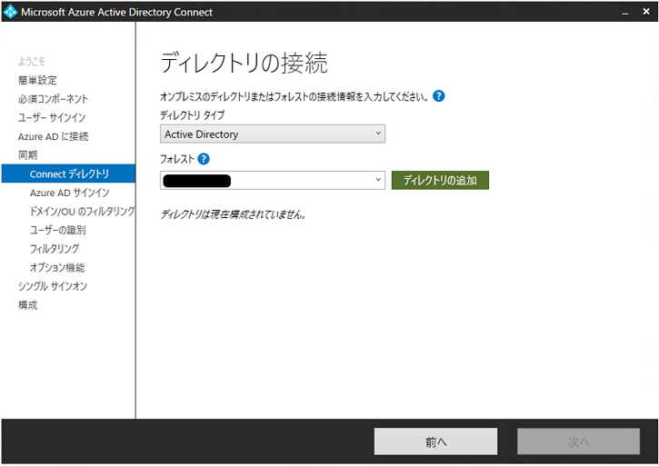  
  
⑧ ユーザープリンシパル名を設定し、[次へ] をクリックします。  
  
  
⑨ [ドメインと OU のフィルリング] を設定し、[次へ] をクリックします。  
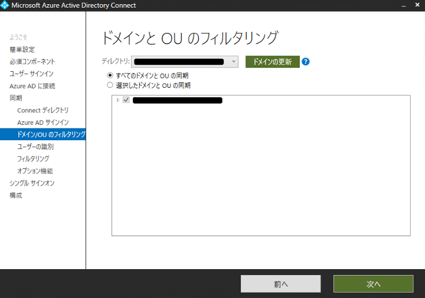  
  
⑩ [特定の属性を選択します] で mS-DS-ConsistencyGuid を選択し、[次へ] をクリックします。  
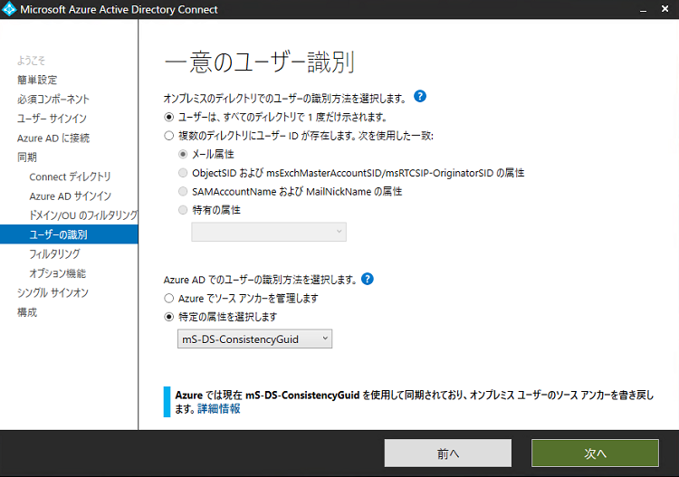  
  
⑪ 構成ウィザードの最後まで進み、[インストール] をクリックします。  
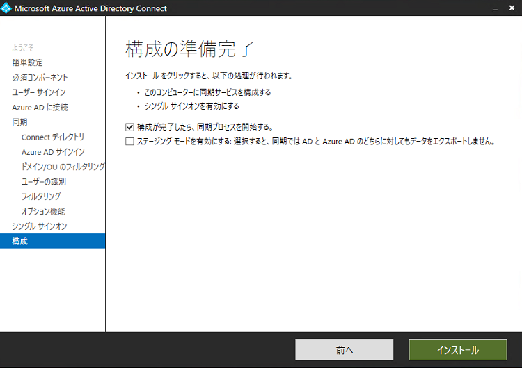  
  
  
以上で同期元ユーザーの切り替え作業は完了になります。  
  
### ＜補足＞  
1. ソフトマッチによるユーザーの切り替えは推奨しておりません。   
	AADC の同期処理 (オブジェクトの紐づけ) には、ハードマッチができない場合の次の手段として、proxyAddresses 属性、または UserPrincipalName 属性の値を一致させて紐づけを行う “ソフトマッチ” という方法があります。  
	ただし、今回のように既に同期済みの オンプレミス AD ユーザーを別のユーザーに変更する場合にソフトマッチを使用しますと、同期を解除した後にまず ImmutableID を削除する必要がありますが (ImmutableID が設定されたオブジェクトに対しては AADC はソフトマッチを行わないため) 、**ImmutableID の削除はサポートしておりません。**  
	したがいましてソフトマッチによる切り替えは技術的には可能ですが、推奨しておりません。  
  
  
上記内容が皆様の参考となりますと幸いです。  
  
ご不明点などございましたら、ぜひ弊社サポートまでお問い合わせください。  
※本情報の内容 (リンク先などを含む) は、作成日時点でのものであり、予告なく変更される場合があります。  
