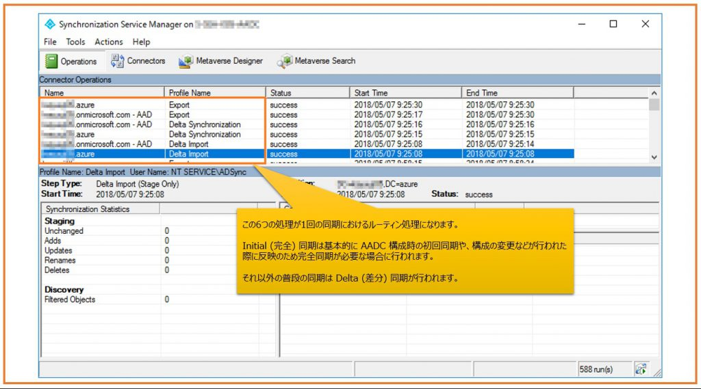
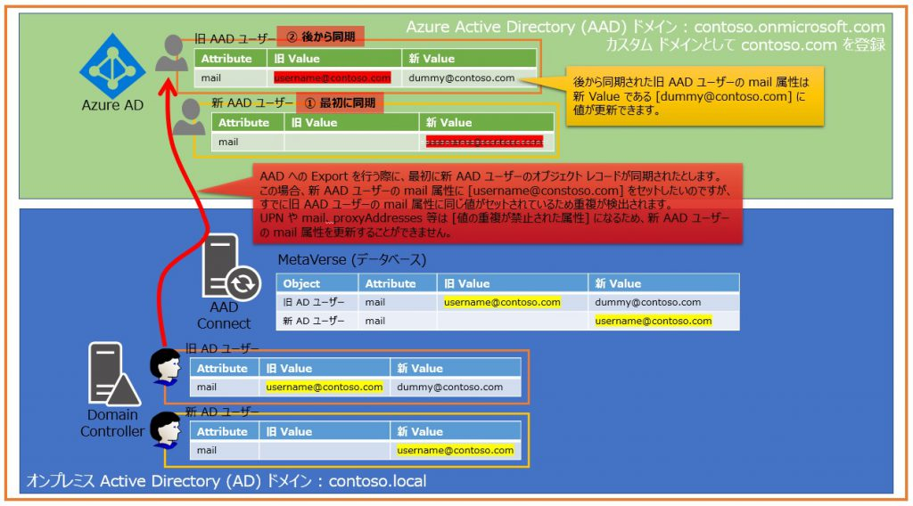

> 本記事は Technet Blog の更新停止に伴い https://blogs.technet.microsoft.com/jpazureid/2018/10/11/aadc-apply-point01/ の内容を移行したものです。
> 元の記事の最新の更新情報については、本内容をご参照ください。

# Azure AD Connect : ディレクトリ同期の応用 – オブジェクト間の属性値の移動

こんにちは。Azure Identity チームの金森です。  
今回は Azure AD Connect (AADC) ツールを利用している環境で "オンプレミス AD ユーザー B にセットしたメール アドレス値が同期先 AAD ユーザーに反映されない" という事象について AADC の動作仕様を元に解説します。  
今回 AADC の動作についての応用編となりますので、先に基本的な考え方については、以下の Blog もぜひご参照いただけたら嬉しいです。

Azure AD Connect : ディレクトリ同期の基本的なポイント
https://blogs.technet.microsoft.com/jpazureid/2018/05/09/synchronization-basic-point/

まず、AADC の基本的な動作を整理します。

- Connector は通信対象ディレクトリとやり取りするデータを、Connector Space (CS) と呼ばれるデータベースに一時的に格納 (ステージング) します。

以上の動作は既定では 30 分毎に行われており、これは次のような流れで行われます。  
Synchronization Service Manager での表示は下から上へ、となります。

1. Delta or Full Import : オンプレ AD からオブジェクト情報を Import する処理 (AD 用 CS にステージング)
2. Delta or Full Import : AAD からオブジェクト情報を Import する処理 (AAD 用 CS にステージング)
3. Delta or Full Synchronization : オンプレ AD 用 CS のデータを MV と同期して更新する
4. Delta or Full Synchronization : AAD 用 CS のデータを MV と同期して更新する
5. Export : 現在の MV のデータを元に更新された AAD 用 CS のデータを AAD へ Export する処理
6. Export : 現在の MV のデータを元に更新されたオンプレ AD 用 CS のデータをオンプレ AD へ Export する処理

AADC の管理画面である Synchronization Service Manager で見た場合のイメージを以下に示します。

## 同期済みユーザーの属性を変更する際の動作について

ここからは冒頭で記載しました同期済みのユーザーの属性を変更したが反映されないという事象について解説していきます。今回は、具体的にお問い合わせをいただきましたメール アドレスを例として、オンプレミス AD ユーザー A に設定されたメール アドレスをユーザー B に付け替えるようなケースを元に説明していきます。  
ここで先に AADC の同期動作を考える上で大事な特徴を挙げておきます。

**ポイント : 1 回の同期で [1 つの値] を [複数オブジェクト間で削除/追加] した場合、タイミングによっては追加した値が AAD ユーザー側に同期されない場合がある**

この特徴を念頭に AADC で属性を変更する際の留意点を言ってしまうと**削除する情報を先に AAD に同期して、追加する情報は後から同期しましょう**ということになるのですが、その心を説明します。  
例えば、以下のような運用処理が行われたとします。

- オンプレミス AD ユーザー A を [旧 AD ユーザー] とします。
- オンプレミス AD ユーザー B を [新 AD ユーザー] とします。
- それぞれの AD ユーザーに呼応して、AAD 側にも 2 つの新旧ユーザー オブジェクトが同期により作成されています。
- [旧 AD ユーザー] が使用していたメール アドレスを [新 AD ユーザー] に使用させたいような状況が生じました。

この場合、オンプレミス AD 側では以下 2 つの操作を行います。

a. 旧 AD ユーザーのメール アドレス (mail) 属性をダミー値に変更 (null としても良いですが、今回はダミー値に変更することを前提で話を進めます)  
b. 新 AD ユーザーのメール アドレス (mail) 属性に、旧 AD ユーザーが使用していたアドレス値をセット

上記 a、b の変更を 1 回のディレクトリ同期で処理した場合、AAD に向けて同期されるオブジェクトの順序によっては、新 AAD ユーザーに変更が反映しない場合があります。

前述の同期処理の [5. の AAD への Export] 時に a と b の処理を AAD に反映させる処理が試みられますが、a と b のどちらの処理が先に行われるかは担保されません。このとき b の処理 (新 AAD ユーザー オブジェクトへの同期) が先に行われると、新 AAD ユーザーに反映したかったメール アドレスが旧 AD ユーザーで利用されているために更新が行われず、結果として a の処理のみが行われて b の処理が行われません。この状況をもう少し詳しく記載したのが下図になります。
  

このような状態になった場合、"次回の同期で新 AD ユーザーの mail 属性値が改めて新 AAD の mail 属性に更新されるのでは？" と考える方もいるかもしれません。  
しかし、次回の同期時には AD からの Import において、AADC の MV 情報は何も更新されないため、AADC は AAD に改めて Export すべき更新が無いと判断します。  
つまり、次回同期でも新 AD ユーザーの mail 属性値は更新されず Null のままとなりオンプレミス AD の情報とも不整合が生じた状態となります。

この場合の対処としては、オンプレミス AD にて新 AD ユーザーの mail 属性値を変更して同期を行い、再度目的の値に戻して同期を行います。具体的な作業は次のとおりです。

- 新 AD ユーザーの mail 属性に一時的な値 (username-temp@contoso.com 等) をセットする
- この状態で一度 AADC による同期を行い、一時的なメール アドレス値を新 AAD ユーザーの mail 属性に反映させる
- 改めて新 AD ユーザーの mail 属性に本来セットしたかった値 (username@contoso.com 等) をセットする
- 再度 AADC による同期を行い、本来の目的であるメール アドレス値を新 AAD ユーザーの mail 属性に反映させる

そもそものお話として、上記のような症状が発生することが無いよう**削除する情報を先に AAD に同期して、追加する情報は後から同期する**運用をぜひ留意いただければ幸いです。  
以下の技術情報でも、AADC のアーキテクチャに関する情報を公開しておりますので、興味を持っていただけた方はぜひ併せてご参照ください。

Azure AD Connect sync: アーキテクチャの概要  
https://docs.microsoft.com/ja-jp/azure/active-directory/hybrid/concept-azure-ad-connect-sync-architecture

上記内容が皆様の参考となりますと幸いです。どちら様も素敵な AAD ライフをお過ごしください。

ご不明な点等がありましたら、ぜひ弊社サポート サービスをご利用ください。  
