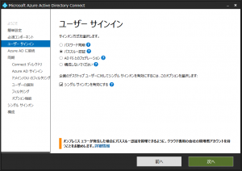

# Azure AD Connect で実現するシングル サインオン

こんにちは！ Azure Identity サポート担当の橋本です。  

今回は Azure AD Connect のシームレス シングルサインオン (sSSO) 機能で実現するシングル サインオンについてご紹介します。

従来、Office 365 にシングル サインオン (SSO) といえば、AD FS が必要でしたが、Azure AD Connect の sSSO を構成することで、AD FS 無しで SSO が実現できてしまいます。ID とパスワードはオンプレミス側で管理しつつも、Azure AD と連携しているクラウド サービスなどは、ユーザーはパスワードを入力することなくオンプレの ID を用いたシングル サインオンで利用できるようになるのです。

設定方法はとても簡単。

1. Azure AD Connect で シングルサインオンを有効にします。

    

    この際、[パスワード同期] か [パススルー認証] のどちらかを [sSSO が利用できない認証要求時に利用できる代替認証方式] として組み合わせるため選択します。

2. ドメイン グループ ポリシーを使って、ユーザーのイントラネットゾーンの設定に次の Azure AD URL を追加するポリシーをユーザーに配布します。 

    https://autologon.microsoftazuread-sso.com

    https://aadg.windows.net.nsatc.net (以前はこちらもイントラネットゾーンへの登録が必要でしたが、現在は不要です)

[前提条件](https://docs.microsoft.com/ja-jp/azure/active-directory/hybrid/how-to-connect-sso-quick-start) などはいくつかありますが、必要な手順は大まかにこの 2 つだけです。

つまり、組み合わせとして [sSSO + パスワード同期] か [sSSO + パススルー認証] のどちらかを選択することになります。

sSSO 認証方式のユーザーの認証は最終的に [クライアントからオンプレ AD の DC サーバーへの kerberos 認証] になるため、sSSO 認証が行えるのは [オンプレ AD ドメインに参加しているクライアントに AD ユーザーでログオン] した状態を前提としています。また、sSSO 認証が対応しているのはブラウザーと先進認証 (ADAL) に対応したリッチアプリ クライアントのみとなります。こちらに関しては[よく寄せられる質問](https://docs.microsoft.com/ja-jp/azure/active-directory/connect/active-directory-aadconnect-sso-faq)も併せてご覧ください。

どちらの組み合わせを選択すべきかはご要件に依存します。例えば、ハッシュ値であり暗号化された経路を使用した場合もパスワードをインターネット通信に乗せたくない、という方はパススルー認証の方が向いています。もしくは、認証基盤を構成するサーバー数を増やしたくない方がメリットが大きい、という方はパスワード同期の方が向いていると言えそうです。

これにより、ユーザーが社内で、ドメインに参加している端末にサインインし、IE や Chrome で、例えば https://portal.office.com/ など Azure AD と連携しているサービスを開くと、パスワードは求められずにサインインが完了します。こんな感じ ↓ で、ADFS 無しで SSO ができてしまいます。

また、前述の[よく寄せられる質問](https://docs.microsoft.com/ja-jp/azure/active-directory/connect/active-directory-aadconnect-sso-faq)にもあるように、パスワードだけではなくユーザー名の指定もせずにサインインが行えるサービス/URLもあります。以下は outlook.office365.com/customdomain.name にアクセスした時の動作です。 (カスタム ドメイン名はご利用の環境に即したドメイン名を指定します)

これは社内のドメイン参加済み端末からアクセスした場合のシナリオです。社外からの場合は ID とパスワードが要求されます。

ぜひお試しください！

## 参考情報

- [Azure Active Directory シームレス シングル サインオン: クイック スタート](https://docs.microsoft.com/ja-jp/azure/active-directory/connect/active-directory-aadconnect-sso-quick-start)
- [Azure Active Directory シームレス シングル サインオン: 技術的な詳細](https://docs.microsoft.com/ja-jp/azure/active-directory/connect/active-directory-aadconnect-sso-how-it-works)
- [Azure AD Connect のシングル サインオン & パススルー認証 (プレビュー) によるクラウド完結のユーザー認証インフラの実現](https://blogs.technet.microsoft.com/office365-tech-japan/2017/03/08/aadconnect-sso-and-pass-through-authentication/)
- [“シームレス SSO” と “パススルー認証” の一般提供開始](https://blogs.technet.microsoft.com/office365-tech-japan/2017/10/31/aadc-sso-and-passthrough-auth-ga/)

ただ、きめ細やかなアクセス制御を行いたいというご要件がある場合は、シームレス SSO にはアクセス制御の機能は実装されていないため、Azure AD Premium の条件付きアクセスや AD FS の併用をご検討ください。個人的には、現時点 (2017 年 10 月) では、クレーム ルールを用いたアクセス制御やユーザー証明書認証も行える AD FS のほうが制御条件のきめ細やかさには軍配が上がるのでは！？と考えます (メリット/デメリットや設計指針に依存するため、個人の感想です)。

製品動作に関する正式な見解や回答については、お客様環境などを十分に把握したうえでサポート部門より提供させていただきますので、ぜひ弊社サポート サービスをご利用ください。
