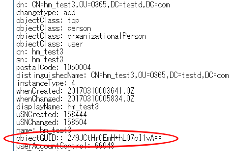

> [!NOTE]
> 本記事は Technet Blog の更新停止に伴い https://blogs.technet.microsoft.com/jpazureid/2017/10/05/135/ の内容を移行したものです。
> 元の記事の最新の更新情報については、本内容をご参照ください。

> 2020/09/26 更新
> [ソフトマッチによるAzure AD (Office 365) 上のユーザーをオンプレミス Active Directory ユーザーと紐付ける方法](../azure-active-directory-connect/aboutSoftMatching.md) のブログの公開に併せて、タイトルに "ハードマッチ" の記載を追記しました。
>
> 2023/7/14 更新
> MSOL コマンド部分を新しい Microsoft Graph PowerShell SDK コマンドに置き換えました。

# ハードマッチによる Azure AD (Office 365) 上のユーザーをオンプレミス Active Directory ユーザーと紐付ける方法

こんにちは、Azure & Identity サポート チームです。

今回は Azure AD (Office 365) 上のユーザーをオンプレミス Active Directory ユーザーと紐付ける方法の一つで、ハードマッチと呼ばれる方法についてご紹介します。

既に Azure AD 上にユーザー アカウントが存在している状態で、そのユーザーを後からオンプレミスの Active Directory (AD) に追加し、同期をおこなうときにその既存のアカウントをそのまま利用したいということがあると思います。

このようなケースではオンプレミス AD で対象となるアカウントのメール アドレス、または UPN 名を一致させた上で同期をおこなうという手法が一般的には取られます (これをソフトマッチと呼びます)。このソフトマッチができない場合 (UPN 名が異なるアカウントを紐づける必要がある場合など) にはハード マッチと呼ばれる方法で直接的に同期時にオブジェクトの一意性を確保する ID 情報 Immutable ID を紐づけます。

Azure AD Connect の既定の構成では、オンプレミス AD の ObjectGUID (バージョン 1.1.486.0 以前) あるいは msDS-ConsistencyGuid (バージョン 1.1.524.0 以降) を Base64 でエンコードした値を Immutable ID (source Anchor) として紐づけています。

以下では Azure AD Connect で ObjectGUID を ImmutableId と紐づける構成とている場合においてハードマッチによる同期をおこなう設定をご紹介します。


## 手順

1. オンプレミス AD にて Base64 でエンコードされた ObjectGUID を確認します
2. Azure AD 上で ImmutableId が設定されてないことを確認します
3. Azure AD 上のアカウントに ImmutableId を手動で設定します
4. 手動で差分ディレクトリ同期を実施します

※ 4 を除き、同期処理が止まっている状態で作業をご実施ください。同期処理が止まっていないと紐づけしたいオンプレミス AD のアカウントが同期されてしまい、Immutable ID を紐づけできません。

### 1. オンプレミス AD にて Base64 でエンコードされた ObjectGUID を確認

オンプレミス上の紐づけ対象のアカウントの GUID 情報を取得します。

1. オンプレミス Active Directory の任意の DC 上で [管理ツール] - [Active Directory ユーザーとコンピューター] を開きます。
2. メニューから [表示] - [拡張機能] にチェックを入れます。
3. 該当ユーザー アカウントのプロパティを開きます。
4. [属性エディター] タブを開き、"distinguishedName" 値を選択し、[表示] をクリックします。
5. distinguishedName 値 (以下、DN 値) の内容をコピーします。
6. コマンド プロンプト (PowerShell でも可) を起動し、以下のコマンドを実行します。

```powershell
ldifde -f c:\ ldifde_user.txt -d "手順 5. でコピーした内容" -p subtree
```

コマンド例：


1-7. 出力されたファイルを開き、ObjectGUID の値を確認します。
出力結果例：



## 2. Azure AD 上で ImmutableId が設定されてないことを確認

Azure AD の紐づけ対象のアカウントに ImmutableId が設定されていないことを確認します。ImmutableId が設定されている場合には、すでに同期対象となっていることを示します。

1. インターネットに接続している任意のコンピューター上で "Windows PowerShell 用 Windows Azure Active Directory モジュール" を管理者として実行します。
2. 起動した PowerShell にて Connect-MsolService コマンドを実行します。
※ 認証ダイアログが表示されますので、管理者ユーザーの資格情報を入力して [OK] ボタンをクリックします。
3. 下記のコマンドを実行します。

```
Get-MgUser -UserId  "対象ユーザーの UPN" -Select OnPremisesImmutableId | fl OnPremisesImmutableId
```

コマンド例：

```ps1
Get-MgUser -UserId test12127@m365x61971868.onmicrosoft.com -Select Userprincipalname,OnPremisesImmutableId | fl OnPremisesImmutableId,userprincipalname
```

4. 出力されたファイルを開き、ImmutableId の値を確認します。

出力結果例：

```ps1
OnPremisesImmutableId :（クラウド内ユーザーの場合、空白になります）
UserPrincipalName     : test12127@m365x61971868.onmicrosoft.com
```

### 3. ImmutableId を手動で設定

ディレクトリ同期ツールにて、ユーザーの情報を関連付けるには下記の情報を使用します。

- オンプレミス AD 側: objectGUID
- Azure AD 側: ImmutableId

1. インターネットに接続している任意のコンピューター上で "Windows PowerShell 用 Windows Azure Active Directory モジュール" を管理者として実行します。
2. 起動した PowerShell にて Connect-MsolService コマンドを実行します。
  ※認証ダイアログが表示されますので、管理者ユーザーの資格情報を入力して [OK] ボタンをクリックします。
3. 下記のコマンドを実行します。

```powershell
Update-MgUser -UserId 対象ユーザーの UPN -OnPremisesImmutableId <オンプレ AD ユーザーの  Base64 エンコードされた objectGUID 値>
```

コマンド実行例：

```powershell
Update-MgUser -UserId test12127@m365x61971868.onmicrosoft.com -OnPremisesImmutableId 2/9JCtHr0EmH+hL07o11vAaa
```

3-4. 下記のコマンドを実行します。

```powershell
Get-MgUser -UserId 対象ユーザーの UPN -Select Userprincipalname,OnPremisesImmutableId | fl OnPremisesImmutableId,userprincipalname
```

コマンド例：


### 4. 手動で差分ディレクトリ同期を実施

※ 2016 年 2 月に公開された新しいバージョン (1.1.105.0 以上) の Azure AD Connect を使用した手順をご案内いたします。

1. ディレクトリ同期サーバーに管理者権限でログインします。
2. 管理者の PowerShell を起動して、以下のコマンドを実行します。

```ps1
Start-ADSyncSyncCycle -PolicyType Delta
```

※ 今回ご紹介しているケースのように Azure AD Connect が構成済みである場合は上記コマンドで差分同期をすることとなります。

3. Office 管理ポータルで作業対象ユーザーの [同期の種類] が [クラウド] から [Active Directory ] に変わったことを確認します。
