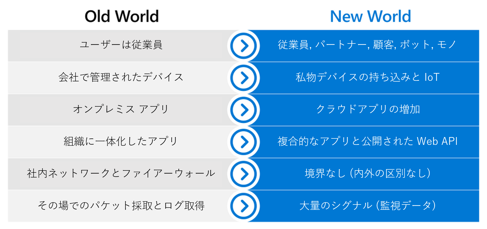
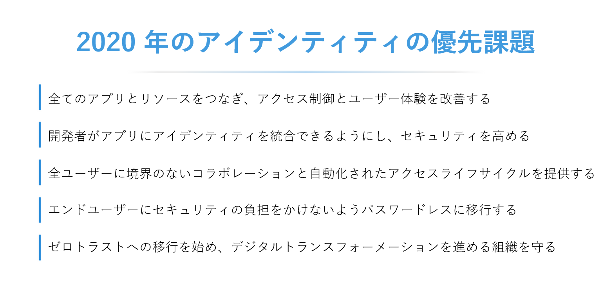

> 本記事は、2020 年 1 月 28 日に Azure Active Directory Identity Blog に公開された記事 (5 identity priorities for 2020—preparing for what’s next) を翻訳したものです。原文は [こちら](https://techcommunity.microsoft.com/t5/azure-active-directory-identity/5-identity-priorities-for-2020-preparing-for-what-s-next/ba-p/1131492) より参照ください。

# 2020 年 アイデンティティについて取り組むべき 5 つのポイント

Microsoft アイデンティティ グループの慣習として、毎年、顧客との共同イノベーション週間というものを開催しています。次の新しい 10 年で最初のイベントを始めるにあたり、2020 年またさらにその先を見据え、常に念頭にあるのは、私たちの戦略と製品の方向性を形作るお客様の優先事項がどのうのように進化していくのかという点です。

過去の10年間を振り返ってみると、デジタル トランスフォーメーションが人々の働き方や企業のビジネスのあり方を大きく変えてきたのは驚くべきことです。 ユーザーを例に見てみましょう。 かつての "ユーザー" とは従業員を意味していましたが、現在のユーザーにはパートナー、顧客さらにはソフトウェア ボットやデバイスも含まれています。アイデンティティ (ID) は従業員を表すものとして始まりましたが、今やすべての人やモノがアイデンティティで表されています。 企業のネットワーク境界がなくなり、アイデンティティは、すべてのユーザーとデジタル リソースに効果的なアクセス制御を提供するセキュリティの制御インターフェイスになりました。

アイデンティティは、お客様のビジネスの成功にとって、絶対的に重要なものとなります。アイデンティティは、セキュリティの中核であるだけでなく、ビジネス変革の中心でもあります。そのため、2020 年に優先すべき 5 つの領域と、今後に備え注目すべき技術を共有したいと思います。 これらの優先事項は、お客様と緊密に協力し、デジタル トランスフォーメーションとしてお客様環境を再構築する際に行った多くの会話に基づいたものです。

## 2020 年 5 つのアイデンティティ優先ポイント
 
### 1.  すべてのアプリケーションとクラウドリソースを接続して、アクセス制御とユーザー体験を改善する。

すべてのアプリケーションに単一のコントロール プレーンとして Azure Activity Directory（Azure AD）を使用すると、デジタル資産全体にわたって可視性と適応性を兼ねた、きめ細かなアクセス制御を実現できます。また、当社のクラウド規模の機械学習アルゴリズムが毎日処理する 171 テラバイトのデータを活用して、各ユーザーとアプリケーションの行動パターンを学習し、潜在的な攻撃にフラグを立て、修正することが可能です。例えば、危険にさらされている可能性のあるユーザーを保護するために、ユーザーの混乱を最小限に抑えて ID の侵害を防ぐ強制パスワードリセットなどのシンプルなポリシーを適用できます。
デジタル ネイティブ世代が労働人口に加わり、今も増え続けています。彼ら/彼女らは、アプリを使い、どこからでも様々なプロジェクトでコラボレーションすることを当たり前に考えており、しかもアプリには何度もサインインしたくないと思っています。一般的な SaaS アプリケーションから [オンプレミス アプリケーション](https://azure.microsoft.com/en-us/services/active-directory/sso/secure-hybrid-access/) や [クラウド リソース](https://techcommunity.microsoft.com/t5/azure-active-directory-identity/azure-ad-authentication-to-windows-vms-in-azure-now-in-public/ba-p/827840) に至る [すべてのアプリケーションを単一のクラウド アイデンティティ サービスで接続する](https://azure.microsoft.com/en-us/services/active-directory/sso/) ことは、ユーザーにシングル サインオン (SSO) の体験を提供するだけでなく、セキュリティも向上させます。

Azure Activity Directory（Azure AD）をすべてのアプリケーションの単一の制御インターフェイスとして使用すると、デジタル資産全体にわたって可視性と適応性を兼ねたきめ細かなアクセス制御を実現できます。また、当社の世界規模の機械学習アルゴリズムが毎日処理する 171 テラ バイトのデータを活用して、各ユーザーとアプリケーションの行動パターンを学習し、潜在的な攻撃にフラグを立て、回復させることが可能です。例えば、危険にさらされている可能性のあるユーザーを保護するために、強制パスワード リセットなどのシンプルなポリシーを適用でき、ユーザーの混乱を最小限に抑えながら ID の侵害を防ぐことが可能です。

### 2. アプリケーションにアイデンティティを統合し、セキュリティを改善できるようにアプリ開発者を支援する。

多くの組織では、複雑なセキュリティとプライバシーの要件を必要とするアプリケーションが爆発的に増えたことで、その対応を進めています。Azure AD と統合すると、アプリケーションのセキュリティとプライバシーが向上しますが、既にある大量のアプリを管理し続けながら、押し寄せる新しいアプリケーションの数々に対処していくことは、ID 管理者にとって莫大な仕事になります。管理者に支援が必要です。

それを解決するためには、ID 管理者はアプリケーション開発チームにさらに多くを委任することが必要です。このため、マイクロソフトでは、開発者が Microsoft Identity Platform を利用して認証をアプリケーションに統合し、Microsoft Graph を使用してデータ駆動型アプリケーションの構築や自動化を簡単に構築できるように支援します。さらに追加の利点として、開発者は各アプリケーションに最低限必要な権限について、きめ細かな設定ができるため、タスクを完了するために必要な Microsoft Graph データにのみアクセスすることが可能です。

### 3. セキュリティでユーザーに負担をかけないためにパスワードレスに移行する。

パスワードは [安全ではなく](https://techcommunity.microsoft.com/t5/azure-active-directory-identity/your-pa-word-doesn-t-matter/ba-p/731984)、管理コストが高く、ユーザーを悩ませることは誰もが知っています。そのため、過去 2年間、FIDO アライアンスと提携し、私たちの従業員から率先して、パスワードの排除を目標としてきました。パスワードのない世界に備える時が今まさに来ています。

[パスワードレス認証](https://www.microsoft.com/en-us/security/technology/identity-access-management/passwordless) には非常に多くの利点があります。 その 1 つは、Microsoft 自身の経験でわかったように、ハード コストとソフト コストが 87% 削減されるという点です。すべての組織がパスワードレスに移行できるように、Windows Hello から Microsoft Authenticator および FIDO2 セキュリティ キーなど、クラウドおよびハイブリッド環境で機能するの様々な方法を提供しています。また、導入しやすくするために、お客様と自社 IT チーム状況に応じて展開の計画を開始する [4 つのステップ](https://www.microsoft.com/security/blog/2019/12/11/go-passwordless-strengthen-security-reduce-costs/) を用意しています。

### 4. すべてのユーザーに対して境界のないコラボレーションと自動化されたアクセス ライフサイクルを実現する。

組織の境界の内外でのデジタル コラボレーションが爆発的に増えています。今日のアイデンティティは、例えば、顧客やパートナー、または以前はデジタル変革の恩恵を得ていなかった 20 億人を超えるファーストライン ワーカー (現場の最前線で働く従業員) とのすべてのデジタルなやり取りに対応ししています。将来的には、人とソフトウェア ボット、マイクロサービス、スマート デバイス間のコラボレーションも強化されるでしょう。

効果的なコラボレーションには、単にすべてのユーザーをつなぐだけでは不十分です。適切なユーザーが適切なリソースに適切なタイミングで適切なアクセスができるようにする必要があります。ユーザーとアプリケーションの数が増加しているため、IT 部門が全員のアクセスのニーズを把握することはできません。アイデンティティ ガバナンスがここで役立ちます。クラウド ベースの [ID ガバナンス](https://aka.ms/identitygovernance) は、SAP Success Factors や Workday などの人事システムとの統合により、アクセス ライフサイクルを自動化し、機械学習と分析の力によりレビュー担当者のアクセス許可/拒否の判断をシンプルにします。また、ビジネス ユーザーがアクセス要求とワークフローを通じてアクセスを管理したり、ファーストライン マネージャー (現場にいるマネージャー) にユーザー管理を委任したりすることもできます。

### 5. ゼロ トラストへの移行を開始し、デジタル トランスフォーメーションを進める組織を守る。

我々が会話する顧客は、"ネットワークの境界はなくコラボレーションにも境界はない、またデバイスとアプリケーションが爆発的に増加し、従来のセキュリティ パラダイムはもはや適用できない" ということを明確に理解にしています。このような世界では、ゼロ トラストという考えが世界の原則であり、セキュリティ戦略でもあります。ゼロトラストの世界では、企業ファイアウォールの背後にあるすべてのものが安全であるという前提はなく、代わりに 3 つの原則である、明示的な検証、最小特権でのアクセス、侵害は必ず発生するという考えを前提とします。

マイクロソフトが [自身の経験](https://www.microsoft.com/security/blog/2019/10/29/improve-security-zero-trust-access-model/) から学んだように、ビジネスの優先順位や所有するテクノロジー、保護する資産に応じて、すべてのゼロ トラストへの移行のステップはお客様ごとに異なるものになります。既存の運用や資産に基づいて構築する場合、[ゼロ トラストの成熟度](https://download.microsoft.com/download/f/9/2/f92129bc-0d6e-4b8e-a47b-288432bae68e/Zero_Trust_Vision_Paper_Final%2010.28.pdf) を評価することで、さらに強力なセキュリティ体制に向けて実用的な手段を講じることができます。

## 2020 年以降のアイデンティティの展望

2020 年以降も、多くのエキサイティングなテクノロジーが、アイデンティティの世界を変えようとしています。特に注目すべき点は、非中央集権型 (decentralized) アイデンティティです。

### 非中央集権型のアイデンティティと検証可能なクレームにより検証性とプライバシーが向上する。

より多くのトランザクションと情報交換がデジタルで行われるようになると、その人が誰なのか、提示する情報が正確であるかを確認することが不可欠となります。これは、収集したデータの正しさを確認し、なおかつそのデータの秘匿性と安全性を確保しなければいけない組織にとって、非常に大きな負担となります。また、人々は自らのアイデンティティを管理し、個人情報を収集するそのような組織に多大な信頼を置く必要もあります。

非中央集権型のアイデンティティは、我々のデジタルとのかかわり方を変えることで、すべてのオンライン上の属性情報を簡単に検証できるようにし、なおかつユーザー自らが自身のデータを管理できるようにします。これは単なるコンセプトではなく、実際にそのようなことが実現可能になります。[Decentralized Identity Foundation (DIF)](https://identity.foundation/) とのコミュニティの取り組みを通じて、私たちは、検証可能な資格情報に関する [新しい W3C Web 標準](https://www.w3.org/TR/vc-data-model/) 化を進めています。また、UK National Health Service、Blackpool Teaching Hospitals および Truu との協力関係により、[非中央集権型アイデンティティの試験運用](https://myignite.techcommunity.microsoft.com/sessions/81763?source=sessions) も行っています。 この試験運用で、医師が自らの資格情報を検証するのにかかる時間を 5 か月から 5 分に短縮することができ、医師がより長い時間、患者に時間をさけるよう支援しています。

## 今後 10 年間の我々のコミットメント

これからの 10 年間では、過去 10 年間と同様、お客様が共有くださるビジネス上の優先事項をもとに、アイデンティティに対する技術投資を進めていきます。私たちのチームの最優先事項は、サービスの信頼性とセキュリティです。我々が核とする技術革新の原則はこれまでもこれからも変わりません:

- 業界をリードするセキュリティを最初から提供する。
- シンプルで統合された完全な ID ソリューションを構築する
- オープンで相互運用可能なエコシステムをサポートする

2020 年のそれぞれのアイデンティティの優先事項を各組織の目標に用意に当てはめ実装するにはそれぞれ個別の対応が必要ですが、アイデンティティは、ビジネス変革の過程において重要な部分になります。私たちのチームは、お客様と密接に協力して製品の革新を図り、お客様に最適なアイデンティティ アーキテクチャの設計を支援し、それをお客様の組織に迅速に展開することに取り組んでいます。お客様のフィードバックをもとに、私たちは製品やサービスの開発を進めていきます。我々の既存製品を超えた更にその先にお客様が進めるよう、ぜひ必要なものをお知らせください。

### 著者について
Joy Chik は、マイクロソフトのアイデンティティ部門のコーポレート バイス プレジデントです。Joy は、数十億ドル規模のアイデンティティ ビジネスの技術部門を率いており、当該部門では数十億の人々が日々利用するコンシューマーおよびエンタープライズのテクノロジーに対し、より優れたセキュリティとモビリティを提供しています。

Joy のチームは、Active Directory、Azure Active Directory を含む Microsoft のすべての ID テクノロジーとサービスの構築を担当しています。これらのサービスは、あらゆる規模の組織と、世界中でほぼ 10 億人の消費者が利用する Microsoft アカウント(MSA) を保護し、エンドツーエンドの ID およびアクセス管理ソリューションを提供しています。Joy は、Anita Borg Institute の評議員および Sierra Wireless の取締役を務めています。彼女は、女性がテクノロジー キャリアを追求することを奨励する慈善団体でも積極的に活動しています。