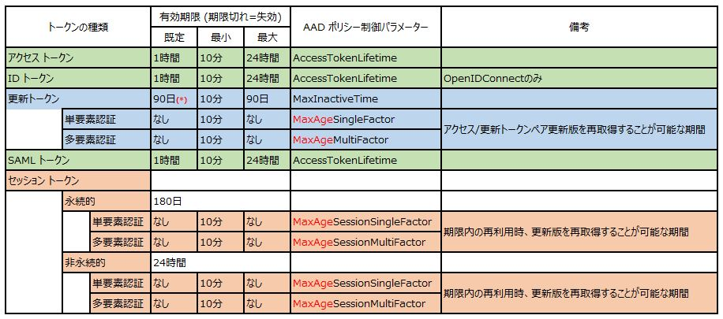
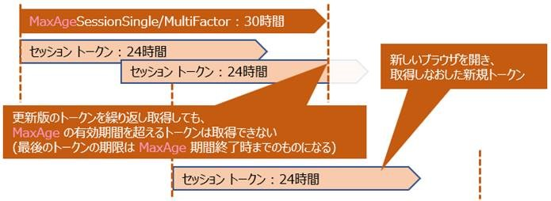
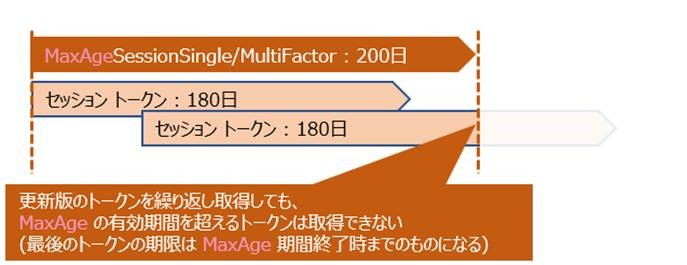

> 本記事は Technet Blog の更新停止に伴い https://blogs.technet.microsoft.com/jpazureid/2018/02/28/aad-issure-token-lifetime/ の内容を移行したものです。
> 元の記事の最新の更新情報については、本内容をご参照ください。

# Azure AD が発行するトークンの有効期間について

こんにちは、Azure & Identity サポート チームの金森です。

Azure AD (AAD) は Office 365 をはじめ様々なクラウド サービスの認証基盤として利用されますが、その重要な機能として認証が完了したアカウントに対してトークンを発行するということがあります。
ここでのトークンとは Kerberos 認証におけるチケットに近いものです。AAD が発行するトークンの種類や有効期間の制御方法は以下の docs 技術情報として公開しています。

- [Azure Active Directory における構成可能なトークンの有効期間 (パブリック プレビュー)](https://docs.microsoft.com/ja-jp/azure/active-directory/active-directory-configurable-token-lifetimes)

**注: アクセス トークンを除き、トークンの有効期間の変更は現在廃止されております。サインインの頻度を変更したい場合には、代わりに条件付きアクセスの [認証セッション管理](https://docs.microsoft.com/ja-jp/azure/active-directory/conditional-access/howto-conditional-access-session-lifetime) をご利用ください**

今回の情報の中で、 AAD が発行するトークンにどのような種類があり、既定の状態ではトークンの有効期間はどうなっているのか、AAD ポリシーでどのような制御ができるのか、もう少しかみ砕いてご紹介いたします。
以下は説明における略語の一覧です。

| 略称                      | 概要                                                                                                                                      |
| ------------------------- | ----------------------------------------------------------------------------------------------------------------------------------------- |
| AAD                       | Azure Active Directory の略です。                                                                                                         |
| SSO                       | Single Sign On の略です。                                                                                                                 |
| IdP                       | Identity Provider の略です。以下の説明では AAD を指します。                                                                               |
| SP                        | Service Provider の略です。以下の説明ではアクセス先のアプリケーションを指します。                                                         |
| ADAL                      | 先進認証ライブラリの略です。OAuth 2.0 や OpenIDConnect のような昨今の業界標準プロトコルを用いた認証方式を利用できるライブラリを指します。 |
| Confidential クライアント | サーバー上で動く Web アプリなどのように、シークレットを秘密にできるクライアントを指します。                                               |
| Public クライアント       | JS アプリやスマホ上のネイティブ アプリなどのように、シークレットを安全に格納できないクライアントを指します。                              |

## トークン種別 (プロトコル、目的別)

## トークン有効期間 (AAD ポリシーの制御パラメーター別)

(\*) に関して
以前の公開技術情報には `14 日` と記載されており、これは Public クライアントに対する以前の既定値でした。
現在の実装は Public クライアントも Confidential クライアントと同じ `90 日` に変更されています。

## 既定値における有効期間の考え方

トークンの更新タイミングと有効期間の考え方を説明します (既定値を例にしています)。

### ADAL クライアントによる認証フローと有効期限の考え方

ID トークンは OpenID Connect での認証時に ID の属性情報を提示するためのトークンであり、初回の SP へのアクセス時に提示された後は再利用されることが無いのが一般的です。
そのため、上記の図では初回の SP へのアクセスに伴う認証時のみ取得している表現となっています。
明示的な再認証が必要となるケースは以下の通りです。

- (既定では) 90 日間以上、ADAL クライアント アプリを停止した状態を維持する
- 認証した AAD ユーザーのパスワードを変更する
- AAD 側で対象ユーザーに発行済みの更新トークンを操作により失効する

### ブラウザー クライアントによる AAD との SSO セッション フローと有効期限の考え方

#### 非永続セッション (Cookie) の場合

明示的な再認証が必要となるケースは以下の通りです。

- (既定では) 24 時間以上、Azure AD へのアクセスを行わない
- 認証した AAD ユーザーのパスワードを変更する
- ブラウザーを閉じる

#### 永続セッション (Cookie) の場合

明示的な再認証が必要となるケースは以下の通りです。

- (既定では) 180 日以上、Azure AD へのアクセスを行わない
- 認証した AAD ユーザーのパスワードを変更する
- クライアント ローカルに保存された Cookie のキャッシュをクリアする

#### 参考: SAML トークンを使用した認証フローと有効期間の考え方

SAML トークンは SAML プロトコルに準じた用途として `SAML 認証に対応した SP へ提示しユーザー認証を行う` ためのものです。SP へのアクセス時に提示した後は通常利用されることはありません。
AAD 制御ポリシーの `AccessTokenLifetime` パラメーターを変更すると、SAML トークン内の Conditions 要素にある NotOnOrAfter 属性が併せて変更されます。これにより、SAML トークンの有効期限を制御できます。SP は提示された SAML トークンの有効期限を見て、タイムアウトを確認することができます。
一般的にはクライアントが SAML トークンを取得してから即座に SP へ取得したトークンを提示することから、 SAML トークンの有効期限が切れることは通常ございません。

明示的な再認証が必要となるケース

- (既定では) 24 時間以上、既存のセッション Cookie の再利用が必要な SP へのアクセスを行わない (結果、24 時間以上、AAD へのアクセスを行わない)

### MaxAge ～ 名のポリシーの考え方

MaxAge ～ 名のポリシーは `最終的にいつまで同じトークンを利用し続けられるか` を定義するパラメーターです。
既定では `失効するまで = 無期限` となり、上述の考え方が合致します。
以下に、MaxAge ポリシーを用いた場合の有効期間の考え方をご紹介します。

**注: 以下のトークンの有効期間の変更は現在廃止されております。**
<!-- TODO 条件付きアクセスでの設定例 -->

#### ADAL クライアント : MaxAgeSingle/MultiFactor を 100 日にした場合

#### 非永続ブラウザー クライアント : MaxAgeSessionSingle/MultiFactor を 30 時間にした場合

#### 永続ブラウザー クライアント : MaxAgeSessionSingle/MultiFactor を 200 日にした場合

#### MaxAgeSessionSingleFactor を 1 時間にした場合

AAD トークンの有効期間ポリシーを作成する手順は、docs 技術情報の [トークンの有効期間ポリシーの例](https://docs.microsoft.com/ja-jp/azure/active-directory/active-directory-configurable-token-lifetimes#example-token-lifetime-policies) のコーナーをぜひご参照ください。
(本コーナーにて使用している Azure AD PowerShell の利用準備については[リンク](./powershell-module.md)もご参照ください)

上記内容が皆様の参考となりますと幸いです。どちら様も素敵な AAD ライフをお過ごしください。

ご不明な点等がありましたら、ぜひ弊社サポート サービスをご利用ください。
※本情報の内容（リンク先などを含む）は、作成日時点でのものであり、予告なく変更される場合があります。
