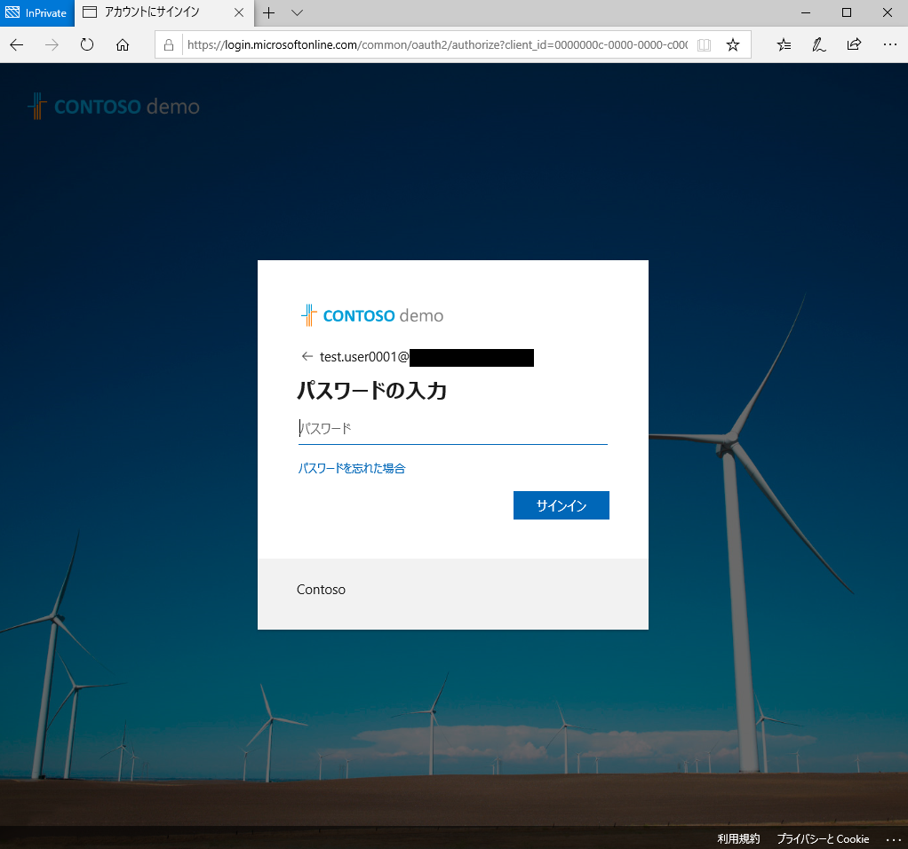
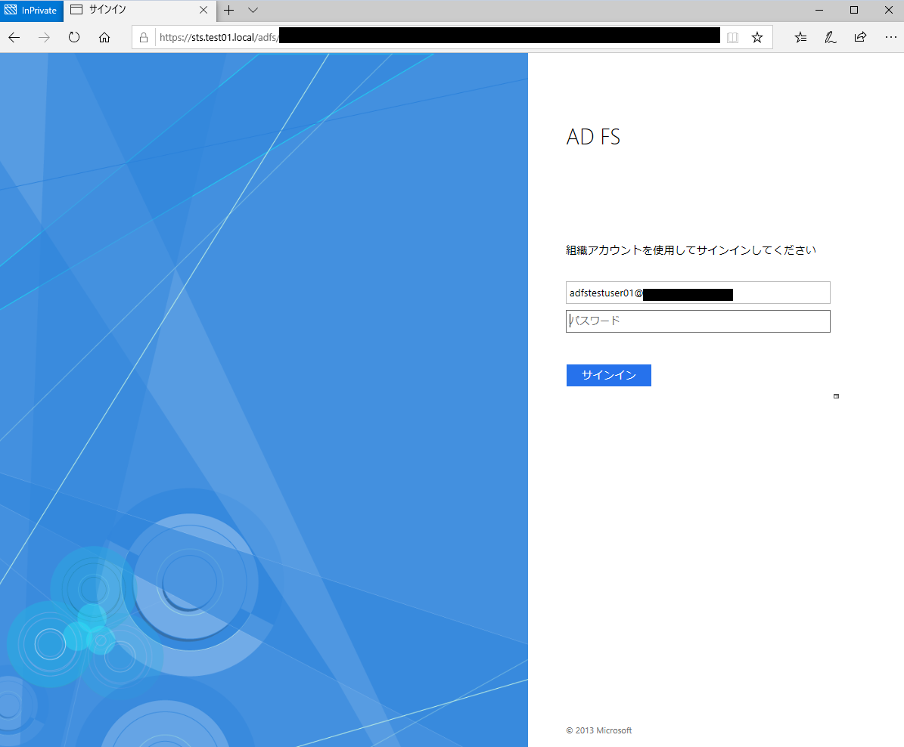

# Staged Rollout について

こんにちは、Azure Identity サポート チームの田中です。

今回は、先日 Public Preview として利用可能になった、フェデレーション ドメインに属しているユーザーの一部のみをマネージド 認証に変更できる Staged Rollout 機能についてご紹介します。

# Staged Rollout とは？

フェデレーションによる認証からマネージド認証 (パスワードハッシュ同期 / パススルー認証) への認証方式の変更に伴うユーザー影響を軽減するための機能を指します。  
これにより、少しずつユーザーの認証方式を変更できるというメリットがあります。

例えば、以下のようなシナリオが挙げられます。

- シナリオ
ユーザー A および ユーザー B は、共に同じ `contoso.com` というフェデレーション ドメインを持つユーザーである。

ユーザー A の UPN : `test.user0001@contoso.com`  
ユーザー B の UPN : `adfstestuser01@contoso.com`

Staged Rollout 機能が割り当てられているユーザー A : マネージド認証 (パスワード ハッシュ同期 / パススルー認証)  
Staged Rollout 機能が割り当てられていないユーザー B : フェデレーションによる認証

詳細については、後述いたします。

# Staged Rollout の構成手順

Staged Rollout の構成手順につきましては、以下の公開情報でもご紹介しております。
そのため、まずは以下の公開情報をご参照いただき、ご不明点などございましたら、弊社サポート チームにお問い合わせいただければ幸いです。

Title : 段階的なロールアウトを使用してクラウド認証に移行する (プレビュー)  
URL : <https://docs.microsoft.com/ja-jp/azure/active-directory/hybrid/how-to-connect-staged-rollout>

以下では、上述のシナリオに基づいて、実際の構成手順を一部抜粋して、ご案内します。

\[ドメイン状態\]

- `contoso.com` : Federated

\[グループおよびグループに含まれるユーザーの構成情報\]

|                                              | グループ名 TESTPHS01 |
|----------------------------------------------|----------------------|
| ユーザー A  `test.user0001@contoso.com`  | 〇 (含まれる)|
| ユーザー B  `adfstestuser01@contoso.com` | x  (含まれていない)   |

TESTPHS01 のグループに対して、以下のように、Staged Rollout 機能におけるパスワード ハッシュ同期を割り当てます。

\[認証方式\]

- `test.user0001@contoso.com` のユーザーで認証を試みます。(グループに含まれるユーザー)  
⇒ フェデレーション認証の場合だとリダイレクトされますが、リダイレクトされておらず、パスワード ハッシュ同期による認証方式が適用されていることが、以下の画面キャプチャからもご確認いただけます。  
※なお、[グループおよびグループに含まれるユーザーの構成情報] において、Staged Rollout 機能におけるパススルー認証を割り当てても、以下の画面キャプチャと同様のサインイン画面が表示されます。

- `adfstestuser01@contoso.com` のユーザーで認証を試みます。 (グループに含まれていないユーザー)  
⇒ AD FS による認証方式が適用されていることが、以下の画面キャプチャからもご確認いただけます。

このように、上記の 2 ユーザー共に、同じフェデレーション ドメイン (例 : `contoso.com`) を使用しているにも関わらず、Staged Rollout 機能を割り当てたグループに含まれるユーザーは、マネージド 認証が適用されます。

# Staged Rollout に関してよくある Q&A 集

**Q. 認証方式の切替を行う際、ユーザー単位での認証方式の変更は必要なく (全ユーザーに対する認証方式を行う想定)、認証方式の変更に要する時間として、ドメイン単位でフェデレーション解除するよりも Staged Rollout 機能を用いた方が、反映時間は短く済むのでしょうか？**

A. いいえ、ドメイン単位でフェデレーション解除をご実施いただいた方が反映時間が短く済みます。  
なお、ドメイン単位でフェデレーション解除するコマンドとして、`Convert-MSOLDomainToStandard` または `Set-MsolDomainAuthentication` がありますが、ユーザーのパスワード リセットを行うような要件がない場合、`Set-MsolDomainAuthentication` をご利用ください。※

※  
`Convert-MSOLDomainToStandard` コマンドは、ユーザーのパスワード リセットを行う要件がある場合に利用します。このコマンドを実行すると、それぞれのユーザー単位での処理を試行するため、ユーザー数に比例して認証方式の切り替えに時間を要します。

一方、`Set-MsolDomainAuthentication` コマンドは、ドメイン単位で認証方式の切り替えのみを行うコマンドであるため、即時的に認証方式の切り替えを行うことができます。なお、過去の事例では、`Set-MsolDomainAuthentication` コマンドによる認証方式の切り替えに伴い一時的に問題が生じる可能性があります。切り替えに要する時間は、 下記の公開情報でご案内しておりますとおり、最大でも 4 時間ですが、この間に一時的にユーザー認証にも問題が発生する可能性がある点についてはご注意ください。

- 参考情報  
Title : メンテナンス期間の計画  
URL : <https://docs.microsoft.com/ja-jp/azure/active-directory/hybrid/plan-migrate-adfs-password-hash-sync#plan-deployment-and-support>

**Q. Staged Rollout 機能を対象グループに割り当てたときの反映時間について、教えてください。**

A. ユーザーが段階的ロールアウトの対象になりますと Azure AD の監査イベントが記録され、実際のユーザーの認証方式変更は、その後にバックグラウンドで実施されます。  
この処理は、最大 4 時間程度を要します。

そのため、すべてのユーザーに対する監査イベントが記録されたことを確認後、バックグラウンドの処理が完了するまで約 4 時間をお待ちいただく必要があります。

過去事例におきましては、17,000 ユーザーを Staged Rollout 対象グループに追加した後、最初のユーザーに対して監査イベントが記録されてから、最後のユーザーのイベントが記録されるまでに 1 時間 30 分ほどの時間を要したという情報がございます。

Azure AD 上での認証切り替えと合わせ、キャッシュなどを考慮しますと、完全な切り替わりまでは、そこから 4 時間お待ちいただければと思いますので、 設定反映に必要な時間の目安としましては、約 5 時間 30 分になります。

- 参考情報  
監査イベントの記録につきましては、下記の公開情報をご参照ください。  
Title : 監査  
URL : <https://docs.microsoft.com/ja-jp/azure/active-directory/hybrid/how-to-connect-staged-rollout#auditing>

**Q. Staged Rollout 機能を割り当てている状態において、Hybrid Azure AD Join の構成を行おうとしていますが、このような構成は可能でしょうか。**

A. Windows 10 version 1903 以降であれば、Hybrid Azure AD Join 構成を有効にした状態で、Staged Rollout 機能をご利用いただくことができます。

理由といたしましては、Windows 10 version 1903 より前のバージョンでは、フェデレーション認証の場合、必ず AD FS との通信が発生するのに対し、Windows 10 version 1903 以降では、ユーザーごとにフェデレーション認証を行うかどうかを識別する機能が実装されているためです。

**Q. 検証用にステージロールアウトを有効化しますが、検証完了後は無効化する予定です。無効化した際に正常に戻っていることを確認したいですが、どのように確認すればよいでしょうか。**

A. ロールバックの手順で無効化した後は、同期ユーザーにて Office 365 ポータルや Azure ポータル、アプリケーション パネル等にブラウザーでアクセスし、フェデレーション認証方式でサインインができれば正常に戻っているとご判断ください。​

**Q. Staged Rollout はいつ頃 GA されますか。**

A. 2020 年 4 月末時点ではパブリック プレビュー状態です。

パブリック プレビューの GA の時期につきましては様々な事情で延期になる可能性もございますため、 GA 見込み時期については基本的に公開しておりません。  
なお、パブリック プレビューはすべてのお客様にご利用いただくことが可能であり、もし問題が生じた場合は弊社サポートにてご支援することが可能ですが、 SLA の対象外ですので、その点につきましてはご理解の上、ご利用のご検討をお願いいたします。

**Q. Staged Rollout 機能を利用するとき、事前に Azure AD Connect のユーザーのサインイン方式として、何が選択されていればいいでしょうか。**

A. \[構成しない\] または \[AD FS とのフェデレーション\] のいずれかが選択されている必要があります。

**Q. 以前にシームレス SSO を構成していた、または PTA を構成していた場合は、コンピューターアカウントを削除し、PTA エージェントも削除しておく必要があるでしょうか。**

A. はい、コンピューター アカウントの削除および PTA エージェントの削除を事前に行う必要があります。

**Q. 最終的にマネージド認証に移行する場合の手順について教えてください。**

A. PowerShell コマンド `Set-MsolDomainAuthentication` を用いて、該当ドメインをマネージド ドメインに変更、あるいは Azure AD Connect 構成ウィザードにてユーザーのサインイン方式を \[パススルー認証\] または \[パスワード ハッシュの同期\] に設定する (自動的にマネージド ドメインに変更される) 必要があります。

**Q. AD FS とのフェデレーション認証への切り戻し方法について教えてください。**

A. Azure AD Connect にて AD FS を管理する場合と、Azure AD Conneect にて AD FS 管理しない場合で、切り戻し方法が異なります。

- Azure AD Connect にて AD FS を管理する場合
    Azure AD Connect のユーザー のサインイン方式として、\[AD FS とのフェデレーション\] を選択します。

- Azure AD Conneect にて AD FS を管理しない場合
    Azure AD Connect のユーザーのサインイン方式として、\[構成しない\] を選択します。
    その後、`Convert-MsolDomainToFederated –DomainName ＜ドメイン名＞`を PowerShell にて実行します。

上記内容が少しでも参考となりますと幸いです。
なお、製品動作に関する正式な見解や回答については、お客様環境などを十分に把握したうえでサポート部門より提供させていただきますので、ぜひ弊社サポート サービスをご利用ください。

※本情報の内容（添付文書、リンク先などを含む）は、作成日時点でのものであり、予告なく変更される場合があります。
