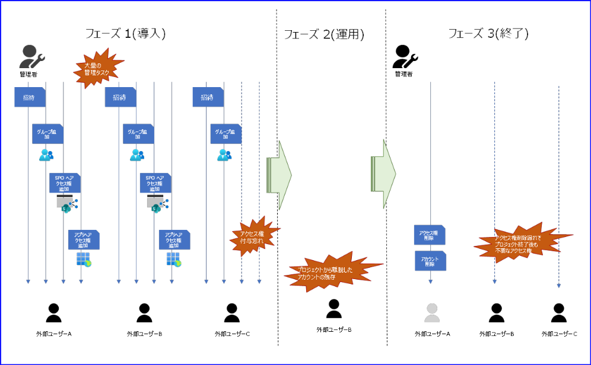
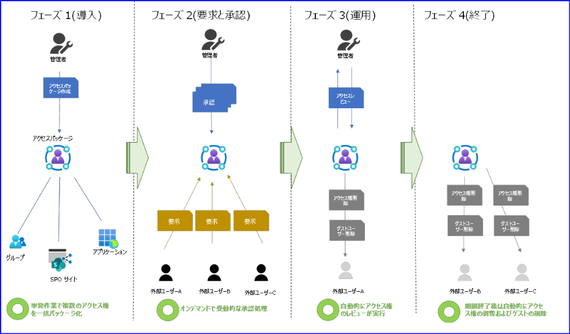
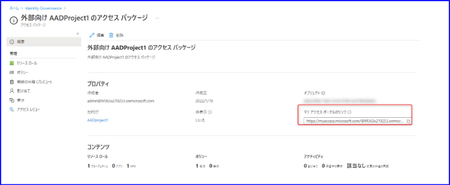
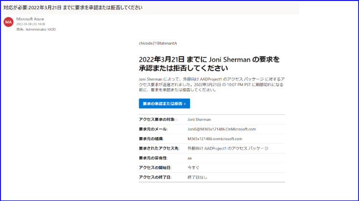
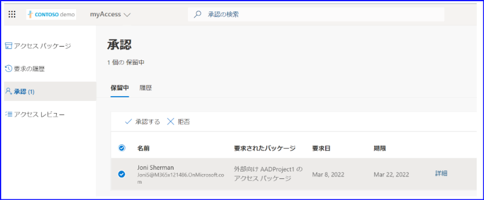
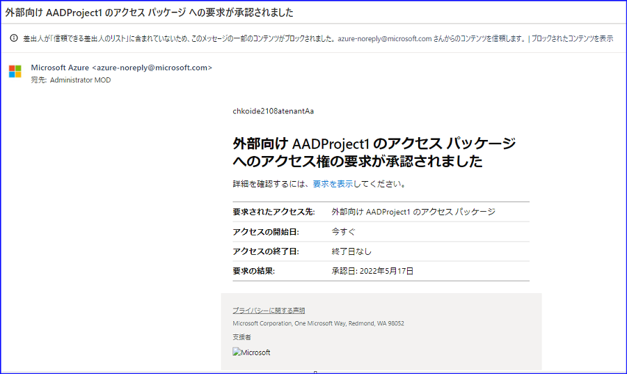
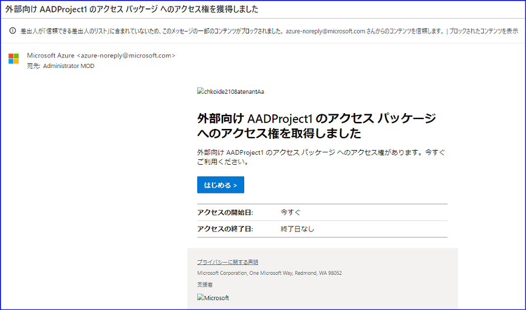
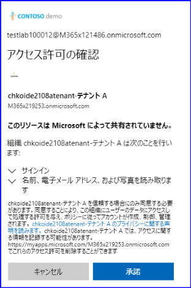
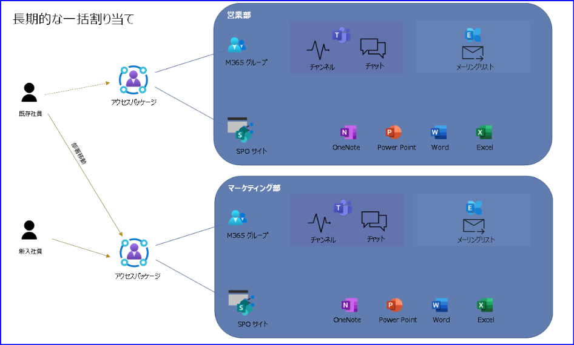

こんにちは、 Azure ID チームの小出です。
今回は、アクセス パッケージを利用した一括アクセス権管理について紹介します。
 
## はじめに
多くのお客様のテナントでは、外部のユーザーが自社テナントの Sharepoint サイトを閲覧したり Teams のチームに参加したりできるように、ゲスト ユーザーの招待機能を利用されていることと思います。  
また、ゲストとのコラボレーション機能をまだ活用いただいていないテナントでも、入社や退職に伴って多くのユーザーを追加・削除したり、これに伴いアクセス権を付与・剥奪したりといった管理作業を実施いただいているかと思います。  

これらのタスクを実施する管理者の方の中には、以下のような困りごとをお持ちの方もいるのではないでしょうか。

- 一括招待機能はあるものの、大量のユーザーを招待するため、 CSV ファイルを作成するのに時間と手間がかかる
- 招待したユーザーから、招待メールが届かないといったお問い合わせが多く対応しきれない
- ゲストを招待したあと、ゲストに Sharepoint や Teams などのアクセス権を割り当てなければならず面倒
- 不要になったアクセス権の剥奪を忘れてしまうことがある
- 新入社員が入ってきたときに、アクセス権を一つずつ付与するのが大変

このような困りごとに対しては、アクセス パッケージを活用することで、ゲスト招待や必要なアクセス権の付与・剥奪を一括して行うことが出来るようになり、より管理者側の負荷を減らすことが可能です。  
アクセス パッケージは、Azure AD Premium P2 ライセンスで使用できる機能となりますため、PIM や Identity Protection の機能を利用するためにライセンスをお持ちのお客様は、追加の費用負担なく利用することができます。    

今回は、アクセス パッケージの概要と、具体的な活用方法についての 2 つのシナリオをご紹介します。

## 目次
A. アクセス パッケージでできること  
B. アクセス パッケージの活用実例紹介  
	B-1. プロジェクトに参加する外部のユーザーに対し、短・中期的なアクセス許可を付与する  
	B-2. 新入社員対応など、社内のユーザーへの長期的なアクセス許可を付与する  

## A. アクセス パッケージでできること
アクセス パッケージはその名の通り、様々なアクセス権をまとめたパッケージのようなもので、具体的には以下のようなリソースのアクセス権をパッキングすることが可能です。  

### ・グループとチーム 
アクセス パッケージが割り当てられたユーザーは、指定したグループに自動的に追加されます。アクセス権には所有者とメンバーがあり、どちらを割り当てるかもあらかじめ指定可能です。  
また、セキュリティ グループが Azure ロール (サブスクリプション A の共同作成者など) や Azure AD ロール（ユーザー管理者など）を持っていた場合、間接的に当該ロールの管理者特権も保有することができます。  
指定したグループが Microsoft 365 グループの場合、 Teams チャンネルのアクセス権も保有することが可能です。  

### ・アプリケーション  
指定したエンタープライズ アプリケーションに対して、ユーザーを割り当てることができます。  
エンタープライズ アプリケーションを活用すると、外部のアプリケーション (Salesforce, Slack, GitHub など) と SAML シングル サインオン/ユーザー プロビジョニングを行うことが可能になります。  
SAML シングル サインオン/ユーザー プロビジョニングの対象ユーザーは、 [エンタープライズ アプリケーション] - [ユーザーとグループ] の項目より管理者が個別に割り当てることもできますが、アクセス パッケージに事前にエンタープライズ アプリケーションを追加しておくと、この手動作業を行う必要がなくなり、パッケージを割り当てられたユーザーは、自動でエンタープライズ アプリケーションへの割り当てが行われます。  

###  ・Sharepoint サイト  
指定した SharePoint サイトへのアクセス権を追加することが可能です。  
アクセス パッケージを割り当てられたユーザーは、自動で Sharepoint サイトへアクセスできるようになります。  
なお、 SharePoint サイトのアクセス権には、所有者・閲覧者・メンバーの 3 つがあります。ユーザーに Sharepoint サイトのどのアクセス権を割り当てるかについても、あらかじめ指定することが可能です。  

 
 
 

ここで、アクセス パッケージを使う前後で管理者の負担がどのように軽減されるかや、アクセス パッケージを利用することでいかに効率的にアクセス権のライフサイクルを管理できるかを、一例を挙げて説明します。  

たとえば contoso テナントには、外部企業をゲスト ユーザーとして招待しています。このゲストには、 contoso テナントの開発プロジェクトに一時的に参加してもらいます。  
多くのお客様の環境では、まずゲスト ユーザー を contoso テナントに招待した後、ゲストが Sharepoint、Teams、サブスクリプションリソース (AppService など) にアクセスできるように、アクセス許可を別途設定していると思います。  
そして開発プロジェクトが終了した際には、ゲスト ユーザーからアクセス権の剥奪を行います。  

該当するユーザーが 1 人の場合は手動でアクセス許可を付与することもできますが、該当するユーザーが 20人や 30 人と増えるほど、上述した「ゲスト招待」「アクセス権付与」「アクセス権剥奪」といった 3 つのタスク負荷は大きくなります。  
作業負荷が大きくなるだけでなく、「アクセス権付与」を忘れてしまった場合は、開発フェーズでトラブルとなったり、「アクセス権剥奪」を忘れてしまった場合はセキュリティ的な懸案になる可能性もあります。  

アクセス パッケージを使用すると、上記に記載した ３つのタスクへの対応が不要になり、管理者側のタスクは、「ユーザーが要求したパッケージを承認する」フロー 1 つのみとなります。  

具体的には、まず「アクセス権付与」を行うリソースを事前に 1 つのアクセスパッケージにパッキングし、アクセスパッケージの URL を外部ユーザーに公開します。  
次に、外部ユーザーは該当の URL から、アクセスパッケージへの参加を要求します。  
承認制の場合、外部ユーザーによってアクセス パッケージへの参加が要求された際は、承認者にメール通知が送られます。管理者はそのメールを確認し承認・拒否を行います。  
要求が承認されることで、自動的に「ゲスト招待」が行われ、アクセス パッケージに事前登録されたリソースへの「アクセス権付与」が行われます。  
最後に、アクセスパッケージの有効期限が切れることで、自動的にパッキングされた全てのリソースに対する「アクセス権の剥奪」が行われます。  
併せて、事前設定を行っておけば、ゲスト アカウントを自動的にブロックし、削除することも可能です。  

## B.  アクセスパッケージの活用実例紹介
上記では、アクセス パッケージでどのようなことができるかについて簡単に記載しましたが、ここからは具体的な活用方法についてご案内します。   
アクセス パッケージの活用シナリオは大きく分けて以下の 2 つが考えられるので、それぞれの設定をおすすめレシピのように紹介します。  

### B-1. プロジェクトに参加する外部のユーザーに対し、短・中期的なアクセス許可を付与する
プロジェクト単位でアクセス パッケージを作成し、プロジェクトに参加する外部ユーザーが、アクセス パッケージを要求するシナリオです。  
アクセス パッケージを管理者が承認すれば、そのユーザーには Sharepoint へのアクセス権など、事前に設定されたリソースへのアクセス許可が割り当てられます。  

今回は、以下のシナリオをもとに、設定方法を下記にてご案内します。  

- 1 年間の短中期的な開発プロジェクトが発足し、開発メンバーにはテナントに存在する社内メンバーのほかに、外部ベンダーも加わることになった
- まだテナントに招待されていない外部ユーザー向けに、アクセス パッケージを作成して「招待」「アクセス権付与」を一括管理して行いたい
- プロジェクト終了時には「アクセス権剥奪」やゲスト アカウントの削除を自動的に行いたい
- プロジェクトのソース コードは GitHub エンタープライズで管理を行い、成果物はサブスクリプションの App Service に展開したい
- プロジェクト中のコミュニケーションには Teams や SharePoint を利用したい

###  - Phase 0: 事前準備   
#### カタログの作成  
事前にプロジェクトで利用できるリソースをカタログにまとめておきましょう。下記のようなカタログ作成が考えられます。  
- 企業が連携している外部アプリケーション (Salesforce, Slack, GitHub など) を全て含んでおく  
- プロジェクト毎に作成された全てのグループ (ProjectA_Team, ProjectB_Team) を含んでおく  
- プロジェクト毎に作成された全ての SharePoint サイト (ProjectA_Site, ProjectB_Site) を含んでおく  

のちのアクセスパッケージ作成フェーズでは、事前にカタログで定義されたリソースのみを追加することになるので、リソースの指定間違いなどを防止することができます。  

#### 接続されている組織の設定
外部ベンダーのテナントを、事前に "接続されている組織" に追加します。これは分かりやすくいうと、「自分のテナントと関係のある組織」の一覧です。  
アクセス パッケージを作成するときには、「そのパッケージを誰が要求できるか設定する項目」があります。  
"接続されている組織" にテナントを追加すると、追加されたテナントに所属するユーザーは、設定に応じそのパッケージを要求できるようになります。  
後の手順をスムーズに行えるよう、事前に登録しておきましょう。  

接続されている組織の追加手順につきましては、[接続されている組織の追加の公開情報](https://docs.microsoft.com/ja-jp/azure/active-directory/governance/entitlement-management-organization#add-a-connected-organization) の手順をご覧ください。    
また、テナントを追加した後は、それぞれのテナントの代表者（連絡先となるユーザー）を、内部スポンサー・外部スポンサーとして登録します。  

#### 外部ユーザーのライフサイクルを設定
アクセスパッケージの有効期限が切れ、外部ユーザーが全てのアクセス権割り当てを剥奪された後、外部ユーザーをどのように扱うか設定できます。  
「外部ユーザーによるこのディレクトリへのサインインをブロックする」を ”はい” にすると、アクセス権剥奪後、外部ユーザーはアクセスパッケージ提供元のテナントにサインインできなくなります。    
また「外部ユーザーを削除」を ”はい” に設定し、「このディレクトリから外部ユーザーを削除するまでの日数」を設定すれば、上記でサインインがブロックされるようになってから指定した日数経過後に、ゲスト アカウント自体も自動的に削除します。  
（ただしこの設定は、アクセス パッケージ経由で追加されたゲストに対してのみ適用される点に注意してください。通常のゲスト招待フローで招待されたユーザーは対象外です。）  

###  - Phase 1: 導入   
アクセス パッケージの作成を行うフェーズです。  
アクセス パッケージ管理が最も効果的に活用できるのは、新規プロジェクトの立ち上げ時です。  
今後プロジェクトに参加するユーザーがアクセスする グループ、Sharepoint サイト、アプリケーションを、事前にアクセス パッケージとしてまとめておき、誰がこのパッケージを要求できるのかなどをポリシーとして定義します。  
このフェーズであらかじめ決めておくべきことがいくつかありますが、このフェーズをしっかり設計しておけば、プロジェクトが進むにつれ関係者が増えてきた場合でも、管理者は「要求されたアクセス パッケージを承認する」 だけで済みます。  

今回のシナリオでは、以下のように設定します。  

|                                                |                                                                                                                                                                                                                                                                                                                                                                                                                                                                                          | 
| ---------------------------------------------- | ---------------------------------------------------------------------------------------------------------------------------------------------------------------------------------------------------------------------------------------------------------------------------------------------------------------------------------------------------------------------------------------------------------------------------------------------------------------------------------------- | 
| 項目                                           | 設定                                                                                                                                                                                                                                                                                                                                                                                                                                                                                     | 
| [基本] タブ                                    | アクセス パッケージの名前と説明を入力します。 利用するカタログとして事前に作成したカタログを指定します。                                                                                                                                                                                                                                                                                                                                                                           | 
| [リソース ロール] タブ                         | アクセス パッケージを要求したユーザーにカタログ内のどのリソースのアクセス権を付与するか決定します。  ・グループとチーム ProjectA_Team のグループを指定します。  ・アプリケーション GitHub Enterprise Cloud - Enterprise Account を指定します。  ・Sharepoint サイト ProjectA_Site を指定します。                                                                                                                                                              | 
| [要求] タブ - [アクセス権を要求できるユーザー] | アクセス パッケージを要求できるユーザーの範囲を決める項目です。今回は以下のように設定します。  アクセス権を要求できるユーザー："自分のディレクトリ内以外のユーザーの場合" 要求可能な範囲： "構成済みの接続されたすべての組織"                                                                                                                                                                                                                                                   | 
| [要求] タブ - [承認]                           | 承認制にするか・承認者は誰かを設定する項目です。 外部ユーザーが参加するアクセス パッケージの場合、プロジェクトの責任者などが要求を承認する構成にするとセキュリティ上安心です。  以下のように設定します。 [承認を要求する]：はい 要求者の理由を要求する：はい ステージの数：1 第 1 の承認者：特定の承認者の選択（プロジェクト責任者などを指定します。）                                                                                                              | 
| [要求] タブ - [有効化]                         | 以下のように設定します。  新しい要求を有効にする：はい                                                                                                                                                                                                                                                                                                                                                                                                                          | 
| [要求元情報] タブ                              | アクセス パッケージを要求するときに、ユーザーに様々な質問をすることができます。この質問を設定する画面です。 この項目は必須ではないため、今回は割愛します。                                                                                                                                                                                                                                                                                                                            | 
| [ライフサイクル] タブ - [有効期限]             | アクセス パッケージの割り当て有効期限設定を行う項目です。今回は以下のように設定します。  アクセス パッケージ割り当ての有効期限が切れる：日付 割り当ての有効期限：2023/3/31 (プロジェクト終了日) ユーザーがアクセス権を延長することを許可する：はい 延長を許可するには承認が必要：はい                                                                                                                                                                                  | 
| [ライフサイクル] タブ - [アクセス レビュー]    | 長期間のプロジェクトでは、メンバーが入れ替わることなどもあります。 [ライフサイクル] で設定した期間までの間に、定期的にアクセス権のレビューを行うか設定できます。 今回は以下のように設定します。  アクセス レビューが必要：はい 開始日：既定値 レビュー頻度：毎月 期間（日数）：7日 レビュー担当者：セルフ レビュー レビュー担当者が応答しない場合：推奨事項の実行 レビュー担当者の意思決定ヘルパーを表示する：はい レビュー担当者の理由が必要：はい   ※アクセスレビューについては[こちら](https://docs.microsoft.com/ja-jp/azure/active-directory/governance/entitlement-management-access-reviews-create)をご参照ください。 | 
| カスタム拡張機能（プレビュー）                 | Logic App などと連携する機能です。必須ではないため今回は割愛します。                                                                                                                                                                                                                                                                                                                                                                                                                     | 

###  - Phase 2: 運用   
作成したアクセス パッケージを外部ユーザーに割り当てるフェーズです。

1. 管理者は作成したアクセス パッケージの [概要] を開き、マイ アクセス ポータルのリンクを、外部ユーザーに共有します。

2. 外部ユーザーが共有してもらったリンクにアクセスすると、アクセス権の要求画面が開きます。
アクセス パッケージの [要求] ボタンをクリックすると、以下のように質問や理由の入力画面が表示されるので、必要事項を入力して送信します。

3. 外部ユーザーがパッケージを要求すると、以下のようなメールが承認者に届きます。このリンクをクリックします。

4. "承認待ちのアクセス パッケージ要求申請" の一覧が表示されるので、選択して [承認する] をクリックします。

5. 承認されると、ユーザーにアクセス パッケージが割り当てられます。ユーザーには以下のような承認メールが届きます。  

6. アクセス権の付与が完了すると、ユーザーにメールが通知されます。これまで付与していた Sharepoint・Teams のアクセス権付与やグループへの追加作業を、すべて自動化することができます。  

5. アクセス パッケージが割り当てられたら、外部ユーザーはさっそくリソースへアクセスしてみます。
以下の画面で招待を [承諾] すれば、リソースにアクセスすることができます。

外部ユーザーが上記「承諾」を実施した段階で、自動的にゲストアカウントが作成され、当該ゲストアカウントに対してグループ、SharePoint サイト、アプリケーションに対する必要なアクセス権が一括して設定されます。  
アクセス パッケージのメール通知につきましては、 [電子メールによる通知](https://docs.microsoft.com/ja-jp/azure/active-directory/governance/entitlement-management-process#email-notifications) の公開情報も併せてご確認ください。  

また、新しい要求を受け取ったり、パッケージが割り当てられたりすると、監査ログにも記録されます。  
後から管理者がパッケージの割り当て日時、履歴などを確認することなども可能です。  
詳細につきましては、 [こちらの公開情報](https://docs.microsoft.com/ja-jp/azure/active-directory/governance/entitlement-management-reports)も併せてご確認いただければと思います。  

###  - Phase 3: 終了    
アクセス パッケージの終了と、割り当てが削除されるフェーズです。プロジェクト完了時がこのフェーズに該当します。  

アクセス パッケージには有効期限があります。  
有効期限が切れると、外部ユーザーに付与されていたアクセスパッケージ内のアクセスが自動的に一括削除され、これまでアクセスできていた SharePoint サイトや Teams チームにアクセスできなくなります。  
また、事前設定でゲスト アカウントの自動サインイン ブロックや自動削除を構成しているので、アクセス パッケージ経由で招待されたユーザー アカウント自体も管理できます。  
これにより「アクセス権が残ったままだった」「ゲストを削除し忘れてしまった」という状況を回避できるため、セキュリティ上もより安心です。  

### B-2. 新入社員対応など、社内のユーザーへの長期的なアクセス許可を付与する
全社用、部門ごとなどの単位でアクセス パッケージを作成し、社内のユーザーがアクセス パッケージを要求するシナリオです。  
上記と同様、アクセス パッケージを管理者が承認すれば、そのユーザーには Sharepoint へのアクセス権など、事前に設定されたアクセス許可が割り当てられます。  

今回は、以下のシナリオをもとに設定方法を下記にてご案内します。  
- 社内に新しい部署ができ、従業員が異動することになった。
- 毎年新入社員が入ってくるので、入社した時にパッケージを要求してもらい、その後は異動・退職するまで利用できるようにしたい

###  - Phase 0: 事前準備   
#### カタログの作成
上記では開発プロジェクト用のカタログを作成しましたが、今度は社内用のリソースを別のカタログとしてまとめておきましょう。下記のようなカタログ作成が考えられます。     
- 部署毎に作成された全てのグループ (SalesGroup, MarketingGroup) を含んでおく
- 部署毎に作成された全ての SharePoint サイト (Sales_Site, Marketing_Site) を含んでおく

###  - Phase 1: 導入   
アクセス パッケージの作成を行うフェーズです。    
基本的には先に記載した内容と同様ですが、今回は社内向けにアクセス パッケージを作成するので、"要求できるユーザーの範囲" などの設定が上記と異なります。  

|                                                |                                                                                                                                                                                                                                                                                                                                                                                                                                                                                                                                                                                                                          | 
| ---------------------------------------------- | ------------------------------------------------------------------------------------------------------------------------------------------------------------------------------------------------------------------------------------------------------------------------------------------------------------------------------------------------------------------------------------------------------------------------------------------------------------------------------------------------------------------------------------------------------------------------------------------------------------------------ | 
| 項目                                           | 設定                                                                                                                                                                                                                                                                                                                                                                                                                                                                                                                                                                                                                     | 
| [基本] タブ                                    | アクセス パッケージの名前と説明を入力します。 利用するカタログとして事前に作成したカタログを指定します。                                                                                                                                                                                                                                                                                                                                                                                                                                                                                                           | 
| [リソース ロール] タブ                         | アクセス パッケージを要求したユーザーが、どのリソースにアクセスする必要があるかを決定します。 具体的には、部署ごとに必要なグループやチーム、 Sharepoint サイトなどを洗い出して設定します。  ・グループとチーム SalesGroup  のグループを指定します。  ・Sharepoint サイト Sales_Site を指定します。                                                                                                                                                                                                                                                                                               | 
| [要求] タブ - [アクセス権を要求できるユーザー] | アクセス パッケージを要求できるユーザーの範囲を決める項目です。今回は以下のように設定します。  アクセス権を要求できるユーザー："自分のディレクトリ内のユーザーの場合" 要求可能な範囲： "すべてのユーザー（ゲストを除く）"                                                                                                                                                                                                                                                                                                                                                                                       | 
| [要求] タブ - [承認]                           | 承認制にするか・承認者は誰かを設定する項目です。 部署の責任者（課長など）を承認者とすると、不要なユーザーがパッケージを要求しても、承認する前に気が付くことができ安心です。  以下のように設定します。 [承認を要求する]：はい 要求者の理由を要求する：はい ステージの数：1 第 1 の承認者：特定の承認者の選択（部署の責任者などを指定します。）                                                                                                                                                                                                                                                       | 
| [要求] タブ - [有効化]                         | 以下のように設定します。  新しい要求を有効にする：はい                                                                                                                                                                                                                                                                                                                                                                                                                                                                                                                                                          | 
| [要求元情報] タブ                              | アクセス パッケージを要求するときに、ユーザーに様々な質問をすることができます。この質問を設定する画面です。 この項目は必須ではないため、今回は割愛します。                                                                                                                                                                                                                                                                                                                                                                                                                                                            | 
| [ライフサイクル] タブ - [有効期限]             | アクセス パッケージの割り当て有効期限設定を行う項目です。今回は以下のように設定します。  アクセス パッケージ割り当ての有効期限が切れる：なし                                                                                                                                                                                                                                                                                                                                                                                                                                                                       | 
| [ライフサイクル] タブ - [アクセス レビュー]    | 内部のユーザーであれば、たとえば退職者のアカウントは削除するなどの運用フローがあるかと思いますが、不要なユーザーにアクセス パッケージが割り当てされ続けていないかを確認することができます。 今回は [ライフサイクル] で有効期限を設定していないため、定期的にアクセス権のレビューを行うと安心です。 以下のように設定します。  アクセス レビューが必要：はい 開始日：既定値 レビュー頻度：四半期ごと 期間（日数）：14 日 レビュー担当者：セルフ レビュー レビュー担当者が応答しない場合：推奨事項の実行 レビュー担当者の意思決定ヘルパーを表示する：はい レビュー担当者の理由が必要：はい   ※アクセスレビューについては[こちら](https://docs.microsoft.com/ja-jp/azure/active-directory/governance/entitlement-management-access-reviews-create)をご参照ください。| 
| カスタム拡張機能（プレビュー）                 | Logic App などと連携する機能です。必須ではないため今回は割愛します。                                                                                                                                                                                                                                                                                                                                                                                                                                                                                                                                                     | 

###  - Phase 2: 運用  
実際にアクセス パッケージを運用し、要求・承認と割り当てが行われるフェーズです。  

基本的には B-1 のシナリオと同様です。  
管理者はアクセスパッケージのリンクを新入社員に提示して、新入社員はアクセス権を要求するのみです。  

新しい要求を受け取ったり、パッケージが割り当てられたりすると、監査ログにも記録されるため、後から管理者がパッケージの割り当て日時、履歴などを確認することなども可能です。
詳細につきましては、 [こちらの公開情報](https://docs.microsoft.com/ja-jp/azure/active-directory/governance/entitlement-management-reports)も併せてご確認いただければと思います。  

---
## 最後に
今回は、アクセス パッケージを使用したアクセス権管理について、シナリオごとに紹介させていただきました。  
アクセス パッケージをご利用いただくと、非常に多くのユーザーや外部ユーザーを管理されているテナントなどでは、管理者の負担を大きく下げることができます。  
Azure AD の機能のなかでも、まだ活用いただいていないお客様も多いかと思いますが、この記事がアクセス権管理の運用改善のきっかけとなれば幸いです。  
