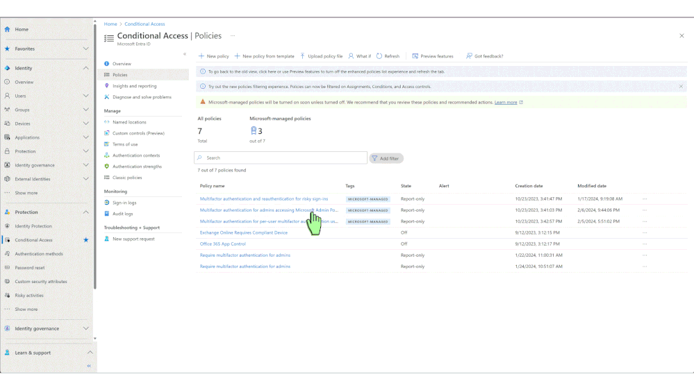

# 今すぐご対応を: Microsoft マネージド条件付きアクセス ポリシーを有効化またはカスタマイズする

こんにちは、Azure Identity サポート チームの 五十嵐 です。

本記事は、2024 年 3 月 19 日に米国の Microsoft Entra (Azure AD) Blog で公開された [Act now: Turn on or customize Microsoft-managed Conditional Access policies](https://techcommunity.microsoft.com/t5/microsoft-entra-blog/act-now-turn-on-or-customize-microsoft-managed-conditional/ba-p/4078809) の抄訳です。ご不明点等ございましたらサポート チームまでお問い合わせください。

----

弊社では [Secure Future Initiative](https://www.microsoft.com/en-us/security/blog/2023/11/02/announcing-microsoft-secure-future-initiative-to-advance-security-engineering/) の一環として、2023 年 11 月に [Microsoft マネージド 条件付きアクセス ポリシー](https://www.microsoft.com/en-us/security/blog/2023/11/06/automatic-conditional-access-policies-in-microsoft-entra-streamline-identity-protection/) を発表しました。これらのポリシーは、利用パターン、リスク要因、既存のポリシー構成に基づいて、組織のリソースとデータのセキュリティを保護できるように設計されています。ID のセキュリティ体制を向上させるために弊社が最も推奨するのは、[漏洩リスクを 99.2% 低減](https://www.microsoft.com/ja-jp/security/security-insider/microsoft-digital-defense-report-2023) する多要素認証 (MFA) の有効化です。このため、3 つのポリシーはすべて異なるシナリオの MFA に関連しています。

Microsoft マネージド条件付きアクセス ポリシーを発表して以来、50 万以上のテナントにレポート専用モードでこれらのポリシーを展開してきました。レポート専用モードでは、ポリシーがユーザーのアクセスに影響を与えることはありませんが、ポリシーの評価結果が記録されます。これにより、管理者はこれらのポリシーによる制御を実施する前に、その影響を評価することができます。管理者が積極的にこれらのポリシーを有効にしたりカスタマイズしたりしたおかげで、現在では **90 万人** 以上のユーザーが MFA で保護されています。

また弊社は、お客様からのフィードバックに積極的に耳を傾けてまいりました。お客様からは、Microsoft マネージド ポリシーが、組織が作成できる条件付きアクセス ポリシーの上限数に抵触してしまうというご意見をいただきましたので、Microsoft マネージド ポリシーが条件付きアクセス ポリシーの上限数にカウントされなくなるよう対応いたしました。もう 1 つの調整は、既存の条件付きアクセス ポリシーに関するものです。Microsoft マネージド ポリシーで設定された要件を満たす、またはそれ以上の要件を課すポリシーがすでに「オン」の状態である場合、Microsoft マネージド ポリシーはテナントで自動的に適用されません。

当初、これらのポリシーは **作成から 90 日後に自動的に有効になる** とお伝えしていました。しかし、お客様からのフィードバックに基づき、一部のお客様には、これらのポリシーの準備にさらに時間が必要であることを確認しました。そのため、**これらのポリシーを有効にするまでの期間を延長することにしました。** これら 3 つのポリシーについては、ポリシーの確認と、カスタマイズ (または無効化) に、90 日以上の時間をかけていただける状況です。テナントでポリシーが適用される 28 日前に電子メールと [メッセージ センター](https://admin.microsoft.com/Adminportal/Home?#/MessageCenter) で通知が届きますので、ご安心ください。

早速ですが、以下の 3 点をご対応ください:

1. [条件付きアクセス ポリシー ブレード](https://entra.microsoft.com/#view/Microsoft_AAD_ConditionalAccess/ConditionalAccessBlade/~/Policies/fromNav/Identity) でこれらのポリシーを確認する。 
2. [緊急アクセス用アカウントやサービス アカウント](https://learn.microsoft.com/ja-jp/entra/identity/conditional-access/concept-conditional-access-policy-common?tabs=secure-foundation#user-exclusions) を除外するなどのカスタマイズを行う。

    

3. 準備ができたら、ポリシーをオンの状態に移行する。

    

より詳細なカスタマイズを行いたい場合は、ポリシーを複製してさらにご調整ください。

リソースを保護する方法の詳細については、[Microsoft マネージド ポリシー](https://learn.microsoft.com/ja-jp/entra/identity/conditional-access/managed-policies) に関するドキュメントをご覧ください。

Nitika Gupta  
Principal Group Product Manager, Microsoft  
[LinkedIn](https://www.linkedin.com/in/guptanitika/)
