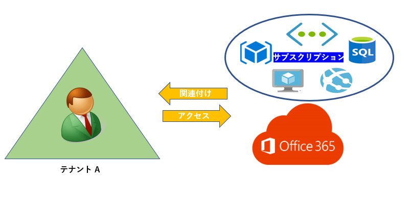
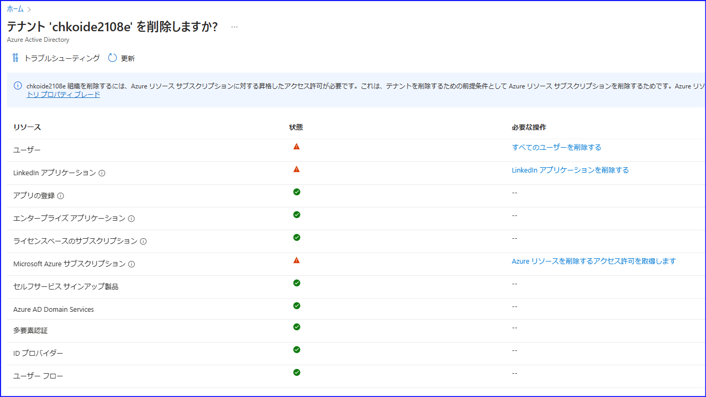

> [!NOTE]
> 本記事は Technet Blog の更新停止に伴い [TechNet Blog](https://blogs.technet.microsoft.com/jpazureid/2018/01/16/azuread-operation/) の内容を移行したものです。元の記事の最新の更新情報については、本内容をご参照ください。

> [!NOTE]
> 2018-01-16: 本記事の初版を投稿  
> 2023-04-07: "管理者以外のユーザーによるテナントの作成を制限する" 機能を追記して全体を更新

# Azure AD の追加・変更・削除

こんにちは、Azure & Identity サポート チームの小出です。この記事はもともと 2018 年 1 月に公開されましたが、直近で新しいプレビューが開始されたことに伴い情報を追記して更新しております。

今回は下記の 3 つについて紹介します。

- Azure AD テナントの追加手順
- Azure AD テナントの変更手順
- Azure AD テナントの削除手順

まずは、簡単に Azure AD テナントについて説明します。

Azure AD テナントは、Azure や Office 365 などの Microsoft クラウド サービスに組織がサインアップしたときに作成されます (もう少し平易な言い方をすると、Office 365 など Azure AD テナントが必須のサービスの新規利用を開始した時点で自動的に作成されます)。Azure AD テナントに存在しているユーザーは、その Azure AD テナントに紐づいているクラウド サービスにサインインして利用することが可能です。Azure AD テナントや Azure AD ディレクトリという言葉が出てきますが、どちらも同じ意味とお考えいただいて結構です。

## Azure AD テナントの追加手順

冒頭で、クラウド サービスにサインアップした際に Azure AD テナントが作成されると書きましたが、Azure AD テナントを個別に追加することも可能です。下記の手順で、Azure AD Free (無料) テナントを作成できます

1. https://portal.azure.com にアクセスし、任意の管理者アカウントでサインインします。
2. ポータル画面左上のナビゲーションの [Azure Active Directory] をクリックします。
3. 表示された画面上で [テナントの管理] をクリックし、[+ 作成] を選択します。
4. [ディレクトリの作成] 画面の下記の項目に入力します。

    - テナントの種類を選択する: Azure Active Directory
    - 組織名: 任意の組織名を入力
    - 初期ドメイン名: <組織> のドメイン名を入力
    - 場所: 組織が存在する場所を選択

5. [作成] をクリックします。
6. 作成が完了すると、"新しいディレクトリを管理するにはここをクリックします" が表示するので、クリックします。
7. 新しく作成したディレクトリの画面に切り替わります。

作成操作を行ったユーザーが新しく作成した Azure AD テナントの管理者となります。

### 一般ユーザーに対するテナント作成の制限機能

上記記載の Azure AD テナント作成操作については、以前は管理者側で制限することができず、一般ユーザーであっても新しいテナントを自由に作成できていました。しかしながら、2023 年に一般ユーザーに対して「新しいテナントの作成を制限する」機能が用意されました。このため、下記を利用することで一般ユーザーによるテナントの作成を制限することが可能です。

[管理者以外のユーザーによるテナントの作成を制限する (プレビュー)] の設定を "はい" にした場合、グローバル管理者もしくはテナント作成者ロールをもつユーザーのみが、上記操作を行えるようになります。この設定はその他の機能には特に影響ないほか、操作を行ったテナントと新規テナントは全く別物となりますので、設定が同期されてしまうなど相互に影響しあうこともございません。

## Azure AD テナントの変更手順

Azure AD テナントは必ず xxxxx.onmicrosoft.com という名前を持ち、この初期ドメイン名を後から変更することはできません。そのため、Azure AD テナントの初期ドメイン名を例えば contoso.onmicrosoft.com にしたい場合は、上記の「Azure AD の追加手順」の手順に従い、Azure AD を一から新規に作成する必要があります。

なお、Azure AD の組織名 (よく "既定のディレクトリ" と表示されている名称) については下記の手順で変更可能です。

1. https://portal.azure.com にアクセスし、管理者アカウントでサインインします。
2. ポータル画面左上のナビゲーションの [Azure Active Directory] をクリックします。
3. [プロパティ] をクリックします。
4. [名前] の項目に新しい組織名を入力します。

    例: 既定のディレクトリ --> コントソ株式会社

5. [保存] を押します。
6. 少し時間を空けて再度サインインすると、名前が変更されます。

また、ご利用の Azure サブスクリプションを新規で作成した Azure AD に紐づけたいというような要件がある場合には、[サブスクリプションの譲渡](https://learn.microsoft.com/ja-jp/azure/role-based-access-control/transfer-subscription) の方法もご覧ください。

## Azure AD テナントの削除手順

手動で作成した Azure AD テナントについては削除が可能です。テナントを削除するためには、以下のような前提条件があります。

- Azure のご契約時に自動的に作成されたディレクトリ (既定のディレクトリ) ではない。
- ディレクトリにユーザーが存在しない (最後の一名の管理者は除く)。
- 連携するアプリケーションが存在しない。
- サブスクリプションが紐づいていない。
- など

テナントの削除手順は以下のとおりです。

1. https://portal.azure.com にアクセスし、管理者アカウントでサインインします。
2. ポータル画面左上のナビゲーションの [Azure Active Directory] をクリックします。
3. 表示された画面上で [テナントの管理] をクリックし、[ディレクトリの削除] をクリックします。
4. 前提条件のチェック完了後に [削除] をクリックします。

削除時に前提条件のチェックが走るため、すべての条件をクリアすることでテナントの削除が可能となります。前提条件に抵触している場合は、下記のように ! の警告が表示され削除を進めることができません。

なお、Azure のサインアップ時に自動作成された Azure AD テナント (既定のディレクトリ) やセルフサインアップ テナントについては削除が想定されていません。そのディレクトリはもう利用することはないという場合には、そのディレクトリから一名の管理者を除く他のすべてのユーザーを削除する方法で対応ください。テナントは残りますが、実質的に利用できない (利用しても意味のない) テナントとなりますので、削除と同等の結果になります。

1. https://portal.azure.com にアクセスし、管理者アカウントでサインインします。
2. ポータル画面左上のナビゲーションの [Azure Active Directory] をクリックします。
3. [ユーザーとグループ] – [すべてのユーザー] をクリックします。
4. [＋新しいユーザー] をクリックします。
5. ユーザー名を入力し、ロールでは「グローバル管理者」を選択します (最後の一名のアカウントを作成します)。

    例) 削除対象のディレクトリ名が contoso.onmicrosoft.com の場合: temp@conotoso.onmicrosoft.com

6. 手順 5. で作成したグローバル管理者のアカウントで https://portal.azure.com にサインインします。
7. [すべてのユーザー] まで移動して、その他のすべてのアカウントをこのテナントから削除します。

削除されたユーザーで、対象のテナントにアクセスができないことを確認ください。

## 補足

複数の Azure AD テナントは完全に独立したリソースとして管理されます。そのため、Azure AD テナント間の連携が必要なシナリオの場合は、Azure AD B2B の利用をします。B2B については下記の記事を合わせてご参照ください。

[Azure AD B2B とは](https://blogs.technet.microsoft.com/jpazureid/2017/12/12/about-azure-ad-b2b/)

上記内容が少しでも皆様の参考となりますと幸いです。
