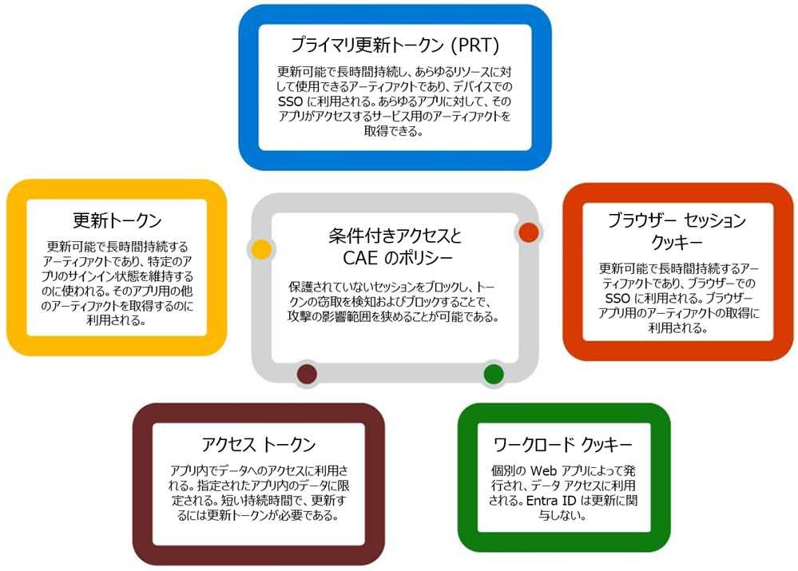

# データ流出への対応: トークンの窃取について

こんにちは、Azure Identity サポート チームの 高田 です。

本記事は、2024 年 1 月 2 日に米国の Microsoft Entra Blog で公開された [Addressing Data Exfiltration: Token Theft Talk](https://techcommunity.microsoft.com/t5/microsoft-entra-blog/addressing-data-exfiltration-token-theft-talk/ba-p/3915337) を意訳したものになります。ご不明点等ございましたらサポート チームまでお問い合わせください。

----

データ流出の防止について前回に引き続きお話ししたいと思います。以前のブログでは、[継続的アクセス評価 (CAE)](https://docs.microsoft.com/ja-jp/azure/active-directory/conditional-access/concept-continuous-access-evaluation) を使用して [認証セッションをセキュリティで保護するための Microsoft のアプローチ](https://techcommunity.microsoft.com/t5/security-compliance-and-identity/apply-zero-trust-principles-to-authentication-session-management/ba-p/3615343) をお話し、[テナント制限 v2](https://learn.microsoft.com/ja-jp/azure/active-directory/external-identities/tenant-restrictions-v2#step-4-set-up-tenant-restrictions-v2-on-your-corporate-proxy) を使用して [テナント間アクセスを安全に行う](https://jpazureid.github.io/blog/azure-active-directory/how-tenant-restrictions-v2-can-be-used-to-prevent-data/) 方法について解説しました。本日のトピックは、認証アーティファクトの窃取についてです。

認証アーティファクト (トークンおよび Cookie) が窃取されると、攻撃者は被害者になりすまし、被害者がアクセスできるすべての情報にアクセス出来てしまいます。数年前までトークンの窃取はまれな攻撃であり、ほとんどの場合、企業内のレッド チーム (セキュリティの脆弱性を検証する部門) によって訓練的に行われていました。この理由としては、クッキーの窃取よりも、パスワードの窃取の方が容易だったからです。しかしながら、多要素認証 (MFA) の普及に伴い、アーティファクトの盗難やリプレイを含む実際の攻撃が増えてきています。

詳細に入る前に、[Token tactics: How to prevent, detect, and respond to cloud token theft](https://www.microsoft.com/en-us/security/blog/2022/11/16/token-tactics-how-to-prevent-detect-and-respond-to-cloud-token-theft/) に記載されているとおり、Microsoft ではトークンの窃取に対する第一線の防御策として、エンドポイント保護やデバイス管理、フィッシング耐性のある MFA、ウィルス対策ソフトを用いてデバイスを保護することを推奨しています。

では次に、認証アーティファクトの種類と、窃取の影響を最小限に抑えるためにその種類ごとに推奨される対応手法について説明していきます。すべての認証アーティファクトは、大まかに 2 つの種類に分けることができます。

- サインイン セッション アーティファクト: クライアントと Entra ID の間でシングル サインオン (SSO) の状態を維持するためのもの。
- アプリ セッション アーティファクト: クライアント アプリにデータ アクセスを許可するためのもの。

最も強力なデバイス SSO アーティファクトである [プライマリ更新トークン (PRT)](https://learn.microsoft.com/ja-jp/entra/identity/devices/concept-primary-refresh-token) を保護することが一番重要になります。幸いなことに、PRT はすべての OS 上で窃取に対して防御策がとられています。保護のレベルは OS の機能によって異なりますが、[Windows が最も強力な保護機能を有しています](https://learn.microsoft.com/ja-jp/entra/identity/devices/concept-primary-refresh-token#how-is-the-prt-protected)。**PRT の保護はポリシーで制御できず、常に有効になっています。**

すべてのアーティファクトを今後同様に保護していくことは開発上のロードマップにありますが、これらの機能を提供するには数年かかると想定しています。トークンの窃取に対する包括的な保護を実現するためのさまざまな課題については、この [RSA のプレゼン資料](https://www.rsaconference.com/library/presentation/usa/2022/token%20theft%20hip%20kids%20are%20doing%20it%20now%20what%20are%20we%20going%20to%20do%20about%20it) をご覧ください。当面のところは、Entra ID のセキュリティ製品を組み合わせて利用することで、トークンの窃取に対応が可能です。

## サインイン セッション アーティファクトの窃取への対処

[条件付きアクセスのトークン保護ポリシー](https://jpazureid.github.io/blog/azure-active-directory/public-preview-token-protection-for-sign-in-sessions/) を用いることで、盗まれたトークンが再利用されないよう暗号技術に基づく仕組みを用いて保護することが可能です。この機能は、PRT に対する既存の保護に上乗せする形で構築されてます。トークン保護ポリシーが有効な場合、保護されていないサインイン セッションの使用はブロックされます。PRT の保護が常に有効となっていることと組み合わせることで、すべての再利用可能なアーティファクトにこのような暗号技術に基づく保護が適用されます。トークンの保護は、Windows 上の Office 製品と Outlook において現在パブリック プレビュー段階です。ご利用の際は、まずレポート専用モードで開始して、組織への影響を評価ください。

トークン保護のスコープにまだ含まれていないクライアント アプリについては、[Entra Global Secure Access](https://learn.microsoft.com/ja-jp/entra/global-secure-access/overview-what-is-global-secure-access) の [準拠ネットワークのチェック](https://learn.microsoft.com/ja-jp/entra/global-secure-access/how-to-compliant-network) を有効にすることで保護いただけます。このポリシーにより、認証アーティファクトが常に組織のネットワークから送信されていることを保証できます。つまり、盗まれたトークンが組織のネットワークからのみ利用可能となるため、攻撃の影響範囲を大幅に縮小することが可能です。

## アプリ セッション アーティファクトの窃取への対処

ネットワーク構成によっては、[条件付きアクセス: 場所によるアクセスのブロック機能](https://learn.microsoft.com/ja-jp/entra/identity/conditional-access/howto-conditional-access-policy-location) および [継続的アクセス評価 (CAE): 場所ポリシーを厳密に適用する機能](https://learn.microsoft.com/ja-jp/entra/identity/conditional-access/concept-continuous-access-evaluation-strict-enforcement) を構成することで、窃取されたアクセス トークンとワークロード (アプリ) Cookie の企業ネットワーク外での利用をブロック可能です。この新しい CAE の強制機能は、許可された IP 範囲外からのアクセスをブロックしますので、盗まれたトークンのネットワーク外部からの使用がブロックされ、攻撃の影響範囲が大幅に縮小します。この機能を利用するには、ユーザーは事前に定義した IP アドレスの範囲から Entra ID とワークロードの両方にアクセスする必要があります。Entra Global Secure Access (GSA) ではユーザーのデバイスの IP アドレスを提示することができるため、Entra GSA を介してデータにアクセスする企業ネットワーク ユーザーに対しては、CAE の場所ポリシーを厳密に適用できます。条件付きアクセス (CA) で [ネームド ロケーション](https://learn.microsoft.com/ja-jp/azure/architecture/guide/security/conditional-access-framework#named-locations) を構成する場合は、ユーザーが Entra ID とワークロード (SharePoint Online など) の両方にアクセスする IP アドレスの範囲をネームド ロケーションに必ず含めるよう対応ください。

## トークンの窃取の検出

アーティファクトの窃取を検出するには、Microsoft Entra ID Protection のリスク検出機能を利用して、トークンの窃取が懸念される場合にユーザー リスクを上げるするという方法があります。[異常なトークン](https://learn.microsoft.com/ja-jp/entra/id-protection/concept-identity-protection-risks#anomalous-token) や [トークン発行者の異常](https://learn.microsoft.com/ja-jp/entra/id-protection/concept-identity-protection-risks#token-issuer-anomaly)、および中間者攻撃の検出が行われた場合は、トークン窃取の可能性があります。それぞれの検出はオフラインで評価されますが、"異常なトークン" の検出はサインイン時にリアルタイムに評価して脅威を捉えられもしますので、その場でサインインを侵害済みであるとしてアラートを上げることもできます。これらの検出を最大限に活用するには、[リスクベースのアクセス ポリシー](https://learn.microsoft.com/ja-jp/entra/id-protection/concept-identity-protection-policies) を構成して、トークンの窃取が懸念される場合に、ユーザーに適切なポリシー制御が適用されるようにすることをお勧めします。リスクベースのアクセス ポリシーをトークン窃取の検出に対して適用すると、ユーザーには多要素認証が求められ、それが完了するとパスワードのリセットが求められます。必要であれば、管理者がユーザー トークンの取り消しを行うことも可能です。

[継続的アクセス評価](https://learn.microsoft.com/ja-jp/entra/identity/conditional-access/concept-continuous-access-evaluation) をリスクベースのアクセス ポリシーと組み合わせることで、窃取されたアーティファクトを用いたリソース アクセスをブロックすることが可能です。ユーザー リスクが上昇すると、CAE は CAE に対応したすべての対応ワークロードに通知を行い、リスクベースのアクセス ポリシーを直ちに適用します。

トークン窃取の攻撃が増えるにつれ、Microsoft もそのような攻撃に対する防御を常に強化しています。この分野における新しい更新情報を今後もぜひお楽しみにお待ちください。

Anna Barhudarian  
Principal Product Manager, Identity Division
