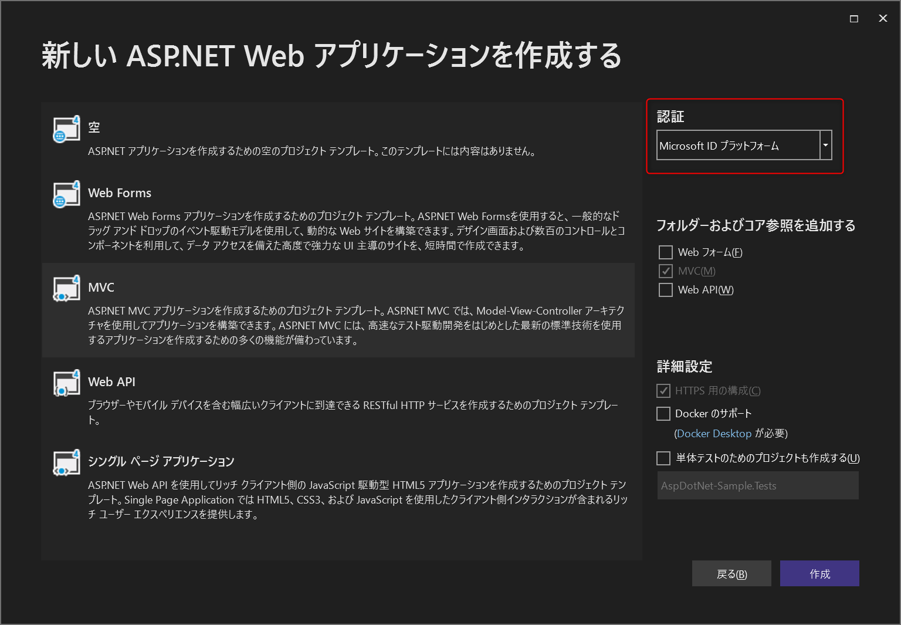
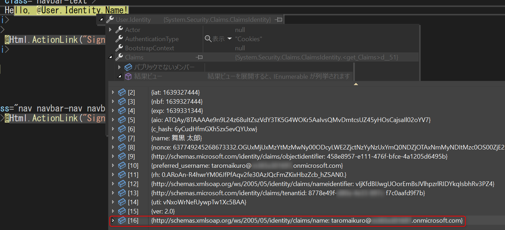

本記事は [Azure Tech Advent Calendar 2021](https://qiita.com/advent-calendar/2021/microsoft-azure-tech) 13 日目の記事です。 
Japan Azure Identity Support Blog では、お問合せの多い事象へのトラブルシューティング方法や、英文で公開された記事の日本語訳の情報を発信しています。 
今回の記事では、たびたびお問い合わせいただくことのある ASP.NET + MVC + Azure AD 認証を構成しているアプリケーションを Azure AD 認証エンドポイント v1 から v2 に変更する際のポイントについて説明します。

## ASP.NET アプリケーションの Azure AD 認証

ASP.NET アプリケーションに Azure AD の組織アカウントを利用してサインインを追加する場合、Open Web Interface for .NET (OWIN) を利用することで簡単に実装することが可能です。 

[チュートリアル:ASP.NET Web アプリに Microsoft へのサインインを追加する](https://docs.microsoft.com/ja-jp/azure/active-directory/develop/tutorial-v2-asp-webapp) 

また、Visual Studio のウィザードにて **Microsoft ID プラットフォーム** を選択することができますが、ウィザードに沿って構成することで Azure AD 認証に必要なコンポーネントや処理が自動的に追加されます。



しかしながら、この自動的に追加される Azure AD 認証では Azure AD 認証エンドポイントの v1 が利用されています。
Azure AD の認証エンドポイントには v1 と v2 があり、v1 エンドポイントは比較的古いアプリケーションで利用されていることが多く、新しいアプリケーションを作成する場合には v2 の認証エンドポイントをご利用いただくことをおすすめしています。 

v1 エンドポイントと v2 エンドポイントの違いについては以下の資料をご覧ください。

[Microsoft ID プラットフォーム (v2.0) に更新する理由 # 制限事項](https://docs.microsoft.com/ja-jp/azure/active-directory/azuread-dev/azure-ad-endpoint-comparison#limitations) 

Visual Studio のウィザードで作成されたアプリケーションの認証エンドポイントを v2 に変更するには、手動でプログラムを修正する必要があります。 
本資料では修正のポイントをご紹介します。

## 認証エンドポイントの変更

Visual Stdio のウィザードで作成されたアプリケーションを変更するには、以下の二つのポイントの変更が必要です。

- 認証エンドポイントを v2 に変更する (必須)
- アクセス許可 (scope) を明示する (オプション)

この二点を変更するだけで以下のように v2 エンドポイントが利用されるよう変更されます。

変更前 
```
https://login.microsoftonline.com/8778e49f-0123-0123-0123-f7c0aafd9f7b/oauth2/authorize?client_id=94cc007d-161c-4a66-8b11-dbcd971bfe16&response_mode=form_post&response_type=code+id_token&scope=openid+profile& ・・・省略・・・
```

変更後
```
https://login.microsoftonline.com/8778e49f-0123-0123-0123-f7c0aafd9f7b/oauth2/v2.0/authorize?client_id=94cc007d-161c-4a66-8b11-dbcd971bfe16&response_mode=form_post&response_type=code+id_token&scope=openid+profile+email& ・・・省略・・・
```

### 認証エンドポイントを v2 に変更する

Visual Studo のウィザードで作成されたアプリケーションでは、Web.config と Startup.Auth.cs で以下のように既定で実装されています。

Web.config
```xml
  <appSettings>
    ・・・ 省略 ・・・
    <add key="ida:AADInstance" value="https://login.microsoftonline.com/" />
    <add key="ida:TenantId" value="8778e49f-0123-0123-0123-f7c0aafd9f7b" />
    ・・・ 省略 ・・・
  </appSettings>
```

Startup.Auth.cs
```CSharp
private static string aadInstance = EnsureTrailingSlash(ConfigurationManager.AppSettings["ida:AADInstance"]);
private static string tenantId = ConfigurationManager.AppSettings["ida:TenantId"];
private static string authority = aadInstance + tenantId;
```

上記の authority の定義において "/v2.0" の文字列を連携することで v2 エンドポイントが利用されるようになります。 
もちろん別の方法でも対応できるかとは思いますが、この方法が最も容易かと思います。 

```CSharp
// private static string authority = aadInstance + tenantId;
private static string authority = aadInstance + tenantId + "/v2.0";
```

### オプション : アクセス許可 (scope) を明示する

冒頭の [Microsoft ID プラットフォーム (v2.0) に更新する理由](https://docs.microsoft.com/ja-jp/azure/active-directory/azuread-dev/azure-ad-endpoint-comparison) の資料に記載のとおり、v2 エンドポイントにおいては "resource" パラメーターの代わりに "scope" パラメーターを指定する必要があります。

> [!NOTE]
> 変更前でも実際の通信時には scope パラメーターが含まれていますが、v1 エンドポイントでは scope パラメーターは無視されます。
> このときの scope パラメーターには "openid" および "profile" が指定されています。このため、本オプションは必須ではありませんが、"openid" および "profile" 以外のアクセス許可を要求する必要がある場合、もしくは、要求するアクセス許可を明確にしておきたい場合、には Scope プロパティの利用をご検討ください。

この指定は、Startup.ConfigureAuth メソッド内で実装されている OpenIdConnectAuthenticationOptions オブジェクトの初期化において Scope プロパティを利用することで可能です。

```CSharp
public void ConfigureAuth(IAppBuilder app)
{
    ・・・ 省略 ・・・
    app.UseOpenIdConnectAuthentication(
        new OpenIdConnectAuthenticationOptions
        {
            ClientId = clientId,
            Authority = authority,
            PostLogoutRedirectUri = postLogoutRedirectUri,
            Scope = "openid profile email"
        });
}

```

## 参考: ID トークンに含まれている内容

この変更に伴い、v1 エンドポイントで取得した ID トークンに含まれていたはずの情報が v2 エンドポイントの時には含まれていない！ということが起こり得ます。この点が影響し、例えば、ASP.NET 側で User.Identity.Name プロパティでサインインしているユーザーの名前が取得できない事象が発生したりします。この差分を埋めるためにはさらに拡張が必要となります。

今回は User.Identity.Name を例として説明します。

### なぜ発生するか

ASP.NET において User.Identity.Name のもととなる情報として、http://schemas.xmlsoap.org/ws/2005/05/identity/claims/ 名前空間の name クレーム (User.Identity.Claims プロパティで確認可能です) が利用されています。そして、この name クレームの情報は、v1 エンドポイントから取得可能な ID トークン内の "unique_name" 属性が利用されていました。


しかしながら、"unique_name" 属性は、以下の資料にも記載のあるとおり v2 エンドポイントでは含まれない属性となりました。

[アプリに省略可能な要求を提供する](https://docs.microsoft.com/ja-jp/azure/active-directory/develop/active-directory-optional-claims)

### どのような対処が必要か

v2 エンドポイントでは、代わりに "preferred_username" 属性を含めることができます。このため、User.Identity.Name プロパティが正常に参照できるようにするには、この "preferred_username" 属性を利用するよう実装する必要があります。ただ、"preferred_username" 属性は既定では ID トークンに含まれないため、上記の資料のとおり "profile" のアクセス許可 (scope) を要求する必要があります。

"profile" のアクセス許可を含めて認証を実施することにより、"preferred_username" 属性が含まれる ID トークンを取得することが可能です。


しかしながら、この対処だけではまだ User.Identity.Name は null のままであり、また、http://schemas.xmlsoap.org/ws/2005/05/identity/claims/ 名前空間の name クレームも設定されていません。

http://schemas.xmlsoap.org/ws/2005/05/identity/claims/ 名前空間の name クレームも設定されるようにするには、以下のような実装が必要となります。

- Scope プロパティを追加した OpenIdConnectAuthenticationOptions オブジェクトの初期化処理に Notifications プロパティを OpenIdConnectAuthenticationNotifications オブジェクトで初期化する処理を追加
- OpenIdConnectAuthenticationNotifications オブジェクトを初期化する処理で SecurityTokenValidated プロパティにメソッドを設定
- SecurityTokenValidated プロパティに設定したメソッドで "preferred_username" をもとに http://schemas.xmlsoap.org/ws/2005/05/identity/claims/ 名前空間の name クレームを追加する処理を追加

具体的な内容は実装を見たほうが早いと思いますため、以下に実装例を記載します。

```CSharp
using System.Threading.Tasks;
using Microsoft.Owin.Security.Notifications;
using Microsoft.IdentityModel.Protocols.OpenIdConnect;
using System.Security.Claims;

public partial class Startup
{
    ・・・省略・・・
    public void ConfigureAuth(IAppBuilder app)
    {
        ・・・省略・・・
        app.UseOpenIdConnectAuthentication(
            new OpenIdConnectAuthenticationOptions
            {
                ClientId = clientId,
                Authority = authority,
                PostLogoutRedirectUri = postLogoutRedirectUri,
                Scope = "openid profile",
                Notifications = new OpenIdConnectAuthenticationNotifications()
                {
                    SecurityTokenValidated = OnSecurityTokenValidated,
                },
            });
    }

    public Task OnSecurityTokenValidated(SecurityTokenValidatedNotification<OpenIdConnectMessage, OpenIdConnectAuthenticationOptions> args)
    {
        string nameClaimType = "http://schemas.xmlsoap.org/ws/2005/05/identity/claims/name";
        string preferredUsernameClaimType = "preferred_username";

        Claim nameClaim = args.AuthenticationTicket.Identity.Claims.FirstOrDefault(claim => claim.Type == nameClaimType);
        Claim preferredUsernameClaim = args.AuthenticationTicket.Identity.Claims.FirstOrDefault(claim => claim.Type == preferredUsernameClaimType);

        if (nameClaim == null)
        {
            if (preferredUsernameClaim != null && !String.IsNullOrEmpty(preferredUsernameClaim.Value))
            {
                args.AuthenticationTicket.Identity.AddClaim(new Claim(nameClaimType, preferredUsernameClaim.Value));
            }
        }
        return Task.CompletedTask;
    }
}
```

このように構成することにより、http://schemas.xmlsoap.org/ws/2005/05/identity/claims/ 名前空間の name クレームに "preferred_username" 属性の内容を反映させることが可能です。 



もちろん、User.Identity.Name も取得できます！ 


ほかにも必要な属性がありましたら、上記の資料を基にアクセス許可 (scope) を要求する、もしくは、[Azure ポータル] &gt; [Azure Active Directory] &gt; [アプリの登録] &gt; 対象のアプリ &gt; [トークン構成] にて "オプションの要求の追加" から登録することをご検討ください。

---
いかがでしたでしょうか。
ASP.NET アプリケーションにおいて v1 から v2 への移行する際の一助となりましたら幸いです。

