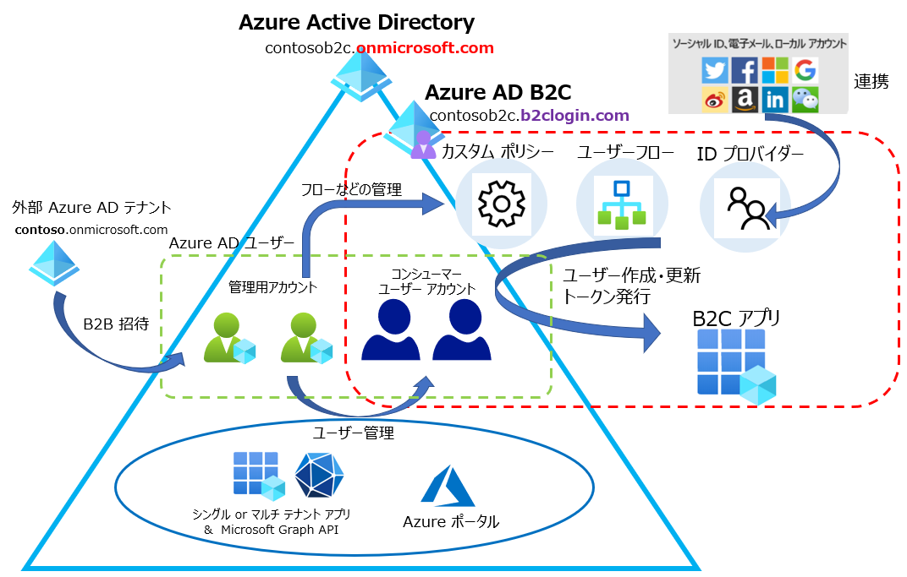

こんにちは。Azure Identity サポートの埴山です。

Azure AD B2C は非常に多機能な ID 基盤ですが、誤った利用方法を検討いただいていたり、本来利用方法として想定されない構成についてご質問いただくことがございます。
本記事では Azure AD B2C をご利用いただくにあたり、抑えていただきたい Azure AD B2C の基本的な考え方と、よくあるご質問について回答します。

## Azure AD B2C のキホン

まず、Azure AD B2C は Microsoft が提供する ID 管理基盤で、いわゆる IDaaS と呼ばれるサービスです。
Azure AD がエンタープライズ向けの ID 基盤であるのに対し、Azure AD **B2C** は、コンシューマーユーザーの管理を目的としている点が大きく異なります。

さて、コンシューマーアカウントといわれても、想像がしづらいと思いますので、Azure AD B2C のドキュメントにある以下の例で具体的に考えていきましょう。

- Azure Active Directory B2C とは | Microsoft Docs
  <https://docs.microsoft.com/ja-jp/azure/active-directory-b2c/overview#example-woodgrove-groceries>

### サンプルシナリオ

WoodGrove 社はあるスーパーマーケット WoodGrove Groceries を経営する会社です。
WoodGrove Groceries のオンライン会員管理システムに Azure AD B2C を利用しています。
ユーザーはサインアップページより、ソーシャルアカウントまたはメールアドレスでサインアップを行い、ショッピングを楽しめます。

### Azure AD と Azure AD B2C の違い

同時に、WoodGrove 社では従業員のユーザー管理に Azure AD を利用しています。
Azure AD B2C と Azure AD を使い分ける理由とは何でしょうか。

それぞれのサービスを利用するユーザーはこのようになっています。

|| 対象組織| 対象ユーザー|
|---|---|---|
|Azure AD| WoodGrove 社 | WoodGrove 社の社員や派遣社員 |
|Azure AD B2C | WoodGrove Groceries のショッピング サイト | オンライン ショッピング利用ユーザー |

もう少しそれぞれのサービスに求められる特徴というものを考えてみましょう。

#### Azure AD に求められる特徴

まず WoodGrove 社のユーザーを管理できるという観点では、会社の管理者がテナントのあらゆる設定を管理できることが望ましいでしょう。
さらに、管理部門や人事部門には、ユーザー管理の権限を適切に割り当てられる必要があります。また、Office 365 や SaaS アプリをユーザーに使わせる、オンプレミスの Active Directory との同期も必要かもしれません。

外部ユーザーとの連携を行いたい場合には、ゲスト ユーザーとして招待することで Azure AD で管理されるサービスを、外部ユーザーに利用するシーンもあるかもしれません。

- WoodGrove 社の ID 管理基盤に求められる機能
  - 管理権限の適切な委譲
  - Microsoft 365 サービスの利用
  - 組織が管理する SaaS アプリとの連携
  - オンプレミスの Active Directory との連携
  - ゲスト ユーザーを招待する B2B 機能

このように、Azure AD は、会社組織の中で適切に権限を設定、以上できるような管理機能が提供されています。
また、各ユーザーはデフォルトではお互いのユーザーを参照できるなど、利用者が同一組織のメンバーである前提で設計されています。

#### Azure AD B2C に求められる特徴

対して、WoodGrove Groceries の会員管理サービスに必要な機能は何でしょうか。
まずサービスを利用するにあたって、サインイン画面やサインアップ画面のカスタマイズが必要です。
また、ユーザー自身が属性情報を変更できるプロフィール編集画面やパスワードリセット機能、ユーザー属性を外部の身分証明サービスと連携する API 連携といった機能が必要となる場合もあるでしょう。

- WoodGrove Groceries の ID 管理基盤に求められる機能
  - ユーザーが自身で会員登録を行えるセルフサインアップ機能
  - サインアップ時に名前や住所、電話番号などのユーザー属性を収集する機能
  - ブランド イメージに合わせてサインイン画面のカスタマイズ
  - ユーザーが自身で行えるプロフィールやパスワード変更(リセット) 機能
  - 本人確認や身分確認のためのサービスとの連携機能

Azure AD B2C では上述の通り、コンシューマー ユーザーを管理することに主眼をおいており、会社組織のアカウント管理で有用な機能は利用できない、あるいはコンシューマー ユーザーには適用できない場合がございます。

もし、あなたが自社組織の ID 管理基盤に求める機能が必要な場合、Azure AD B2C は適切なソリューションではない可能性があります。
つまり、求める機能は実現できなかったり、あるいは自身で細かい実装が必要になる可能性があるので、ご注意ください。

#### Azure AD B2C 以外のソリューション

代替のソリューションとして、既存の Azure AD テナントに B2B ユーザーとしてゲスト招待をし、組織内のアプリケーションにサインインをさせる、あるいは、マルチテナント アプリケーションを作成し、すべての Azure AD テナントのユーザーがサインイン可能なアプリを作ることが代替策になる可能性があります。

たとえば、自組織内の Office 365 のリソースを外部ユーザーにも参照させたいときには、Azure AD B2B、Azure AD を利用する他社組織へのサービス提供 (SaaS アプリの開発) を考えている場合には、マルチテナント アプリケーションの構成が適切でしょう。

詳しくは、[外部 ID の比較 - Azure Active Directory | Microsoft Docs](https://docs.microsoft.com/ja-jp/azure/active-directory/external-identities/compare-with-b2c) をご確認ください。

### Azure AD B2C の機能

ここからは、もう少し詳しく Azure AD B2C の動作について確認していきましょう。
Azure AD B2C は上述の通り、インターネット上での会員証のような機能を実現するための ID 基盤です。

WoodGrove Groceries ではユーザーの登録時に、氏名、メールアドレスなどを収集します。
現実世界のネットショップでは、生年月日、電話番号、住所などの属性も収集が必要でしょう。
Azure AD B2C が標準で対応している本人確認はメールアドレスの確認のみですが、必要に応じて API 連携などを行い本人確認を行います。

こうして発行された Azure AD B2C テナントのアカウントは、WoodGrove Groceries ショップの中での身分証となり、WoodGrove 社が提供する様々なサービスへサインインすることが可能となります。

このように作成されたユーザーは "コンシューマー ユーザー" とよばれ、Azure AD B2C に登録されたアプリにのみサインインすることが可能です。当然 Azure AD B2C のコンシューマー ユーザーは、その管理基盤である Azure AD テナントにサインインすることは想定されていませんし、ユーザー同士が他のユーザー情報を見れたり、管理することは Azure AD B2C 既定の動作ではできません。

大まかな Azure AD B2C を構成するコンポーネントの関係について、図にまとめましたので参考にしてください。

## よくあるご質問

ここからは、上記の前提事項を踏まえ、よくある質問について回答いたします。

### Azure AD B2C のコンシューマー ユーザー アカウントとはなんですか

Azure AD B2C のサインアップ フローで作成されたアカウントは、コンシューマー ユーザー アカウントと呼ばれます。
コンシューマー ユーザーは Azure AD B2C のユーザーとしてサインイン フロー等を利用し Azure AD B2C の世界のトークンを発行することができます。一方で Azure ポータルにサインインをしたり、Microsoft Graph API を呼び出すといった、Azure AD の世界を直接利用することはできません。

これに対し、管理用の Azure AD ユーザー (B2B ゲストユーザーを含む) は、Azure AD を直接利用することができ、Azure ポータルにサインインをし、ユーザーを操作を行う、Microsoft Graph API を呼び出すといったことが可能です。

### Azure AD B2C の管理ユーザーとは何ですか

Azure AD B2C テナントは、通常の Azure AD テナントを拡張して作成されております。そのため多くの Azure AD 機能を利用いただけますが、Azure AD B2C の管理領域とそれらは分けて考えることが重要です。たとえば Azure AD B2C テナントでは、管理用ユーザーとして B2B ゲスト ユーザーが作成できますが、これらのユーザーを Azure AD B2C のサインイン フローで利用することはできません。

上記図の、赤枠で囲われた部分が Azure AD B2C の機能ですが、これらの機能は通常の Azure AD テナント上に拡張機能として実装されています。
そのため、ユーザーストア等は従来の Azure AD と共用の部分もあり、管理ユーザーは Azure AD ユーザー管理機能 (Microsoft Graph API や Azure ポータル上での操作) を実施することが可能です。

### Azure AD B2C のユーザー フローで取得したトークンで Microsoft Graph API を呼び出せますか？

いいえ、Azure AD B2C のユーザー フローは、お客様のアプリ用のトークンのみを発行します。

Azure AD B2C のサインイン アップ フローや、サインイン フロー、b2clogin.com の認証エンドポイントと発行されるトークンは、ある意味 Azure AD の領域とは切り離されており、お客様独自のアプリケーション内で利用できるものとなっています。

もう少し、技術的な説明を付け加えると、[Microsoft Graph API を呼び出すために必要なトークン](https://docs.microsoft.com/ja-jp/graph/auth/auth-concepts) は、issuer が `https://login.microsoftonline.com/<tenantid>/v2.0` などである必要がありますが、[Azure AD B2C のユーザー フローで発行されるトークン](https://docs.microsoft.com/ja-jp/azure/active-directory-b2c/tokens-overview) の issuer は `https://<tenantname>.b2clogin.com/<tenantid>/v2.0/` であり、B2C アプリの閉じた世界でのみ利用できるトークンとなっています。

Microsoft Graph API を呼び出すユースケースがある場合、アプリ側で Azure AD の [OAuth 2.0 クライアント資格情報フロー](https://docs.microsoft.com/ja-jp/azure/active-directory/develop/v2-oauth2-client-creds-grant-flow) などを利用し API を呼び出し、お客様の API で結果を返すといった実装をご検討ください。

### Azure AD B2C テナントに登録できるアプリの種類について教えてください。

Azure AD B2C のユーザー フローを利用する B2C アプリを登録できます。それに加え、通常の Azure AD テナント同様に、シングルテナント アプリケーション、マルチテナント アプリケーションの登録も可能です。

前述の通り、前者が `<tenantname>.b2clogin.com ` のエンドポイントで認証し、Azure AD B2C の世界のトークンを発行するのに対し、後者は管理用アプリとして `login.microsoftonline.com` のエンドポイントで認証し、Microsoft Graph API の呼び出し用などに利用します。

管理ユーザーで Microsoft Graph API を呼び出すには、テナントにシングルテナント (またはマルチテナント) アプリを登録します。Microsoft Graph Explorer などのアプリを利用して Microsoft Graph API を呼び出すためには、Azure AD B2C テナントに管理ユーザー (上記例では admin@contosob2c.onmicrosoft.com といったユーザー) を作成いただく必要がありますので、ご注意ください。

ユーザー管理のためのサンプルはこちらをご覧ください。

- Microsoft Graph API を使用してユーザーを管理する - Azure AD B2C | Microsoft Docs
  <https://docs.microsoft.com/ja-jp/azure/active-directory-b2c/manage-user-accounts-graph-api>

### Azure AD B2C の料金について詳しく教えてください

2021/1 現在、料金は Azure AD の External Identity と同様で以下のページよりご確認いただけます。

- 料金 - Active Directory 外部 ID | Microsoft Azure
  https://azure.microsoft.com/ja-jp/pricing/details/active-directory/external-identities/

### Azure AD B2C テナントにオンプレミス AD のユーザーを同期したいのですが可能ですか？

いいえ、Azure AD B2C テナントでは Azure AD Connect をご利用いただくことはできません。
Microsoft Graph API を利用して、お客様独自のアプリを作成し同期を行うことは可能ですが、上述の利用シーンを確認いただき、組織ユーザーを Azure AD B2C に連携することが適切か再度ご検討ください。

### Azure AD B2C の P1 と P2 で利用できる機能は何ですか

2021/1 現在、Azure AD B2C のコンシューマー アカウント向けに、条件付きアクセス ポリシーの利用 (P1)、リスクベースの条件付きアクセス ポリシーの利用 (P2) が可能です。
現時点では Azure AD Premium の機能、つまり B2C テナント管理ユーザー向けの、アプリやロールへのグループ ベースの割り当て機能、Azure AD の組織アカウント向けの Identity Protection などのは利用できません。

### XXXX の機能について、カスタム ポリシーを利用すればを実現可能ですか

弊社ではカスタム ポリシーの利用例として、以下の GitHub リポジトリにてサンプルを公開しています。まずは実現したいことが以下のサンプルにあるかを確認ください。

- azure-ad-b2c/samples: Azure AD B2C Identity Experience Framework sample User Journeys.
  <https://github.com/azure-ad-b2c/samples>

カスタム ポリシーは非常に柔軟な連携や構成が可能なため、ある意味イチからプログラミングをしてアプリケーションを作成するぐらいの自由度があります。そのため、Microsoft サポートとしては Azure AD B2C の機能自体についてのご質問については回答可能ですが、特定の要件に合わせた詳細なカスタマイズ手順については、別途コミュニティー (Stack overflow) サポートの利用もご検討ください。

- Newest 'azure-ad-b2c' Questions - Stack Overflow
  <https://stackoverflow.com/questions/tagged/azure-ad-b2c>
