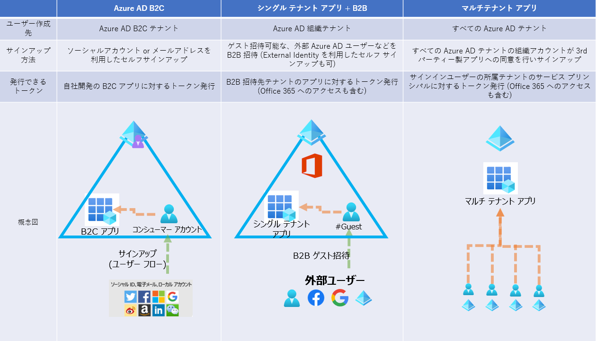
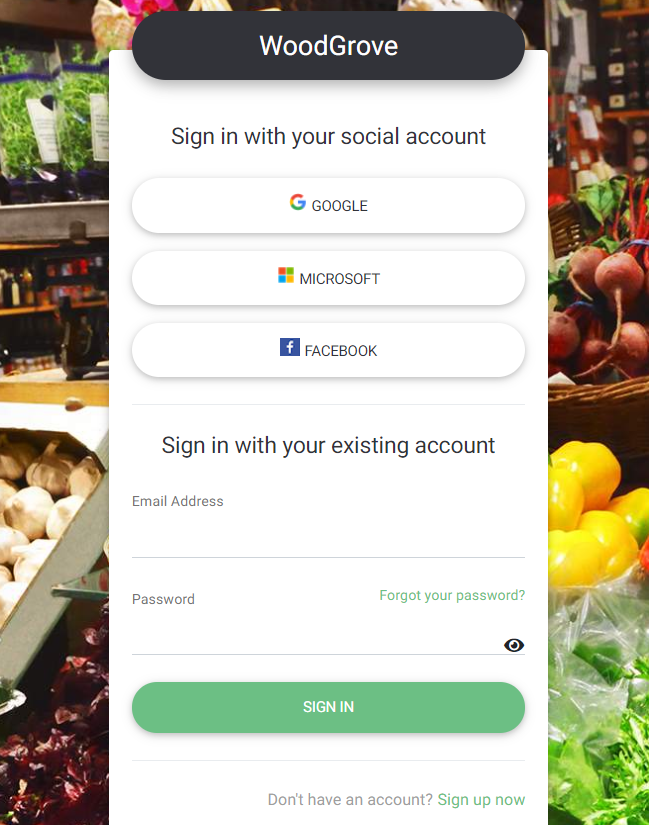
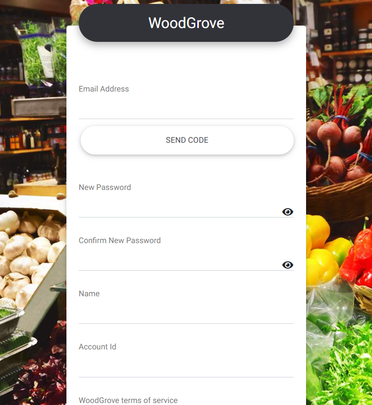
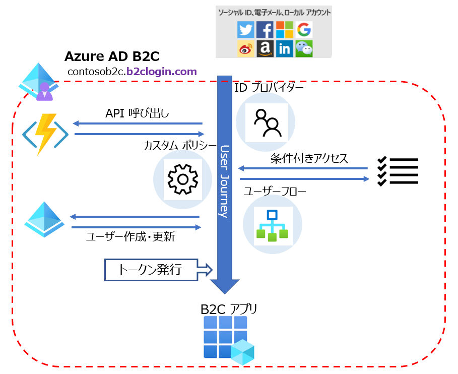

こんにちは。Azure Identity サポートの埴山です。

Azure AD B2C は非常に多機能な ID 基盤ですが、誤った利用方法を検討いただいていたり、本来利用方法として想定されない構成についてご質問いただいたりすることがございます。本記事では Azure AD B2C をご利用いただくにあたり、抑えていただきたい Azure AD B2C の基本的な考え方をご案内し、併せてよくあるご質問について回答します。

## Azure AD B2C のキホン

まず、Azure AD B2C は Microsoft が提供する ID 管理基盤で、いわゆる IDaaS と呼ばれるサービスです。Azure AD がエンタープライズ (企業など組織で働くユーザー) 向けの ID 管理基盤であるのに対し、Azure AD **B2C** は、コンシューマー (ショッピング サイトの利用者など一般ユーザー) の ID 管理を目的としている点が大きく異なります。

さて、コンシューマーのアカウントといわれても、想像がしづらいと思いますので、Azure AD B2C のドキュメントにある以下の例で具体的に考えていきましょう。

- [Azure Active Directory B2C とは | Microsoft Docs](https://docs.microsoft.com/ja-jp/azure/active-directory-b2c/overview#example-woodgrove-groceries)


### サンプル シナリオ

WoodGrove 社はあるスーパーマーケット WoodGrove Groceries を経営する会社です。WoodGrove Groceries のオンライン ショッピング サイトに利用者をサインインさせたり、利用者の ID を管理したりするために Azure AD B2C を利用しています。ユーザーはサインアップ ページより、Google アカウントや Facebbok アカウントなどのソーシャル アカウントまたはメール アドレスでサインアップを行い、ショッピングを楽しめます。

同時に、WoodGrove 社では従業員のユーザー管理に Azure AD を利用しています。Azure AD B2C と Azure AD を使い分ける理由とは何でしょうか。

### Azure AD と Azure AD B2C の違い

それぞれのサービスを利用するユーザーはこのようになっています。

|| 対象のシステム| 対象ユーザー|
|---|---|---|
|Azure AD| WoodGrove 社の社内システム | WoodGrove 社の社員や派遣社員 |
|Azure AD B2C | WoodGrove Groceries のショッピング サイト | オンライン ショッピングの利用ユーザー |

もう少しそれぞれのサービスに求められる特徴を考えてみます。

#### Azure AD に求められる特徴

まず WoodGrove 社のユーザーを管理できるという観点では、会社の管理者がテナントのあらゆる設定を管理できることが望ましいでしょう。さらに、管理部門や人事部門には、ユーザー管理の権限を適切に割り当てられる必要があります。また、Office 365 や SaaS アプリをユーザーに使わせることや、オンプレミスの Active Directory との同期も必要かもしれません。

外部ユーザーとの連携を行いたい場合には、その外部ユーザーをゲスト ユーザーとして招待することで自社の Azure AD で管理されるサービスを、外部ユーザーに利用させるシーンもあるかもしれません。

このため、WoodGrove 社の ID 管理基盤に求められる機能は以下のとおりとなります。

- 管理権限の適切な委譲
- Microsoft 365 サービスの利用
- 組織が管理する SaaS アプリとの連携
- オンプレミスの Active Directory との連携
- ゲスト ユーザーを招待する B2B 機能

このように、Azure AD には、会社組織の中で適切に権限を設定し委任できるような管理機能が提供されています。また、各ユーザーは既定でお互いのユーザーを参照し連携できるなど、利用者が同一組織のメンバーであることを前提に設計されています。

#### Azure AD B2C に求められる特徴

一方で、WoodGrove Groceries (ショッピング サイト) の会員管理サービスに必要な機能は何でしょうか。まずサービスを利用するにあたり、サインイン画面やサインアップ画面のカスタマイズが必要です。また、ユーザー自身が属性情報を変更できるプロフィール編集画面やパスワード リセット機能、ユーザー属性を外部の身分確認サービスと連携する API 連携といった機能が必要となる場合もあるでしょう。

このため、WoodGrove Groceries の ID 管理基盤に求められる機能は以下のとおりとなります。

- ユーザーが自身で会員登録を行えるセルフサインアップ機能
- サインアップ時に名前や住所、電話番号などのユーザー属性を収集する機能
- ブランド イメージに合わせたサインイン画面のカスタマイズ
- ユーザーが自身で行えるプロフィールやパスワード変更 (リセット) 機能
- 本人確認や身分確認のためのサービスとの連携機能

Azure AD B2C では上述のとおり、コンシューマー ユーザーを管理することが目的であり、会社組織のアカウント管理で有用な機能は利用できない、あるいはコンシューマー ユーザーには適用できない場合がございます。

もし、あなたが自社組織の ID を管理しようとしており、その管理のための機能が必要な場合、Azure AD B2C は適切なソリューションではない可能性があります。つまり、求める機能は Azure AD B2C では実現できない、あるいは自身で細かい実装が必要になる可能性がありますのでご注意ください。

#### Azure AD B2C 以外に自テナントのリソースを他者に利用させるソリューション

Azure AD B2C を利用せず自テナントのリソースを他者に利用させたい場合、Azure AD の以下の方法が代替策になる可能性があります。

- 既存の Azure AD テナントに外部ユーザーを B2B ユーザーとしてゲスト招待し、組織内のアプリケーションにサインインをさせる (シングル テナント アプリ)
- マルチテナント アプリケーションを作成し、すべての Azure AD テナントのユーザーがサインイン可能なアプリを作る

たとえば、自組織内の Office 365 のリソースを外部ユーザーにも参照させたいときには Azure AD B2B を使用し、また Azure AD を利用する他社組織へのサービス提供 (SaaS アプリの開発) を考えている場合には、マルチテナント アプリケーションを構成するのが適切でしょう。

以下に、外部のユーザーをアプリにサインアップ、サインインさせる際のソリューションについて簡単な比較表を作成しましたので参考にしてください。



詳しくは、[外部 ID の比較 - Azure Active Directory | Microsoft Docs](https://docs.microsoft.com/ja-jp/azure/active-directory/external-identities/compare-with-b2c) をご確認ください。

### Azure AD B2C の機能

ここからは、もう少し詳しく Azure AD B2C の動作について確認していきます。

[WoodGrove Groceries](https://woodgrovedemo.com/Account/LogIn) では新規ユーザーの登録時に、Google や Facebook などのソーシャル アカウントまたは、既存のメール アドレスを指定してセルフサインアップを行えます。



この際、ユーザー フローに設定された属性値をもとに、サインアップと同時に氏名、メールアドレス、規約への同意情報などを収集します。



現実世界のネット ショップでは、生年月日、電話番号、住所などの属性も収集が必要でしょう。また Azure AD B2C が標準で対応している本人確認はメールアドレスの確認のみですが、必要に応じて外部サービスや、独自の API との連携で本人確認を実施することも可能です。サインアップが完了すると、Azure AD B2C テナント上にユーザーが作成され、サインアップ時に利用したアカウント情報 (ソーシャル アカウントの情報、あるいはメール アドレス情報) と属性値が Azure AD 上に記録されます。

このように作成されたユーザーは "コンシューマー ユーザー" とよばれます。大まかな Azure AD B2C を構成するコンポーネントの関係について、図にまとめましたので参考にしてください。


コンシューマー ユーザーは、赤枠のフローを通してサインアップ・サインインを行い、アプリに対してトークンを発行することが可能です。

ユーザー フローなどの設定は管理用アカウントである B2B ユーザーやテナントの組織ユーザーに管理権限を付与し設定を行います。Azure AD B2C ではトークンに含まれる属性情報などを細かくカスタマイズする、条件付きアクセス ポリシーを構成し必要に応じて多要素認証を求める、API コネクターやカスタム ポリシーを利用して API 連携を行うなど、アプリに合わせた認証・認可フローを構成することが可能です。



> [!NOTE]
> ※ カスタム ポリシーは既定で用意されている ID プロバイダーとユーザー フローで要望を実現できない場合に、より高度なカスタマイズを実現するための ID プロフェッショナル向けの機能です。Azure AD B2C をご利用いただく際には、まずは既定で用意されている ID プロバイダーとユーザー フローにて要件を満たせるか検討いただくことを推奨します。

## よくあるご質問

ここからは、上記の前提事項を踏まえ、よくある質問について回答いたします。

### Azure AD B2C テナントの管理画面にアクセスするにはどうすればよいですか

Azure AD B2C はサブスクリプションに紐づくリソースではありますが、サブスクリプションが紐づくテナントとは別の Azure AD テナント上に機能が提供されています。そのため、管理者が Azure AD B2C テナントへアクセスするには、以下の手順でアクセス先のテナントを切り替える必要があります。

1. Azure ポータルにアクセスします。
2. 右上のユーザーアイコンをクリックし、`ディレクトリの切り替え` をクリックします。
3. 作成した Azure AD B2C テナントを選択します。

あるいは Azure AD B2C テナントのテナント ID を、`https://portal.azure.com/<tenant id>` のように指定してブラウザーからアクセスすることでも、Azure AD B2C テナントに切り替えいただけます。

なお、Azure ポータルから Azure AD B2C テナントにアクセスしてユーザー (admin@contosob2c.onmicrosoft.com など) を作成いただき、グローバル管理者権限を付与することで、このユーザーを管理者としてご利用いただくことも可能です。その場合、直接 Azure AD B2C テナントにアクセスするためテナントの切り替えが不要となるほか、[Graph Explorer](https://developer.microsoft.com/ja-jp/graph/graph-explorer) などで Azure AD B2C テナントに対して API 呼び出しを実施いただくことも可能になります。このため、検証用に Azure AD B2C テナントに対しメンバー ユーザーとして管理ユーザーを作成いただくことをお勧めします。

### Azure AD B2C のコンシューマー ユーザー アカウントとはなんですか

Azure AD B2C のサインアップ フローで作成されたアカウントは、コンシューマー ユーザー アカウントと呼ばれます。コンシューマー ユーザー アカウントは、サインアップ フロー以外に Azure ポータル、あるいは Microsoft Graph API を利用して作成することが可能です。

技術的にはコンシューマー アカウントは、連携している IdP のアカウント情報、またはローカル アカウントのメール アドレスを "ID プロパティ" として保持しています。ID プロパティ (identities 属性) のほか、表示名 (DisplayName) や拡張属性 (extension) を Microsoft Graph API を利用することで編集、またはユーザーの新規作成を行うことが可能です。

詳細については、以下の公開情報をご確認ください。

- [Microsoft Graph API を使用してユーザーを管理する - Azure AD B2C | Microsoft Docs](https://docs.microsoft.com/ja-jp/azure/active-directory-b2c/manage-user-accounts-graph-api)

### Azure AD B2C の職場アカウント (管理ユーザー) とは何ですか

Azure AD B2C テナントにはコンシューマー ユーザー以外にも、管理用の Azure AD ユーザーを登録することが可能です。これらの職場アカウント (B2B ゲストユーザーを含む) は管理ユーザーとして Azure AD を直接利用することができ、Azure ポータルにサインインをしユーザーを操作を行う、Microsoft Graph API を呼び出すといったことが可能です。上記の admin@contosob2c.onmicrosoft.com がこの例に該当します。

- [Azure Active Directory B2C のユーザー アカウントの概要 | Microsoft Docs](https://docs.microsoft.com/ja-jp/azure/active-directory-b2c/user-overview)

Azure AD B2C テナントは、通常の Azure AD テナントを拡張して作成されております。そのため多くの Azure AD 機能を利用いただけますが、Azure AD B2C の管理領域とそれらは分けて考えることが重要です。管理ユーザーは従来の Azure AD テナントのユーザーと同等であり、グローバル管理者のディレクトリ ロールを割り当てることで、ユーザー フローを含めたテナントの設定を行うことが可能です。

上記のとおり、ユーザー ストア等は従来の Azure AD と Azure AD B2C のコンシューマー アカウントで共用であり、管理ユーザーは Azure AD ユーザー管理機能 (Microsoft Graph API や Azure ポータル上での操作) を利用してコンシューマー ユーザー アカウントを含めたユーザーを管理することが可能です。

なお、職場アカウントはあくまで管理用のユーザーであり、Azure AD B2C のユーザー フローで利用することはできません。上記図の赤枠で囲われた部分が Azure AD B2C の機能ですが、これらの機能は通常の Azure AD テナント上に拡張機能として実装されており、コンシューマー ユーザー アカウントのみが利用することを想定しております。

### 他テナントの Azure AD ユーザーをコンシューマー アカウントとして利用することは可能ですか

他テナントのユーザーを B2B 招待 (管理ユーザーとして招待) ではなく、コンシューマー ユーザーとして作成したい場合には、[特定の Azure Active Directory 組織用のサインインを設定](https://docs.microsoft.com/ja-jp/azure/active-directory-b2c/identity-provider-azure-ad-single-tenant?pivots=b2c-user-flow) しサインアップとサインインのフローを構成ください。

連携先のテナントに作成いただく Azure AD アプリにてサインイン可能なユーザーを設定することで、Azure AD B2C テナントにサインアップできるユーザーを制限することも可能です。アクセスできるユーザーを制限するには、エンタープライズ アプリケーションの[ユーザーの割り当てを有効](https://docs.microsoft.com/ja-jp/azure/active-directory/manage-apps/assign-user-or-group-access-portal)に設定し、アプリにアクセスを許可するユーザーを割り当てます。

### Azure AD B2C のユーザー フローで取得したトークンで Microsoft Graph API を呼び出せますか？

いいえ、Azure AD B2C のユーザー フローはお客様のアプリ用のトークンのみを発行し、Microsoft Graph API を呼び出すためのトークンを発行することはできません。

Azure AD B2C のサインイン アップ フローやサインイン フロー、b2clogin.com の認証エンドポイントから発行されるトークンは、ある意味 Azure AD の領域とは切り離されており、お客様独自のアプリケーション内でのみ利用できるものとなっています。

もう少し、技術的な説明を付け加えると、[Microsoft Graph API を呼び出すために必要なトークン](https://docs.microsoft.com/ja-jp/graph/auth/auth-concepts) は、issuer が `https://login.microsoftonline.com/<tenantid>/v2.0` などである必要がありますが、[Azure AD B2C のユーザー フローで発行されるトークン](https://docs.microsoft.com/ja-jp/azure/active-directory-b2c/tokens-overview) の issuer は `https://<tenantname>.b2clogin.com/<tenantid>/v2.0/` となります。このように、Issuer が異なるため、Azure AD B2C が発行するトークンを Microsoft Graph API に対して利用することはできません。Azure AD B2C のユーザー フローで発行されるトークンは、B2C アプリの閉じた世界でのみ利用できるものとなります。

Microsoft Graph API を呼び出すユース ケースがある場合、アプリ側で Azure AD の [OAuth 2.0 クライアント資格情報フロー](https://docs.microsoft.com/ja-jp/azure/active-directory/develop/v2-oauth2-client-creds-grant-flow) などを利用して Microsoft Graph API 用のトークンを取得ください。例えばお客様側で API を用意いただき、その API 内部で Microsoft Graph API 用のトークン取得と Microsoft Graph API の呼び出しを行うといった実装が考えられます。

### Azure AD B2C テナントに登録できるアプリの種類について教えてください。

Azure AD B2C のユーザー フローを利用する B2C アプリを登録できます。それに加え、通常の Azure AD テナント同様に、シングルテナント アプリケーション、マルチテナント アプリケーションの登録も可能です。

前者のユーザー フローを利用する B2C アプリは `<tenantname>.b2clogin.com` のエンドポイントで認証し、Azure AD B2C の世界のトークンを発行します。これに対して、後者のシングルテナントおよびマルチテナント アプリケーションは管理用アプリとして `login.microsoftonline.com` のエンドポイントで認証し、Microsoft Graph API の呼び出しなどに利用します。

テナントの管理ユーザー権限あるいはサービス プリンシパル権限で Microsoft Graph API を呼び出すには、テナントにシングルテナント (またはマルチテナント) アプリを登録ください。

### Azure AD B2C の料金について詳しく教えてください

2021/1 現在、料金は Azure AD の External Identity と同様で以下のページよりご確認いただけます。

- [料金 - Active Directory 外部 ID | Microsoft Azure](https://azure.microsoft.com/ja-jp/pricing/details/active-directory/external-identities/)

### Azure AD B2C テナントに Azure AD Connect を利用しオンプレミス AD のユーザーを同期するのは可能ですか？

いいえ、Azure AD B2C テナントでは Azure AD Connect をご利用いただくことはできません。お客様独自のアプリを開発し、Microsoft Graph API を利用して Azure AD B2C テナントにユーザーを同期することは可能ですが、上述の利用シーンを確認いただき、組織ユーザーを Azure AD B2C に連携することが適切か再度ご検討ください。

### Azure AD B2C の Premium P1 と P2 ライセンスで利用できる機能は何ですか

2021/1 現在、Azure AD B2C のコンシューマー アカウント向けに、条件付きアクセス ポリシーの利用 (P1)、リスクベースの条件付きアクセス ポリシーの利用 (P2) が可能です。現時点では Azure AD Premium の機能であるアプリおよびロールへのグループ ベースの割り当てや Azure AD の組織アカウント向けの Identity Protection などの機能は B2C テナント管理ユーザー向けには利用できません。

### コンシューマー ユーザー アカウントのパスワードをリセットするにはどうすればよいですか

コンシューマー ユーザー (ローカル アカウント) のパスワード リセットを Azure ポータルから実施すると、パスワード プロファイルの `forceChangePasswordNextSignIn` が `true` となり、一部のユーザー フローでサインインの失敗が発生します。

そのためパスワード リセットは Microsoft Graph API や Azure AD PowerShell モジュールを利用し、`forceChangePasswordNextSignIn` を `false` に設定したうえで更新ください。

▽ Graph API の例

```http
PATCH https://graph.microsoft.com/v1.0/users/<対象ユーザーのオブジェクト ID>
 
{
    "passwordProfile": {
        "password": "password-value",
        "forceChangePasswordNextSignIn": false
    },
    "passwordPolicies": "DisablePasswordExpiration"
}
```

▽ Microsoft Graph PowerShell モジュールでの例

```powershell
Connect-MgGraph -Scopes "Directory.AccessAsUser.All" -TenantId <B2C tenant 名>
$params = @{
  PasswordProfile = @{
      ForceChangePasswordNextSignIn = $false
      Password = 'password-value'
  }
}
Update-MgUser -UserId <対象ユーザーのオブジェクト ID> -BodyParameter $params
```

### コンシューマー ユーザー アカウントのパスワードに有効期限を定めることは可能ですか

パスワード有効期限の通知機能や、強制更新機能は Azure AD B2C の標準機能としては提供しておりません。

Azure AD B2C では、お客様が設定可能なパスワードのポリシーとして NIST SP 800-63 をベースに機能を実装しております。NIST SP 800-63 では、頻繁なパスワード変更や、複雑なパスワード ポリシーはエンドユーザーの利便性を下げるだけではなく、セキュリティの向上に寄与しないことを指摘しています。

必要に応じてカスタム ポリシーでの実装をご検討ください。

- [samples/policies/force-password-reset-after-90-days at master · azure-ad-b2c/samples](https://github.com/azure-ad-b2c/samples/tree/master/policies/force-password-reset-after-90-days)

### XXXX の機能について、カスタム ポリシーを利用すれば実現可能ですか

弊社ではカスタム ポリシーの利用例として、以下の GitHub リポジトリにてサンプルを公開しています。まずは実現したいことが以下のサンプルにあるかを確認ください。

- [azure-ad-b2c/samples: Azure AD B2C Identity Experience Framework sample User Journeys.](https://github.com/azure-ad-b2c/samples)

カスタム ポリシーは非常に柔軟な連携や構成が可能なため、ある意味イチからプログラミングをしてアプリケーションを作成する程度の自由度があります。一方で構成が非常に複雑であり、仕組みの理解や適切な利用には十分な学習と検証が必要です。弊社サポートとしては Azure AD B2C の機能自体についてのご質問については回答可能ですが、特定の要件に合わせた詳細なカスタマイズ手順のご案内については、別途コンサルティング サービス、あるいはコミュニティー (Stack overflow) サポートの利用をご検討ください。

- [Newest 'azure-ad-b2c' Questions - Stack Overflow](https://stackoverflow.com/questions/tagged/azure-ad-b2c)
