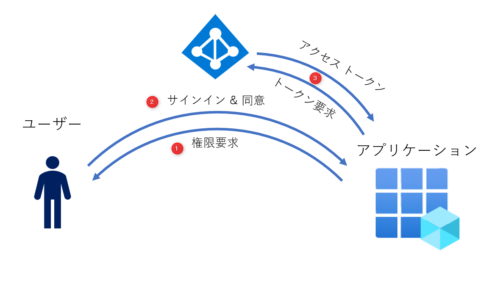
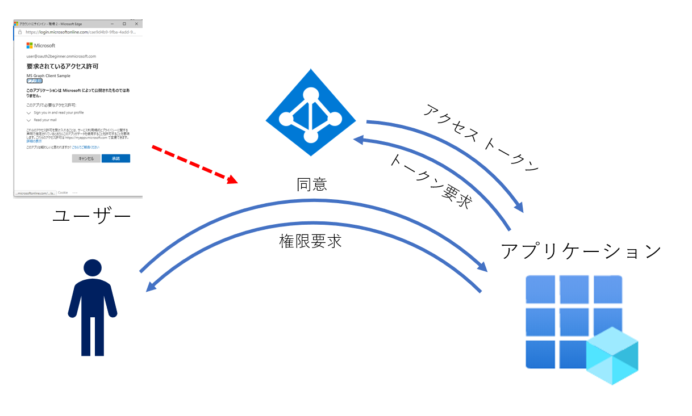
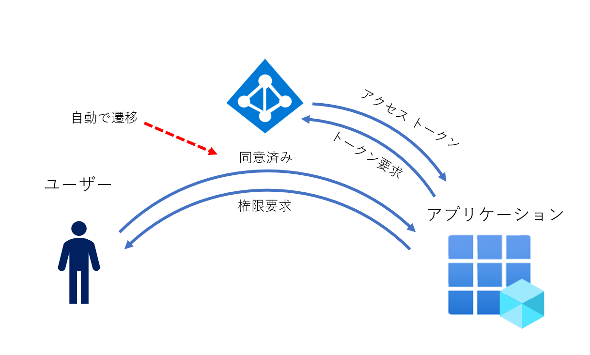
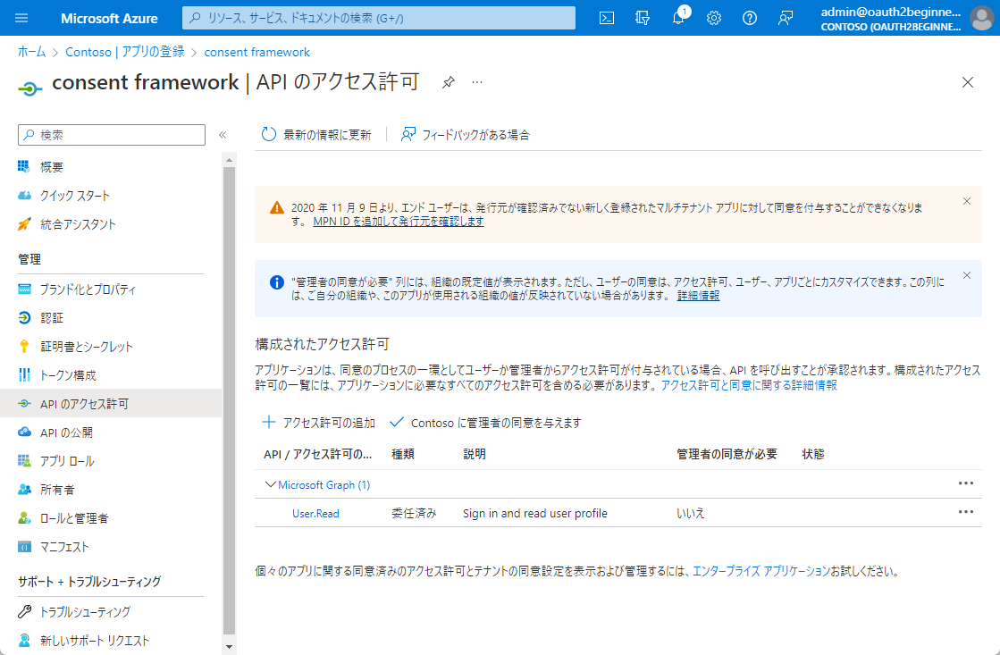
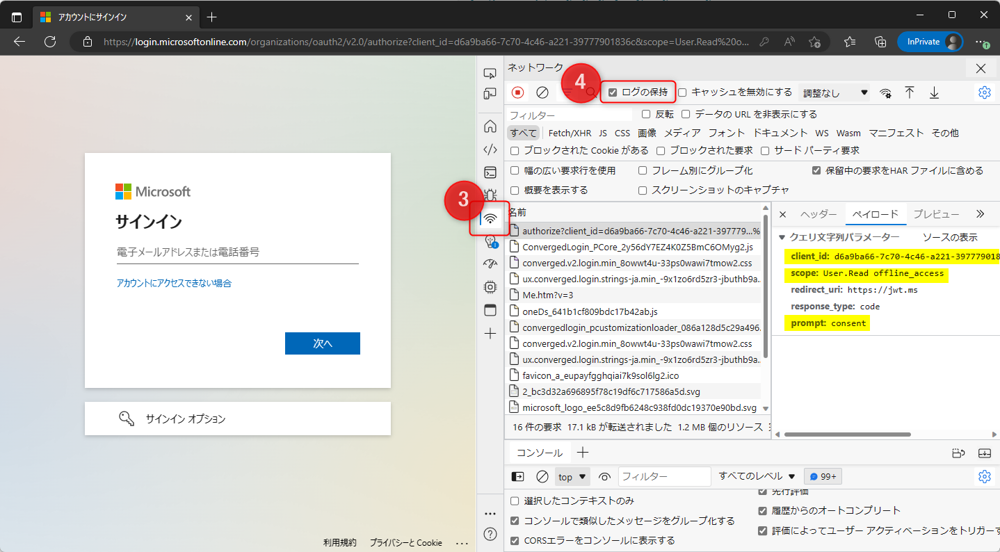
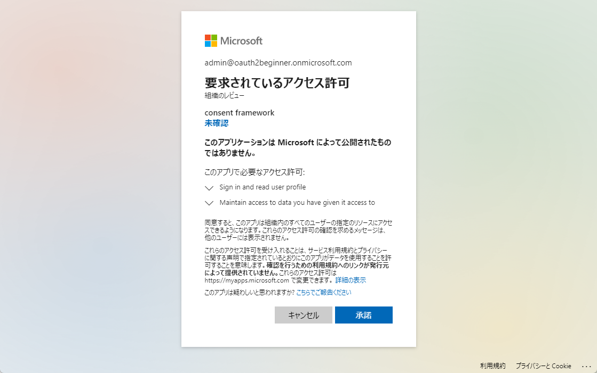

# 管理者の同意を実施したにも関わらず、「管理者の承認が必要です」の画面が表示される

こんにちは。Azure Identity チームの埴山です。
不正なアプリを利用した攻撃を防ぐ目的で、一般ユーザーによる同意を制限しているお客様から、管理者同意に関するお問合せを多く頂いております。

そこで以前、[「管理者の承認が必要」のメッセージが表示された場合の対処法](../azure-active-directory/azure-ad-consent-framework.md) という記事を書きました。
しかしながら記事を参考に管理者同意を実施したにもかかわらず、一般ユーザーがアプリにアクセスすると「管理者の承認が必要です」の画面が表示されるというお問合せをいただくことがございます。

アプリから想定外に同意要求がなされるのにはいくつかのパターンがあるのですが、いずれも「同意のフレームワーク」の仕組みについて理解が必要になります。
そこで今回の記事では、より技術的な視点で「同意のフレームワーク」がどのように動作するのか、想定外の同意要求はどのようにして発生するのか解説し、その対処方法をご案内します。

## アプリが権限を要求する際の流れ

具体的なパターンを説明する前に、まずはアプリが実際にリソースへの権限を取得する流れを説明します。

### 同意の流れ

サードパーティー製のアプリが、Azure AD で保護されたリソースにアクセスを行う場合、概ね以下のような流れになります。

1. アプリが Azure AD の認可 (authorize) エンドポイントにアクセスし、ユーザーの同意を得る
1. 同意を得た結果 (authorization code) が Azure AD からアプリに返却される
1. 同意を得た結果 (authorization code) を元にアクセス トークンを取得する
1. アクセス トークンを利用し、保護されたリソース (API) の呼び出しを実施する (図では省略)
 


>[!NOTE]
> 認証部分は省略しており、サインイン済みの状態を想定しています

アプリは 1 の Step で動作に必要な権限を指定します。以前の記事で説明した通り、権限は scope と呼ばれる単位で管理されており、たとえばメール データを取得するアプリであれば `Mail.Read` を scope に指定しユーザー同意を得る必要があります。

## 認可リクエストの詳細

同意要求は Azure AD の認可 (authorize) エンドポイントを介して実施されます。具体的には、以下のエンドポイントに対し GET リクエストを送信することで、サインイン ユーザーに対し同意要求を実施することが可能です。

- `https://login.microsoftonline.com/{tenant}/oauth2/v2.0/authorize`

実際には上記の URL にアクセスするだけでは、「どのアプリ」が「どのような権限」を求めているか分かりません。オプショナルなパラメーターを除き、最低限必要なパラメーターを含めたリクエストの例は以下の通りです。

- `https://login.microsoftonline.com/organizations/oauth2/v2.0/authorize?client_id=d6a9ba66-7c70-4c46-a221-39777901836c&scope=Mail.Read&redirect_uri=https%3A%2F%2Fjwt.ms&response_type=code&etc...`

URL の末尾 ? から後のクエリ パラメーターは、`=` で繋がれた Key, Value 形式になっていますが、同意のフレームワークで重要なのは特に以下パラメーターです。

| パラメーター | 意味 | 例 |
| :--- | :--- | :---|
| client_id | アクセス権を要求しているアプリのアプリケーション ID |d6a9ba66-7c70-4c46-a221-39777901836c |
| scope | アプリが要求している権限 | Mail.Read |

ここでは `d6a9ba66-7c70-4c46-a221-39777901836c` のアプリが `Mail.Read` の権限を求めていることが分かります。

## 要求を受け取ったユーザーが出来ること

ユーザーが自身で同意が出来る場合には、同意画面が表示されます。ユーザーの同意が完了するとアプリは同意された API のアクセス許可の範囲で、ユーザーの代わりに API アクセスが出来るようになります。



一方で、ユーザーが自身で同意できない場合には、管理者の承認が必要の画面が表示され、アプリへのアクセスがブロックされます。ユーザーがどのような条件で同意できるかについては、[以前の記事](../azure-active-directory/azure-ad-consent-framework.md)で解説をしていますので、そちらを確認してください。

ポイントとして押さえておいていただきたい点としては、ユーザーが `Mail.Read` に同意済み、あるいは管理者がユーザーの代わりに同意済みの場合には、同意画面は**再度現れることは無く**、トークンの発行まで完了する点です。



つまり、ユーザー同意を制限している環境においても、管理者同意が完了しているアプリに対しては、同意画面は二度と表示がされないはずです。
しかしいくつかのシナリオにおいては、ユーザー同意が要求され「管理者の承認が必要です」の画面が表示されてしまいます。

## 管理者の同意を実施したのにユーザー同意が要求される 3 つのパターン

では、どのようなパターンでユーザー同意が要求されてしまうのでしょうか。結論から言うと、以下の 3 つのパターンが挙げられます。

1. アプリが同意要求に `prompt=consent` クエリ パラメーターを付与している
1. アプリがすでに同意済みの権限以外の API のアクセス許可を要求している
1. 静的な同意と動的な同意の差異により、必要な権限に同意が出来ていない

それぞれのパターンについて説明します。 

### 1. アプリが同意要求に `prompt=consent` クエリ パラメーターを付与している

ユーザーまたは管理者が同意済みにも関わらず、毎回同意画面が出てしまう要因として考えられるのが、`prompt=consent` パラメーターです。
アプリは認可エンドポイントへのアクセス時に様々な[オプション パラメーター](https://learn.microsoft.com/ja-jp/azure/active-directory/develop/v2-oauth2-auth-code-flow#request-an-authorization-code)を付与することができますが、`prompt` パラメーターは認可リクエスト時に表示される対話画面を指定します。

`prompt` パラメーターにより、資格情報の再入力を強制したり、対話的なサインイン画面を省略することを試みたりすることができますが `prompt=consent` パラメーターはユーザー同意を再度実施するよう強制します。
管理者の同意が実施済みであっても、`prompt=consent` パラメーターが付与されている場合には、必ず同意画面を表示しようと試みるため、ユーザー同意が制限されている環境では「管理者の承認が必要です」のエラー画面が表示されることになります。

ユーザー同意が制限された環境では `prompt=consent` パラメーターが付与された同意要求をユーザーが処理することは不可能ですので、ユーザー同意を許可するようテナントの構成を変更するか、アプリが `prompt=consent` パラメーターを送信しないように改修する必要があります。サードパーティー製アプリの場合には、アプリの開発元にご確認ください。

パラメーターにより同意画面が表示されているかは、アプリへのアクセス時の通信トレースを確認することで判別できます。Web アプリの場合にはアクセス時にブラウザーの開発者ツール (F12 トレース) を確認することで、authorize エンドポイントへの要求を確認することが可能です。

開発者ツールの簡単な使い方と同意要求の解析方法は本ブログの[付録](#付録)にまとめましたので参考にしてください。

### 2. アプリがすでに同意済みの権限以外の API のアクセス許可を要求している

Azure AD の同意フレームワークでは「増分および動的な同意」がサポートされています。これは、アプリが必要なタイミングで、必要な権限を要求できるようになる仕組みで、例えば以下のような実装が考えられます。

アプリは基本的にユーザーのメールボックスと連携するため `Mail.Read` の権限を要求するが、追加の機能を有効化することで取得したメールの添付ファイルを SharePoint Online に保存が出来る。機能を有効化する際には追加で `Files.ReadWrite` の権限を要求する。

このように「増分および動的な同意」の機能により、アプリは必要に応じて、必要なタイミングで同意を要求することが可能です。アプリが最初に要求し同意済みの権限とは別に、追加の権限を要求した場合、そのタイミングでユーザー同意が要求されます。ユーザー同意が制限されている場合には、「管理者の承認が必要です」の画面が表示されます。

対処方法は 「3. 静的な同意と動的な同意の差異により、必要な権限に同意が出来ていない」のシナリオと同様なので、[動的な権限要求に対して同意を実施する](#動的な権限要求に対して同意を実施する) を確認ください。

### 3. 静的な同意と動的な同意の差異により、必要な権限に同意が出来ていない

本パターンは、本質的には「アプリがすでに同意済みの権限以外の API のアクセス許可を要求している」と同じ要因ですが、特にお問合せを頂くことが多いため、個別に説明します。

ここまで説明した「増分および動的な同意」機能は柔軟な権限要求を実装でき、アプリの機能拡張などをしやすくするメリットがあります。ただ動的な要求が出来る性質上、**同意を実施するまでは本当にアプリの動作に必要な権限が分かりません。**
これは実際に**アプリを利用するタイミングでしか必要な権限が何か分からない**ことを意味しています。

> [!NOTE]
> 正確にはアプリが authorize エンドポイントに認可リクエストを送信する際、必要な API のアクセス許可として指定する scope パラメーターを確認するまで、動的なアクセス許可が特定できません

この性質により、**実際のアプリの利用時**以外に同意を実施した際に、本当に必要な権限に同意が出来ないことがあります。より具体的には、エンタープライズ アプリケーションのアクセス許可から管理者の同意を付与するパターンでは動的に要求される権限に同意が出来ずに問題となる場合があります。

#### Azure ポータル上から実施するアクセス許可への同意

Azure ポータルのエンタープライズ アプリケーションから、登録されたアプリを選択し [アクセス許可] ブレードに移動すると、管理者同意を実施するボタンがあります。

[「管理者の承認が必要」のメッセージが表示された場合の対処法](../azure-active-directory/azure-ad-consent-framework/#パターン-1-アプリケーションに管理ユーザーでアクセスを行い、組織の代理として同意するにチェックをいれて同意を付与する) では、実際にグローバル管理者権限でアプリにサインインを実施し、同意画面で要求された権限に対し [組織の代理として同意する] 方法をお勧めしました。
しかし [組織の代理として同意する] にチェックをつけ忘れて承諾した場合、グローバル管理者はユーザー同意を完了させますので、その後アプリが同じ権限のみを求める限り、二度と同意画面が表示されることはありません。

その際の代替方法として、エンタープライズ アプリケーションの [アクセス許可] ブレードから管理者の同意を付与する方法を紹介しました。


上記の [Contoso に管理者の同意を与えます] ボタンをクリックすることで、要求された権限が表示され管理者同意を実施できます。

前述の通り、アプリが要求している権限はアプリへのアクセス時にしか分かりません。しかし、エンタープライズ アプリケーションの [アクセス許可] ブレードからの同意ではアプリにアクセスせず Azure ポータル上で処理が完結します。
Azure ポータル上では一体何の権限に同意しているのでしょうか。

#### 静的なアクセス許可

結論から言うと、エンタープライズ アプリケーションの [アクセス許可] ブレードの同意ボタンでは、アプリケーション開発者が設定した [静的なアクセス許可] に同意します。

アプリの開発者はアプリの開発テナントに登録されたアプリケーション オブジェクトに、あらかじめ必要と考えられる API のアクセス許可、静的なアクセス許可 (構成されたアクセス許可) を定義しておくことが可能です。



事前定義された API のアクセス許可は、以前のバージョンである Azure AD の v1.0 エンドポイントを利用する際に利用されますが、現在主流の v2.0 エンドポイントではほとんど利用されません。

しかしながら Azure ポータルからアプリに同意を付与する場合には、何の権限に同意すれば良いのかの情報がないため、v1.0 エンドポイントで利用されていた  [静的なアクセス許可] に同意が付与されます。

結果として、アプリの開発者がアプリの実装時に動的に求める権限 (scope パラメーター) と、Azure AD にあらかじめ登録された [静的なアクセス許可] に差異が生じることがあります。

例えばアプリ上では `Mail.Read` の権限を動的に要求しているのにもかかわらず、[静的なアクセス許可] には `User.Read` のみが設定されていた場合、いくら Azure ポータル上で管理者同意を実施しても `User.Read` にしか管理者同意が付与されません。そのため、一般ユーザーが `Mail.Read` の権限を動的に要求しているアプリにアクセスした際には、ユーザー同意が求められ、ユーザー同意が制限された環境では「管理者の承認が必要です」のエラーが表示されることが想定されます。

>[!NOTE]
> 現在 Azure AD の同意フレームワークでは「増分および動的な同意」がサポートされていますが、以前からサポートされていたわけではありません。
> 現在 Azure AD の同意エンドポイントは、MSAL ライブラリでも利用され、主流の v2.0 エンドポイントと、ADAL ライブラリで利用されていた旧来の v1.0 エンドポイントの 2 種類があります。
> v1.0 のエンドポイントではあらかじめアプリの動作に必要な API の権限を定義しておき、定義された権限にのみ同意を実施する「静的な同意」のみをサポートしていました。

### 動的な権限要求に対して同意を実施する

2, 3 で紹介した差分同意や動的な権限要求を実施するアプリに対しては、**実際にアプリを利用する**タイミングで求められた権限に同意を実施する必要があります。一つの方法が前回のブログで紹介したグローバル管理者でサインインを実施し [組織の代理として同意する] オプションにチェックを付けたうえで同意を行う方法です。[組織の代理として同意する] にチェックを付け忘れて同意を実施した場合には、エンタープライズ アプリを削除するなどして同意を取り消し、再度同意画面を表示させるという方法が考えられます。

他の方法としては [管理者の同意ワークフロー](https://learn.microsoft.com/ja-jp/azure/active-directory/manage-apps/configure-admin-consent-workflow) を構成いただくことで**ユーザーがアプリ利用時に求められた権限**を把握し、管理者が同意することが可能です。管理者の同意ワークフローではグローバル管理者以外のユーザーでも同意が可能なため、柔軟な運用が可能になります。

さらに細かい制御を実施したり、特定の権限にのみ同意を実施する方法は、後述の付録をご確認ください。

## 付録

[組織の代理として同意する] チェックボックスでの同意や、管理者の同意ワークフローを利用できない場合、あるいは管理者の同意ではなく特定ユーザーにのみ同意を付与したい、といったシナリオではアプリが求めている API のアクセス許可を正確に把握する必要が出てきます。その際に有効なツールがブラウザーの開発者ツール (F12 トレース) です。

### F12 トレースの確認方法

採取の仕方はブラウザーによって細かな違いがありますが、概ね以下の通りです。

1. ブラウザーを開きます。
2. F12 を押し、開発者ツールを起動します。
3. [ネットワーク タブ] を選択します。
4. "ログの保持" にチェックが入った状態 (有効) にします。
5. 同意を行うアプリにアクセスし組織アカウントでのサインインを実施します。



採取した通信のうち、`https://login.microsoftonline.com/organizations/oauth2/v2.0/authorize` へのアクセスを探し、ペイロードのクエリ文字列パラメーターを確認することで、authorize エンドポイントに対するリクエストの内容が分かります。

上記の例では `client_id` (アプリケーション ID) が `d6a9ba66-7c70-4c46-a221-39777901836c` のアプリが権限を要求していること、`scope` として `User.Read offline_access` が要求されていること、`prompt` として `consent` が指定されているため、明示的な再同意が求められていることが確認できます。

なお上記のログは、ダウンロード ボタン (↓) を選択することで har ファイルとしてダウンロード頂けます。サポート サービスをご利用いただく場合には、調査に有用な情報となりますので、問い合わせの際には添付いただくことをお勧めします。

### 管理者の同意エンドポイント

具体的なアプリケーション ID と求められている権限が分かれば、管理者の同意を付与するためのリンクを作成することが可能です。

[管理者の同意エンドポイント (v2.0)](https://learn.microsoft.com/ja-jp/azure/active-directory/develop/v2-admin-consent) は、以下のような形式の URL です。

```http
GET https://login.microsoftonline.com/{tenant}/v2.0/adminconsent
        ?client_id={client_id}
        &scope={scope}
        &redirect_uri={redirect_uri}
        &state=12345
```

`client_id` と `scope` は `redirect_uri` はトレースなどで得られた値を指定します。`tenent` は GUID または <初期ドメイン>.onmicrosoft.com などのドメイン名を指定します。
たとえば、先ほどの F12 トレースで解析したアプリに対し、管理者同意を実施するには以下のような URL を組み立ててクラウド アプリケーション管理者などの管理者アカウントでアクセスします。

```http
GET https://login.microsoftonline.com/oauth2beginner.onmicrosoft.com/v2.0/adminconsent
        ?client_id=d6a9ba66-7c70-4c46-a221-39777901836c
        &scope=User.Read%20offline_access
        &redirect_uri=https%3A%2F%2Fjwt.ms
        &state=12345
```

管理者アカウントでアクセスした場合には、以下のような同意画面が表示され管理者の同意を実施できます。



同意が正常に完了すると、redirect_uri に指定した URL に以下のような応答が返却されます。

```http
https://jwt.ms
    ?admin_consent=True
    &tenant={tenant-gui}
    &scope={scope}
    &state=12345
```

リダイレクト URI には Azure ポータルの同意ボタンで利用される `https://portal.azure.com/TokenAuthorize` を指定しても構いません。

### 特定のユーザーに対しての同意を管理者が実施する

アプリが求めている権限が分かれば、[PowerShell を使用して 1 人のユーザーに代わって同意を許可する](https://learn.microsoft.com/ja-jp/azure/active-directory/manage-apps/grant-consent-single-user?pivots=msgraph-powershell) のように、特定のユーザーの代わりに管理者が同意することも可能です。
通常アプリに対するユーザーの制限は [ユーザーの割り当てが必要ですか？](https://learn.microsoft.com/ja-jp/azure/active-directory/develop/howto-restrict-your-app-to-a-set-of-users) のオプションを [はい] に設定し、アクセスを許可するユーザーを割り当てることが適切です。

一方で、ユーザーにより付与したい権限が変わるようなシナリオでは個別のユーザー同意を付与する API を利用できます。たとえば Microsoft Graph SDK や Microsoft Graph Explorer など、付与する権限によって出来ることが変わるアプリに対し、特定のユーザーにはサインイン ログが見れるアクセス許可を、特定のユーザーにはユーザー一覧が取得できるアクセス許可を付与するといったことが可能です。

### Microsoft Graph SDK のサンプル

以下にユーザー委任のアクセス許可に関する PowerShell のサンプルを記載します。

#### 特定アプリに対し 1 人のユーザーに変わって同意を許可

[PowerShell を使用して 1 人のユーザーに代わって同意を許可する](https://learn.microsoft.com/ja-jp/azure/active-directory/manage-apps/grant-consent-single-user?pivots=msgraph-powershell) を参照ください。

#### 特定アプリに実施した同意情報を取得

```powershell
# クラウド アプリケーション管理者権限でサインイン
Connect-MgGraph -Scope "Application.Read.All,DelegatedPermissionGrant.ReadWrite.All"
 
# 権限を割り当てたアプリのサービス プリンシパル オブジェクトの取得
$sp = Get-MgServicePrincipal -Filter "appId eq '<AppId>'"

# 付与された同意情報を取得
$delegatedPermissions = Get-MgOauth2PermissionGrant -Filter "clientId eq '$($sp.Id)'"

$delegatedPermissions | Format-List Id, ConsentType, PrincipalId, ResourceId, Scope

# ClientId             : クライアント アプリの "オブジェクト ID" (ClientID ではない)
# Id                   : Oauth2PermissionGrant オブジェクトの ID
# ConsentType          : 管理者同意の場合 AllPrincipals, ユーザー同意は Principal
# PrincipalId          : ユーザー同意の場合のユーザー オブジェクト ID
# ResourceId           : リソースのオブジェクト ID
# Scope                : 同意済みの API のアクセス許可のリスト
```

#### 特定アプリに対する管理者同意を含むすべてのユーザー委任の同意を削除

```powershell
# クラウド アプリケーション管理者権限でサインイン
Connect-MgGraph -Scope "Application.ReadWrite.All,DelegatedPermissionGrant.ReadWrite.All"
 
# 権限を割り当てたアプリのサービス プリンシパル オブジェクトの取得
$sp = Get-MgServicePrincipal -Filter "appId eq '<AppId>'"

# 付与された同意を取得
$delegatedPermissions = Get-MgOauth2PermissionGrant -Filter "clientId eq '$($sp.Id)'"

# 付与された同意を削除
$delegatedPermissions | ForEach-Object{ Remove-MgOauth2PermissionGrant -OAuth2PermissionGrantId $_.Id } 
```

#### 特定アプリに対する 1 人の特定ユーザー委任の同意のみを削除

```powershell
# クラウド アプリケーション管理者権限でサインイン
Connect-MgGraph -Scope "User.ReadBasic.All,Application.ReadWrite.All,DelegatedPermissionGrant.ReadWrite.All"

$userUpnOrId = "user@example.com"

# ユーザーのオブジェクト ID を取得
$user = Get-MgUser -UserId $userUpnOrId

# 権限を割り当てたアプリのサービス プリンシパル オブジェクトの取得
$sp = Get-MgServicePrincipal -Filter "appId eq '<AppId>'"

# 付与された同意を取得
$delegatedPermissions = Get-MgOauth2PermissionGrant -Filter "clientId eq '$($sp.Id)' and principalId eq '$($user.Id)'"

# 付与された同意を削除
$delegatedPermissions | ForEach-Object{ Remove-MgOauth2PermissionGrant -OAuth2PermissionGrantId $_.Id } 
```

#### 特定アプリに対する管理者の同意のみを削除

```powershell
# クラウド アプリケーション管理者権限でサインイン
Connect-MgGraph -Scope "Application.ReadWrite.All,DelegatedPermissionGrant.ReadWrite.All"
 
# 権限を割り当てたアプリのサービス プリンシパル オブジェクトの取得
$sp = Get-MgServicePrincipal -Filter "appId eq '<AppId>'"

# 付与された管理者同意を取得
$adminConsents = Get-MgOauth2PermissionGrant -Filter "clientId eq '$($sp.Id)' and consentType eq 'AllPrincipals'"

# 付与された管理者同意を削除
$adminConsents | ForEach-Object{ Remove-MgOauth2PermissionGrant -OAuth2PermissionGrantId $_.Id }
```

#### 特定アプリに付与した管理者の同意のうち、一部の API のアクセス許可のみを削除

例えば "openid profile User.Read Mail.Read" から、 "User.Read Mail.Read" のみを削除する

```powershell
# クラウド アプリケーション管理者権限でサインイン
Connect-MgGraph -Scope "Application.ReadWrite.All,DelegatedPermissionGrant.ReadWrite.All"
 
# 権限を割り当てたアプリのサービス プリンシパル オブジェクトの取得
$sp = Get-MgServicePrincipal -Filter "appId eq '<AppId>'"

# 付与された管理者同意を取得
$adminConsents = Get-MgOauth2PermissionGrant -Filter "clientId eq '$($sp.Id)' and consentType eq 'AllPrincipals'"

# 削除したい管理者の同意を指定
$RemovePermissions = @("User.Read","Mail.Read")

# 削除したい管理者の同意を除く新しいスコープを定義
$scope = ($adminConsents.Scope.Split(" ") | Where-Object { -not ($RemovePermissions -ccontains $_)}) -join " "
              
# 新しいスコープで管理者の同意を更新
Update-MgOauth2PermissionGrant -OAuth2PermissionGrantId $adminConsents.id -Scope $scope
```
