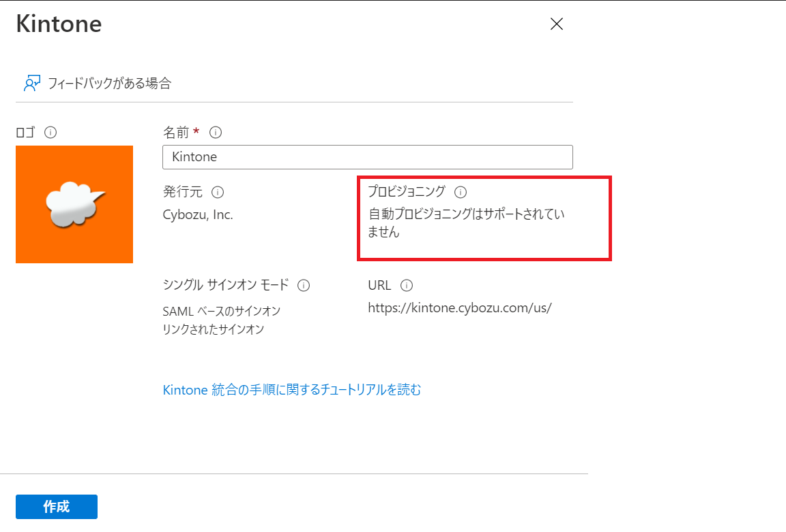
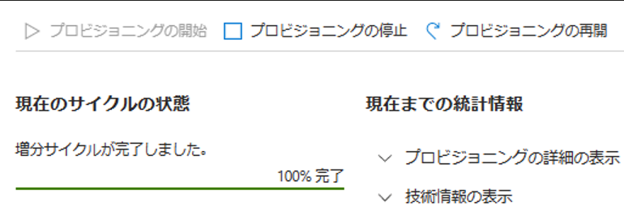
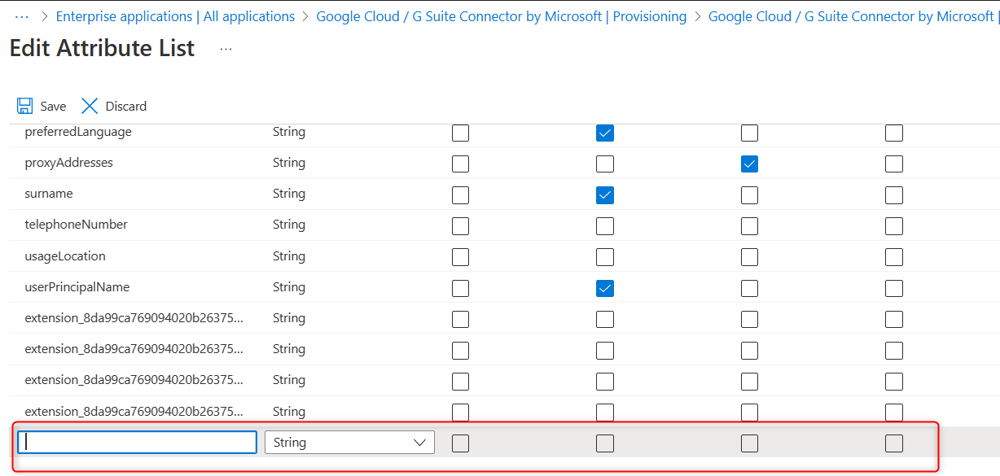
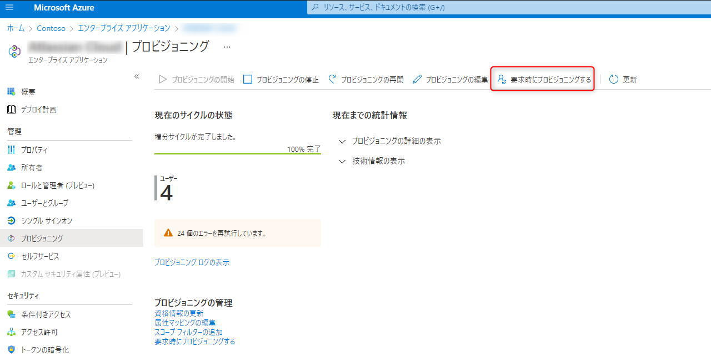

# プロビジョニングのよくあるお問い合わせ 2

こんにちは、 Azure & Identity サポート チームの星野です。
本記事では、以前公開された記事「[Azure AD のプロビジョニング機能について](../../azure-active-directory/azure-ad-provisioning.md)」で紹介されたお問い合わせに続いて、続編としてさらによくあるご質問に関しまとめています。

Azure AD  プロビジョニングの基本的な仕組みに関しては前述の記事にまとめられておりますので、本記事では機能概要の説明は控えます。
まずは基本的な動作を確認されたい、という方は前述の記事をご参照くださいますと幸いです。


## Azure AD プロビジョニングのよくあるお問い合わせ・ご質問


### プロビジョニング構成前

#### <span style="color: #ff0000; ">Q.</span> SaaS側でユーザ情報を変更すると Azure AD  にも反映されますか。
#### <span style="color: #3366ff; ">A.</span> SaaS 側の変更は Azure AD に反映されません。

SaaS 側でユーザーやグループといったオブジェクトを追加、更新、削除した場合であっても、Azure AD テナントにその情報が反映されることはありません。

Azure AD から同期を行っているユーザーは、SaaS アプリケーションの仕様によっては、SaaS 上で同期アカウントの管理ができず、同期元 ID プロバイダー (Azure AD) からの編集が必要です。

例えば Azure AD よりプロビジョニング同期を行っているアカウントを SaaS 側にて情報変更 (アカウント削除等) し同期に問題が出るお問い合わせが多く寄せられております。

SaaS の仕様で制限されていない場合であっても、同期をとっているアカウントは基本的に同期元で管理を行うという原則にご留意ください。

#### <span style="color: #ff0000; ">Q.</span> 対象のSaaS がAzure AD 自動プロビジョニングをサポートしているかわかりません。
#### <span style="color: #3366ff; ">A.</span> エンタープライズアプリケーションのギャラリーより自動プロビジョニングの対象アプリをご参照いただけます。

Azure AD にて用意されたエンタープライズアプリケーションでは基本的に自動プロビジョニングがサポートされていますが、アプリケーションによっては、自動プロビジョニングがサポートされておりません。

// 自動プロビジョニングがサポートされていない例


この場合はプロビジョニングを構成するために、カスタムアプリケーションを別途作成する必要があります。 
※カスタムアプリケーションは Azure AD ポータルより [Azure Active Directory] -> [エンタープライズアプリケーション] -> [独自のアプリケーションの作成] で作成します。
以下のように [テナントの URL] には SaaS アプリケーション側の SCIM API エンドポイント URL を登録し、[シークレット トークン] には本 API にアクセスするための Bearer トークンを登録します。


#### <span style="color: #ff0000; ">Q.</span> 同期したいオブジェクトの数が大規模 (10 万程度) になる予定です。ベストプラクティスはありますか。
#### <span style="color: #3366ff; ">A.</span> グループ割り当てでの管理がおすすめです。

プロビジョニングの対象範囲として「割り当てられたユーザーとグループのみ同期」に設定のうえ、ユーザーを直接割り当てるのではなく、ユーザーをまとめたグループをいくつか割り当てる方式がおすすめです。※ グループの割り当ては Azure AD Premium ライセンス プランが必要です。詳しくはこちらをご覧ください。

理由としては、グループを使用せずユーザ―を個別に割り当てることによって同期サイクル時、Azure AD の動作仕様上発生する読み込みの処理が速くなったり、プロビジョニング対象数の管理が容易となる点より、グループ割り当てでの管理を推奨しております。

ベストプラクティスは部署やロールといったユーザーの共通項ごとにいくつかのグループにまとめそれらを割り当てることとなりますが、1 つのグループに 10 万のユーザーをまとめそれを割り当てるだけでも同期処理の遅延防止に効果的です。


### プロビジョニング構成時


#### <span style="color: #ff0000; ">Q.</span> プロビジョニングの開始、停止、再開の違いは何ですか。
#### <span style="color: #3366ff; ">A.</span> プロビジョニングを構成し有効化すると初回の同期サイクルが開始します。

これが完了するとその後、定期間隔にて後続の増分サイクルが行われます。このサイクルでは前回のサイクルから変更があったオブジェクトを評価します。
この稼働し続ける同期サイクルを途中で停止するのが [プロビジョニングの停止] です。
また、停止している同期サイクルを停止を行った時点から再開するのが [プロビジョニングの開始] です。

一方で [プロビジョニングの再開] を押下するとプロビジョニングの対象となっているオブジェクトすべてを改めて評価する初回サイクルが実施されます。
※ プロビジョニングの再開による初回サイクルを実施しても、ターゲットシステム 側の情報が初期化される等は発生いたしません。
※ 評価対象が増分サイクルよりも多い分、一度のサイクルに増分サイクルよりも長い時間を要します。

プロビジョニングを停止した状態でプロビジョニングの再開を行うと、停止された位置はクリアされ 1 から全ての対象オブジェクトの評価が行われる点が、 [プロビジョニングの開始] とは異なります。



#### <span style="color: #ff0000; ">Q.</span> 同期したい Azure AD 属性がマッピングの候補にありません。候補がない属性についてはマッピングはできないのでしょうか？
#### <span style="color: #3366ff; ">A.</span> 下記手順でマッピング可能な属性が追加可能です。

プロビジョニングの属性マッピングにおける詳細オプションにつきましては、下記 Azure ポータルの URL に接続することで、編集可能となります。

#### マッピング追加手順

1. 以下のパラメーター付き URL を使用して Azure Active Directory ポータルにサインインします。

https://portal.azure.com/?Microsoft_AAD_Connect_Provisioning_forceSchemaEditorEnabled=true
	
2. [Azure AD] -[エンタープライズアプリケーション] - [任意のアプリケーション] - [プロビジョニング] - [プロビジョニングの編集] -[Provision Azure Active Directory Users] - [詳細オプションの表示] にチェックを選択します。
	
3. [Azure AD の属性リストを編集します] をクリックします。

4.  属性リストの下部にあるフィールドに、追加したい属性に関する情報を入力します。


5. ［保存］を選択し変更を保存します。マッピング設定に戻り、4 で追加した属性を使用して SaaS 側の任意の属性とマッピングを設定します。その後問題なく追加した属性が SaaS 側の設定した属性にて問題なく同期されているかご確認ください。


また、[こちら](https://learn.microsoft.com/ja-jp/azure/active-directory/app-provisioning/user-provisioning-sync-attributes-for-mapping#create-an-extension-attribute-in-a-tenant-with-cloud-only-users) の公開情報に記載の通りテナント上のサービスプリンシパルの数が 1,000 を超える場合、プロビジョニング設定のソース属性の一覧にディレクトリ拡張属性 (AADC を使って拡張した拡張属性など) が含まれないことがございます。
この場合も上記の手順で手動で対象のディレクトリ拡張属性をソース属性としてご追加ください。


### プロビジョニング開始後


#### <span style="color: #ff0000; ">Q.</span> ログを確認していると、エンタープライズアプリへ割り当てていないユーザーに対して処理が実行されていました（結果は Skipと判定)。
#### <span style="color: #3366ff; ">A.</span> 想定された動作となります。

Azure AD プロビジョニング機能では、テナント上で情報変更が発生した全てのユーザー（プロビジョニングの範囲外であっても）の情報をトレースする動作があります。その結果監査ログにはエンタープライズアプリへ割り当てていないユーザーに対して処理が実行されたようなログが記録されます。

トレースして検知したユーザー情報の変更について、もし該当のユーザーがプロビジョニングの対象であった場合は、実際の同期処理 (Export など) を進めます。一方で、スコープ外のユーザーは Skip されエクスポートはされませんため、実影響はありません。

本事象は後続の増分同期だけでなく初回同期でも同様に発生することが報告されており、よくあるお問い合わせとして「[Azure AD のプロビジョニング機能について](../../azure-active-directory/azure-ad-provisioning.md)」のブログ記事内にて解説されています。
 

#### <span style="color: #ff0000; ">Q.</span> ユーザーの変更を即時で反映したいです。
#### <span style="color: #3366ff; ">A.</span> 「要求時にプロビジョニングする」をクリックし、オンデマンドで任意のユーザー/ グループを同期できます。

自動プロビジョニングを設定しているエンタープライズ アプリケーションでは、画面キャプチャの赤枠に [要求時にプロビジョニングする] ボタンが表示されます。



こちらを実行することで、現在実行されているプロビジョニングサイクルの完了を待たずに適宜手動でプロビジョニングを実施可能です。
※ 一度に複数のユーザー/ グループは選択できません。


#### <span style="color: #ff0000; ">Q.</span> プロビジョニング対象外としたユーザーが SaaS からアカウントが削除されません。
#### <span style="color: #3366ff; ">A.</span> SaaS 側にてアカウントが非有効化されていないかご確認ください。

Azure AD にてアカウントが [削除済みユーザー一覧] に移ったり、プロビジョニングの割り当て対象から解除された場合、アカウントは論理的な削除状態として扱われます。

ユーザーが論理的な削除状態に移ると、Azure AD より SaaS へアカウントが非有効化された旨をアップデートするためのリクエストがへ送信されます。

ただし、Azure AD から該当ユーザーに対する変更リクエストを、ターゲットシステムがどのように受け取るかはターゲットシステム側の動作に依存します。

例えば、ある SaaS ではリクエストを受け取るとターゲットシステム側でアカウントを非有効化する、
また別の SaaS ではアカウントを非有効化しつつ、UPN を Azure AD より送信された最新の UPN に変更する等がございます。

そのため、Azure AD にてアプリから割り当てを解除したり、削除済みに移ったユーザーの SaaS 側での挙動に関しましては、実際にご検証をいただくもしくは、ご利用の SaaS へお問い合わせをしていただく等による確認が必要となります。

また [削除済みユーザー一覧] よりアカウントを完全に削除した場合、アカウントは完全な削除状態となります。
アカウントが完全に削除された際はその旨リクエストが送信され、SaaS 側でもアカウントが削除されることが想定されます。


#### <span style="color: #ff0000; ">Q.</span> エラーコード 'Bad credentials' が表示されプロビジョニングが検疫になっています。
#### <span style="color: #3366ff; ">A.</span>  Azure AD  プロビジョニングではSaaS 側へ送信したリクエストが常に失敗する場合、プロビジョニング ジョブが検疫状態となります。

検疫中は増分サイクルの頻度が徐々に減少し、最終的には 1 日 1 回になります。

エラーコード 'Bad credentials' が表示されている場合は、Azure AD から SaaS へプロビジョニングを行う際に必要となる Azure AD 側で保持しているトークンに問題がある状況が考えられます。
 

エラーメッセージ例:
```CMD
"Bad credentials"
While attempting to validate our authorization to access your application, we received this unexpected response.
```

この場合の対処策は、上記のトークンを新しく取得するため Azure AD 側でユーザー プロビジョニングを構成する際に、Azure AD 側で入力する SaaS側の管理者の資格情報の入力について改めて再構成することで、検疫状態が解消されプロビジョニングが動作できる可能性が考えられます。

プロビジョニングの検疫に関する詳細は、[こちら](https://learn.microsoft.com/ja-jp/azure/active-directory/app-provisioning/application-provisioning-quarantine-status)もご確認ください。

#### <span style="color: #ff0000; ">Q.</span> 上記の FAQ で解決しない。
#### <span style="color: #3366ff; ">A.</span>  Azure サポートの活用を検討ください。一般的に調査の際には次のような情報が必要です。

詳細はお問い合わせの後でご案内を差し上げておりますが、現象の発生タイミング、発生頻度に関する情報と併せまして事前に用意いただければと存じます。

	1. テナント ID ([Azure Active Directory] - [プロパティ] - [ディレクトリ ID] より確認可能です)
	2. プロビジョニングのジョブ ID もしくはアプリケーションの ID 


ご不明な点等がありましたら、ぜひ弊社サポート サービスをご利用ください。
※本情報の内容（添付文書、リンク先などを含む）は、作成日時点でのものであり、予告なく変更される場合があります。
