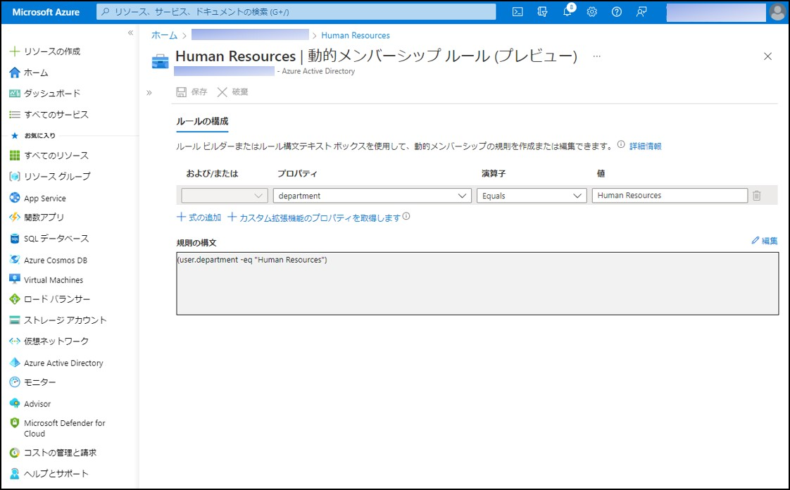

---
title: Azure AD RBAC : ユーザーおよびデバイス用の動的な管理単位がパブリック プレビューとなりました
date: 2022-05-09 09:00
tags:
  - Azure AD
  - US Identity Blog
---

# ユーザーおよびデバイス用の動的な管理単位がパブリック プレビューとなりました

こんにちは、Azure Identity サポート チームの 村上 です。

本記事は、2022 年 4 月 12 日に米国の Azure Active Directory Identity Blog で公開された [Azure AD RBAC: Dynamic administrative units now in public preview for users & devices](https://techcommunity.microsoft.com/t5/azure-active-directory-identity/azure-ad-rbac-dynamic-administrative-units-now-in-public-preview/ba-p/3185207) を意訳したものになります。ご不明点等ございましたらサポート チームまでお問い合わせください。

---

皆さん、こんにちは。

Azure Active Directory (以下 Azure AD) のロールベース アクセス コントロール (RBAC) の一連の発表の一部として、動的な管理ユニットのパブリック プレビューをご案内できることを嬉しく思っています。

[動的な管理単位](https://docs.microsoft.com/ja-jp/azure/active-directory/roles/admin-units-members-dynamic) を使用すると、管理単位のメンバーシップを手動で管理する必要がなくなります (もしくは、メンバーシップを管理するための独自の自動化の仕組みを作る必要もなくなります)。代わりに、Azure AD では、ユーザーまたはデバイスの属性に基づいてクエリを指定し、手動で管理することなく、メンバーシップを維持することができるようになります。

これらの新しい機能を使ったシナリオをいくつかご紹介いたします。

[動画 : ユーザー向け動的な管理単位](https://youtu.be/rqbCjzIQ_gA)

また、RBAC に関連する他の発表内容は、以下からご覧いただけます。

- [Azure AD RBAC - デバイス用のカスタム ロールと管理単位が利用可能に](https://jpazureid.github.io/blog/azure-active-directory/azure-ad-rbac-custom-roles-amp-administrative-units-for-devices/)
- [Azure AD RBAC でアプリ管理用のカスタム ロールが利用可能になりました](https://jpazureid.github.io/blog/azure-active-directory/custom-roles-for-app-management-now-available/)

## ユーザー メンバーシップを簡単に管理するためのルールを作成する

動的メンバーシップ ルールを作成するには、管理単位に移動して、**プロパティ** タブをクリックします。この例では、Human Resources 部門を表す管理ユニットを作成しています。

**プロパティ** ブレードで、**メンバーシップの種類** を **動的ユーザー** に設定します。次に、**動的クエリ**の追加をクリックして、動的ルールを作成します。

ここでは、ルール ビルダーを使用して、部署が「Human Resources」であるすべてのユーザーを含む、基本的なルールを作成しています。動的グループに使用するのと同じ構文を使用して、より複雑なルールを作成することもできます (作成方法の詳細については、[このページ](https://docs.microsoft.com/ja-jp/azure/active-directory/enterprise-users/groups-dynamic-membership) を参照ください)。

ルールを作成したら、**保存** をクリックして、ルールの構文を保存します。次に、プロパティ ブレードでもう一度 **保存** をクリックして、管理単位へのメンバーシップの変更を保存します。動的グループの処理エンジンが、ルールに一致するユーザーを、数分以内に管理単位に反映するよう動作します。

**ロールと管理者** タブに移動して管理ロールを管理単位に付与すると、動的メンバーシップの処理エンジンによって、スコープが自動的に更新されるようになります。

今回の例では、Human Resources 管理単位に **パスワード管理者** ロールを割り当てて、Human Resources 部門の従業員のパスワードを管理する権限を委譲しています。

## 今後の予定

今後は、ひとつの動的な管理単位においてユーザーとデバイスの両方をサポートし、動的なクエリを構築する際に利用可能な追加のプロパティを提供することを検討しています。また、管理単位とカスタム ロールに関連する Azure AD RBAC の領域で、より素晴らしい機能を実現するために取り組んでいます。今後のアナウンスにご期待ください。

Alex Simons (Twitter: [@Alex_A_Simons](https://twitter.com/Alex_A_Simons))  
Corporate VP of Program Management  
Microsoft Identity Division

