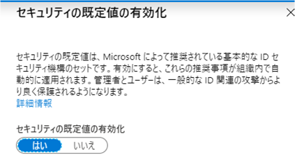
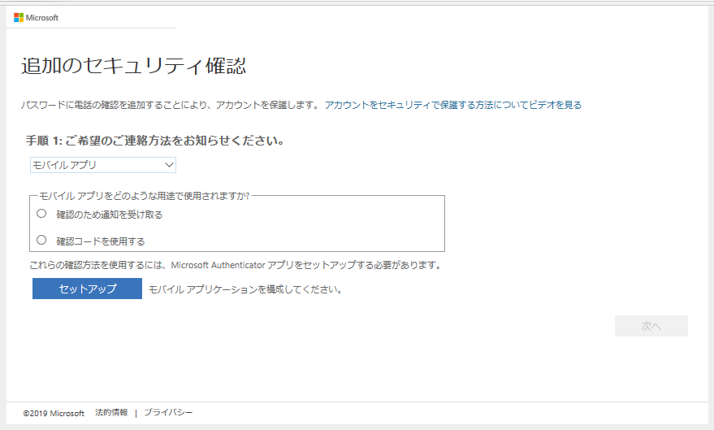
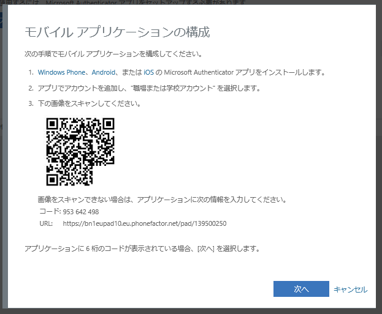

# [ベースライン ポリシー] から [セキュリティの既定値] への移行

こんにちは、Azure & Identity サポート チームの石川です。  
今回は、Azure AD において、無料で利用できる多要素認証の機能の移行についてご紹介します。

----

## 概要
Azure AD の多要素認証 (MFA) を実現するために 2020 年 1 月時点ではプレビュー機能の "ベースライン ポリシー" (条件付きアクセスの [ベースライン ポリシー]) を利用することができます。  
ベースライン ポリシーを有効にすることで、特定のディレクトリ ロールを持つユーザーに対して MFA を要求するなどのベースライン レベルのセキュリティ強化を追加の費用なしで有効にすることができます。

※ベースラインポリシーの詳細はこちらでご確認ください。

ベースライン ポリシーとは ?  
https://docs.microsoft.com/ja-jp/azure/active-directory/conditional-access/concept-baseline-protection

しかし、ベースライン ポリシーは、[セキュリティの既定値] という新機能 (無料) に置き換えられ、2020 年 2 月 29 日に機能の削除を予定しています。  
これにより、すべてのテナントからベースライン ポリシーが削除されます。

現在、ベースライン ポリシーを有効にしているテナントでは、ポリシーが削除されることにより MFA の要求がされなくなりますので、ベースライン ポリシーを有効にしているテナントの管理者は、お早めに [セキュリティの既定値] への移行を検討する必要があります。
[セキュリティの既定値] の機能は以下の手順で有効に設定することができます。
[セキュリティの既定値] の有効化手順:

1. Azure ポータル (https://portal.azure.com) にグローバル管理者 (全体管理者) でサインインします。
2. [その他のサービス] – [Azure Active Directory] をクリックします。
3. [プロパティ] をクリックします。
4. [セキュリティの既定値の管理] をクリックします。
5. [セキュリティの既定値の有効化] を [はい] に設定します。

6. [保存] をクリックします。

[セキュリティの既定値] の詳細はこちらでご確認ください。

セキュリティ デフォルトとは  
https://docs.microsoft.com/ja-jp/azure/active-directory/fundamentals/concept-fundamentals-security-defaults

ベースライン ポリシーを有効にしていないテナントでは、ベースライン ポリシーが削除されても特に影響はありません。  
ただし、有償版の条件付きアクセスの機能を利用して多要素認証をすでに設定している環境以外では、セキュリティ強化のため、[セキュリティの既定値] を有効にすることをお勧めします。

なお、 Azure AD Premium ライセンスで提供される条件付きアクセスや Azure AD Identity Protection を利用した多要素認証では、[セキュリティの既定値] よりも高度かつ柔軟なセキュリティ機能をご利用いただくことができます。  
Azure AD Premium ライセンスをまだお持ちでない方も、是非ご検討いただければと思います。

Azure AD Premium の機能の一覧  
https://azure.microsoft.com/ja-jp/pricing/details/active-directory/

## よくあるご質問

ここからは、よくお問い合わせをいただくご質問について、Q&A 形式でご紹介します。

-------
Q. ベースライン ポリシーが現在有効となっているかは、どうやって確認しますか？

A. 次の手順で確認します。
1.	Azure ポータル (https://portal.azure.com) にグローバル管理者でサインインします。
2.	[その他のサービス] – [Azure Active Directory] をクリックします。
3.	左メニューの [セキュリティ] をクリックします。
4.	左メニューの [条件付きアクセス] をクリックします。
5.	次のそれぞれのポリシーの状態がオンになっていれば有効です。オフの場合は無効です。

Baseline policy: Require MFA for admins (プレビュー)  
Baseline policy: End user protection (プレビュー)  
Baseline policy: Block legacy authentication (プレビュー)  
Baseline policy: Require MFA for Service Management (プレビュー)  

--------------------------------------------------------------------------------------------
Q.  [セキュリティの既定値] を有効にできない。 ([保存] をクリックできない)

A. Azure AD Premium ライセンスのあるテナントで、条件付きアクセスや ID 保護ポリシーが有効になっている場合、[セキュリティの既定値] を有効にできません。  
これらの機能は、[セキュリティの既定値] よりも高度かつ柔軟な設定が可能ですので、[セキュリティの既定値] は無効のままとして、引き続きこれらの機能をご利用ください。

--------------------------------------------------------------------------------------------
Q. [セキュリティの既定値] を有効にする際にベースライン ポリシーが削除されると表示されるが、実行しても大丈夫か。

A. ベースライン ポリシーは、間もなく (2020 年 2 月 29 日) の段階で削除を予定しているプレビュー機能になります。
セキュリティの既定値を有効にすると、自動的にすべてのベースライン ポリシーが削除され、[セキュリティの既定値] を無効にしても、ベースライン ポリシーは復元されません。

--------------------------------------------------------------------------------------------
Q. [セキュリティの既定値] を有効にした後に、Azure にサインインをすると、[詳細情報が必要] という画面が表示される。

A. [セキュリティの既定値] の機能により、グローバル管理者など管理者アカウントは、サインイン時に MFA が要求されるようになります。  
また、それ以外のユーザーも Azure ポータルや Azure CLI 等の利用を試みる際に MFA が要求されます。  
対象となるアカウント、操作については以下の情報を参照ください。

セキュリティ デフォルトとは  
https://docs.microsoft.com/ja-jp/azure/active-directory/fundamentals/concept-fundamentals-security-defaults

また、初回サインイン時に、MFA 認証用のモバイル アプリ (Microsoft Authenticator) のインストールとアカウントの追加の操作が必要となりますので、iOS、Android デバイスをご用意ください。

Microsoft Authenticator アプリの使い方  
https://support.microsoft.com/ja-jp/help/4026727/microsoft-account-how-to-use-the-microsoft-authenticator-app

[詳細情報が必要] 画面で画面の指示に従い、Authenticator アプリにアカウントを追加することで、Azure にサインインすることができます。  
次回以降は、パスワード認証後に、Authenticator アプリに通知が送信されるので、これに応答することで Azure にサインインすることができます。

## (参考情報) Microsoft Authenticator アプリによる追加の認証方式の登録手順

手順:
1. まず、事前準備として、管理者のスマートフォンに認証用のモバイル アプリをインストールしておきます。
2. iOS、または Android、Windows Phone 上で、Microsoft Authenticator というアプリをインストールします。(アプリは無料です。)
3. Azure ポータルにアクセスして、Azure AD 認証でユーザー名/パスワードの認証が完了すると次のような画面が表示されます。
4. [次へ] をクリックします。

5. [確認のための通知を受け取る] をオンにして、[セットアップ] をクリックします。

6.	次のような画面が表示されるので、画面の指示にしたがって、Microsoft Authenticator アプリで QR コードをスキャンします。
7.	[次へ] をクリックします。

8.	[次へ] をクリックします。

9. Microsoft Authenticator アプリに 「承認しますか」という画面が表示されるので、[承認] をクリックします。
10. [完了] をクリックします。

--------------------------------------------------------------------------------------------

上記内容が少しでも皆様の参考となりますと幸いです。