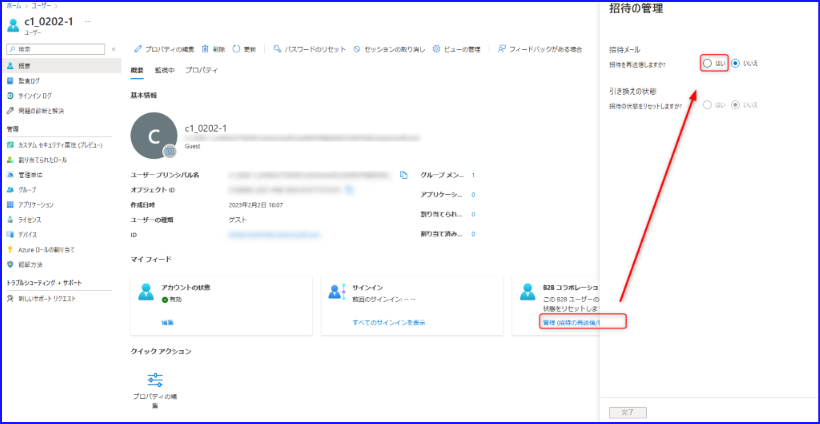
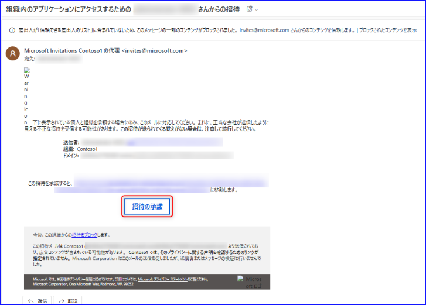
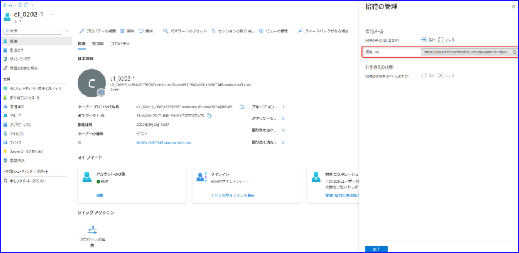

> [!NOTE]
> 本記事は Technet Blog の更新停止に伴い https://blogs.technet.microsoft.com/jpazureid/2017/11/27/azuread-b2b-troubleshooting/ の内容を移行したものです。
> 元の記事の最新の更新情報については、本内容をご参照ください。
> 
> 2017-11-27: 本記事の初版を投稿  
> 2023-03-28: 画面ショットや Azure ポータル上のメニューの変更に伴い最新の情報に更新

# 招待したユーザーが利用できない

こんにちは、Azure & Identity サポート チームの 小出 です。

本記事では Azure AD に招待したはずのユーザーが利用できない際の確認ポイントについて説明します。この記事はもともと 2017 年 11 月に公開されましたが、その後 Azure ポータルのメニューなどが変更されたため、内容を最新版に更新いたしました。

Azure AD へのユーザー招待は、明示的に Azure Active Directory の管理画面からゲスト ユーザーを追加した場合だけでなく、その追加したユーザーが Azure AD にすでに追加済みでなければ、Azure のサブスクリプションに対して "所有者" や "仮想マシン共同作成者" の役割を追加したときにも行われます。

ユーザーを招待した後には、招待されたユーザー側でその招待の受諾処理を行う必要があり、それが完了していないと、役割を割り当てたもののサブスクリプションの利用ができないというような状況になります。そのような状況の場合は、まずはじめに Azure ポータルにて招待状況を確認しましょう。

## Azure ポータルでの招待状況の確認方法

招待操作を行ったテナントの管理者権限を持つユーザーで Azure ポータルにサインインし、[Azure Active Directory] – [ユーザー] – [すべてのユーザー] から該当のゲスト ユーザーを選択します。

[プロパティ] のタブで「外部ユーザーの状態」(赤枠) の項目が「保留中の承諾」の場合は、招待メールは送信されているものの、該当のユーザーが招待を受け付け操作を完了していない状態を示します。招待を受けたユーザーは送信された E メールに含まれる [招待の承諾] のリンクをクリックしてウィザードを完了させる必要があります。

なお、招待 E メールが届いていない場合、緑枠部分の「B2B コラボレーション」の [管理（招待の再送信/状態のリセット）] から招待 E メールの再送も可能です。

招待 E メールは下記のようなメールです。

アドレス: invites@microsoft.com  
件名: 組織内のアプリケーションにアクセスするための <招待者> さんからの招待

> [!NOTE]
> 件名に招待者の名前がない場合、ProxyAddresses 属性に値が入っていないユーザーで招待操作を行ったことが考えられます。この場合、特定のユーザー名の代わりにテナント名が記載されます。

もし、招待されたユーザーが E メールを利用できない場合や、E メール ボックスの作成前の場合は、招待の再送信後に表示される下記、「招待 URL ※」をコピーして、何らかの手段でその URL を招待されたユーザーにお渡しください。招待されたユーザーは、その URL にブラウザーからアクセスすることで招待の完了作業を進めることができます。

※ URL にアクセスして招待の完了作業を進めても、招待 E メールの「招待の承諾」を押す場合と同等の操作になります。

招待された外部ユーザーの状態が 「保留中の承諾」 ではなく、「承諾済み」となっている場合は、ユーザーの招待は完了しています。

「承諾済み」の状態で、期待したサブスクリプションの操作や Azure AD テナントの確認ができない場合は、適切なアカウントや Azure AD を選択できていない可能性がありますので、一度 [サブスクリプションが見えない](https://jpazureid.github.io/blog/azure-active-directory/subscription-azuread/) の内容をご確認ください。

なお、招待 E メールに含まれるリンクをクリックし、ウィザードを進めた結果、次のような「表示するアプリはありません。 このコレクションを非表示にする」との画面が表示されることがありますが、こちらは問題なく招待が完了していますのでご安心ください。

これは、特に割り当てられたアプリケーションがないことを意味しており、招待自体は正常に完了したことを示します。

## おわりに

上記内容でもご要望の動作が完了しない場合は、ぜひ弊社サポート サービスをご利用ください。その際は下記の情報を事前にご提供いただけると幸いです。

- 招待操作を行ったテナント名 (例: xxx.onmicrosoft.com)
- 招待操作を行ったユーザー名 (例: xxx@contoso.com)
- 招待操作を行った時刻
- 招待されるユーザーの E メールアドレス (例: xxx@fabrikam.com)
- 問題となっている状況の詳細と画面ショット

例としては、「招待 E メールが届かない」、「招待 E メールは届くが招待の操作が完了しない」、「招待は完了したが、その後に目的のリソースにアクセスできない」などが挙げられます。それぞれ、上記の情報を添えてお問い合わせを発行いただけますと幸いです。

また、招待 E メールを使用しないユーザーの追加や CSV を使用した一括招待の方法については、[Azure における ゲスト ユーザー招待 (B2B) のよくある質問](https://jpazureid.github.io/blog/azure-active-directory/b2bfaq/) を参照ください。招待 E メールを使用しないユーザーの追加方法についても同様にこの記事の「よくある質問」をご確認ください。

Azure AD B2B で活用いただける PowerShell サンプルは [Azure Active Directory B2B コラボレーション コードと PowerShell サンプル](https://learn.microsoft.com/ja-jp/azure/active-directory/external-identities/code-samples?tabs=http) にまとめられておりますので、併せてご参照ください。

上記内容が少しでも皆様の参考となりますと幸いです。
