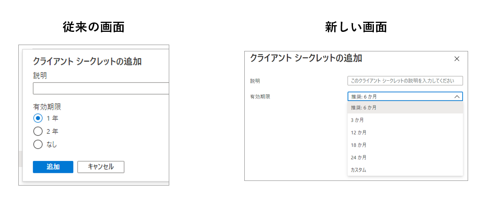

# クライアント シークレット作成画面の変更について

こんにちは。Azure Identity チームの栗井です。

この度、Azure AD アプリケーション (Service Principal) のクライアント シークレットの作成画面の変更、設定可能な有効期限の変更がありましたので、本記事にて紹介します。

## 新旧画面の比較
該当画面 : [Azure Active Directory] > [アプリの登録] > (任意のアプリケーション) > [証明書とシークレット]



- 従来の画面では、有効期限が「1 年」「2 年」「なし (= 無期限)」が選択いただけました。
- 新しい画面では、1, 12, 18, 24 ヶ月が選択肢として表示されます。

    [カスタム] を選択することで更にきめ細かく開始日と終了日を選択可能です。
     - 開始日 : 現在の日付 ～ 1 年 6 ヶ月後の範囲内を指定します。(現在の日時が 2021/04/20 の場合、2021/04/20 ～ 2022/10/20 の範囲)
     - 終了日 : 開始日 ～ 開始日 ＋ 2 年後 の範囲内を指定します。(開始日を 2021/04/20 にした場合、2021/04/20 ～ 2023/04/20 の範囲)

## 最大の変更点 : "無期限" のクライアント シークレットが作成不可になりました

上記の変更によって、 **新しい画面では無期限 (= 失効日を持たない永続的な) クライアント シークレットを作成することができなくなりました。** 最大でも 2 年ごとに、クライアント シークレットを更新する必要があります。

## 動作変更に至った経緯

上記の動作変更は「同じクライアント シークレットを長期間利用し続けることは、セキュリティ リスクである」という考えに基づきます。

クライアント シークレットは、アプリケーションが Azure AD へアクセスするために利用するための資格情報です。万が一この情報が漏洩することで、その登録されたアプリケーションに許可された操作をおこなうことができます。

特に、利用されなくなったアプリケーションが、有効な資格情報 (クライアント シークレット) を保持し続けることは、リスクと考えられます。

Azure AD に登録されたアプリケーションについて、利用されなくなった時点で適宜削除することが理想的ではありますが、現実問題、多かれ少なかれ残存してしまう現状があります。このようなアプリケーションが、無期限の資格情報を持つ、アプリケーションに許可された操作を行える状態になっていることは、望ましくない状態です。


## 過去に作成した "無期限" のクライアント シークレットはどうなりますか？

結論から言いますと、過去に作成した、有効期限が無期限のクライアント シークレットの有効期限は変わりません。

有効期限が無期限のクライアント シークレットは、これまでも内部的には "2299 年 12 月 31 日" が有効期限とされていたので、新しい画面ではこの日付に置き換わります。

今回の動作変更 (選択できるのは最長 2 年、無期限は選べない) は、これから新たな画面で作成される、新しいクライアント シークレットが対象です。

## PowerShell からは、有効期限が 2 年以上のクライアント シークレットが作成できるようですが...

はい、現在は PowerShell コマンドでクライアントシークレットを作成する際は、2 年以上の有効期限を指定することが可能です。

1. PowerShell を管理者権限で起動します
2. 下記コマンドで  Azure Active Directory PowerShell モジュール をインストールします (すでにインストール済みである場合は必要ありません)
   ```powershell
    Install-Module -Name AzureAD
    ```
3. 下記コマンドでテナントに接続します
    ```powershell
    Connect-AzureAD 
    ```
4. 下記コマンドでシークレットを作成します
    ```powershell
    New-AzureADApplicationPasswordCredential -ObjectId <アプリの Object Id を指定> -CustomKeyIdentifier "キーの説明" -StartDate "2021/04/20 00:00:00" -EndDate "2299/12/31 23:59:59"
    ```

ただし、いずれは PowerShell コマンドによるクライアントシークレット作成にも、Azure ポータル上と同じ制限がかかるようになる方針です (制限が反映された際には、この項目は削除する予定です)。この制限が実施されるスケジュールについては、現時点では未定です。

## 作成したシークレットの有効期限をメールなどで通知する方法はありますか？

開発部門でもご要望は認識しておりますが、現時点ではシークレットの有効期限をメールなどで通知する機能は実装されておりません。また現時点では具体的な提供予定についての情報もございません。

以下の弊社ブログで Power Automate を使ってシークレットと証明書の期限切れの状態を確認する処理を自動化する方法を案内しておりますので、代替案として検討ください。

- Use Power Automate to Notify of Upcoming Azure AD App Client Secrets and Certificate Expirations - Microsoft Tech Community
 <https://techcommunity.microsoft.com/t5/core-infrastructure-and-security/use-power-automate-to-notify-of-upcoming-azure-ad-app-client/ba-p/2406145>

## "Updates to converged applications are not allowed in this version." が発生する場合

アプリの [サポートされているアカウントの種類](https://docs.microsoft.com/ja-jp/azure/active-directory/develop/supported-accounts-validation) が `任意の組織ディレクトリ内のアカウント (任意の Azure AD ディレクトリ - マルチテナント) と個人の Microsoft アカウント (Skype、Xbox など)`
の場合 New-AzureADApplicationPasswordCredential コマンドレットや New-AzADAppCredential によるシークレットの追加は行えません。

```powershell
New-AzureADApplicationPasswordCredential -ObjectId <マルチテナント & 個人アカウントがアクセス可能なアプリ> -CustomKeyIdentifier "キーの説明" -StartDate "2021/04/20 00:00:00" -EndDate "2299/12/31 23:59:59"

# New-AzureADApplicationPasswordCredential : Error occurred while executing SetApplication
# Code: Request_BadRequest
# Message: Updates to converged applications are not allowed in this version.
# RequestId: d1caae9f-37a9-4b20-8040-ce9161a1d1d6
# DateTimeStamp: Wed, 07 Jul 2021 12:34:59 GMT
# HttpStatusCode: BadRequest
# HttpStatusDescription: Bad Request
# HttpResponseStatus: Completed
```

この場合シークレットの作成は [Microsoft Graph API](https://docs.microsoft.com/ja-jp/graph/api/application-addpassword?view=graph-rest-1.0&tabs=http) 経由で実施いただく必要がございます。

```http
POST https://graph.microsoft.com/v1.0/applications/【アプリケーションの Object ID】/addPassword
 
{
    "passwordCredential": {
        "displayName": "key 1",
        "startDateTime": "2021-04-20T00:00:00Z",
        "endDateTime": "2299-12-31T23:59:59Z"
    }
}
```

出力例 :
```json
{
    "@odata.context": "https://graph.microsoft.com/v1.0/$metadata#microsoft.graph.passwordCredential",
    "customKeyIdentifier": null,
    "displayName": "key 1",
    "endDateTime": "2299-12-31T23:59:59Z",
    "hint": "7BZ",
    "keyId": "9ec834fa-cd16-4a95-aa3c-93ff100c43a0",
    "secretText": "xxxxxxxxxxxxxxxxxxxxxx",
    "startDateTime": "2021-04-20T00:00:00Z"
}
```

> [!NOTE]
> 上記 Graph API の実行には Application.ReadWrite.All のアクセス許可が必要です。

secretText を控え、クライアント シークレットとして利用します。

## 今後のアップデートについて

本変更についての公開情報やアナウンス等は、現在 (2021/04/21) の時点で公開されておりません。新たな情報が入り次第、本記事内でアップデートさせていただきます。

## おわりに

上記の内容がご参考になれば幸いです。
ご不明点などございます場合は、ぜひ弊社サポートサービスをご利用ください。
