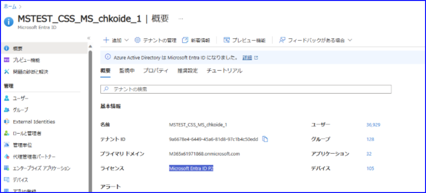
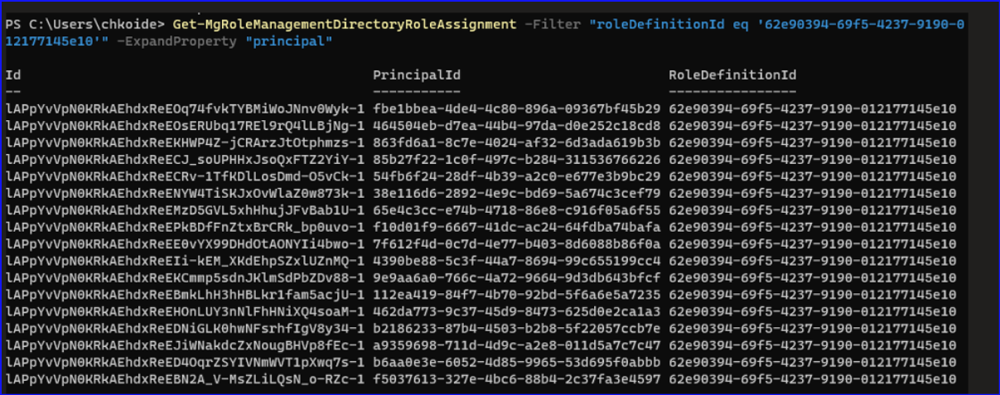
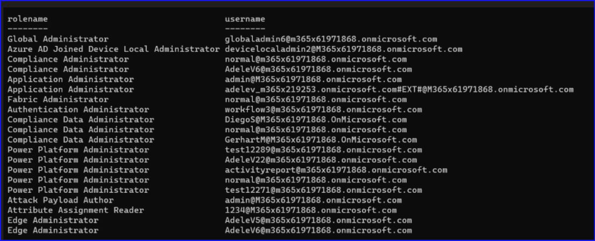
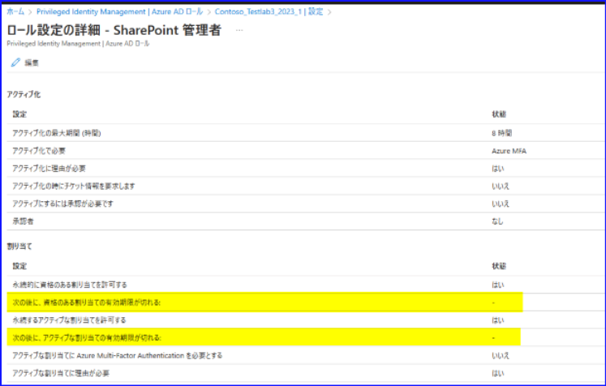
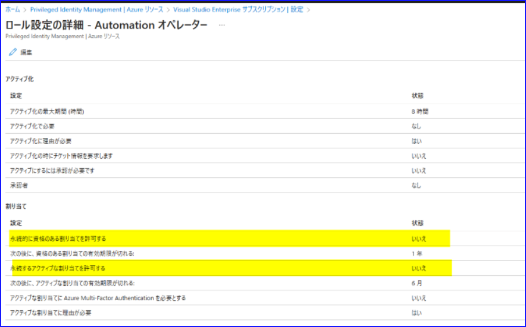

# Microsoft Graph PowerShell SDK への移行について 6_ロール割り当て

こんにちは、 Azure Identity サポート チームの小出です。

この記事は、MSOnline / AzureAD モジュール廃止について、[1. 概要編](https://jpazureid.github.io/blog/azure-active-directory/azuread-module-retirement1/)、[2. 移行導入編](https://jpazureid.github.io/blog/azure-active-directory/azuread-module-retirement2/)、[3. インストール・接続編](https://jpazureid.github.io/blog/azure-active-directory/azuread-module-retirement3/) の続きとして連載しています。[4. ではユーザーに関する操作](https://jpazureid.github.io/blog/azure-active-directory/azuread-module-retirement4/) を、 [5. ではグループに関する操作](https://jpazureid.github.io/blog/azure-active-directory/azuread-module-retirement5/) についておまとめしましたので、今回の 6. では、Microsoft Entra (Azure AD) ロールの管理について情報をまとめました。

まだ Microsoft Graph PowerShell SDK モジュールをインストールしていない場合や、Connect-MgGraph コマンドを使用した接続方法が分からない場合などは、本シリーズの 2. と 3. をご確認ください。

なお、下記にはいくつか簡易的なスクリプトの案内などもございますが、こちらのカスタマイズに関するお問い合わせは承っておりません。あくまでもサンプルとなりますので参考として利用いただき、カスタマイズにつきましてはお客様自身で実施くださいますようお願い申し上げます。

## はじめに

ロールの管理については、Microsoft Entra Premium P2 もしくは Microsoft Entra ID Governance ライセンスをお持ちかどうかで、推奨される Graph API が変わります。この記事をご覧になる前に、まずは Azure ポータルにサインインし、Microsoft Entra ID を開いた下記画面の表示をご確認ください。



上記画面の表示内容によって、下記のように本記事をご利用ください。ライセンスによって推奨する項目が違う理由は、Microsoft Entra ID P2 以上をお持ちの場合、PIM の機能を活用できるためです。P2 ライセンスをお持ちでも Free や P1 ライセンスで提供されている API を利用することは可能ですが、これらの API では PIM で提供される「資格のある割り当て」および「期限付きの割り当て」といった情報を取得できません。このため、P2 ライセンスをお持ちのお客様には、機能をフル活用するために PIM 用の API を利用したロール管理をお勧めします。

|  表示されているライセンス名  |  確認いただきたい本記事の章と関連する Graph API ドキュメントへのリンク  |
| ---- | ---- |
| Microsoft Entra ID Free | [ロール管理用 API を利用したロール管理](https://learn.microsoft.com/ja-JP/entra/identity/role-based-access-control/custom-assign-graph) |
| Microsoft Entra ID P1   | [ロール管理用 API を利用したロール管理](https://learn.microsoft.com/ja-JP/entra/identity/role-based-access-control/custom-assign-graph) | 
| Microsoft Entra ID P2   | [PIM 用 API を利用したロール管理](https://learn.microsoft.com/ja-jp/graph/api/resources/privilegedidentitymanagementv3-overview?view=graph-rest-1.0) |  

## ロール管理用 API を利用したロール管理

以下に、よくあるロール管理コマンドについて紹介いたします。API の詳細について確認されたい場合は、 [roleManagement リソースの種類 - Microsoft Graph v1.0](https://learn.microsoft.com/ja-jp/graph/api/resources/rolemanagement?view=graph-rest-1.0) の公開情報の配下に、各 API の詳細について記載がありますのでそちらをご覧ください。

### 1-1. Microsoft Entra ID ロールの roledefinitionID と名前の一覧を取得したい

Get-MgRoleManagementDirectoryRoleDefinition コマンドを実行することで、ロール定義の表示名、 ID、テンプレート ID (roledefinitionid)、説明などが表示されます。このコマンドで取得できる TemplateID はどのテナントも同じ共通した値となります。ただし、カスタム ロールはそのテナントに固有のロールとなりますため、ID やテンプレート ID は各テナントで独自の値となります。


 
### 2-1. グローバル管理者ロールを持っているユーザーを取得したい

以下のコマンドを利用すると、グローバル管理者 (テンプレート ID: 62e90394-69f5-4237-9190-012177145e10) ロールを持つユーザーを一覧することができます。この 62e9 から始まる ID が、グローバル管理者ロールを示しています。この 62e9 から始まる ID は、どのテナントでも共通するテンプレート ID です。そのため、下記コマンドをそのまま実行すれば、下記のようにグローバル管理者ロールを持っているユーザーを取得可能です。

```PowerShell 
Get-MgRoleManagementDirectoryRoleAssignment -All -Filter "roleDefinitionId eq '62e90394-69f5-4237-9190-012177145e10'" -ExpandProperty "principal"
```



なお、この例の場合、PrincipalID にユーザーの ObjectID が表示されておりますが、一見誰にロールが割り当てられているかが分かりにくいと思います。上記コマンドでは ExpandProperty オプションを利用して、 principal の中身 (ロールが割り当てられているユーザーなどの情報が格納されている) を取得していますので、中身を展開するようにコマンドを記載すれば、オブジェクト ID ではない値を表示することが可能です。例えば以下では、グローバル管理者ロールを持つユーザーの UserPrincipalName のみ取得するようなコマンドにしています。

```PowerShell 
(Get-MgRoleManagementDirectoryRoleAssignment -Filter "roleDefinitionId eq '62e90394-69f5-4237-9190-012177145e10'" -All -ExpandProperty "principal").principal.additionalproperties.userPrincipalName
```

上記を実行すると、以下のような結果が返され、誰にロールがあるのかすぐに判断いただけます。


### 2-2. 何かしらのロールを持っているユーザーを取得したい

以下のように実行することで何かしらのロールを持っているユーザーを取得できます。まずすべてのロール割り当てを取得し、上記例と同様に UPN のみを取得します。パイプ（|）の左側だけですと、1 人のユーザーが 2 つ以上のロールを保持している場合に、同じ UPN が 2 回以上結果に含まれてしまいます。そのため、Sort-Object にてUPN 一覧を並び替え、重複を排除するために Get-Unique を利用しています。
 
```PowerShell 
(Get-MgRoleManagementDirectoryRoleAssignment -All -ExpandProperty Principal).principal.additionalproperties.userPrincipalName | Sort-Object | Get-Unique
```


### 2-3. 特定のカスタム ロールを持っているユーザーを取得したい

まずはカスタム ロール一覧から、特定のカスタム ロールの ID 取得します。その後、2-1 と同様に ID を指定して実行します。

```PowerShell 
Get-MgRoleManagementDirectoryRoleDefinition | where {$_.isBuiltIn -eq $false}
(Get-MgRoleManagementDirectoryRoleAssignment -Filter "roleDefinitionId eq '6be2f6bb-cfc4-48df-8beb-51a538ec1cdf'" -All -ExpandProperty "principal").principal.additionalproperties.userPrincipalName
```

もし、特定のカスタム ロールではなく、カスタム ロールのいずれかを持っているユーザーを一括して抽出したい場合は、下記が便利です。

```PowerShell 
foreach($a in $customrole){(Get-MgRoleManagementDirectoryRoleAssignment  -ExpandProperty "principal" -All | where {$_.roleDefinitionId -eq $a}).principal.additionalproperties.userPrincipalName}
```

### 2-4. 何かしらのロールを持っているゲスト ユーザーを取得したい

2-2 のコマンドと似ていますが、違いは「ゲスト ユーザーのみ」に絞り込む点です。2-2 のコマンドを実行すると、何かしらのロールを保持しているユーザーの UPN 一覧を取得できます。ゲスト ユーザーの場合、UPN には #EXT# という値が含まれる特徴があるので、こちらをキーワードにゲスト ユーザーを抽出します。

```PowerShell 
 (Get-MgRoleManagementDirectoryRoleAssignment -All -ExpandProperty Principal).principal.additionalproperties.userPrincipalName | Sort-Object | Get-Unique | where-object {$_ -like "*#EXT#*"}
```

### 3. 新しいロール割り当ての作成

PrincipalID に取得したいユーザーの ObjectID を指定します。 Roledefinitionid には、付与したいロールのテンプレート ID を指定します。

```PowerShell 
$params = @{
    "@odata.type" = "#microsoft.graph.unifiedRoleAssignment"
    roleDefinitionId = "62e90394-69f5-4237-9190-012177145e10"
    principalId = "0b3cc095-ad6f-40cc-982f-7c71a2cf9bc7"
    directoryScopeId = "/"
}

New-MgRoleManagementDirectoryRoleAssignment -BodyParameter $params
```


### 4. 既存のロール割り当ての削除

上記 2-1 のように、Get-MgRoleManagementDirectoryRoleAssignment コマンドを取得して、削除したいロール割り当ての ID を取得します。この ID はテナントごと、割り当てごとに異なるため、事前に割り当て一覧を取得して ID を確認する必要があります。


そのうえで、下記のようにコマンドを実行し、ロールの割り当てを削除します。

```PowerShell 
Remove-MgRoleManagementDirectoryRoleAssignment -UnifiedRoleAssignmentId oz6hWDLGrkae4JwNQ81_Peq74fvkTYBMiWoJNnv0Wyk-1
```

### 5. 新しいカスタム ロールの作成

[roleDefinitions を作成する - Microsoft Graph v1.0](https://learn.microsoft.com/ja-jp/graph/api/rbacapplication-post-roledefinitions?view=graph-rest-1.0&tabs=http) の手順を用いて、ロールの定義を作成します。カスタム ロールの名前を displayName、説明を description に記載し、実際に許可したいアクセス権を rolePermissions 内に記載します。

 ```PowerShell 
$params = @{
    description = "Update basic properties of application registrations"
    displayName = "Application Registration Support Administrator"
    rolePermissions = @(
        @{
            allowedResourceActions = @(
                "microsoft.directory/applications/basic/read"
            )
        }
    )
    isEnabled = $true
}

New-MgRoleManagementDirectoryRoleDefinition -BodyParameter $params
```

## ロール管理用 API を利用したサンプル スクリプト

上記コマンドを利用したサンプル スクリプトを以下に案内します。改めまして、スクリプトの代理作成やカスタマイズ、スクリプト自体のデバッグなどの支援は弊社サポートでは承っておりませんので、あらかじめご了承ください。下記のようなお問い合わせであればご支援可能ですので、その際は事前に切り分けや動作確認などを実施のうえ、一問一答形式にてお問い合わせを発行ください。

- スクリプトの中で「ユーザーを取得する」コマンドとして Get-MgUser が記載されているが、これをゲストのみにしたい場合はどうしたらいいか (Get-Mguser のフィルターの使い方など、Graph API クエリもしくはコマンドの記載方法についての一問一答のご質問)。
- スクリプトを実行するとエラーになってしまう。切り分けとしてコマンド単体でも実行したが同じエラーになった (スクリプトではなく、コマンドの動作に関するトラブル シューティング)。

Graph PowerShell コマンドで取得した内容を CSV に出力させたいというご要望がよくございますので、今回は結果を CSV に出力するサンプルを以下に紹介いたします。以下ではオブジェクトに対するロール割り当てを取得し、割り当てられているオブジェクトの表示名、ID、ロールの名前を CSV に出力します。また、後半部分では、下記公開情報にて案内のある「特権としてみなされるロールに対し割り当てを持っているユーザーについて、その数を確認し、多すぎる場合には削減する」旨の推奨メッセージを出しています。

[Microsoft Entra ID の特権を持つロールとアクセス許可 (プレビュー) - Microsoft Entra ID](https://learn.microsoft.com/ja-jp/entra/identity/role-based-access-control/privileged-roles-permissions?tabs=ms-powershell)

```PowerShell
# 全特権ロールの割り当て一覧を取得して、ロール名と併せて CSV に出力する。
$data = @()
$data += "asignee,asignee-objectid,rolename"
$result = Get-MgBetaRoleManagementDirectoryRoleAssignment -ExpandProperty "Principal" -Filter "roleDefinition/isPrivileged eq true" -All
foreach ($n in $result) {
    $displayname = $n.principal.additionalProperties.displayName
    $objectID = $n.principalID
    $rolename = (Get-MgRoleManagementDirectoryRoleDefinition -UnifiedRoleDefinitionId $n.RoleDefinitionId).displayname

    $data += $displayname + "," + $objectID + "," + $rolename
}

$outfile = "C:\Work\roleassginment.csv"
$data | Out-File $outfile -encoding "utf8"

# 特権ロール扱いのロールについて、それぞれ割り当てが 10 以上なら画面に削減するよう表示する。
$privadmins = Get-MgBetaRoleManagementDirectoryRoleDefinition -Filter "isPrivileged eq true"
foreach ($priv in $privadmins) {
    $id = $priv.id
    $count = ( Get-MgRoleManagementDirectoryRoleAssignment -All | where {$_.roledefinitionid -eq $id}).count
    If($count -ge 10) {
        $role_displayname = $priv.displayname
        Write-Host "$role_displayname の管理者数が多すぎます。推奨は 10 人以下（グローバル管理者は 5 人以下）です。現在の数は $count です。先に出力した CSV を利用して、ロールが割り当てられているユーザーを確認し、削減を検討してください。"
    }
}
``` 

**CSV 結果**


**表示メッセージの例**

User Administrator の管理者数が多すぎます。推奨は 10 人以下（グローバル管理者は 5 人以下）です。現在の数は 11 です。先に出力した CSV を利用して、ロールが割り当てられているユーザーを確認し、削減を検討してください。

## PIM 用 API を利用したロール管理

PIM を利用したよくあるロール管理コマンドについて以下に紹介いたします。API の詳細について確認されたい場合は、[特権 ID 管理 (PIM) API を使用してMicrosoft Entraロールの割り当てを管理する - Microsoft Graph v1.0](https://learn.microsoft.com/ja-jp/graph/api/resources/privilegedidentitymanagementv3-overview?view=graph-rest-1.0) の公開情報の配下に、各 API の詳細について記載がありますのでそちらをご覧ください。

アクティブな割り当て (Active Assignments) に関する操作と、資格のある割り当て (Eligible Assignments) で API やコマンドが異なるため、コマンドを探す際にはまず、「今操作したい割り当ての種類はどちらか？」を明確にして、該当する情報を探していくようにすると便利です。

### 1-1. PIM でアクティブもしくは資格のある割り当てを問わずグローバル管理者ロールを持っているユーザーを取得したい

資格のある割り当てとアクティブな割り当てでコマンドが異なるため、2 つコマンドを実行する必要がありますが、下記にて取得可能です。

```PowerShell 
# 資格のある割り当てを持っているグローバル管理者を取得する。
(Get-MgRoleManagementDirectoryRoleEligibilityScheduleInstance -All -Filter "RoleDefinitionId eq '62e90394-69f5-4237-9190-012177145e10'" -ExpandProperty Principal).principal.AdditionalProperties.userPrincipalName
```

```PowerShell 
# アクティブな割り当てを持っているグローバル管理者を取得する。
(Get-MgRoleManagementDirectoryRoleAssignmentScheduleInstance -All -Filter "RoleDefinitionId eq '62e90394-69f5-4237-9190-012177145e10'" -ExpandProperty Principal).principal.AdditionalProperties.userPrincipalName
```


### 1-2. PIM で何かしらのロールを持っているユーザーを全員取得したい

1-1 に記載されているコマンドを活用して取得できます。1-1 のコマンドでは -filter オプションの後ろで「グローバル管理者のテンプレート ID を持っている」という条件を記載しておりましたので、この部分を削除すれば何かしらのロールを持っているユーザーを全員取得できます。見やすいようにロールの名前とユーザーの UPN を取得するような構成にしました。

アプリケーションにロールを割り当てている場合、アクティブな割り当てを取得するコマンドを利用すると UPN 部分が空白として表示されます (アプリケーションは UPN を持たないため)。userPrincipalName の代わりに displayName を使用すると、アプリおよびユーザーともに表示名があるため空白なく情報を取得することができます。

```PowerShell 
# 何かしらの資格のある割り当てを持っているユーザーを取得する。
$a = Get-MgRoleManagementDirectoryRoleEligibilityScheduleInstance -All -ExpandProperty Principal

foreach ($b in $a) {
    $obj = New-Object PSCustomObject
    $user = $b.principal.AdditionalProperties.userPrincipalName
    $role = (Get-MgRoleManagementDirectoryRoleDefinition -UnifiedRoleDefinitionId $b.RoledefinitionID).displayname
    $obj | Add-Member -NotePropertyMembers @{
        username = $user
        rolename = $role
    }
    $obj
}
```

```PowerShell 
# 何かしらのアクティブな割り当てを持っているユーザーを取得する。
$a = Get-MgRoleManagementDirectoryRoleAssignmentScheduleInstance -All -ExpandProperty Principal

foreach ($b in $a) {
    $obj = New-Object PSCustomObject
    $user = $b.principal.AdditionalProperties.userPrincipalName
    $role = (Get-MgRoleManagementDirectoryRoleDefinition -UnifiedRoleDefinitionId $b.RoledefinitionID).displayname
    $obj | Add-Member -NotePropertyMembers @{
        username = $user
        rolename = $role
    }
    $obj
 }
```



### 1-3. PIM で資格のある割り当てを持っているユーザーのみ取得したい

何らかの資格のある割り当てをもっているユーザー一覧のみ取得したい場合は、下記を利用できます。

```PowerShell 
$user = (Get-MgRoleManagementDirectoryRoleEligibilityScheduleInstance -All -ExpandProperty Principal).Principal.AdditionalProperties.userPrincipalName
$user | sort-object | Get-Unique
```

### 1-4. PIM でもうすぐ割り当てが終了を迎えるユーザーのみを取得したい 

EndDatetime に指定されている日付をベースに、もうすぐ割り当てが終了を迎えるユーザーとロールの情報を取得することができます。資格のある割り当てとアクティブな割り当てでコマンドが異なりますが、実行方法は同じです。

```PowerShell 
# 資格のある割り当て
$a = Get-MgRoleManagementDirectoryRoleEligibilityScheduleInstance -All -ExpandProperty Principal | Where {$_.EndDateTime -ne $null -and $_.EndDateTime -lt "2024/1/30 0:00:00"}
foreach ($b in $a) {
    $obj = New-Object PSCustomObject
    $user = $b.principal.AdditionalProperties.userPrincipalName
    $role = (Get-MgRoleManagementDirectoryRoleDefinition -UnifiedRoleDefinitionId $b.RoledefinitionID).displayname
    $obj | Add-Member -NotePropertyMembers @{
        username = $user
        rolename = $role
        endDatetime = $b.enddatetime
    }
    $obj
}
```

```PowerShell 
# アクティブな割り当て
$a = Get-MgRoleManagementDirectoryRoleAssignmentScheduleInstance -All -ExpandProperty Principal | Where {$_.EndDateTime -ne $null -and $_.EndDateTime -lt "2024/1/30 0:00:00"}
foreach ($b in $a) {
    $obj = New-Object PSCustomObject
    $user=$b.principal.AdditionalProperties.userPrincipalName
    $role= (Get-MgRoleManagementDirectoryRoleDefinition -UnifiedRoleDefinitionId $b.RoledefinitionID).displayname
    $obj | Add-Member -NotePropertyMembers @{
        username = $user
        rolename = $role
        endDatetime = $b.enddatetime
    }
    $obj
}
```


### 2. PIM で資格のある割り当てをユーザーに割り当てる (期限付き)

以下のように実行して割り当てます。PrincipalID には割り当てるユーザーなどの ObjectID を指定し、割り当てたいロールのテンプレート ID を roleDefinitionId に指定します。期限付きにしたい場合は、expiration 内の enddatetime に終了したい日付を記載します。

```PowerShell 
$params = @{
    action = "adminAssign"
    justification = "Assign Groups Admin to IT Helpdesk group"
    roleDefinitionId = "fdd7a751-b60b-444a-984c-02652fe8fa1c"
    directoryScopeId = "/"
    principalId = "717d0ac2-c100-466c-aa19-c1ca506dbf77"
    scheduleInfo = @{
        startDateTime = [System.DateTime]::Parse("2023-12-10T00:00:00Z")
        expiration = @{
            type = "afterDateTime"
            endDatetime = "2023-12-18T00:00:00Z"
        }
    }
}

New-MgRoleManagementDirectoryRoleEligibilityScheduleRequest -BodyParameter $params
```

### 3. PIM でアクティブな割り当てをユーザーに割り当てる (期限付き)

以下のように実行して割り当てることができます。PrincipalID には割り当てるユーザーなどの ObjectID を指定し、割り当てたいロールのテンプレート ID を roleDefinitionId に指定します。期限付きにしたい場合は、expiration 内 enddatetime に終了したい日付を記載します。

```PowerShell 
$params = @{
    action = "adminAssign"
    justification = "Assign Groups Admin to IT Helpdesk group"
    roleDefinitionId = "fdd7a751-b60b-444a-984c-02652fe8fa1c"
    directoryScopeId = "/"
    principalId = "717d0ac2-c100-466c-aa19-c1ca506dbf77"
    scheduleInfo = @{
        startDateTime = [System.DateTime]::Parse("2023-12-10T00:00:00Z")
        expiration = @{
            type = "afterDateTime"
            endDatetime = "2023-12-18T00:00:00Z"
        }
    }
}

New-MgRoleManagementDirectoryRoleAssignmentScheduleRequest -BodyParameter $params
```


### 4. PIM でユーザーが自身でロールのアクティブ化を行う

下記公開情報の例 5. に記載のように PowerShell コマンドを実行すればユーザーが自身でロールのアクティブ化を行うことが可能です。

[Microsoft Graph で Privileged Identity Management (PIM) API を使用して Azure AD ロールを割り当てる](https://learn.microsoft.com/ja-jp/graph/tutorial-assign-azureadroles?tabs=powershell#request-3)

下記 principalID にはアクティブ化を行うユーザー自身の ID を指定し、roleDefinitionID には、アクティブ化するロールのテンプレート ID を指定ください。また、理由については justification の項目を利用いただけます。

```PowerShell 
Connect-MgGraph -Scopes RoleAssignmentSchedule.ReadWrite.Directory
$params = @{
    action = "SelfActivate"
    principalId = "3796e4df-bf11-4b99-9be7-c65c63dfe9a6"
    roleDefinitionId = "a9ea8996-122f-4c74-9520-8edcd192826c"
    directoryScopeId = "/"
    justification = "Need to invalidate all app refresh tokens for Contoso users."
    scheduleInfo = @{
        startDateTime = [System.DateTime]::Parse("2023-12-14T00:12:00.000Z")
        expiration = @{
            type = "AfterDuration"
            duration = "PT5H"
        }
    }
    ticketInfo = @{
        ticketNumber = "CONTOSO:Security-012345"
        ticketSystem = "Contoso ICM"
    }
}

New-MgRoleManagementDirectoryRoleAssignmentScheduleRequest -BodyParameter $params
```

### 5. PIM の申請を承認する

下記のように実行することで、アクティブ化要求を PowerShell から承認することが可能です。reviewResult にて Approve と記載し、justification には承認する理由を記載してコマンドを実行してください。

なお、このコマンドは beta バージョンのコマンドが利用されておりますので、予告なくコマンドの動作に変更が加わることがございます。運用環境での利用は推奨しておりませんが、利用の際はご留意ください。

```PowerShell 
Connect-MgGraph -Scope RoleAssignmentSchedule.ReadWrite.Directory,PrivilegedAccess.ReadWrite.AzureAD

Import-Module Microsoft.Graph.Identity.Governance
Import-Module Microsoft.Graph.Beta.Identity.Governance

# 現在承認待ちの有効化の要求を取得する。
$pendingApprovalRequest = Get-MgRoleManagementDirectoryRoleAssignmentScheduleRequest -Filter "(status eq 'PendingApproval')"

# 現在承認待ちの有効化の要求を一覧する。
$pendingApprovalRequest | Format-List
 
$roleApproval = Get-MgBetaRoleManagementDirectoryRoleAssignmentApproval -ApprovalId $pendingApprovalRequest.ApprovalId

# 承認する旨と、その理由についてここで指定する。
$params = @{
    reviewResult = "Approve"
    justification = "I approve this request"
}

# 承認処理を行う。
Update-MgBetaRoleManagementDirectoryRoleAssignmentApprovalStep -ApprovalId $roleApproval.Id -ApprovalStepId $roleApproval.Steps.Id -BodyParameter $params
```

## PIM 用の API を利用したロール管理のサンプル スクリプト

上記コマンドを利用したサンプル スクリプトを以下に案内いたします。改めまして恐れ入りますが、スクリプトの代理作成やカスタマイズ、スクリプト自体のデバッグなどの支援は弊社サポートでは承っておりませんのでご了承ください。今回は、PIM に関するお問い合わせでよくご質問をいただく、Entra ロールと Azure ロールの PIM 設定を一括で変更するスクリプトをそれぞれ記載します。

### Microsoft Entra ロール

割り当ての最大期間は「資格のある割り当て」が 1 年、「アクティブな割り当て」が半年になっていますが、以下の例ではこれらを 2 年にするよう全ロールのポリシーを一括で更新します。ポータル上では 2 年の表示がされないため、下記のように - になりますが正しく動作します。



```PowerShell 
# Azure AD に接続する。
Connect-MgGraph -Scopes RoleManagement.ReadWrite.Directory

# Azure AD ロール用のポリシーをすべて取得する。
$PolicyList=Get-MgPolicyRoleManagementPolicy -Filter "scopeId eq '/' and scopeType eq 'DirectoryRole'" 

# どのようなポリシーの更新を行いたいか指定します。  
# 資格のある割り当てのポリシーを更新し、割り当ての最大期間を 2 年（730 日）にする。
$params1 = @{
    "@odata.type" = "#microsoft.graph.unifiedRoleManagementPolicyExpirationRule"
    id = "Expiration_Admin_Eligibility"
    isExpirationRequired = "false"
    maximumDuration = "P730D"
    target = @{
        "@odata.type" = "microsoft.graph.unifiedRoleManagementPolicyRuleTarget"
        caller = "Admin"
        operations = @(
            "All"
        )
        level = "Eligibility"
        inheritableSettings = @()
        enforcedSettings = @()
    }
}

# アクティブな割り当てのポリシーを更新し、割り当ての最大期間を 2年（730 日）にする。
$params2 = @{
    "@odata.type" = "#microsoft.graph.unifiedRoleManagementPolicyExpirationRule"
    id = "Expiration_Admin_Assignment"
    isExpirationRequired = "false"
    maximumDuration = "P730D"
    target = @{
        "@odata.type" = "microsoft.graph.unifiedRoleManagementPolicyRuleTarget"
        caller = "Admin"
        operations = @(
            "All"
        )
        level = "Assignment"
        inheritableSettings = @()
        enforcedSettings = @()
    }
}

Foreach ($policy in $policylist) {
    # 資格のある割り当てのポリシー更新
    Update-MgPolicyRoleManagementPolicyRule -UnifiedRoleManagementPolicyId $policy.Id -UnifiedRoleManagementPolicyRuleId Expiration_Admin_Eligibility -BodyParameter $params1

    # アクティブな割り当てのポリシー更新
    Update-MgPolicyRoleManagementPolicyRule -UnifiedRoleManagementPolicyId $policy.Id -UnifiedRoleManagementPolicyRuleId Expiration_Admin_Assignment -BodyParameter $params2
}
 ```

## Azure ロール

下記ハイライト部分をすべて "いいえ" にするスクリプトです。



```PowerShell 
# サブスクリプション ID とテナント ID を指定する。
$subscriptionId = "2ef5f4f0-e4ef-42b0-85fb-d0f5c05ee8f3"
$tenantId = "9a6678e4-6449-45a6-81d8-97c1b4c50edd"

# Azure AD へ接続する。
Connect-AzAccount -Tenant $tenantId -Subscription $subscriptionId

# Azure ロール一覧の名前を取得する。
$Roles=(Get-AzRoleDefinition).name

# スコープを指定する。
$scope ="/providers/Microsoft.Subscription/subscriptions/$subscriptionId/"

#スコープを指定 (リソース グループのスコープの場合) する。
#$resourceGroup = "testnet0717-RG"
#$scope = "/providers/Microsoft.Subscription/subscriptions/$subscriptionId/resourceGroups/$resourceGroup"

# 実際に変更したい設定を記載する。
# 資格のある割り当てのみ永続を許可したい場合。
$payload = '
{
    "properties": {
        "rules": [
            {
                "isExpirationRequired": false,
                "maximumDuration": "P365D",
                "id": "Expiration_Admin_Eligibility",
                "ruleType": "RoleManagementPolicyExpirationRule",
                "target": {
                    "caller": "Admin",
                    "operations": [
                        "All"
                    ],
                    "level": "Eligibility"
                }
            }
        ]}
    }
}'

# 資格のある割り当て・アクティブな割り当ての双方を永続拒否したい（必ず期限を指定する）場合。
$payload = '
{
    "properties": {
        "rules": [
            {
                "isExpirationRequired": true,
                "maximumDuration": "P365D",
                "id": "Expiration_Admin_Eligibility",
                "ruleType": "RoleManagementPolicyExpirationRule",
                "target": {
                    "caller": "Admin",
                    "operations": [
                        "All"
                    ],
                    "level": "Eligibility"
                }
            },
            {
                "isExpirationRequired": true,
                "maximumDuration": "P180D",
                "id": "Expiration_Admin_Assignment",
                "ruleType": "RoleManagementPolicyExpirationRule",
                "target": {
                    "caller": "Admin",
                    "operations": [
                        "All"
                    ],
                    "level": "Assignment"
                }
            }
        ]
    }
}'
 
# 設定変更の処理を行う。
foreach ($rolename in $roles){
    $roleId = (Get-AzRoleDefinition | where {$_.Name -eq $roleName}).Id
    $roleDefinitionId = "/subscriptions/$subscriptionId/providers/Microsoft.Authorization/roleDefinitions/$roleId"
    $result = Invoke-AzRestMethod -Method GET -Path "$scope/providers/Microsoft.Authorization/roleManagementPolicyAssignments?api-version=2020-10-01"
    $properties = ($result.Content | ConvertFrom-Json).value.properties
    $roleProperty = $properties | where {$_.roleDefinitionId -eq $roleDefinitionId}
     
    # PolicyID が必要になるので控える。
    $policyId = $roleProperty.policyId
     
    # PolicyID を組み込んだ URL を指定する。
    $result = Invoke-AzRestMethod -Method GET -Path $policyId"?api-version=2020-10-01"
    $rules = ($result.Content | ConvertFrom-Json).properties.rules
      
    $result = Invoke-AzRestMethod -Method PATCH -Path $policyId"?api-version=2020-10-01" -Payload $payload
    $newResult = Invoke-AzRestMethod -Method GET -Path $policyId"?api-version=2020-10-01"
    $newRules = ($result.Content | ConvertFrom-Json).properties.rules
}
```
