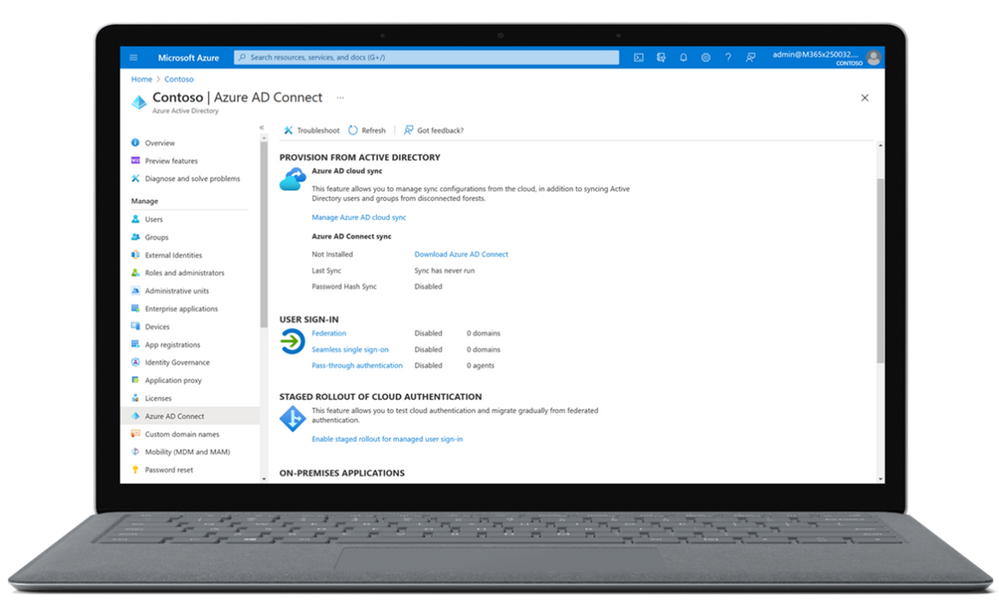
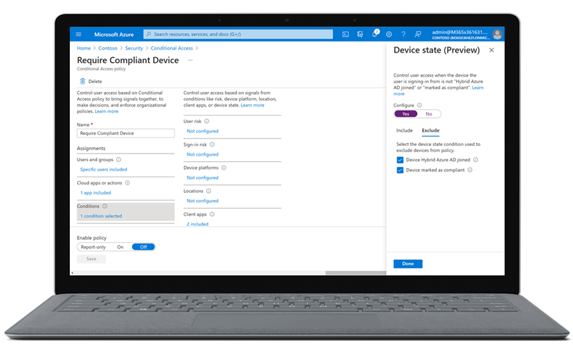
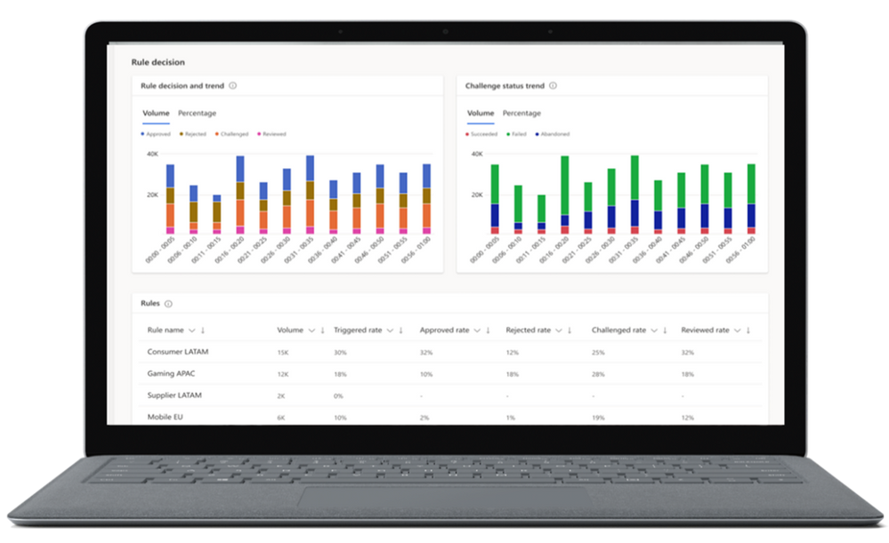

# ID とエンドポイント管理から始まる強固なゼロトラスト基盤の構築

こんにちは、Azure Identity サポート チームの 竜 です。本記事は、2021 年 7 月 14 日に米国の Azure Active Directory Identity Blog で公開された [Build a strong Zero Trust Foundation starting with identity and endpoint management](https://techcommunity.microsoft.com/t5/azure-active-directory-identity/build-a-strong-zero-trust-foundation-starting-with-identity-and/ba-p/2520420) を意訳したものになります。ご不明点等ございましたらサポート チームまでお問い合わせください。

----

昨年の Microsoft Inspire では、お客様がリモートワークへ迅速に移行できるよう支援いただいたパートナー企業に感謝の意を表しました。世界が変化し続け、新しい現実が定着する中、今年は 2 つのトレンドがお客様の優先事項に影響を与えてきています。それは、ハイブリッド ワークへの移行とサイバー空間における脅威の高度化です。これらの変化に適応するために、お客様は引き続き弊社のパートナー エコシステムを活用しようとしてくださっています。お客様が変化に適応できる方法の一つとして、弊社のパートナー企業はお客様がゼロ トラスト セキュリティ戦略を採用することを支援しています。
 
ゼロ トラストへの移行を始めるのは大変なことかもしれませんが、何もしないという選択肢はもはやありません。私たちはパートナー企業とともに、すべてのお客様にこの道のりを案内する責任があると考えています。どこから始めればよいかの指針を求めている企業には、[ID](https://www.microsoft.com/ja-jp/security/business/identity-access-management/azure-ad-pricing)と[エンドポイント](https://www.microsoft.com/ja-jp/security/business/microsoft-endpoint-manager)を保護することで強固な基盤を構築することをお勧めしています。今週の [Microsoft Inspire](https://myinspire.microsoft.com/home) では、このような基盤を構築するための主要な戦略を紹介しています。

## ID とエンドポイント管理の刷新

高度なセキュリティと包括的なゼロ トラスト戦略を実現するために、まずアイデンティティとエンドポイント管理のソリューションを刷新することで、クラウドへの移行をさらに迅速に進めることをお勧めします。ビジネス リーダーの間でもこの必要性はさらに高まっている状況です。

IT システムの刷新は、一見すると非常に大変な作業のように見えます。しかし、まずそのきっかけとして着目すべきは、重要なアクセス可否の判断をクラウドで管理し、一般的な攻撃経路を排除することです。レガシーなフェデレーション方式をやめ、[認証方式を刷新する](https://docs.microsoft.com/ja-jp/azure/active-directory/hybrid/choose-ad-authn)ことで、ビジネスに最適なアクセス パスを選択することができます。[段階的なロールアウト](https://docs.microsoft.com/ja-jp/azure/active-directory/hybrid/how-to-connect-staged-rollout)を用いれば特定のグループからテスト的に展開を行うことができ、移行がよりスムーズになります。また、[レガシー認証をブロックする](https://docs.microsoft.com/ja-jp/azure/active-directory/conditional-access/block-legacy-authentication)ことによって、多要素認証を確実に施行できるようになり、条件付きアクセスによって多要素認証を既定のポリシーとして設定できます。さらに、アクセス管理を一元化するために、[Azure AD クラウド同期](https://docs.microsoft.com/ja-jp/azure/active-directory/cloud-sync/what-is-cloud-sync)などのツールを利用してオンプレミスのすべての ID をクラウドに同期することができます。Azure AD クラウド同期は、数百の Active Directory フォレストがあるような複雑な環境にもご利用いただけます。

エンドポイント管理を刷新するために、 お客様の要望に合ったペースでクラウドの計画を立てられる [Microsoft エンドポイント マネージャー](https://www.microsoft.com/ja-jp/security/business/microsoft-endpoint-manager)の利用をお勧めしています。Microsoft エンドポイント マネージャーは、Configuration Manager と Microsoft Intune を 1 つのエンドポイント管理プラットフォームに統合したものです。それぞれのツールを個別で使用することも、共同で管理することもできます。

最後に、ID とエンドポイント管理を刷新するために、1 つのクラウド ID とクラウド エンドポイント管理のソリューションを用いてアプリ管理を統一することも検討ください。[すべてのアプリを 1 つの ID システムに接続する](https://www.microsoft.com/ja-jp/security/business/identity-access-management/secure-app-access)ことで、使用されているアプリが可視化され管理も容易になります。また、1 つの認証情報を用いて接続することで、リソースへのアクセスが簡素化されます。マイクロソフトのソリューションは、クラウド アプリからオンプレミス アプリ、デスクトップ アプリやモバイル アプリまで幅広く対応しています。

## ハイブリッド環境で働く従業員の保護

すべての従業員がハイブリッドな環境で働く場合、ID とエンドポイントの保護がさらに重要になります。ハイブリッド環境の従業員のセキュリティを確保するために最初のステップは、[強力な認証](https://www.microsoft.com/ja-jp/security/business/identity-access-management/mfa-multi-factor-authentication)でユーザーの ID を確認することです。パスワードは、一連のセキュリティの中で最も脆弱な部分です。セキュリティを守るために何か 1 つできるとすれば、99.9% の ID 攻撃を防ぐことができる多要素認証から始めることをお勧めします。私たちは、さらに強力な認証のために、より安全で便利な[パスワードレス](https://www.microsoft.com/ja-jp/security/business/identity-access-management/passwordless-authentication) の世界に進もうとしています。

次に、脆弱なデバイスや侵害されたデバイスからリソースへのアクセスを不可とするポリシーを適用することで、準拠した信頼できるデバイスからのみアクセスできるように制限します。まずエンドポイントをデバイス管理に登録し、デバイスにデータ保護ポリシーを適用します。そして [Microsoft Defender for Endpoint](https://www.microsoft.com/ja-jp/security/business/threat-protection/endpoint-defender) のような脅威保護ソリューションを使用して危険なデバイスを検出することで、エンドポイントを保護することができます。

ID とデバイスを制御できるようになったら、利用の流れとリスク評価に基づいて適応性のあるアクセス ポリシーを設定します。[条件付きアクセス](https://www.microsoft.com/ja-jp/security/business/identity-access-management/conditional-access-azure-ad)では、ユーザー、デバイス、場所、セッションのリスク評価に基づいてアクセス ポリシーを細かく設定することができます。私たちは継続的に条件付きアクセスを改善しており、さらにきめ細やかなアクセス ポリシーも可能にしています。たとえば、認証コンテキストに基づいてポリシーを構築したり、アクセス条件が満たされているかどうかを常に再評価し、変化が検出された場合はセッションを中断することができる継続的なアクセス評価などを利用したりすることが可能です。

リソースへのアクセスの可否を決定するもう一つの重要な要素に、ユーザーの権限があります。ユーザーの権限は、お客様が従業員やパートナー企業に割り当てる役割、プロジェクト、その他の属性に基づいて設定されます。これらの権限を付与するのは簡単ですが、追跡したり、不要になったときにアクセスを取り消したりするのは非常に困難です。従業員の増加に伴い、全員のアクセス権を管理する単一のソリューションがますます重要になっています。重要なリソースへのアクセスを保護、監視、監査をするために、Azure AD に組み込まれた [Identity Governance](https://www.microsoft.com/ja-jp/security/business/identity-access-management/identity-governance) のご利用をお勧めします。

## 従業員の体験を変える

リモート ワークにより従来の方法で IT ヘルプデスクに頼ることがさらに難しくなってきていることもあり、ビジネス リーダーにとって、従業員の満足度を高めることが重要な課題となっています。たとえば、米国内だけでも、4,900 万人のリモート ワーカーが、IT の問題を解決するのに何日も、時には何週間もかかると報告しています (脚注 1)。

優れた従業員体験をつくるプロセスは、新入社員の入社時から始まります。[Azure AD のプロビジョニング](https://www.microsoft.com/ja-jp/security/business/identity-access-management/lifecycle-management-software)、Microsoft エンドポイント マネージャー、および [Windows Autopilot](https://www.microsoft.com/ja-jp/microsoft-365/windows/windows-autopilot) を使用することで、このプロセスを数日から数時間、あるいは数分に短縮し、初日から適切なアプリケーションとデバイスへのアクセスを付与することができます。[Azure AD の検証可能資格情報](https://www.microsoft.com/ja-jp/security/business/identity-access-management/verifiable-credentials)を使用すると、このプロセスをさらに簡素化できます。たとえば、新入社員の個人データを収集して保存することなく、学歴や専門資格などの情報を数分で確認できます。

入社時から[シングル サインオン](https://www.microsoft.com/ja-jp/security/business/identity-access-management/single-sign-on)を使うことにより、従業員が必要なアプリにスムーズにアクセスできるようになります。従業員の生産性を向上させる最も簡単な方法の 1 つは すべてのアプリケーションを Azure AD に接続することです。Workday、ServiceNow、さらには AWS などの[クラウド アプリケーション](https://www.microsoft.com/ja-jp/security/business/identity-access-management/integrated-apps-azure-ad)から、[オンプレミスのアプリケーション](https://www.microsoft.com/ja-jp/security/business/identity-access-management/application-management-services)やカスタム ビルドのアプリケーションまで、すべてのアプリケーションを Azure AD に接続することができます。アプリケーションを Azure AD に接続することで、エンド ユーザーは、一元化されたアプリケーション起動ポータルである [My Apps](https://www.microsoft.com/ja-jp/security/business/identity-access-management/user-self-service-portals) から、すべてのアプリケーションを容易に見つけて起動することができます。

## ユーザーに合わせた安全なアクセスのカスタマイズ

私たちは、すべてのユーザーに安全なアクセスと快適な体験を提供したいと思っています。たとえば、現場の第一線で働く人々 (フロントライン ワーカー) を例に挙げてみましょう。昨年、私たちは、彼らが社会で果たす重要な役割を目の当たりにしましたが、75％ の人はまだ職務を遂行するための適切なツールを持っていない状況があります (脚注 2)。私たちはパートナー企業やお客様と協力して、彼らの仕事環境に適した体験を提供することで、この状況を変えようとしています。まずは、[ワンタイム SMS コード](https://docs.microsoft.com/ja-jp/azure/active-directory/authentication/howto-authentication-sms-signin)を使ってサインイン プロセスがスムーズに行われるようにし、現場の方々が自ら資格情報を管理できるようにすることから始めています。そのために、たとえば [マイ スタッフ ポータル](https://docs.microsoft.com/ja-jp/azure/active-directory/roles/my-staff-configure) から電話番号の追加やパスワード リセットの承認などを可能にしました。また、第一線で働く人々が使うツールとしてキオスクが一般的になっています。そのため、[共有デバイス モード](https://docs.microsoft.com/ja-jp/azure/active-directory/develop/msal-shared-devices)を利用することで、キオスクのようなデバイス上ですべてのアプリやブラウザー セッションに安全にサインインおよびサインアウトすることを可能にしています。

お客様にとって、もう一つの重要な優先事項は、顧客との長期的な関係を築くことです。[Azure AD B2C](https://docs.microsoft.com/ja-jp/azure/active-directory-b2c/overview) を利用することで、企業や開発者は顧客向けアプリケーションのサインイン体験をカスタマイズし、きめ細かなアクセス ポリシーを構築することができます。さらに、[Azure AD B2C を Dynamics Fraud Protection と統合する](https://cloudblogs.microsoft.com/dynamics365/bdm/2021/05/12/fraud-trends-part-4-balancing-identity-authentication-with-user-experience/)ことで、不正利用や詐欺から顧客アカウントや収益を保護します。この統合により、偽のアカウントの作成、アカウントの乗っ取り、不正なアカウント アクセスを防ぐことができます。また、不正行為による損失や顧客による購入時の手間を最小化しつつ、収益機会を最大化するための知見を活用することで、取引の成功率を向上させることができます。

## Microsoft Inspire にバーチャル (ライブまたはオンデマンド) でご参加ください

仕事のやり方や場所が変化し、セキュリティ上の脅威が増大していることから、新たなセキュリティ アプローチが必要とされています。ID とエンドポイントを基盤としたゼロ トラストこそが、そのアプローチとなりえます。統合されたセキュリティへのアプローチと併せて、Azure AD と Microsoft エンドポイント マネージャーを利用することで、適切な人が適切なレベルのアクセス権を得られるようになり、セキュリティとエンドユーザーの生産性の両方を向上することができます。

世界のどこにいても、Microsoft Inspire の期間中、我々のセッションに参加いただけることを願っております。[Twitter](https://twitter.com/azuread/status/1278418103903363074) や [LinkedIn](https://www.linkedin.com/showcase/microsoft-security/) でハッシュタグ #MSInspire をつけて会話に参加ください。

- [TS03](https://myinspire.microsoft.com/sessions/a5411f0e-7928-41c2-850f-c7dfbed207a3): Build a foundation of trust and security
- [BRK122](https://myinspire.microsoft.com/sessions/af379ebd-9be9-4985-9443-068f4a584344): Identity and endpoint management – a strong foundation for Zero Trust and profitability
- [OD122](https://myinspire.microsoft.com/sessions/8f6f4cf4-3712-4e74-bd31-9efeb249298c): Build a business around helping customers drive towards a Zero Trust framework
- [ATEBRK122](https://myinspire.microsoft.com/sessions/b9f77c58-b8c7-4e95-992b-6875efa7da68): Ask the Experts: Identity and endpoint management – a strong foundation for Zero Trust and profitability

上記内容が参考となれば幸いです。

Irina Nechaeva  
ID 製品マーケティング担当シニア ディレクター

脚注:

1. 1E American Remote Work Survey, July 20, 2020
2. Equip Firstline Workers with Better Tools to Drive Engagement, Forrester Opportunity Snapshot: A Customer Study Commissioned by Microsoft, December 2018
