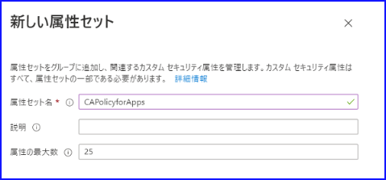
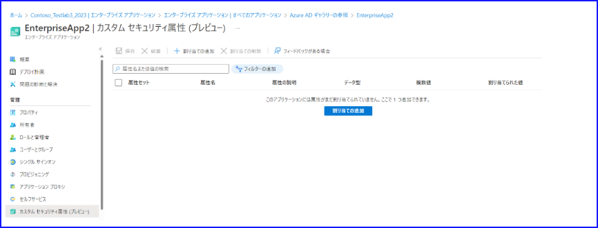
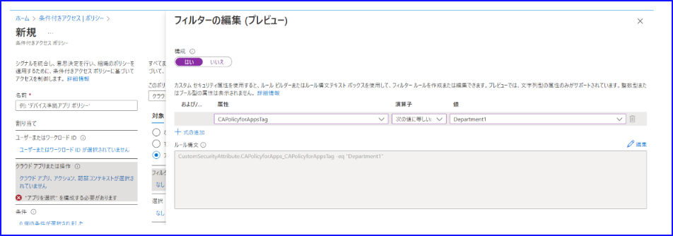

こんにちは、 Azure ID チームの小出です。
本記事は、 2022 年 10 月 26 日に公開された [Public Preview: Conditional Access filters for apps](https://techcommunity.microsoft.com/t5/microsoft-entra-azure-ad-blog/public-preview-conditional-access-filters-for-apps/ba-p/2365680)の意訳をもとに、新しくパブリック プレビューになりました、アプリ用の条件付きアクセス フィルターの機能と、実際の操作方法について紹介します。

## 新しい機能の概要

これまで条件付きアクセス ポリシーを構成するときには、下記のように「どのアプリケーションに対してポリシーを適用するか」 を個別に指定する必要がありました。
たとえば Office 365 にアクセスした時にポリシーを適用させたい場合、下記のように設定しますが、適用させたいアプリケーションがたくさんある場合、この画面でアプリを 1 つずつ選択してリストアップしていたと思います。

新しいパブリック プレビューの機能を使うと、上記画面で 1 つずつアプリケーションを選択しなくても、条件に基づいたアプリをポリシーの対象に含めてくれるようになります。
この機能では、[カスタム セキュリティ属性] を使用してアプリケーションにタグ付けを行います。このタグをもとに、特定のカスタム セキュリティ属性の値が含まれているアプリを、自動的にポリシーへ追加します。対象となるアプリケーション数に制限はありません。

## どのような利点があるか

### ポリシーの数を減らすことができる
これまで新しいアプリを作成するごとにポリシーを作成していたなど、類似構成のポリシーが多くある場合には、この機能を使用することでポリシーの数を減らすことが可能です。

### 新しいアプリを追加した時の負担軽減と作業ミスの可能性の低減
新しいアプリをポリシーに追加したい場合、以前はポリシーを編集し、対象となるアプリケーションを追加する必要がありました。このアプリ フィルター機能を使用すれば、新しいアプリを追加しても、それにタグ付けすることで自動的にポリシーの対象となり、ポリシーを編集する必要がなくなります。

また、新しいアプリをポリシーの対象に追加する際に、たとえばポリシー編集時に誤った項目を設定したり、ポリシー自体を削除してしまったりすることもあり得ると思います。

しかしながらこのアプリ フィルターの機能を用いると、アプリ自体のカスタム セキュリティ属性をもとに対象アプリが自動的にポリシーの対象として構成されるため、ポリシーを一度構成すれば、新しいアプリケーションが追加されてもポリシーを編集する必要はなく、操作ミスをなくすことができます。

### 権限の委任範囲を明確に切り離すことができる
カスタム セキュリティ属性は、属性管理者や属性割り当て管理者といった、一部のロールを持つユーザーしか閲覧・編集することができず、グローバル管理者でも操作を行うことはできません。
このため、一部のユーザーのみにカスタム セキュリティ属性の管理を委任することで、属性の管理者と、ポリシーの管理者を分けることができるようになります。
役割を分けることで、属性の変更操作を行ったユーザーの特定や監査も容易になります。
また、この属性の変更権限を持つユーザーには条件付きアクセス ポリシーを編集する権限はないため、条件付きアクセスの管理者と、カスタム セキュリティ属性の管理者で職務の分離を確実に行うことが可能です。 

## 構成方法

条件付きアクセス ポリシーでアプリ フィルターを選択する前に、事前にカスタム セキュリティ属性を構成し、アプリケーションに値を割り当てる必要があります。
そのため、詳細な手順を下記にてご紹介します。

### 事前準備

カスタム セキュリティ属性を管理するためには、属性定義管理者および属性割り当て管理者が必要です。まずは操作ユーザーにこれらのロールを付与します。
グローバル管理者や特権ロール管理者であれば、自身に対してロールを追加することも可能です。

### カスタム セキュリティ属性の作成

1. [Azure Active Directory] - [Custom Security Attributes] を開き、 [属性セットを追加する] をクリックします。
2. "属性セット名" を指定し、任意で説明や属性の最大数を決定します。属性セットは、属性をまとめた「箱」のようなものです。

    

3. 作成した属性セットを選択します。
4. 下記の画面が表示されるので [属性の追加] を選択します。

    

5. 属性は、実際にアプリ フィルターで条件付けに使う属性名です。データ型や複数の値が入れられるか、値はどのようにするか（定義済みのものから選ぶ or 自由に指定）を決めることができます。

    

> [!WARNING]
> 条件付きアクセス ポリシーのアプリ フィルターでは、文字列型のデータのみが使用できるため、データ型は String を選択ください。

6. 下記のように属性が作成されることを確認します。

    

### カスタム セキュリティ属性の割り当て

1. 作成したカスタム セキュリティ属性を、実際にアプリケーションに割り当てます。 [エンタープライズ アプリケーション] - [カスタム セキュリティ属性] - [割り当ての追加] を選択します。

    

2. 属性セット、属性名、値をそれぞれ選択、もしくは入力して保存します。

    

### 条件付きアクセス ポリシーの構成

1. Azure ポータルから [条件付きアクセス] を選択し、ポリシーの作成画面に遷移します。
2. [クラウド アプリまたは操作] をクリックし、 [アプリを選択] - [フィルターの編集（プレビュー）] を選択します。
3. 下記のような画面が表示されるので、 [構成] を "はい" に設定し、このポリシーに適用させたいアプリケーションの条件を指定して保存します。

たとえばここでは、 CAPolicyforAppsTag というカスタム セキュリティ属性の値が "Department1" となっているアプリケーションを対象にしています。

  

4. ポリシーの名前や条件など、ほかに必要な項目を入力してポリシーを作成すれば完了です。

## フィードバックをお寄せください

今回は、条件付きアクセス ポリシーにて新しく利用できるようになったアプリ フィルターについて紹介しました。
新しいプレビュー機能を利用して気づいたこと、フィードバックがある場合には、下記画面の [フィードバックがある場合] からご意見、ご要望をお寄せください。

  

## 参考となる公開情報
[条件付きアクセス ポリシーでのアプリケーションのフィルター (プレビュー)](https://learn.microsoft.com/ja-jp/azure/active-directory/conditional-access/concept-filter-for-applications)
[Azure AD のカスタム セキュリティ属性とは (プレビュー)](https://learn.microsoft.com/ja-jp/azure/active-directory/fundamentals/custom-security-attributes-overview)
[条件付きアクセス ポリシーの条件としてのデバイスのフィルター](https://learn.microsoft.com/ja-jp/azure/active-directory/conditional-access/concept-condition-filters-for-devices)
[ワークロード ID 用の Azure Active Directory の条件付きアクセス (プレビュー)](https://learn.microsoft.com/ja-jp/azure/active-directory/conditional-access/workload-identity)
