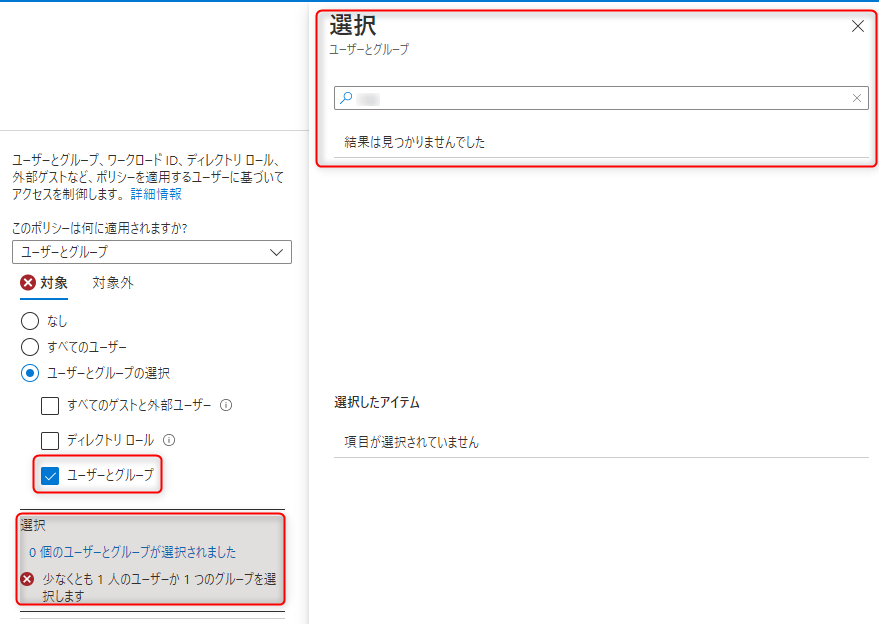
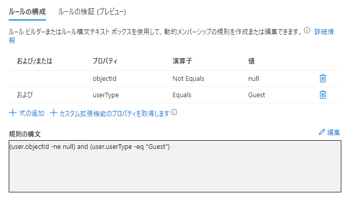
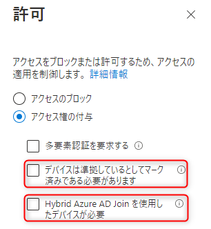
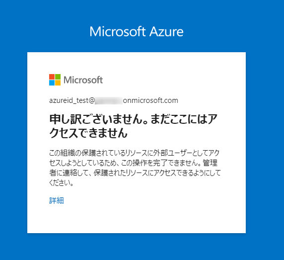

# CSP アカウントに対して適用される、条件付アクセス ポリシーについて

こんにちは、Azure & Identity サポート チームの栗井です。

昨今では多くのお客様におかれまして、弊社のクラウド ソリューション プロバイダー (CSP) のパートナー経由で、様々なクラウド製品をご利用いただいております。

本記事では、CSP パートナーの方から多くいただくご相談について、情報をおまとめいたしました。


## よくある事例 : パートナー センターから顧客のテナントにアクセスすることができません
CSP パートナーのアカウントは、パートナー センター (https://partner.microsoft.com) 経由で、顧客のテナントに対してグローバル管理者相当の権限でのアクセスが可能です。

例えば、顧客の代理で Microsoft サポートに問い合わせをする際などには、顧客の Azure ポータルの [ヘルプとサポート] の項目から、サポート リクエストを作成いただいているかと存じます。

さて、この「CSP パートナーのアカウント (以下 CSP アカウント) による顧客テナントへのアクセス」について、CSP パートナーの方から、下記のようなご相談をよく頂きます。

- お問い合わせ内容 : ある時を境に、パートナーセンターを経由した顧客テナントへのアクセスが、下記のような画面によって、ブロックされるようになった。この事象は特定の顧客 (1 社) のみで発生しており、他の顧客テナントへのアクセスは問題なく可能です。
    

上記の画面は、**条件付きアクセス ポリシー**と呼ばれる Azure AD の機能によって、アクセスがブロックされたことを示します。

※ 条件付きアクセスは、多くのお客様にご好評いただいているセキュリティ機能です。機能の詳細については、[Azure Active Directory の条件付きアクセスとは - Microsoft Entra](https://docs.microsoft.com/ja-jp/azure/active-directory/conditional-access/overview) をご参照ください。

顧客のほとんどは、自分のテナントで条件付きアクセス ポリシーを構成する際に、CSP アカウントによるアクセスへの影響を意識しません。そのため、作成したポリシーによって、意図せずに CSP アカウントによるアクセスをブロックしてしまう場合がございます。

CSP アカウントに対してのポリシー適用は、通常のユーザーを制御する場合とは仕組みが異なります。ご留意点ならびに回避策について、本記事でご紹介させていただきます。

## CSP アカウントに条件付きアクセス ポリシーが適用される場合
顧客のテナント上で、条件付きアクセス ポリシーのユーザー 割り当て設定を開いても、CSP アカウントを選択することはできません。なぜなら、**CSP アカウントは、顧客のテナント上にユーザー オブジェクトが存在しない、特殊なアカウント**であるためです。

そのため、、条件付きアクセス ポリシーのユーザー選択画面で CSP アカウントを検索しても、結果には表示されません。

  


それではどのような設定をすると、CSP アカウントによるアクセスにポリシーが適用されるのか？それは、**割り当て対象に "すべてのユーザー" もしくは "すべてのゲストと外部ユーザー" のいずれかを選択した場合**です。

- "すべてのユーザー" を選択 : すべてのユーザーのサインインに対して、一律にポリシーの制御が適用されるため、CSP アカウントによるアクセスも制御対象となります。
- "すべてのゲストと外部ユーザー" を選択 : Azure AD B2B で招待されたゲスト ユーザー、ならびに CSP アカウントによるアクセスが制御対象となります。

上記の動作となるため、下記内容のお問い合わせを、CSP パートナーの方から頻繁にいただきます。

### 【よくある事例 : CSP アカウントがブロックされてしまう】
- お問い合わせ内容 (再掲) : ある時を境に、パートナーセンターを経由した顧客テナントへのアクセスが、ブロックされるようになった。この事象は特定の顧客 (1 社) のみで発生しており、他の顧客テナントへのアクセスは問題なく可能です。
- 原因 : 顧客のテナントで、下記内容のポリシーが有効化されたこと。
  ```
  
  [名前] : "社内 IP のみアクセス許可"

  [割り当て] 

    [ユーザーとグループ] : すべてのユーザー

    [クラウド アプリまたは操作] : すべてのクラウド アプリ

  [条件] 

    [場所] : すべての場所 (対象外 : 社内ネットワークのグローバル IP アドレス)

  [アクセス制御] 
  
    [許可] : アクセスのブロック
  
  ```

## CSP アカウントへの条件付きアクセス ポリシーの適用を回避する方法
前述の「よくある事例」のようなパターンにおいて、CSP パートナーの方からは「CSP アカウントを、条件付アクセス ポリシーの適用対象から除外することは可能か ?」というご相談をいただきます。本項目では解決方法をおまとめいたしました。

### 前提 : [ユーザーとグループ] > [対象外] の項目はご利用いただけません
条件付きアクセス ポリシーでは、割り当て対象ユーザーの設定画面において [対象外] の項目があります。通常であれば、特定のユーザーをポリシーの割り当て対象から除外したい場合は、[対象外] の項目で該当のユーザーを指定する方法が適切です。

しかし、CSP アカウントの場合は、この方法を利用することができません。前述の通り、CSP アカウントは顧客のテナント上にユーザー オブジェクトが存在しない、特別なアカウントです。 そのため、[対象外] の項目で選択することができません。


したがって、割り当て対象ユーザーの設定では、CSP アカウントを明示的にポリシーの適用対象外に指定することはできません。以下では代替案としての、2 通りの回避策をご紹介いたします。
1. CSP アカウントのアクセス元 IP アドレスを、ポリシーの対象外に指定
2. "すべてのユーザー" "すべてのゲストと外部ユーザー" のオプションの利用を止める

### 回避策 1 : CSP アカウントのアクセス元 IP アドレスを、ポリシーの対象外に指定
CSP アカウントによるアクセス元が、特定の IP アドレス (群) に限定される場合に、ご利用いただける方法です。アクセス元の IP アドレスを、ポリシーの適用対象外に指定ください。

- **【手順 1 : CSP アカウントによるアクセス元 IP を、ネームドロケーションに登録】**
  1. Azure ポータル > Azure Active Directory > セキュリティ > 条件付きアクセス > [ネームドロケーション] に進みます。
  2. [+ 新しい場所] を選択して、下記のネームド ロケーションを登録します。

      [名前] : 任意 (例 : CSP 接続ポイント)

      [次を使用して場所を定義します] : IP 範囲

      [IP 範囲] : <CSP 様の事業所のグローバル IP アドレス範囲>

  3. [作成] を選択し、ネームド ロケーションを保存します。下記の【手順 2】に進みます。

- **【手順 2 : 登録したネームド ロケーションを、ポリシーの対象外に指定】**

  4. 該当の条件付アクセス ポリシーの設定画面を開きます。
  5. . [条件] - [場所] に進み、[構成] を "はい" にします。
  6. "対象" の構成で "すべての場所" を選択します。
  7. "対象外" の構成で "選択された場所" を選択し、手順 2 で登録したネームド ロケーションを指定します。
  8. ポリシーの変更を保存します。

上記の通り、ポリシーを変更いただくことで、CSP アカウントが [IP 範囲] で指定したネットワーク ロケーションからアクセスする際には、ポリシーによる制御は行われなくなります。

### 回避策 2 : "すべてのユーザー" "すべてのゲストと外部ユーザー" のオプションの利用を止める
前述の通り、"すべてのユーザー" "すべてのゲストと外部ユーザー" を割り当て対象とするポリシーは、CSP アカウントによるアクセスに対しても一律に適用されます。

これらの割り当てオプションを利用せずに、**ポリシーを適用するユーザーを個別に指定**いただくことで、CSP アカウントに対してのポリシー適用を回避いただくことが可能です。


「ポリシーを適用するユーザーを個別に指定」とは、[対象]  > [ユーザーとグループ]  の項目において、ポリシー適用対象ユーザー (もしくはユーザー グループ) を、1 個ずつ指定する方法です。

 

しかし、テナント上に 1000 人単位のユーザーが登録されているような大規模な組織では、ユーザー アカウントを 1 個ずつ選択するという操作は、現実的ではないかもしれません。

このような場合は、次の項目でご紹介する "動的グループ" の機能によるユーザーグループの作成をご利用いただくと便利です。

### 動的グループを利用したユーザーグループの作成方法
"動的グループ" とは、ユーザーのプロパティ (属性値) に基づくルールを記述することで、ユーザー グループに自動でユーザーを追加いただける機能です。

動的グループの機能の詳細については、[Azure Active Directory で動的グループを作成または更新する | Microsoft Docs](https://docs.microsoft.com/ja-jp/azure/active-directory/enterprise-users/groups-create-rule) をご覧ください。 

以下では、条件付きアクセス ポリシーにおける "すべてのユーザー" ならびに "すべてのゲストと外部ユーザー" の代わりとしてご利用いただける、動的グループ メンバーシップルールをご紹介いたします。いずれのグループも、CSP アカウントは含まれません。

- 「すべてのユーザー (除外 : CSP アカウント)」 に該当する、動的メンバーシップ ルール
    
  ```
  (user.objectId -ne null)
  ```

- 「すべてのゲストと外部ユーザー (除外 : CSP アカウント)」 に該当する、動的メンバーシップ ルール
   
  ```
  (user.objectId -ne null) and (user.userType -eq "Guest")
  ```

上記 2 つのルールはいずれも「オブジェクト ID が null ではない」という条件を含みます。従って、ユーザー オブジェクト自体が存在しない CSP アカウントは、グループのメンバーシップには含まれない動作になります。

作成いただいたユーザー グループは、条件付きアクセス ポリシーの [ユーザーとグループの選択] において、選択いただくことができます。


## Q&A

- **<span style="color:blue">Q </span>.** [対象外] に "すべてのゲストと外部ユーザー" を指定することで、CSP アカウントへのポリシー適用を回避できますか？
  
  **<span style="color:red">A </span>.**  はい、回避いただくことができます。

- **<span style="color:blue">Q </span>.** [対象外] に "ディレクトリ ロール : グローバル管理者" を指定することで、CSP アカウントへのポリシー適用を回避できますか？
  
  **<span style="color:red">A </span>.**  はい、回避いただくことができます。

- **<span style="color:blue">Q </span>.** "すべてのユーザー" に対して多要素認証 (MFA) を要求するポリシーを作成した場合、CSP アカウントは MFA を突破することができますか ? MFA を突破できず、アクセスが失敗しますか ?
  
  **<span style="color:red">A </span>.**  CSP アカウントは MFA を突破することができます。そのため、MFA を要求するポリシーを CSP アカウントに対して適用しても、CSP アカウントのアクセスがブロックされることはございません。

  CSP パートナー向けの追加解説 : パートナー センター (https://partner.microsoft.com) へのアクセス時は、MFA による認証が必須です。この際に実施した MFA のキャッシュによって、顧客テナントに要求される MFA 要件を満たすことができます。

- **<span style="color:blue">Q </span>.** "すべてのユーザー" に対して、アクセス許可条件として "準拠済みデバイス" "Hybrid Azure AD Join 済みデバイス" を要求するポリシーを作成した場合、CSP アカウントはこの条件を満たすことができますか？

    
  
  **<span style="color:red">A </span>.**  いいえ。"準拠済みデバイス" "Hybrid Azure AD Join 済みデバイス" の条件は、テナントに直接所属するユーザーのみが満たすことができる条件です。ゲストユーザーならびに外部ユーザー (CSP アカウント含む) に対してこの条件が適用された場合は、下記画面によって、アクセスがブロックされます。

    

 **<span style="color:blue">Q </span>.** CSP アカウントによる顧客テナントへのアクセスは、顧客テナントのサインイン ログで確認することができますか ?

  **<span style="color:red">A </span>.**  いいえ。 CSP アカウントによるアクセスは、サインイン ログに記録されません。


上記内容が少しでも皆様の参考となりますと幸いです。ご不明な点がございましたら、弊社サポートまでお気軽にお問い合わせください。