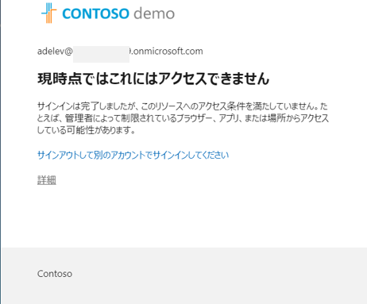
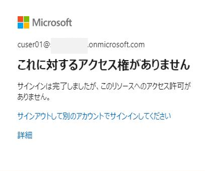
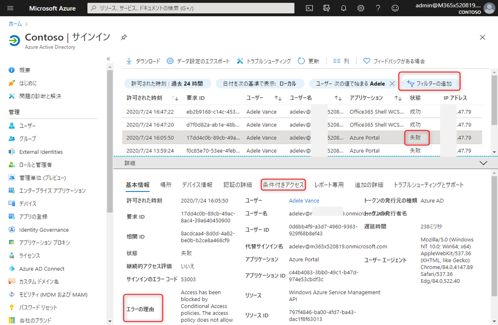
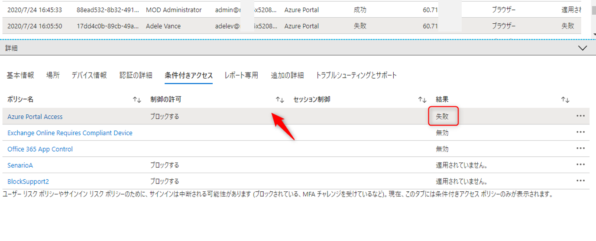
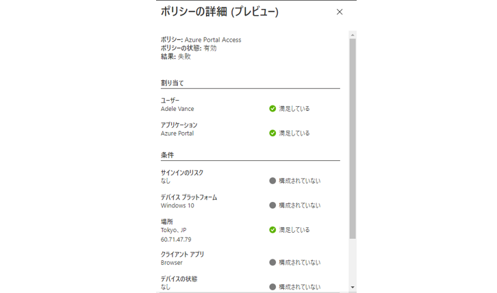
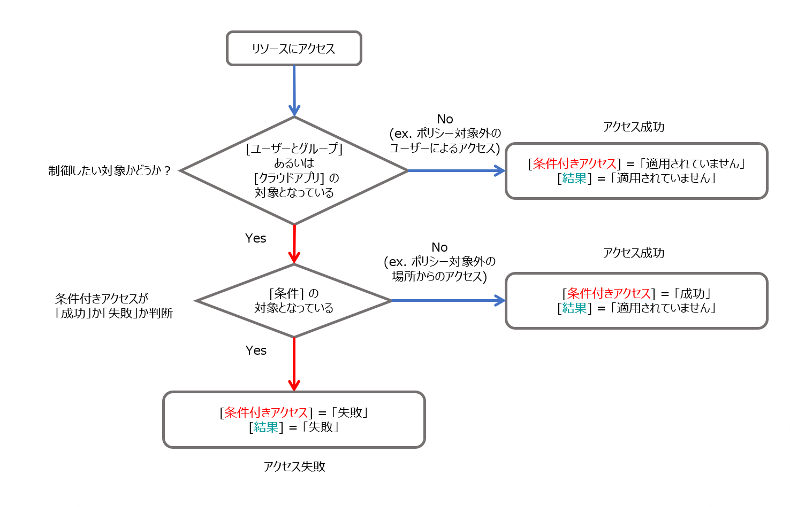
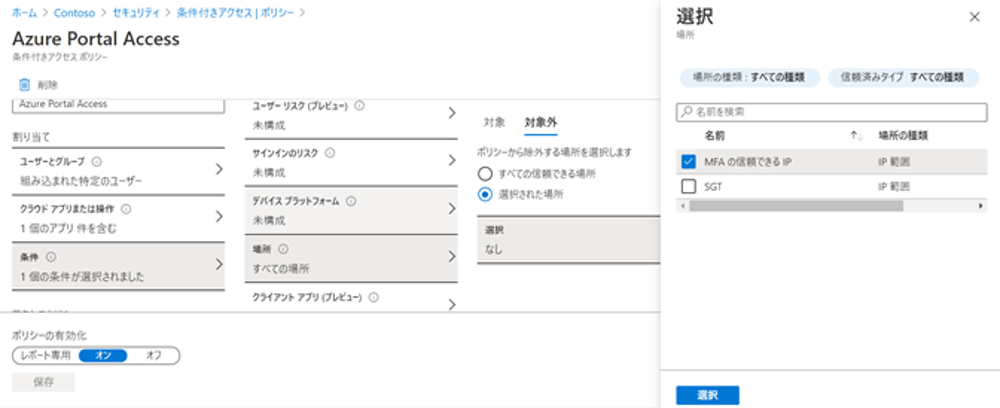
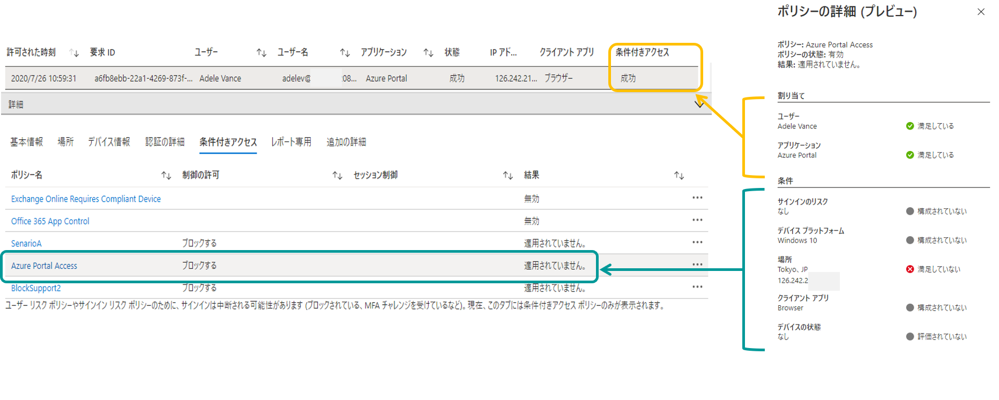
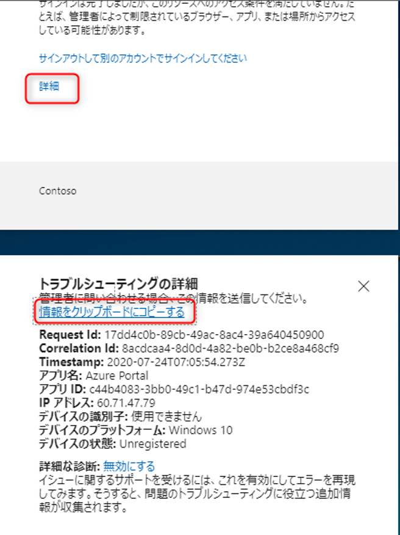

# 「現時点ではこれにはアクセスできません」エラーについて

こんにちは！ Azure & Identity サポートチームの中井です。
この記事では、Microsoft 365 や Azure など Microsoft のクラウドサービスにサインインしようとした場合に遭遇するエラー「現時点ではこれにはアクセスできません」 について、その原因と調査方法を解説します。

また、最後に、一般的にエラー画面に遭遇しサポート部門にお問い合わせする際のポイントもお伝えしようと思いますので、最後まで読んでいただけると嬉しいです。

## 目次

1. [「現時点ではこれにはアクセスできません」と表示される原因](#anchor1)
2. [条件付きアクセスポリシーの確認方法](#anchor2)
3. [サインインログの見方に関する注意点](#anchor3)
4. [よくある質問](#anchor4)
5. [最後に](#anchor5)

## 「現時点ではこれにはアクセスできません」と表示される原因

特定のユーザーで Azure AD に連携しているアプリにサインインを試みて以下のようなエラーに遭遇した場合 (エラー例 1)、Azure AD Premium Edition の機能である **条件付きアクセス** が原因と考えられます。ポイントは、ユーザーが入力したパスワードなどの資格情報は正しかったものの「リソースへのアクセスが許可されなかった」 ことにあります。

すなわち、サインインはできるが、「条件付きアクセス ポリシー」 が適用され、特定のサービスへのアクセスがブロックされたことを示します。(なお、エラー例 2 の "これに対するアクセス権がありません" も、条件付きアクセス適用によるブロック例です。)

もしこれらが意図しないブロックだった場合、Azure ポータルにて、**条件付きアクセス ポリシーの構成内容を確認する** 必要があります。 条件付きアクセスポリシーは Azure AD の管理者のみ確認・編集ができるため、もしエラーに遭遇された "あなた" が管理者以外でしたら、管理者の方にお問合せください。

お問い合わせする際には、本ブログの [最後に](#anchor5) も合わせて参照いただけますと幸いです。

## 条件付きアクセスポリシーの確認方法

さて、ここからは、 "あなた" が管理者であった場合にユーザーからお問い合わせを受けて、意図しないブロックに対してどう対応するかをお知らせします。
作成した条件付きアクセス ポリシーの内容を地道に見直すのも手ですが、より便利な方法として 「サインインログ」から詳細を確認する方法をご紹介します。

Azure ポータル (https://portal.azure.com) に、Azure AD の管理者ロールを持つアカウントでサインインします。
[Azure Active Directory] - 監視 [サインイン] を選択すると、ユーザーのリソースへのサインイン ログを参照することができます。
サインイン ログでは、例えば以下の情報を確認することができます。

- アクセス日時
- アクセスしようとしたリソース
- アクセス (サインイン) に成功したかどうか (状態)
- アクセス元の IP アドレス
- 条件付きアクセス適用の有無

特定のユーザーでエラーが発生している場合、[+ フィルターの追加] でユーザー (もしくはメールアドレスであらわされるユーザー ID) を選択し、ユーザー名を入力することで関係するログだけを表示することができます。
関係するログを特定したらまず、[状態] に注目しましょう。 ユーザーが入力した視覚情報が間違っていた場合や、資格情報は正しかったものの条件付きアクセスによりアクセスがブロックされた場合、[状態] の項目が [失敗] と表示されます (無事サインインしてリソースにアクセスできた場合は「成功」)。

続いて、そのサインイン ログをクリックすると、下に詳細画面が表示されます (図 1)。左下には [エラーの理由] も記されており、サインイン エラーの原因を特定するのに有益な情報となります。

今回は "Access has been blocked by Conditional Access policies. The access policy does not allow token issuance" と表示されており、これが「条件付きアクセスによる予期せぬブロックが原因かな」 と見当をつけることができます。では、[条件付きアクセス] メニューをクリックしてみましょう。ここでは、作成している条件付きアクセスポリシーの一覧が確認できます。
もし、今回のようなサインイン エラーの事象が発生した場合、いずれかのポリシーの　[結果] が [失敗] と表示されているはずです (図 2)。 そのポリシー名をクリックすれば、直接条件付きアクセス ポリシーの構成画面へと遷移し、行そのものをクリックすれば今回の事象で適用された [ポリシーの詳細] を確認することができます (図 3)。

 

 

 

### 条件付きアクセス ポリシーの構成においてチェックすべきポイント

- [ユーザーとグループ] は、適切なユーザーが登録されているか？
- [アプリケーション] は正しいか？
  -  アクセスを拒否したいクラウド アプリは、個別に選択することを推奨しております。
  -  参考 : Azure Active Directory 条件付きアクセスのサービス依存関係の概要
    https://docs.microsoft.com/ja-jp/azure/active-directory/conditional-access/service-dependencies
- [場所] は、信頼された場所 (会社など) の IP アドレスが正しく設定されているか？

  - サインインログから確認できるアクセス元の IP アドレスと、 ポリシー対象外として設定している [信頼できる場所] の IP アドレスは整合しているか確認しましょう。

## サインインログの見方に関する注意点

ここまで確認した方でお気づきの方もいらっしゃるかもしれませんが、サインイン ログには条件付きアクセスの適用状況を示す項目が 2 つあります。1 つは、サインイン ログの一覧に表示される [条件付きアクセス] の項目。 2 つ目は、サインイン ログの各行をクリックし表示される [詳細] - [条件付きアクセス] タブ内の [結果] の項目です。これらの違いを以下に説明します。

端的に言うと、ユーザーによるアクセスが条件付きアクセス ポリシーの [ユーザーとグループ] or [クラウド アプリ] に合致しているかどうかが判断されたうえで、その結果が [条件付きアクセス] の値に入ります。もしこの時点で制御対象外のユーザーによるサインイン、あるいは制御対象外のアプリケーションに対するアクセスだった場合、「適用されていません」と表示されます。

続いて、[条件] の項目に合致しているアクセスかどうかを判断し、その結果が [結果] の値に入ります。もし対象外の場所を設定し、そこからアクセスした場合、「適用されていません」と表示されます。この流れをフローチャートに示すと以下のようになります。

イメージしやすいように簡単なテストケースを考えてみましょう。

【テストケース】
Azure ポータルへの管理作業を社内からだけに限定することができるか、検証したい。

【流れ】
1. 以下のリンクを参考に、社内の Global IP アドレスを信頼できる場所として Azure ポータルに登録します。
   [Azure Active Directory] - [セキュリティ] - [条件付きアクセス] へと進みます。左ペインより [ネームドロケーション] を選択し、「新しい場所」から社内の Global IP を登録します。 
    参考：ネームド ロケーションの構成
    https://docs.microsoft.com/ja-jp/azure/active-directory/reports-monitoring/quickstart-configure-named-locations#configure-named-locations
手順 1  で追加した信頼できる場所を、条件付きアクセスの許可された場所に設定します。左ペイン最上部 [ポリシー] を選択してください。
   - 検証用としてテスト ユーザー (Adele Vance) を用意し、[ユーザーとグループ] に割り当てます。
   - [クラウドアプリ] は [Microsoft Azure Management] アプリケーションを検索、選択します。
   - [対象] で [すべての場所] を選択し、[対象外] – [選択された場所] をクリックします。[選択] より、[ネームドロケーション] にて設定した場所をチェックします。
   - 最後に、[アクセス制御] – [許可] にて、[アクセスのブロック] を選択します。 
   参考: Azure ポータルへのアクセス制限
   https://jpazureid.github.io/blog/azure-active-directory/access-restriction-azure-portal/

      

3. 設定した Global IP アドレスから、テストユーザー (Adele Vannce) による Azure ポータルへのアクセスが成功し、それ以外の場所 (スマートフォンの 4G ネットワークなど) からのアクセスは拒否されることを確認します。

【テストユーザー以外で社内から Azure Portal にアクセスしたときのログ】

そもそも、テスト ユーザー以外は制御対象とみなしていないため、条件付きアクセス ポリシーは適用されません。したがって、[条件付きアクセス] は「適用されていません」と表示され、[結果] も自動的に「適用されていません」と表示されます。

【テスト ユーザー (Adele Vannce) により、社内から Azure Portal にアクセスしたときのログ】

まず、テスト ユーザーが [割り当ての対象] と合致しているので、[条件付きアクセス] のポリシー適用対象となり、最終的にアクセスに成功したかどうかが値として反映されます。このケースでは信頼できる場所からのアクセスであるため、[条件付きアクセス] は「成功」です。 しかし一方で、信頼できる場所からのアクセスは [条件]  の対象外であるため、詳細の [結果] では [適用されていません] と表示されます。 
（条件付きアクセス ポリシーの適用外、つまり信頼できる場所として 「対象外」 に設定した場所からのアクセスは、『 [条件] に合致していない』とみなされ、「満足していない」と表示されます。ここ、非常に分かりにくいですよね…）

以下では、よくあるお問い合わせをおまとめました。

## よくある質問

Q: 管理者ではないですが、ログを確認することは可能でしょうか？

A: はい、Azure ポータルにサインイン可能な状態であれば、自分自身のサインイン ログは下記より確認が可能です。 
[Azure Active Directory] - [ユーザー] - [自身のユーザー] - [サインイン] 
ただし、他のユーザーのログは参照できません。また、管理者が一般ユーザーによるログの閲覧をブロックしている場合もあります。
 
 
Q: 自分たちの会社では条件付きアクセスの設定は未実施にもかかわらず今回のエラーが出たのはなぜですか？

A: 他社テナントのクラウド サービスにアクセスを試行している可能性が考えられます。
条件付きアクセスはサインインではなく、リソースへのアクセスを制御しています。 
つまり、他社のテナントのリソースにアクセスした場合に、他社が設定した条件付きアクセスのポリシーに抵触した場合は、アクセス先のテナントで設定されている条件付きアクセス ポリシーにてアクセスがブロックされます。 
その際の詳細なログの確認は他社のテナントの管理者に依頼する必要があります。つまり他社のテナントの管理者にサインイン ログや条件付きアクセス ポリシーを確認してもらう必要があります。

Q: 検証を実施していたところ、すべてのユーザーがブロックされてしまいました。

A: 弊社サポートまでお問い合わせいただく以外に回避策はありません。
設定の解除には、数営業日いただくことになります。このような状況が生じないよう、必ず 1 名の管理者だけはポリシーの対象外とするようご注意ください。

## 最後に
みなさん、一度は遭遇したことがあるであろうこのエラー画面に「詳細」のリンクがあるのはお気づきでしょうか。

クリックしてみると、「トラブルシューティングの詳細」が展開されます。ここに表示される Timestamp や Request Id、Correlation Id は、発生した事象を特定する識別コードの役割を果たします。実は、画面に表示されている「Request Id」 はサインインログにおける「要求 ID」 に一致しており、この ID を使用して事象に対応するサインイン ログを特定することも可能です。
つまり、この ID を管理者に連絡することで管理者側もサインイン ログからスムーズに確認が可能になるということです。

また、これらの情報も含めて Microsoft のサポート部門にご提供いただければ、事象が発生したログの特定が容易になり、問題解決が迅速に進む可能性があります。今回に限らず、もしエラー画面に遭遇し、Microsoft のサポート部門にお問い合わせしたい場合、エラー画面の「詳細」をクリックし、ぜひその情報をクリップボードにコピーして一緒にお知らせしましょう！

（私たち Azure サポート部門のメンバーも、この ID を含めてお問合せいただくと嬉しくなり思わず笑顔になります。）

最後まで読んでくださり、ありがとうございました！リモートワークが推進される今日において、Azure AD の条件付きアクセスは安全なアクセスを実現するためにますます重要な役割を担っています。本記事が、条件付きアクセスを利用される皆様の参考になれれば幸いです。

【参考】 
サインインレポートにおける条件付きアクセスの表示の違い
https://docs.microsoft.com/ja-jp/azure/active-directory/reports-monitoring/reports-faq#conditional-access
Azure Active Directory ポータルのサインイン アクティビティ レポート
https://docs.microsoft.com/ja-jp/azure/active-directory/reports-monitoring/concept-sign-ins
