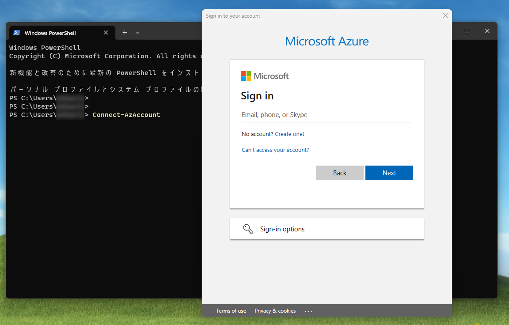

# ワークロード ID を利用した Azure PowerShell モジュールにおける認証のご紹介

こんにちは、Azure & Identity サポート チームの栗井です。

Microsoft Azure の各種リソース操作や情報取得を行う方法として、多くのお客様に、各種 PowerShell モジュール (Az PowerShell, Microsoft Graph PowerShell SDK、Azure CLI etc...) をご利用いただいています！

よくある活用例の 1 つとして、自動実行を目的としたスクリプト ファイルの作成が挙げられます。ここで課題となるのが、認証用のコマンドにどのようにして資格情報を渡すかという点です。いずれの PowerShell モジュールも、最初に認証コマンドを実行しアクセス トークンの取得が必要です。例えば Microsoft Graph PowerShell SDK の認証用コマンド "Connect-MgGraph" では、引数無しで実行すると、以下のようにユーザー認証画面が表示されます。しかし自動実行を想定したスクリプトの場合、ユーザーによるサインイン操作が発生することは不都合です。

 

こんなシナリオの解決策としては、ワークロード ID の活用が最適です！

## ワークロード ID ってなに ?

ワークロード ID は、ソフトウェア (スクリプト、アプリケーション、サービス、スクリプト、コンテナーなど) に割り当てる ID です。ユーザーに払い出す人間用の ID ではなく、システムやソフトウェア用に払い出す ID とお考えください。Microsoft Entra では、ワークロード ID はアプリケーション (サービス プリンシパル) やマネージド ID を表します。

### アプリケーション (サービス プリンシパル) オブジェクト

アプリケーション (サービス プリンシパル) オブジェクトは、Azure における「アプリケーションを表すアカウント」のような存在です。アプリケーション (サービス プリンシパル) オブジェクトは、アプリケーションとしての ID (Client ID) に加えて資格情報 (クライアント シークレット文字列、もしくは証明書) を保有でき、これらの資格情報を利用して Microsoft Entra ID に認証します。アプリケーション (サービス プリンシパル) オブジェクトは、Azure に接続できる環境であればどこからでも利用することが可能です。

### マネージド ID

マネージド ID もアプリケーション (サービス プリンシパル) オブジェクトに非常に似ていますが、「"Azure リソース専用" のアプリケーション アカウント」とお考えください。アプリケーション (サービス プリンシパル) オブジェクトとの大きな差異としては以下の 2 点が挙げられます。

- マネージド ID は Azure 上のリソース (Azure VM や WebApp など) でのみ利用が可能
- 利用者がマネージド ID の資格情報を管理する必要がない

マネージド ID では、Azure 内部のエンドポイントで Azure リソースに紐づいた ID として Microsoft Entra ID の認証処理を行います。利用者は、Azure 上のリソース (Azure VM や WebApp など) を作成すれば、この ID をすぐに利用でき、資格情報の管理 (有効期限に応じた更新、資格情報漏洩の対策など) が不要という大きなメリットがあります。

マネージド ID の利用をサポートする Azure リソースについては、以下の公開情報をご参照ください。
[マネージド ID を使用して他のサービスにアクセスできる Azure サービス (learn.microsoft.com)](https://learn.microsoft.com/ja-jp/entra/identity/managed-identities-azure-resources/managed-identities-status)

## アプリケーション (サービス プリンシパル) オブジェクトのシークレット/証明書とマネージド ID のどれを使えばいい？

それでは、実際に PowerShell スクリプトを実装する際には、以下のうちどの認証方法を選べばいいのでしょうか？

1. アプリケーション (サービス プリンシパル) - クライアント シークレットによる認証
2. アプリケーション (サービス プリンシパル) - 証明書による認証
3. マネージド ID 

マネージド ID が利用可能なシナリオ (= コマンド実行元がマネージド ID に対応した Azure リソース) である場合は、マネージド ID のご利用が最もおすすめです。

上述のとおり、マネージド ID では資格情報の管理が不要という大きなメリットがあります。そして、管理者側で予めマネージド ID を有効化した Azure リソース上でのみ認証が可能であるため、外部のシステムによる ID の不正利用ができないというセキュリティ面での利点もあります。

マネージド ID が利用できないシナリオでは、次点でアプリケーション (サービス プリンシパル) の資格情報として証明書を利用することがおすすめです。証明書の利用が難しい場合には、クライアント シークレットを利用した方法を検討します。クライアント シークレットを利用する場合、資格情報の取り扱いに十分ご注意ください。マネージド ID ではなくアプリケーション (サービス プリンシパル) を利用する場合、必要に応じて、後述の「ワークロード ID 用の条件付きアクセス」もぜひご活用ください。

## アプリケーション (サービス プリンシパル) およびマネージド ID を使った認証コマンド

以下ではまず、もっともお勧めするマネージド ID を利用した方法についてお知らせします。続いて、アプリケーション (サービス プリンシパル) を利用した認証方法についてもおまとめします。

### マネージド ID の場合

ここでは以下のシナリオを、一例として紹介します。

- Microsoft Graph PowerShell SDK の認証用コマンド "Connect-MgGraph" を自動で実行したい。
- 実行元は Azure VM (Windows) 上の PowerShell である。

Azure VM はマネージド ID に対応した Azure リソースです。かつ、Connect-MgGraph コマンドもマネージド ID に対応しています。そのため、Azure VM 上で Microsoft Graph PowerShell SDK を利用するシナリオではマネージド ID を利用した認証が可能です。マネージド ID には「システム割り当て マネージド ID」と「ユーザー割り当て マネージド ID」の 2 種類がありますが、ここでは「システム割り当て マネージド ID」の利用例を紹介します。これら二つの違いについては、[Azure リソースのマネージド ID とは (learn.microsoft.com)](https://learn.microsoft.com/ja-jp/entra/identity/managed-identities-azure-resources/overview) の公開情報をご参照ください。

#### マネージド ID の有効化

まずは、PowerShell コマンド実行元の Azure VM で「システム割り当て マネージド ID」を有効化します。

1. Azure ポータルで、該当の Azure VM リソースを開きます
2. [セキュリティ] > [ID] の設定画面に進みます
3. [システム割り当て済み] タブの [状態] を "オン" にして、[保存] を押下します。

#### マネージド ID を利用した認証

「システム割り当て マネージド ID」を有効化した Azure VM 上で、PowrShell を起動し、以下のようにコマンドを実行します。コマンドの引数である ``-Identity`` がマネージド ID を利用するという意味のオプションです。

```powershell
Connect-MgGraph -Identity
```

認証に成功すると、"Welcome To Microsoft Graph!" のメッセージが表示されます。サインインの詳細は、Microsoft Entra ID のサインイン ログから確認できます。特に資格情報を渡さずとも認証が完了しますので、あっという間の出来事ですが、マネージド ID を利用して安全に認証が完了していますのでご安心ください。

### アプリケーション (サービス プリンシパル) を利用した認証の場合

この場合は以下のようなシナリオが該当します。

- Microsoft Graph PowerShell SDK の認証用コマンド "Connect-MgGraph" を自動で実行したい。
- 実行元は Azure 上のリソース (Azure MV) ではなく、オンプレミスや外部のデータセンターやクラウド サービスである。

#### アプリケーション (サービス プリンシパル) の作成

まずは Microsoft Entra ID にアプリケーション (サービス プリンシパル) を新規作成します。

1. [Azure ポータル](https://portal.azure.com/) もしくは [Microsoft Entra 管理センター](https://entra.microsoft.com/) にアクセスします。
2. 以下の画面に進みます。
    - Azure ポータル: Microsoft Entra ID > アプリの登録
    - Microsoft Entra 管理センター: ID > アプリケーション > アプリの登録
 
3. [+ 新規登録] からアプリを新規登録します。
    - [名前] に任意の名称を設定します。
    - [サポートされているアカウントの種類] は "この組織ディレクトリのみに含まれるアカウント" を選択します。
    - [リダイレクト URI] は空欄のまま進みます。

4. 登録されたアプリの [概要] 欄から、下記の 2 つの項目を控えます。
    - アプリケーション (クライアント) ID
    - ディレクトリ (テナント) ID

#### アプリケーション (サービス プリンシパル) を利用した認証 - 証明書

アプリケーション (サービス プリンシパル) の証明書認証では、証明書に含まれる非対称キー (秘密鍵/公開鍵) ベースの認証処理を行います。証明書は証明機関 (CA) 等で発行することがおすすめですが、自己署名証明書の利用も可能です。証明書の Subject 名などはどのようなものでも構いません。

##### 証明書の準備

証明機関 (CA) で証明書のファイル (秘密鍵あり / 秘密鍵なし) を取得ください。Windows 端末上で自己署名証明書を発行する場合の例については、[自己署名公開証明書を作成してアプリケーションを認証する (learn.microsoft.com)](https://learn.microsoft.com/ja-jp/entra/identity-platform/howto-create-self-signed-certificate) の公開情報をご参照ください。PowerShell を実行するの Windows 端末で、[個人 (/My)] の証明書ストアに秘密鍵を含む証明書をインポートします。証明書の拇印をお手元にお控えください。

Microsoft Entra ID では、以下の手順で秘密鍵を含まない証明書をアップロードします。

1. [アプリの登録] から該当のサービス プリンシパルを選択し、[証明書とシークレット] を開きます。
2. [証明書] タブの [+ 証明書のアップロード] を選択します。
3. 秘密鍵を含まない証明書ファイル (.cer、.pem、.crt) をアップロードし、[追加] を押下します。

##### 証明書を利用した認証

証明書を使って、Connect-AzAccount を実行します。上の手順で控えたアプリケーション (クライアント) ID とディレクトリ (テナント) ID、証明書の拇印をここで使用します。

```powershell
Connect-MgGraph -ClientId "クライアント ID" -TenantId "テナント ID" -CertificateThumbprint "証明書の拇印"
```

認証に成功すると、"Welcome To Microsoft Graph!" のメッセージが表示されます。サインインの詳細は、Microsoft Entra ID のサインイン ログから確認できます。この例では証明書の拇印を指定しまましたが、モジュールやコマンドによっては証明書の指定方法が異なる場合もあります。

#### アプリケーション (サービス プリンシパル) を利用した認証 - クライアント シークレット

何らかの理由で、証明書の利用ができない場合は、クライアント シークレットを用いた認証も可能です。この場合、Key Vault など別の仕組みを用いて極力クライアント シークレットをアプリケーション内に埋め込まないようにすることをお勧めします。できる限り、上記のマネージド ID か証明書を用いた方法をご選択ください。

##### クライアント シークレット文字列の作成

クライアント シークレット文字列を新規作成します。

1. [アプリの登録] から該当のサービス プリンシパルを選択し、[証明書とシークレット] を開きます。
2. [クライアント シークレット] タブを開き [+ 新しいクライアント シークレット] を選択します。
3. 任意の説明 (空欄でも構いません) を入力、有効期限を指定のうえ [+ 追加] を押下します。
4. 新しいシークレットが発行されます。[値] の項目に表示される文字列が、クライアント シークレットの値です。この文字列をコピーして控えます。

    

> [!NOTE] 一度この画面を離れると、シークレット文字列を再表示することはできません。次回以降はマスクされた値のみが表示されるので、ご注意ください。
>  

##### クライアント シークレットを利用した認証

クライアント シークレットを使って、Connect-AzAccount を実行します。

```powershell
$Client_Id = "クライアント ID"
$Client_Secret = ConvertTo-SecureString -String "クライアントシークレットの値" -AsPlainText -Force
$ClientSecretCredential = New-Object -TypeName System.Management.Automation.PSCredential -ArgumentList $Client_Id, $Client_Secret

Connect-MgGraph -TenantId "テナント ID" -ClientSecretCredential $ClientSecretCredential
```

認証に成功すると、"Welcome To Microsoft Graph!" のメッセージが表示されます。サインインの詳細は、Microsoft Entra ID のサインイン ログから確認できます。

## よりセキュリティを高めるための Tips

アプリケーション (サービス プリンシパル) を利用した認証 (シークレットおよび証明書) のセキュリティ性をより高めたい場合は、[ワークロード ID 用の条件付きアクセス (learn.microsoft.com)](https://learn.microsoft.com/ja-jp/entra/identity/conditional-access/workload-identity) の活用をおすすめします。"条件付きアクセス" は Microsoft Entra ID の提供するアクセス制御の機能です。アクセス先のリソースや認証時の条件 (IP アドレス、リスクスコア 等) に応じて、アクセスの許可および拒否、条件付き許可 (例: 多要素認証の実行など) を制御することができます。

元々はユーザー認証のみを対象に提供していた機能ですが、Workload Identities Premium ライセンス (有償) を購入いただくことで、アプリケーション (サービス プリンシパル) の認証も制御可能となります。この機能を「ワークロード ID 用の条件付きアクセス」と呼びます。

※ マネージド ID による認証は対象外です。

ワークロード ID 用の条件付きアクセスでは、「IP アドレス ベースの場所情報」ならびに「リスク スコア」に応じて、アクセスの可否 (許可 or ブロック) を構成できます。設定方法は上記の公開情報をご参照ください。

> [!TIP]
> アプリケーション (サービス プリンシパル) による認証を利用する IP アドレス範囲が予め分かっている場合に、その他の IP アドレスからのアクセスをブロックとするポリシーを作成します。これにより、指定した場所以外からのアクセスをブロックでき、不正アクセスのリスクを低減いただけます。

## アプリケーション (サービス プリンシパル) およびマネージド ID での認証に対応した PowerShell モジュール (一部)

### Microsoft Graph PowerShell SDK モジュール

Microsoft Graph PowerShell SDK v2.0 (2023/7/5 以降のリリース) の認証用コマンド "Connect-MgGraph" は、アプリケーション (サービス プリンシパル) とマネージド ID の両方に対応しています。

※ 旧バージョンの場合は利用可能な認証オプションが限られます

- 参考情報: [Authentication module cmdlets in Microsoft Graph PowerShell - 項目 "App-only access" (learn.microsoft.com)](https://learn.microsoft.com/ja-jp/powershell/microsoftgraph/authentication-commands?view=graph-powershell-1.0#app-only-access)
- 参考情報: [Microsoft Graph PowerShell v2.0 でサポートされた認証方法と変更点 (jpazureid.github.io)](https://jpazureid.github.io/blog/azure-active-directory/microsoft-graph-powershell-v2.0/)
- 参考情報: [Connect-MgGraph (learn.microsoft.com)](https://learn.microsoft.com/ja-jp/powershell/module/microsoft.graph.authentication/connect-mggraph?view=graph-powershell-1.0)

### Az PowerShell モジュール

Az PowerShell モジュールの認証用コマンド "Connect-AzAccount" は、アプリケーション (サービス プリンシパル) およびマネージド ID の両方に対応しています。

- 参考情報: [Connect-AzAccount (learn.microsoft.com)](https://learn.microsoft.com/ja-jp/powershell/module/az.accounts/connect-azaccount)

### Azure CLI

Azure CLI の認証用コマンド "az login" も、アプリケーション (サービス プリンシパル) およびマネージド ID の両方に対応しています。

- 参考情報: [パスワードベースの認証で Azure サービス プリンシパルを使う (learn.microsoft.com)](https://learn.microsoft.com/ja-jp/cli/azure/azure-cli-sp-tutorial-2)
- 参考情報: [証明書ベースの認証を使用して Azure サービス プリンシパルを使用する (learn.microsoft.com)](https://learn.microsoft.com/ja-jp/cli/azure/azure-cli-sp-tutorial-3)
- 参考情報:  [Azure CLI でマネージド ID 使用したサインイン (learn.microsoft.com)](https://learn.microsoft.com/ja-jp/cli/azure/authenticate-azure-cli-managed-identity)

以上の情報がご参考になりましたら幸いです。
