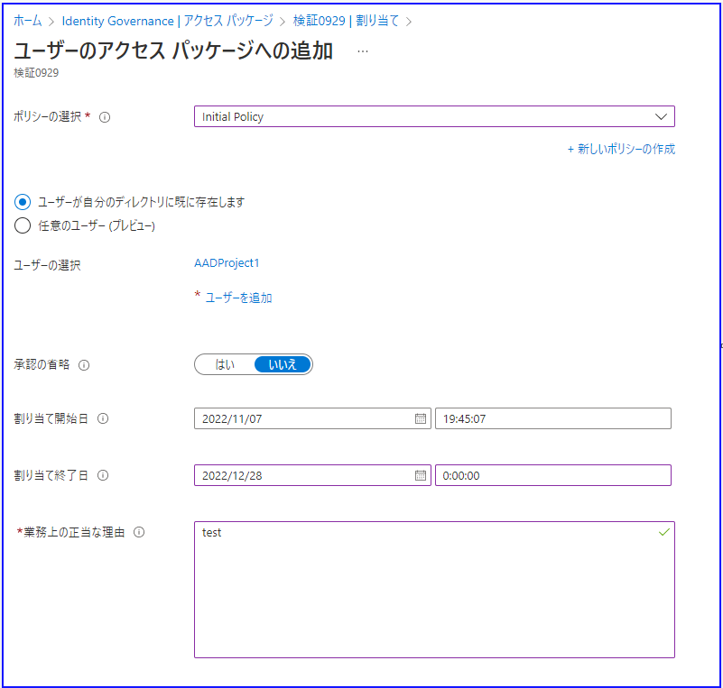
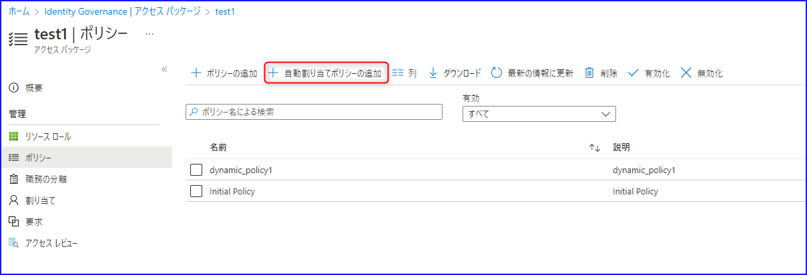

こんにちは。 Azure ID チームの小出です。

この記事では、2022 年 8 月 29 日に公開された [Dynamic automated access with Azure AD entitlement management](https://techcommunity.microsoft.com/t5/microsoft-entra-azure-ad-blog/dynamic-automated-access-with-azure-ad-entitlement-management/ba-p/2466937) の記事の抄訳をもとに、アクセス パッケージの活用方法やポイントなどを紹介します。

---

最近弊社では、Azure Active Directory（Azure AD）Identity Governance の機能を継続的に強化しています。たとえば最新機能では、多段階のアクセス レビューや、 Azure Logic App と連携したエンタイトルメント管理の機能などがリリースされました。

今回ご紹介するのは、エンタイトルメント管理において新しくプレビューになりました「自動割り当てポリシー」の機能です。基本的なアクセス パッケージの機能については、こちらのブログでご案内しておりますので、事前に基礎的な機能・使い方について確認されたい方は [こちら](https://jpazureid.github.io/blog/azure-active-directory/access-management-with-access-package/) をご覧ください。

## 何ができるのか？

アクセス パッケージ ポリシーに事前に設定した条件に応じて、対象となるユーザーにパッケージが自動的に割り当てられるようになります。これにより、アプリケーションへのアクセス許可などを、条件に応じて自動的に適用したり剥奪したりすることが可能となります。動的グループのアクセス パッケージ版のように理解いただくとわかりやすいです。

[こちらの公開情報](https://learn.microsoft.com/ja-jp/azure/active-directory/governance/entitlement-management-access-package-auto-assignment-policy)も併せてご活用ください。

アクセス パッケージは、グループやチーム・アプリケーション・ Sharepoint サイトなどを一括してユーザーに割り当てることができる機能です。この機能を使用しない場合、各リソースにアクセス許可をそれぞれ付与する必要があり、管理者には大きな負担となっていました。アクセス パッケージを活用することで負担は大きく下げることが期待されますが、これまでは「パッケージを割り当てたいユーザーを追加する」もしくは「ユーザーがパッケージを要求する」作業が必要だったため、管理者もしくはユーザー側で操作する必要がありました。

たとえば管理者が割り当てる場合、まず以下の画面で [新しい割り当て] をクリックしていました。

次に、どのユーザーにどのポリシーを使用してパッケージを割り当てるかなどを個別に指定する必要がありました。

管理者が手動で割り当てたり、ユーザーが自身で要求したりできるポリシーももちろん活用できますが、新機能を使うと、「表示名が test から始まるユーザー」 や 「JobTitle 属性に "一般社員" と登録されているユーザー」といった条件をもとに、自動的にアクセス パッケージを割り当てることができるようになります。また、 1 つのアクセス パッケージには複数のポリシーを追加することができるので、自動で追加されないユーザーに手動でパッケージを割り当てることも可能です。

## 設定の仕方

1. Azure ポータルにサインインします。
2. [Identity Governance] - [アクセス パッケージ] をクリックし、ポリシーを作成したいアクセス パッケージを選択します。
3. [ポリシー] タブを開き、下記のように [自動割り当てポリシーの追加] を選択します。

4. [自動割り当てポリシーの作成] 画面が開き、 [ルールの構文] ボックスが表示されるので、右端の "編集" をクリックします。
5. 下記のような設定画面が開きます。

6. ルール ビルダーを活用するか、直接構文を入力して条件を記載します。
7. 設定を保存し、自動割り当てポリシーを作成します。

動的グループを活用されているお客様のなかには、5 の画面には見覚えがあると思います。アクセス パッケージの自動割り当てポリシーでも同じように設定いただければ問題ございませんので、初めて利用される方でも簡単に設定できます。

## 活用ポイント

動的グループは、ライセンスの割り当てやアクセス許可の自動設定に加え、さらにパッケージの静的な割り当てにも活用できますが、自動割り当てポリシーによるエンタイトルメント管理では、さらに以下のようなことも実現可能できます。

### 複数のリソースにまたがるアクセスを一括で管理する

アプリケーション、SharePoint Online サイト、既存の Azure AD グループと Teams、オンプレミス AD にプロビジョニングされたグループなど、アクセス パッケージには複数のリソースを追加することができます。

上記で設定したポリシーを併せて確認することで、どんなユーザーにどのようなリソースへのロールが割り当てられているのかをすぐに確認できます。動的グループでも割り当てを行うことはできますが、どのパッケージに何の権限が割り当たっているのかを一目で確認することができる点は、アクセス パッケージの利点です。

### 複雑な条件でパッケージを割り当てたい場合

静的なポリシーでは、内部向けの場合は特定のユーザーやグループ、ゲストあり or なしのメンバー ユーザーなど、パッケージを要求できるユーザーを大まかにしか指定できませんでした。新機能では、動的グループのような条件でポリシーを作成できるため、より複雑な構成（例外となるユーザーを指定するなど）を行うこともできるようになりました。

### カスタム拡張機能との連携

エンタイトルメント管理のカスタム拡張機能により、Microsoft や 3rd パーティー アプリケーションでのタスクをさらに自動化できます。
ユーザーにパッケージが割り当てられたり、失ったりしたときに、事前に設定したワークフローを実行するよう構成できます。

## よくある質問

Q. 動的割り当てポリシーを作成したら、自動的に動的グループが作成されました。どうしたらいいですか？
A. 動的割り当てポリシーでは、メンバーを評価するために自動的に動的グループが作成されます。AutoAssignment_ から始まる名前であれば、動的割り当てポリシーで使用されています。[公開情報](https://learn.microsoft.com/ja-jp/azure/active-directory/governance/entitlement-management-access-package-auto-assignment-policy)にも記載がありますが、このグループはエンタイトルメント管理で使用されているため、ほかの目的やサービスで指定しないでください。

該当箇所:
このプレビューでは、エンタイトルメント管理によって、スコープ内のユーザーを評価するために、各ポリシーに対応する動的セキュリティ グループが自動的に作成されます。 このグループは、エンタイトルメント管理自体以外は変更しないでください。 また、このグループはエンタイトルメント管理によって自動的に変更または削除される可能性があるため、他のアプリケーションやシナリオではこのグループを使用しないでください。

Q. アクセス パッケージに複数の自動割り当てポリシーを含めてもいいのでしょうか？
A. 動作を確認する限りでは、複数の自動割り当てポリシーを作成できる動作となっています。ただし、[公開情報](https://learn.microsoft.com/ja-jp/azure/active-directory/governance/entitlement-management-access-package-auto-assignment-policy)には最大 1 つと記載されているほか、多くの自動割り当てポリシーを作成すると管理が難しくなるため、 1 つのパッケージに 1 つの割り当てポリシーを設定することをお勧めします。

該当箇所:
このプレビュー期間中は、アクセス パッケージに含められる自動割り当てポリシーは最大 1 つです。

Q. 動作を確認しようと、検証目的で作成した自動割り当てポリシーが削除できません。
A. すでにパッケージにアクティブな割り当てがあると、ポリシーを削除するときにエラーになります。
まずはポリシーを編集し、アクティブに割り当てられることのないような条件に変更してください。たとえば、 ObjectID が Null であるといった条件が利用できます。次に、 [割り当て] 画面から、すでに割り当てられてしまったアクセス権を選択して削除します。その後、自動割り当てポリシー自体も削除することが可能になります。
