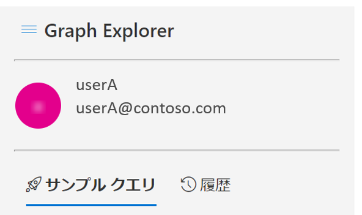
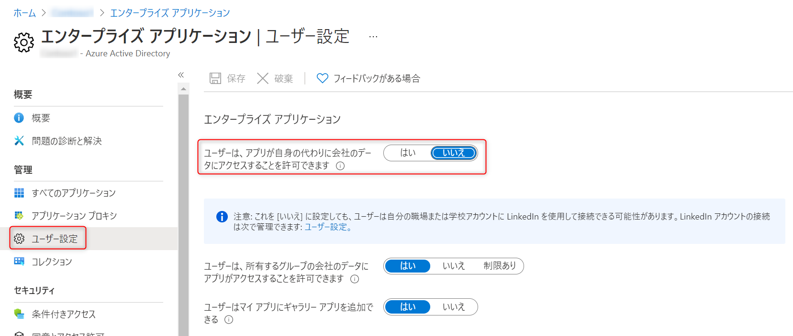
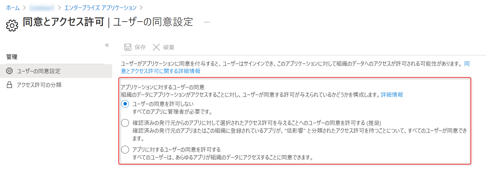

# エンタープライズ アプリケーションに、管理者の知らないアプリケーションが追加されている!

こんにちは。Azure Identity チームの栗井です。

突然ですが、Azure AD の管理者ユーザー様からよく、下記のようなお問い合わせをいただきます。

「Azure AD の [エンタープライズ アプリケーション] 一覧に、管理者が追加した覚えのないアプリケーションが追加されています。」

「これはユーザーが追加したものなのでしょうか。Azure AD のアカウントと連携をとっているのでしょうか。」

「追加されたアプリケーションは、Azure AD 上の情報やリソースにアクセスが発生するものなのでしょうか。心配です。」

## その正体は「マルチテナント アプリケーション」

Azure ポータル上で確認いただける [エンタープライズ アプリケーション] には、既定で多くのアプリのサービス プリンシパルが登録されております。

既定で登録されているもの以外について、どのようなパターンでサービス プリンシパルが追加されるのか？という点については、すべてを網羅的にご案内することは難しいですのですが、大まかには下記の 2 パターンに分けることができます。

1. 権限のあるユーザー (テナント管理者など) が意図的に追加したもの
    - (例) [アプリの登録] 上で登録した Open ID Connect のアプリのサービス プリンシパル
    - (例) SAML 連携しているアプリケーションのサービス プリンシパル
2. ユーザーが何らかのアプリケーションでの認証時に、Azure AD のアカウントを利用することによって、自動的に追加されたもの

上記の 2. の方法で追加されるサービス プリンシパルは、「マルチテナント アプリケーション」という種類のアプリです。マルチテナント アプリのサービス プリンシパル登録は、管理者の操作を必要としません。

**マルチテナント アプリ**とは、**Azure AD アカウントを持つすべてのユーザー (テナント内外問わず) による、アプリおよび API の利用を想定して設計**されているアプリです。

※ 具体的には、マルチテナント アプリは外部の Azure AD のテナントの [アプリの登録] にて登録されています。かつ、サポートしているアカウントとして "任意の組織ディレクトリ内のアカウント (任意の Azure AD ディレクトリ - マルチテナント)" が選択されています。

## どのような操作で、ユーザーによって「マルチテナント アプリケーション」が追加されるのか？

ここでは、弊社が公開しているマルチテナント アプリケーション ["Microsoft Graph Explorer"](https://developer.microsoft.com/ja-jp/graph/graph-explorer) を例に説明します。

["Microsoft Graph Explorer"](https://developer.microsoft.com/ja-jp/graph/graph-explorer) は、Microsoft Graph REST API 要求を簡単に作成し、対応する応答を表示できる開発者ツールです。このアプリケーションは、弊社の Azure AD テナント (microsoft.com) の [アプリの登録] 上で、マルチテナント アプリケーションとして登録されています。

- 仮定 1 : userA さん (userA@contoso.com) は、contoso.com の Azure AD に所属するユーザーです。
- 仮定 2 : contoso.com の Azure AD の [エンタープライズ アプリケーション] 上には、まだ "Microsoft Graph Explorer" のサービス プリンシパルは存在しません。
### userA さんによってマルチテナント アプリ「Graph Explorer」が追加される時の操作

1. userA さんは、 ["Microsoft Graph Explorer"](https://developer.microsoft.com/ja-jp/graph/graph-explorer) にアクセスします。
2. userA さんは下記のボタンから、自身の Azure AD アカウントで認証します。

    

3. パスワード認証後、userA さんには下記の画面が表示されます。この例では、openid, profile, User.Read, offline_access へのアクセス許可が要求されているので、userA さんは "承諾" を押下します。

    

4. userA@contoso.comでのサインインが成功します。

    

5. 次回以降 userA が Graph Explorer にアクセスする際は、openid, profile, User.Read, offline_access のアクセス許可への同意が要求されることはありません。

userA が上記の操作を行った後、管理者によって contoso.com テナントの [エンタープライズ アプリケーション] を開くと、下記のように "Graph explorer (official site)" という名前のサービス プリンシパル が追加されています。

正確には、3. でユーザーが  "承諾" を押下したタイミングで、このサービス プリンシパルが作成されています。

なお、同じアプリケーションのサービス プリンシパルが、テナント上に複数登録されることはありません。userA による上記の操作によって作成されたサービス プリンシパルは、今後他のユーザーが Graph Explorer にアクセスする際にも利用されるようになります。

## よくある質問 (1) 管理者の知らないところでユーザーによって登録された マルチテナント アプリケーションは、Azure AD 上のリソースにアクセスが可能なのですか？セキュリティ的に心配です。

これは「はい」であり「いいえ」です。まず、下記の大原則がございます。
1. アプリケーションが Azure AD のリソースにアクセスするためには、テナントのユーザーが明示的に "アクセス許可" を付与する操作が必要です。その操作が行われるのは (先ほども出てきた) この画面です。

    

2. ユーザーが "アクセス許可" を承諾することができるのは、そのユーザー自身がアクセスできるリソースの範囲に限られます。
3. Azure AD テナント全体 (テナントユーザー全員のリソースや、テナント自体に紐づくデータなど) へのアクセス許可を承諾することができるのは、管理者ユーザーのみです。

"アクセス許可" 自体の考え方や仕組みについては、下記の記事でより詳細に、分かりやすくご紹介しておりますので、こちらをご覧ください。
- 「管理者の承認が必要」のメッセージが表示された場合の対処法(https://jpazureid.github.io/blog/azure-active-directory/azure-ad-consent-framework/)

ここでお伝えしたいことの要点は下記の通りです。
- **管理者が知らないところで一般ユーザーによって追加されたマルチテナント アプリのサービス プリンシパルが、Azure AD のリソース全体にアクセスできる ! ということは起こりえません**ので、ご安心ください。
- なぜなら、Azure AD のリソース全体にアクセスするための許可をサービス プリンシパルに与えられるのは、管理者ユーザーのみだからです。
- 一般ユーザーは、部分的なアクセス許可を与えることができます。
先述の例だと、userA は Graph Explorer に対して、下記のアクセスを許可しています。
    - userA 自身の基本情報 (profile) へのアクセス
    - userA が許可済みのアクセスに対する、継続的なアクセス権 (offline_access)
    - [profile と offline_access についての詳細はこちら](https://docs.microsoft.com/ja-jp/azure/active-directory/develop/v2-permissions-and-consent#openid-connect-scopes)

## よくある質問 (2) エンタープライズ アプリケーションが勝手に追加されるのは不本意です。一般ユーザーによるこの操作を禁止することは可能でしょうか?

結論から言うと可能です。

前述の通り、マルチテナント アプリケーションのサービス プリンシパルが追加されるタイミングは、「ユーザーが認証後、アクセス許可を承諾した時」です。
なので、ユーザーによるアクセス許可の承諾を禁止することで、マルチテナント アプリケーションの追加もできなくなります。

これによって、ユーザーの認証後に表示される "アクセス許可" の画面が、下記の画面に置きかわります。

ユーザーは管理者によってアクセス許可が承諾されない限り、このアプリケーションへアクセスすることができません。

ユーザーによるアクセス許可の承諾を禁止する設定項目は 2 つございます。

### 1. [エンタープライズ アプリケーション] > [ユーザー設定]

設定項目 : [ユーザーは、アプリが自身の代わりに会社のデータにアクセスすることを許可できます]
この項目を "いいえ" にすることで、ユーザーはアプリケーションに対していかなるアクセス許可も承諾することができなくなります。 

### 2. [エンタープライズ アプリケーション] > [同意とアクセス許可]

この画面では、前述の [ユーザー設定] よりも細かい設定が可能です。
[ユーザー設定] では、ユーザーによるアクセス許可承諾の可否は "はい" "いいえ" のみが選べますが、ここではその中間の選択肢があります。それが "確認済みの発行元からのアプリに対して選択されたアクセス許可を与えることへのユーザーの同意を許可する (推奨)" です。

とてもカジュアルに言い換えると、「発行元が怪しくないアプリケーションに対する、部分的なアクセス許可であれば、一般ユーザーでも承諾することができる」ということです。

- "確認済みの発行元" とは、「自身のテナント」+「Microsoft によって認められた発行元」のことを指します。「Microsoft によって認められた発行元」についての詳細は下記の公開情報をご覧ください。
    - [発行者の確認(docs.microsoft.com)](https://docs.microsoft.com/ja-jp/azure/active-directory/develop/publisher-verification-overview)
- "選択されたアクセス許可" とは、管理者があらかじめ [アクセス許可の分類] に登録したアクセス許可のことです。
    - 設定画面 : [エンタープライズ アプリケーション] > [同意とアクセス許可] > [アクセス許可の分類]

## よくある質問 (3) ユーザーによるアクセス許可の承諾を一切禁止したので、勝手にマルチテナント アプリケーションが追加されることはなくなりました！ただし、ユーザーが本当に必要なマルチテナント アプリケーションの利用を許可するには、どうすればいいでしょうか。

結論から言うと、「ユーザーに代わって、管理者が代わりにアクセス許可を付与すること」が必要です。

再掲になりますが、下記の記事で手順をご紹介しています。
- 「管理者の承認が必要」のメッセージが表示された場合の対処法(https://jpazureid.github.io/blog/azure-active-directory/azure-ad-consent-framework/)

以上の情報がご参考になれば幸いです。
ご不明な点がございましたら弊社サポートまでお気軽にお問い合わせください !
