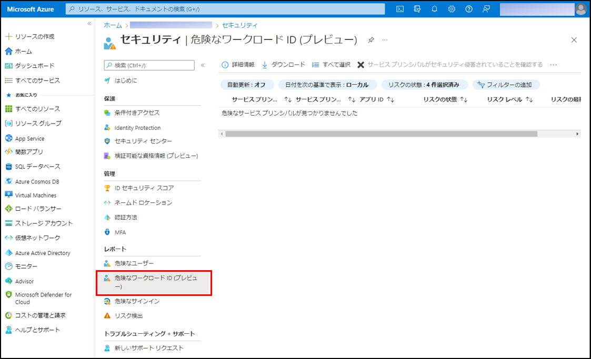
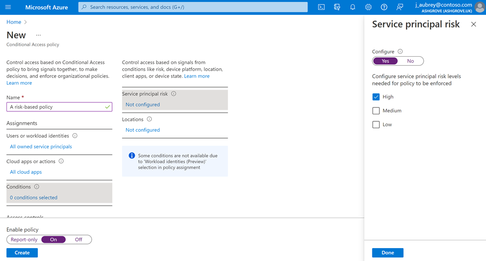
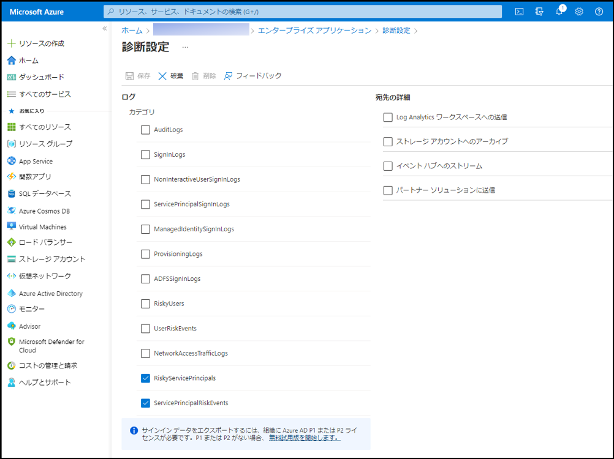

# Azure AD Identity Protection がワークロード ID へも拡張

こんにちは、Azure Identity サポート チームの 村上 です。

本記事は、2022 年 2 月 23 日に米国の Azure Active Directory Identity Blog で公開された [Extend the reach of Azure AD Identity Protection into workload identities](https://techcommunity.microsoft.com/t5/azure-active-directory-identity/extend-the-reach-of-azure-ad-identity-protection-into-workload/ba-p/2365666) を意訳したものになります。ご不明点等ございましたらサポート チームまでお問い合わせください。

---

本日は、[ワークロード ID 向け Azure AD Identity Protection のパブリック プレビュー](https://docs.microsoft.com/ja-jp/azure/active-directory/identity-protection/concept-workload-identity-risk) をご紹介できることを嬉しく思います。弊社では、特に現在の攻撃者の振る舞いを考慮し、ユーザー アカウントの保護から得たすべての知見を [ワークロード ID](https://docs.microsoft.com/ja-jp/azure/active-directory/develop/workload-identities-overview) に適用すべく、お客様とともに取り組んできました。ワークロード ID 用に開発された異常検知機能により、ユーザー用の検知機能と併せ、お客様の資産全体を保護可能です。

企業のクラウド コンピューティングへの移行に伴い、企業はクラウド リソースにアクセスするソフトウェア ワークロード (アプリケーション、サービス、スクリプトなど) を展開しています。これらのワークロードでは、Azure AD の [ワークロード ID](https://www.microsoft.com/en-us/security/business/identity-access-management/workload-identity-management)（アプリケーション、マネージド ID、およびサービス プリンシパル）が利用されます。

当社の社内調査によると、通常、組織にはユーザーの **5 倍以上** のソフトウェア ワークロードが存在すると言われています。ワークロード ID が侵害されると、それらは攻撃者が攻撃先をさらに横展開して広げていく足がかりとなります。このような攻撃は増加の一途をたどっており、お客様においても喫緊でこれら ID のセキュリティに、人間のユーザーのセキュリティと同じように目を向けつつある状況です。

さっそく、[ワークロード ID 向け Azure AD Identity Protection](https://docs.microsoft.com/ja-jp/azure/active-directory/identity-protection/concept-workload-identity-risk) の新しい検出、制御、SIEM 統合機能とその効果について見ていきましょう。

## 侵害されたワークロード ID の検出と対応

組織は貴重なリソースとデータを保護するために、侵害のリスクを減らす機能を必要としています。Azure AD Identity Protection ではすでに、認証情報が漏洩したユーザーやリスクの高いセッションを検出することでお客様を保護しています。今回の発表では、この保護をワークロード ID に拡張し、疑わしいログイン パターンやディレクトリの変更を含む、アプリケーションの異常な動作のレポート機能を提供することで、より迅速に攻撃を検出して修正できるように支援します。

## リスク ベースの条件付きアクセスで、ゼロ トラストの展開を強化

ゼロ トラストの重要なポイントは、「明示的な検証」を行い、システムが異常を検出した場合には安全を確保することです。リスク ベースの条件付きアクセス ポリシーを適用することで、Identity Protection がリスクの高いワークロード ID を Microsoft Graph で検出したときに、アクセスをブロックすることが可能です (Azure Portal でのサポートは近日公開予定です)。つまり、すべてのシングル テナントのアプリケーションにおいて、高リスク、中リスク、低リスクの任意の組み合わせでブロックするポリシーを設定できます (マルチ テナントのアプリケーションについては、今後対応予定です)。

## リスク データを任意の場所にエクスポート

非常に多くのお客様が、Azure ポータル以外のツールを使って Identity Protection のログを解析しています。本日より、分析または長期保存のために、リスク イベントをご希望のソリューションにエクスポートすることが可能となります。ポータル上の [診断設定] から、お試しいただけます。

弊社では、ワークロード ID を含むすべての ID の保護に取り組んでおり、この分野のさらなる新機能を近々お届けする予定です。わたしたちは、いつもながら、皆様の貴重なフィードバックをお待ちしています。ワークロード ID に関する詳細は、[ID 保護に関するドキュメント](https://docs.microsoft.com/ja-jp/azure/active-directory/identity-protection/concept-workload-identity-risk) をご覧ください。
