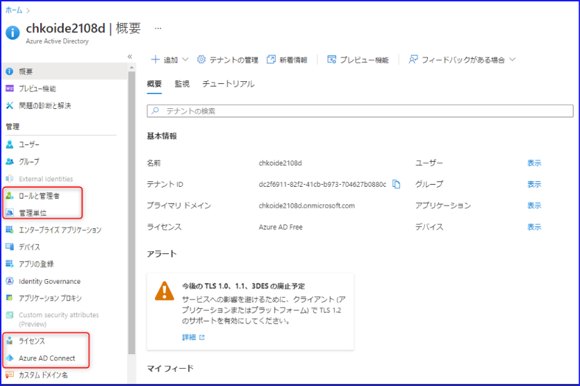
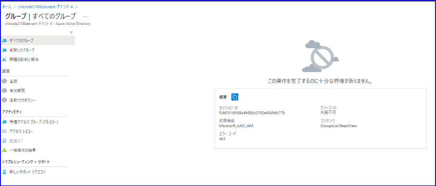
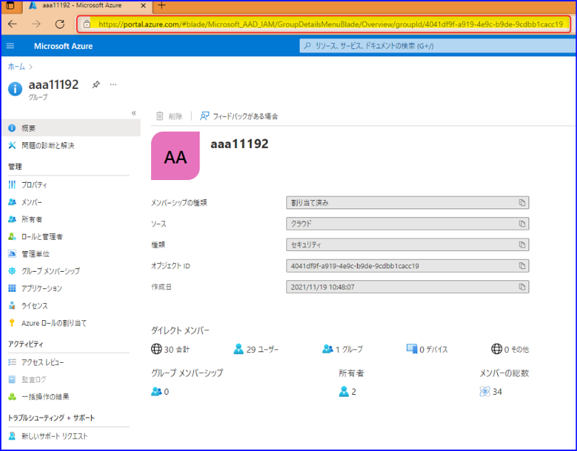

こんにちは、 Azure ID チームの小出です。

今回は、外部コラボレーションの設定で指定できる、ゲスト ユーザーのアクセス制限についてご紹介します。

Azure ポータルには、招待されたゲスト ユーザーがどのような情報にアクセスできるか・できないかを制御する設定項目があります。
具体的には、下記画面の [ゲスト ユーザーのアクセス制限] の 3 つの選択肢で、ゲストがアクセスできる範囲を指定できます。

この設定については、[外部コラボレーションの設定を構成する](https://docs.microsoft.com/ja-jp/azure/active-directory/external-identities/external-collaboration-settings-configure) にて詳細を確認することができますが、各選択肢について、具体的にどのような違いがあるのか分からない・詳細を教えてほしいというお問い合わせを多くいただいております。

そのため今回は、それぞれの選択肢を指定した際、ゲスト ユーザー側から見ると、どのような変化があるかを、画面ショット付きでご案内します。

# [ゲスト ユーザーは、メンバーと同じアクセス権を持ちます (制限が最も少ない)] を選択した場合
詳細は[公開情報](https://docs.microsoft.com/ja-jp/azure/active-directory/fundamentals/users-default-permissions)に記載の通り、ゲスト ユーザーとメンバー ユーザーでは、既定で持っているアクセス権が異なりますが、この設定に変更すると、ゲスト ユーザーは、テナントにいる「管理者ロールを持たないメンバー ユーザー」と同じアクセス権を持つようになります。

具体的には、ゲスト ユーザーはたとえば下記画面のように、[ロールと管理者]、[管理単位]、[ライセンス]、[Azure AD Connect] などの情報を確認することができます。

※[ユーザー]、[グループ] で確認できる情報については、「管理者ロールを持たないメンバー ユーザー」と同じアクセス権で確認できる情報と同じです。詳細な記載は省略しますが、ユーザー一覧・グループ一覧を確認できます。

# [ゲスト ユーザーは、ディレクトリ オブジェクトのプロパティとメンバーシップへのアクセスが制限されます] を選択した場合
既定の設定です。ゲスト ユーザーは、メンバー ユーザーと同じアクセス権を持たず、一部閲覧できない項目があります。

たとえば、メンバー ユーザーと異なり、[ユーザー] の画面にて、ユーザー一覧が表示されません。以下のようにメッセージが表示されます。

ただし、任意のユーザーの ObjectID を入力することができれば、ほかのユーザーの詳細を確認することができます。

グループにつきましては、ユーザー一覧のように検索ボックスは表示されず、以下のように "この操作を完了するのに十分な特権がありません。" とのエラー メッセージが表示されます。

 
しかし、ユーザーと同様、Azure ポータル - [Azure Active Directory] - [グループ] のブレードにアクセスしたときの URL をもとに、グループの ObjectID を含む URL にアクセスすると、下記のグループ詳細画面にアクセスすることが可能です。

具体的には、以下のような URL を直接指定できれば、グループの詳細を閲覧することができます。
 
URL 例（GroupID/ の後ろに、グループの ObjectID を指定します。）
https://portal.azure.com/#blade/Microsoft_AAD_IAM/GroupDetailsMenuBlade/Overview/groupId/4041df9f-a919-4e9c-b9de-9cdbb1cacc19
 

その他、[ロールと管理者] から、誰がどの管理者ロールを持っているか確認したり、テナントに紐づいているライセンス一覧を確認したりすることはできません。

# [ゲスト ユーザーのアクセスは、各自のディレクトリ オブジェクトのプロパティとメンバーシップに制限されます (最も制限が多い)] を選択した場合
ゲスト ユーザーは、自身のプロパティにアクセスすることができます。自分の名前や UPN を確認することが可能です。

しかしながら、その他のユーザーをユーザー一覧から検索したり、グループの詳細画面にアクセスしたりすることもできなくなります。（ほかのユーザーの ObjectID を入力しても検索できません。）

ゲスト自身が、何らかのグループに所属しているかどうかは閲覧できますが、具体的にどのグループに所属しているのか、名前は表示されません。
（ObjectID のみ表示されますが、ObjectID をもとにグループを検索することもできません。）

下記画面でグループをクリックすると、"アクセス権がありません" の画面が表示されます。

具体的には、上記の画面で対象グループをクリックしたり、 ObjectID を含む URL に直接アクセスしても、グループの詳細は閲覧できません。下記のようなエラーとなります。

この設定に変更すると、ゲストがアクセスできる範囲は「ゲスト ユーザー自身に関する情報のみ」とご認識いただければと思います。

-----
今回は、ゲスト ユーザーのアクセス制限の項目を設定した時に、どのような見え方となるかをご案内させていただきました。

[外部コラボレーションの設定] のほかの項目につきましても、順次本ブログにてご案内できればと考えておりますので、その際は新しい記事も併せてご覧いただければと思います。
