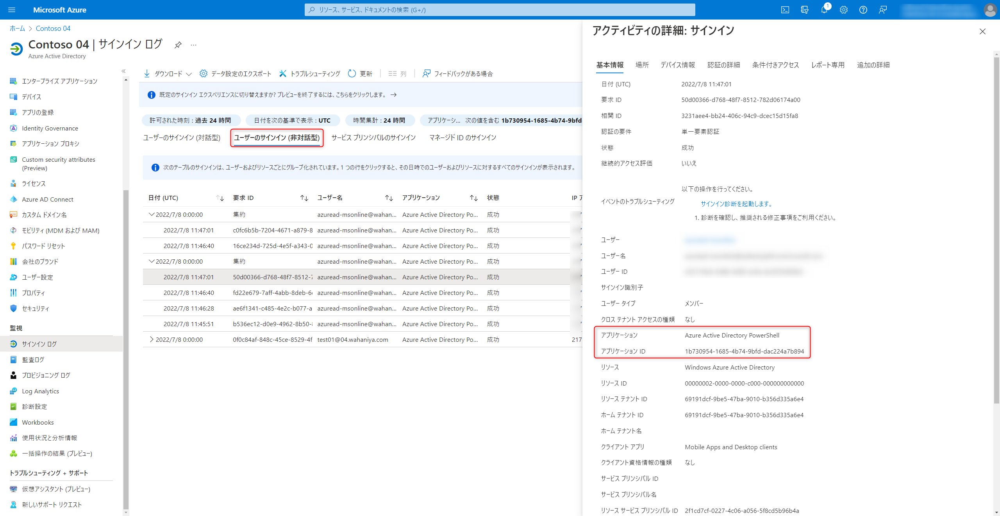

# Azure AD Graph / MSOnline PowerShell モジュール利用状況の調べ方

こんにちは、Azure Identity サポート チームの 埴山 です。

## Azure AD Graph / MSOnline PowerShell モジュールの廃止予定

[Azure AD の変更管理を簡素化します](../azure-active-directory/azure-ad-change-management-simplified.md) の記事でお伝えしております通り、 MSOnline および Azure AD for Graph (Preview 含む) は 2022 年 12 月 **以降** に廃止が予定されております。改めて廃止が予定されているモジュールは、以下の通りです。

| 名前 | モジュール名 | プレフィックス | コマンド例 |
| :--- | :--- | :--- | :--- |
|MSOnline (Azure AD v1)|MSOnline|Msol|Connect-MsolService, Get-MsolUser|
|Azure AD for Graph (Azure AD v2)| AzureAD | AzureAD | Connect-AzureAD, Get-AzureADUser |
|Azure AD for Graph preview (Azure AD v2 preview)| AzureADPreview | AzureAD | Connect-AzureAD, Get-AzureADUser |

これらのモジュールを利用しているすべてのお客様は、Microsoft Graph API への移行を検討いただく必要がございます。

## モジュールを利用しているかの確認方法

最近、廃止されるモジュールを利用しているか Azure AD のログから確認する方法はないかとのお問合せを多く頂きます。ただ、残念ながら Azure AD のログからすべての利用履歴を精査することはできません。
 
### スクリプトの内容を確認する

モジュールを利用しているか正確に確認する唯一の方法は、実際に利用されておりますスクリプトの内容を精査する方法です。

MSOnline PowerShell (以下 Msol) モジュール, Azure AD for Graph (以下 AzureAD) モジュールの利用箇所についてはお客様環境で利用しているスクリプトなどの精査が必要です。
具体的には AzureAD および MSOL モジュール利用時には、必ず以下のいずれかのコマンドで Azure AD に認証を行います。(大文字小文字は区別しません)

Connect-MsolService
Connect-AzureAD

従って、これらのコマンドを業務で利用していないか、これらのコマンドが含まれているバッチファイルが存在しないかなどを精査することが有効です。

しかしながら、スクリプトの精査が難しい場合や、棚卸の補助として Azure AD に保存されたサインイン ログから一部の利用履歴や、該当する可能性のあるログを抽出することが可能です。
抽出されたログの IP アドレスや利用ユーザーなどから、利用元のマシンやシステムを推測することを検討ください。

###  サインインからスクリプトが使われているか確認する

ユーザーの資格情報を利用しモジュールを利用する場合、利用履歴が Azure AD のログに記録されます。(例 1, 2)
これらのログは Azure AD のサインイン ログからアプリケーション Azure Active Directory PowerShell (AppId: 1b730954-1685-4b74-9bfd-dac224a7b894) を絞り込むことで確認が可能です。(AzureAD, MSOL のいずれも同じアプリとして表示され区別はつきません)

####  例1. 対話的な認証を実施しサインインしている場合

```powershell
# オプションなしで実行
Connect-AzureAD
Connect-MsolService
```

#### 例2. 埋め込まれたユーザー名パスワードを利用してサインインしている場合

```powershell
# UPN を含む Credential を指定
$password = ConvertTo-SecureString 'SecurePassword' -AsPlainText -force;
$cred = New-Object System.management.Automation.Pscredential($username, $password);

Connect-MsolService -Credential $cred;
Connect-AzureAD -Credential $cred -TenantId $tenantId
```

例 1, 2 の場合サインインログは "Azure Active Directory PowerShell" (AppId:	
1b730954-1685-4b74-9bfd-dac224a7b894)  のアプリ名にて記録されます。

つまり Azure ポータルの[サインイン ブレード](https://portal.azure.com/#view/Microsoft_AAD_IAM/ActiveDirectoryMenuBlade/~/SignIns) にて、フィルターにアプリケーションを追加後 `1b730954-1685-4b74-9bfd-dac224a7b894` のアプリ ID 入力し絞り込むことで、利用者の特定が可能です。


> [!NOTE]
> 例 2 の場合はユーザーのサインイン (非対話) に記録される場合があります。



> [!NOTE]
> バッチ処理に組み込まれたシステムユーザーの場合、どのマシンで実行しているかの情報は残念ながら確認できないので、IP アドレスや時間などから、利用されているマシンやシステムを特定できないか検討ください。

#### 例3. サービス プリンシパルの資格情報を利用

```powershell
Connect-AzureAD -TenantId $tenantId -ApplicationId $appId -CertificateThumbprint $thumb
```

AzureAD モジュールではアプリの資格情報を利用する例もあり、バッチ処理では一般にこちらの方式をお勧めしておりました。

例 3 のようにアプリケーション ID を指定したサインインでは、お客様が登録したアプリの ID で認証が実施され、モジュールを利用していない認証と区別がつきませんので、Azure AD 側のログからは特定が困難です。


認証に利用したアプリケーションのログとして記録されます。
例えば、以下のようなコマンドにて Azure AD に接続を実施したとします。(07e819fe-9ab3-4dc5-9e9a-89ecd77b828e はアプリケーション ID です)
 
Connect-AzureAD -ApplicationId 07e819fe-9ab3-4dc5-9e9a-89ecd77b828e -TenantId $tenantId -CertificateThumbprint $certThumb
 
この場合、サインイン ログは [Azure Active Directory] > [サインイン ログ] > [サービス プリンシパルのサインイン] に記録されます。
 
具体例は以下の通りで、アプリケーション ID は Connect-AzureAD コマンドで指定したものが、アプリケーション名は、お客様が登録したアプリ名で記録されます。(下記例では Connect-AzureAD as app というアプリ名のアプリを作成しています)


唯一、見分け方として、Connect-AzureAD での接続時に記録されるサインインログの "リソース" プロパティ は Windows Azure Active Directory となる点が挙げられます。
ただ Connect-AzureAD 以外でもこの値が記録される可能性があるため、上記ログが必ずしも Connect-AzureAD での利用とは限らない点にご留意ください。

## まとめ

Msol, Azure AD モジュールは、2022 年 12 月以降に廃止予定です。モジュールが利用されているかを特定するには、Connect-MsolService, Connect-AzureAD コマンドを実行しているか、バッチ処理に含まれるかを精査することが最も有効です。

サインインログから調査する場合、Connect-MsolService と Connect-AzureAD コマンドの認証ログは
 
- 対話的なサインイン ログと非対話型のサインインログではアプリケーション "Azure Active Directory PowerShell" のログが該当する
- サービス プリンシパルでのサインイン ログでは リソース プロパティが “Windows Azure Active Directory” のログに含まれる **可能性がある**

これらのログから、利用ユーザーやバッチ処理の特定を検討ください。

引き続き、本ブログでは廃止予定のモジュールの移行方法に関して発信していきます。
ご不明な点等ございましたら、是非弊社サポートサービスをご利用ください。


## Q & A

### Connect-AzureAD の -AadAccessToken オプションまたは -MsAccessToken を利用して接続しているログを特定する方法はないでしょうか

それぞれのオプションでは Azure AD Graph API, Microsoft Graph API に対するアクセス トークンを指定します。アクセス トークンの取得方法によりログの出力が異なりますので、サインインログから特定することは困難です