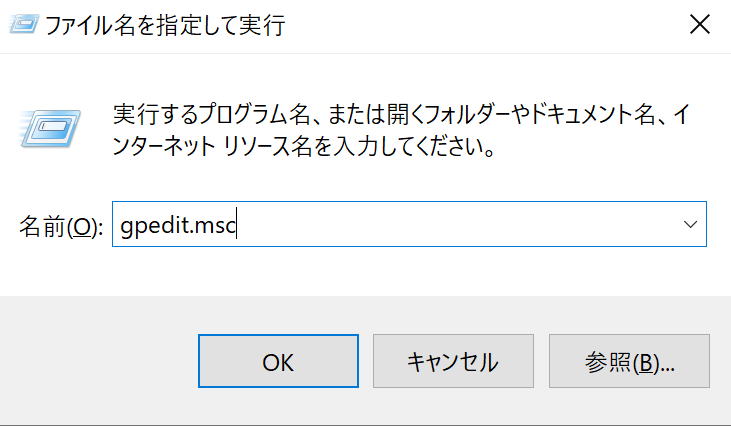
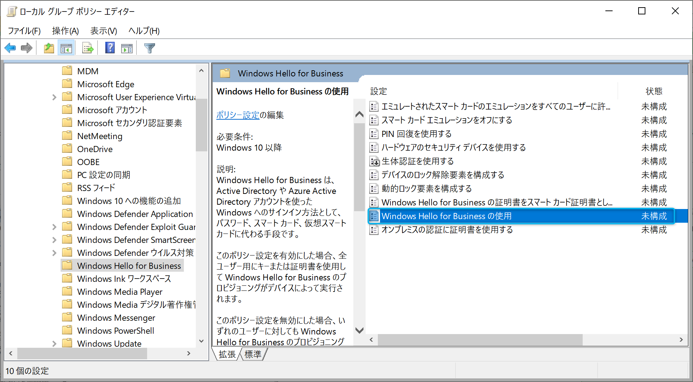
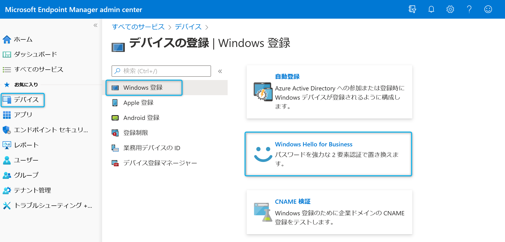
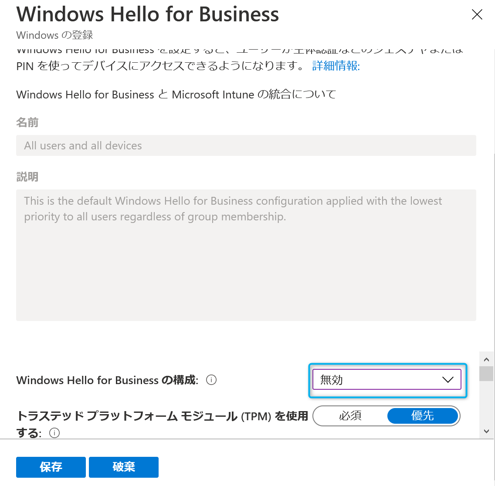
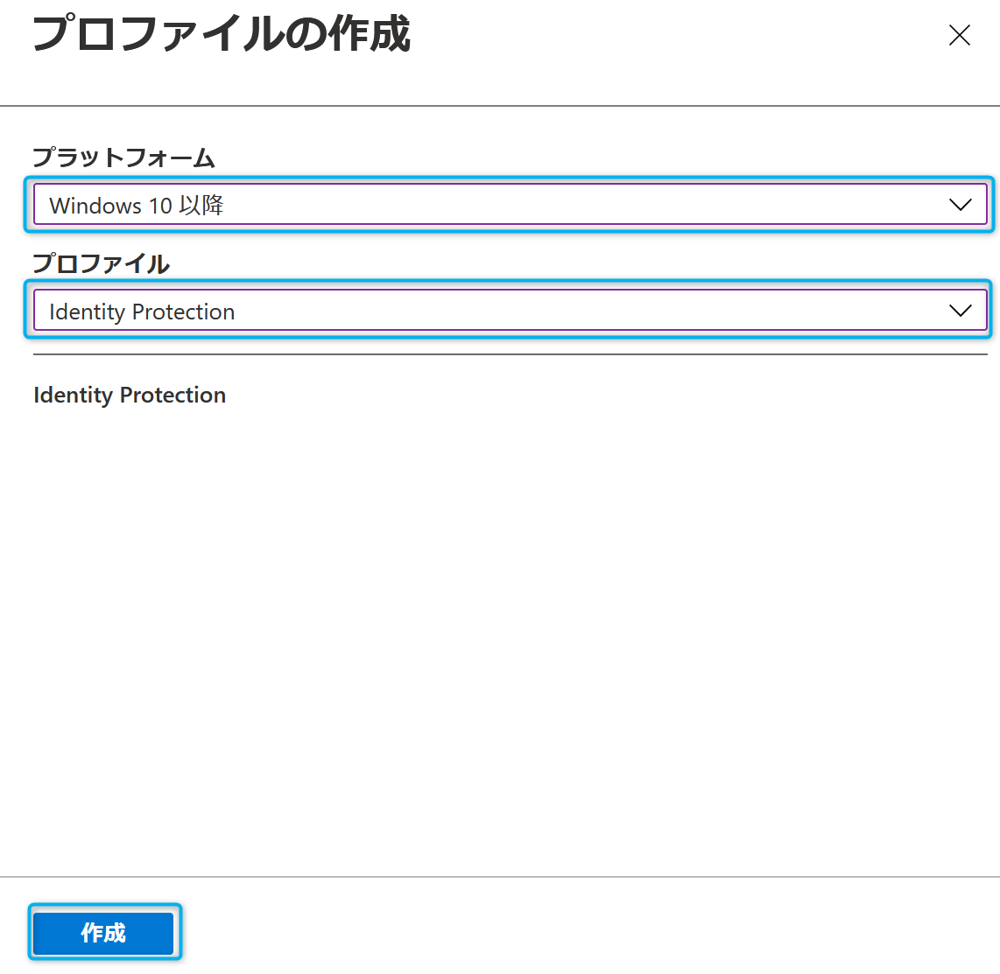
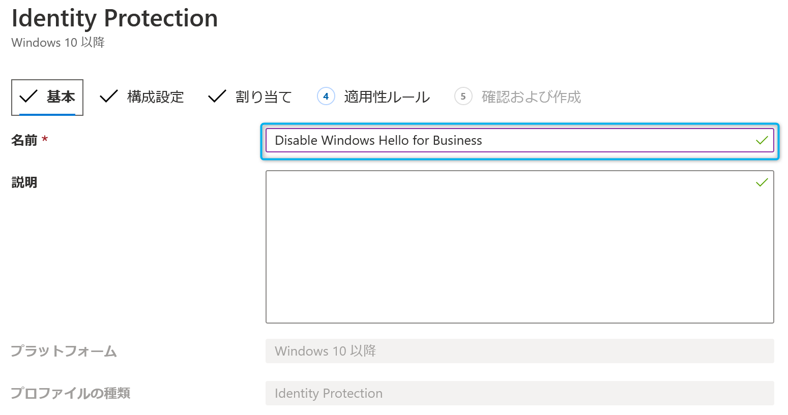
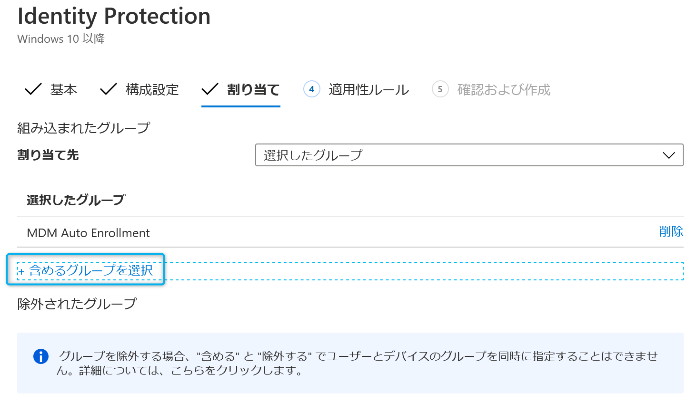
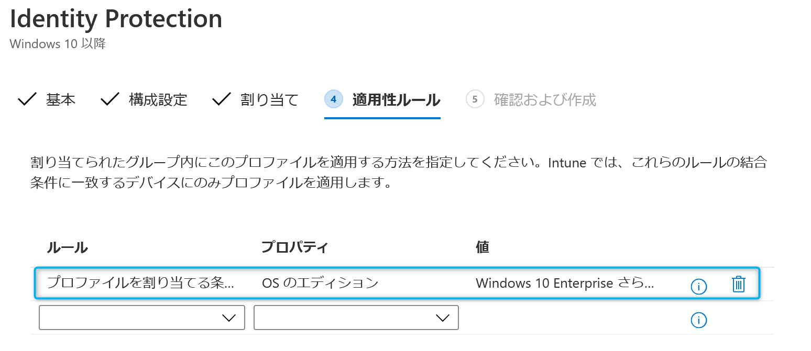

# Azure AD 参加後に有効になる Windows Hello for Business とその無効化方法について
こんにちは、Azure & Identity サポート チームの中山です。

昨今では、オンプレミス環境からクラウド環境へ随時移行を検討されている企業も多く、デバイスもオンプレミスの Active Directory で管理するのではなく、クラウド サービスである Azure AD と Microsoft Intune などの MDM で管理するといった方法も選択肢となっております。

今回は、Azure AD でデバイスを管理する方法の 1 つである "Azure AD 参加 (Azure AD Join)" 後に既定で有効になる Windows Hello for Business についての説明と、さらに Windows Hello for Business の無効化方法について紹介します。

Azure AD 参加については、以下の記事で Azure AD 登録の違いと比較し、まとめてますのでもしよろしければこちらもご参照ください。

[Azure AD 登録 と Azure AD 参加 の違い](https://github.com/jpazureid/blog/blob/master/articles/azure-active-directory/azure-ad-join-vs-azure-ad-device-registration.md)

## Windows Hello for Business とは
Windows Hello for Business は、デバイスへのサインインにおいて、パスワードを PIN や生体認証 (顔認証、指紋認証など) に置き換えてサインインできるようにする機能です。

つまり、Windows Hello for Business を使用することで、ユーザーはパスワードを使用せずとも、PIN や生体認証を使用してセキュアに、そして手軽にデバイスへサインインできます。

なお、Windows Hello と Windows Hello for Business は、いずれも PIN や生体認証を用いた Windows へのサインイン方法ですが、違いは以下のようになります。
- Windows Hello はパスワード情報そのものを端末の TPM と呼ばれるセキュアな領域に格納し、PIN や生体認証を行うことで TPM からパスワードそのものを提示します。
- Windows Hello for Business はパスワード自体をログオン処理で使用しておらず、秘密鍵/公開鍵のペアによって認証する仕組みとなり、TPM にはパスワードではなく秘密鍵が格納されます。
- Windows Hello は Azure AD ユーザーとして認証しない構成 (端末のローカル ユーザーとしてサインイン、もしくはオンプレミス AD に参加して AD ユーザーとしてサインイン) 時のみの利用を想定しています。

今回は、Azure AD に参加し、Azure AD ユーザーとして Windows にサインインする構成を想定しているため、Windows Hello for Business を対象としています。

マイクロソフトは、以下のサイトからダウンロードできるホワイトペーパーでパスワードレスを推奨しており、Windwos Hello for Business はそれに適った機能です。

[パスワードの終わり、これからはパスワードレス](https://www.microsoft.com/ja-jp/security/business/identity/passwordless)

しかし、企業によっては、組織の要件で Windows Hello for Business をユーザーに使用させたくない要望もあるかもしれません。

例えば、Azure AD 参加し、Azure AD ユーザーでサインインすることで Azure AD で管理されたリソース (Office 365 など) へシングル サインオン (SSO) ができます。

ここで Windows Hello for Business を使用してサインインした場合、多要素認証 (MFA) を実施済みと判定されます。  

つまり、Azure AD の条件付きアクセスやユーザー毎の MFA の設定でユーザーに MFA を要求するように構成していたとしても、Windows Hello for Business でのサインインでは MFA が求められません。

この動作が組織の要件にそぐわない場合、Azure AD 参加を構成することで既定で有効になる Windows Hello for Business を無効にする必要があります。  

また、 Azure AD 参加することで自動的に Windows Hello for Business の資格情報登録を求められるのですが、ユーザーへの操作方法の周知ができていないため、ユーザーの混乱を防ぐという目的で Windows Hello for Business を無効にしたいという場合もあると思います。

ここでは、Windows Hello for Business について簡単に説明しましたが、技術的な詳細については、以下の公開情報をご参照ください。

[Windows Hello for Business の概要](https://docs.microsoft.com/ja-jp/windows/security/identity-protection/hello-for-business/hello-overview)

## Azure AD 参加するデバイスで Windows Hello for Business を無効にする方法
Azure AD 参加を構成したデバイスにて、既定で有効となる Windows Hello for Business は、以下 3 つのいずれかの方法で無効にすることができます。

a. ローカル グループ ポリシーで Windows Hello for Business を無効にする方法  
b. Microsoft Intune のポリシーで Windows Hello for Business を無効にする方法  
c. Microsoft Intune の構成プロファイルで Windows Hello for Business を無効にする方法

上記 3 つのどの方法が適しているかは、要件次第です。

まず、Microsoft Intune を利用していない環境においては、[a. ローカル グループ ポリシーでの Windows Hello for Business を無効にする方法] を選択するしかありません。

一方、Microsoft Intune を利用している環境では、a の方法も利用できますが、[b. Microsoft Intune のポリシーで Windows Hello for Business を無効にする方法] もしくは [c. Microsoft Intune の構成プロファイルで Windows Hello for Business を無効にする方法] を選択した方が、簡単に無効化を行うことができます。  

使い分けとしては、Azure AD 参加及び Microsoft Intune 登録する全てのデバイスに対して、Windows Hello for Business を無効にしたい場合は、b. Microsoft Intune のポリシーで Windows Hello for Business を無効にする方法] を選択するのが良いでしょう。  

また、一部のユーザーや一部のデバイスのみ Windows Hello for Business を無効にしたい場合は、[c. Microsoft Intune の構成プロファイルで Windows Hello for Business を無効にする方法] を選択することになります。

では、それぞれの設定方法を以下に記します。

### a. ローカル グループ ポリシーでの Windows Hello for Business を無効にする方法
Microsoft Intune を利用していない場合は、ローカル グループ ポリシーで Windows Hello for Business を無効にします。
手順は以下の通りです。

1. Ctrl + R の [ファイル名を指定して実行] にて gpedit.msc と入力し、ローカル グループ ポリシー エディターを起動します。

    

2. 以下のパスへ移動します。
[コンピューターの構成] - [管理テンプレート] - [Windows コンポーネント] - [Windows Hello for Business]

    

3. "Windows Hello for Business の使用" を "無効" にします。  
※ "未構成" もしくは "有効" の場合、Windows Hello for Business は有効として機能します。

    

4. デバイスを再起動します。

### b. Microsoft Intune のポリシーで Windows Hello for Business を無効にする方法
Azure AD へデバイス登録すると同時に Microsoft Intune へも登録されるように自動登録を構成している場合、 以下の手順で Azure AD 参加する全てのデバイスの Windows Hello for Business を無効にすることが出来ます。

1. Microsoft Endpoint Manager 管理センター (https://endpoint.microsoft.com) へグローバル管理者権限を持つユーザーでサインインします。

2. [デバイス] - [デバイスの登録] - [Windows の登録] - [Windows Hello for Business] へ移動します。

    

3. [Windows Hello for Business の構成] を "無効" にします。  
※ "構成されていません" もしくは "有効" の場合、Windows Hello for Business は有効として機能します。

    

4. [保存] を押下して設定変更を完了させます。

本設定については、以下の公開情報にも記載されておりますので、必要に応じてご参照ください。


[Windows Hello for Business と Microsoft Intune の統合](https://docs.microsoft.com/ja-jp/mem/intune/protect/windows-hello)

### c. Microsoft Intune の構成プロファイルで Windows Hello for Business を無効にする方法
Azure AD へデバイス登録すると同時に Microsoft Intune へも登録されるように自動登録を構成している場合、 以下の手順で一部のユーザーや一部のデバイスに対して Windows Hello for Business を無効にすることができます。

1. Microsoft Endpoint Manager 管理センター (https://endpoint.microsoft.com) へグローバル管理者権限を持つユーザーでサインインします。

2. [デバイス] - [構成プロファイル] へ移動し、[プロファイルの作成] を押下します。

    

3. 以下の通り設定し、[作成] を押下します。  
   プラットフォーム : Windows 10 以降  
   プロファイル : Identity Protection

    
  
4. [基本] 項目で任意の名前を設定し、[次へ] を押下します。

    

5. [構成設定] 項目で以下の通り設定し、[次へ] を押下します。
   Windows Hello for Business の構成 : 無効にする

    

6. [割り当て] 項目で対象もしくは対象外とするユーザーやデバイスのグループを設定し、[次へ] を押下します。

    

7. [割り当て] 項目でプロファイルを適用するデバイスを OS のエディションや OS のバージョンによって絞りたい場合は、適用性ルールを設定し、[次へ] を押下します。

    

8. [確認および作成] 項目で設定内容を確認し、[作成] を押下します。

本設定については、以下の公開情報にも記載されておりますので、必要に応じてご参照ください。

[Microsoft Intune がインストールされた Windows 10 デバイス上で Windows Hello for Business を使用する](https://docs.microsoft.com/ja-jp/mem/intune/protect/identity-protection-configure#create-the-device-profile)

## 既にプロビジョニングされた Windows Hello for Business をリセットする方法
既に Windows Hello for Business の設定を完了 (プロビジョニング) したユーザーは、前述した手順で Windows Hello for Business を無効にしても PIN や生体認証でサインインし続けられます。  
そのため、既に Windows Hello for Business をプロビジョニングしたユーザーの  PIN や生体認証でのサインインを無効化する場合は、前述した方法で Windows Hello for Business を無効化した上で、以下のリセット手順を実施する必要があります。

1. デバイスへ Windows Hello for Business をプロビジョニング済みのユーザーでサインインします。

2. ユーザー権限でコマンド プロンプトを起動します。 (管理者権限で起動しないでください)

3. 以下のコマンドを実行し、Windows Hello for Business の設定情報を削除します。   
   ```PowerShell
   certutil-deletehellocontainer
   ```

    

4. デバイスを再起動します。

## まとめ
Windows Hello for Business は、今後のパスワードレス時代のトレンドに適合したとても便利なサービスです。

しかしながら、組織の要件でどうしても Windows Hello for Business を利用したくないといったことがあるかと存じます。  
そういった際に、今回の内容が皆様の参考となりますと幸いです。

ご不明点等がありましたら、是非弊社サポート サービスをご利用ください。

※本情報の内容（リンク先などを含む）は、作成日時点でのものであり、予告なく変更される場合があります。

