# 条件付きアクセスの認証コンテキストを触ってみた

本記事は [Azure Tech Advent Calendar 2021](https://qiita.com/advent-calendar/2021/microsoft-azure-tech) 1 日目の記事です。
Japan Azure Identity Support Blog では、お問合せの多い事象へのトラブルシューティング方法や、運用環境でのおススメの構成などサポート情報を中心に案内しておりますが、今回の記事は、プレビュー機能についていろいろと試してみた所謂「やってみたシリーズ」でございます。

認証コンテキスト自体は 2021 年 3 月に [Microsoft Ignite で 発表された](https://techcommunity.microsoft.com/t5/azure-active-directory-identity/granular-conditional-access-for-sensitive-data-and-actions/ba-p/1751775)条件付きアクセス ポリシーの新しい機能ですが、日本語での解説記事が全然出ておらず、個人的にもっと広まってほしいと思い、この機会にご紹介します。

> ![IMPORTANT]
> 認証コンテキスト機能は、現在 Public Preview での提供であり、プレビュー期間中は作成した認証コンテキストを削除できません。
> そのため以下の手順をお試しいただく際には、検証用テナントなどで動作を確認いただくことを推奨します。
> 本記事でご紹介する機能は 2021/12/01 現在の動作であり、最新の動作については公開ドキュメントをご参照ください。

## 認証コンテキストとは？

Azure AD の条件付きアクセス ポリシーは、サインインの場所、デバイスの状態、ユーザーのリスクなど様々なシグナルをもとに Azure AD で保護されたリソースへのアクセスを制御する機能です。
従来のポリシーで制御可能な操作は、保護されたリソース (クラウド アプリ) へのアクセス、セキュリティ情報の登録またはデバイスの登録または参加の操作のみでした。

しかしながら、より高度なアクセス制御を求めたいアプリケーションでは、特定の操作を行うときのみ多要素認証を要求する、あるいは、準拠済みデバイスからのアクセスを要求するといった、ステップアップ認証を設定したい場合があります。
このような要件を満たすために実装が進んでいる機能が、認証コンテキストです。

- 条件付きアクセス ポリシーのクラウド アプリ、アクション、認証コンテキスト - Azure Active Directory | Microsoft Docs
  <https://docs.microsoft.com/ja-jp/azure/active-directory/conditional-access/concept-conditional-access-cloud-apps#authentication-context-preview>

認証コンテキストを利用することで、特定の SharePoint サイトにアクセスする際のみに追加の認証を要求したり、Microsoft Defender for Cloud Apps (旧 MCAS) を利用し、セッション ポリシーを割り当てたアプリケーションで、特定の動作に対し追加の認証を要求したりすることが可能になります。


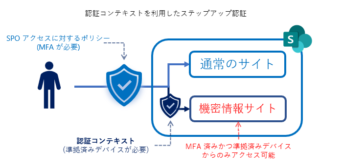

ちなみに、サポート チームではこのような情報は社内情報として入手することもあれば、お客様と同時に Ignite や Tech ブログなどの発表で知る… ということもあります😅

## 公式ドキュメントを読む

新機能が発表されてもすぐに使えるとは限りません。認証コンテキストの場合は、3 月に Ignite で発表されてから 5 月ごろに [パブリック プレビューが開始され](https://techcommunity.microsoft.com/t5/azure-active-directory-identity/conditional-access-authentication-context-now-in-public-preview/ba-p/1942484) ました。

同時に公式ドキュメントもたいてい公開されるので、私も早速動作を試してみました。

- [条件付きアクセス ポリシーのクラウド アプリ、アクション、認証コンテキスト - Azure Active Directory | Microsoft Docs](https://docs.microsoft.com/ja-jp/azure/active-directory/conditional-access/concept-conditional-access-cloud-apps#authentication-context-preview)

## 実際に試してみる

では、公式ドキュメントを参考に早速試してみましょう。認証コンテキストを試すには、以下の手順が必要です。

1. 認証コンテキストを作成する
1. 認証コンテキストに条件付きアクセス ポリシーを適用する
1. 認証コンテキストを利用アプリに割り当てる

構認証コンテキストは単体で動作するわけではなく、アプリ、認証コンテキスト、条件付きアクセスが連動して動作します。
もう少し具体的に言うと、アプリが認証コンテキストを利用するという認証要求を Azure AD に送信し、Azure AD は指定された認証コンテキストに紐づく条件付きアクセス ポリシーを適用、結果としてポリシーに基づいた追加のアクセス制御が可能となります。

> ![NOTE]
> 認証コンテキスト機能を利用するには Azure AD Premium P1 以上のライセンスが必要です。

### 認証コンテキストの作成

認証コンテキストを作成するには、Azure ポータルの `Azure Active Directory` > `セキュリティ` > `条件付きアクセス ポリシー` > `認証コンテキスト` から作成します。

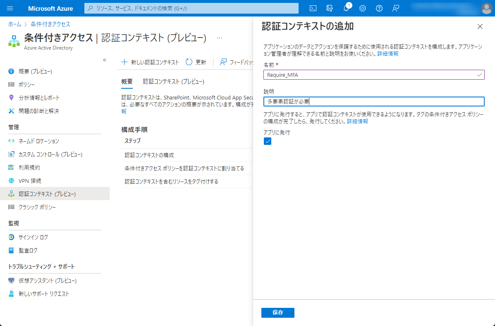

今回は、Require_MFA, Require_CompliantDevice, Require_TOU の 3 つの認証コンテキストを作成しました。

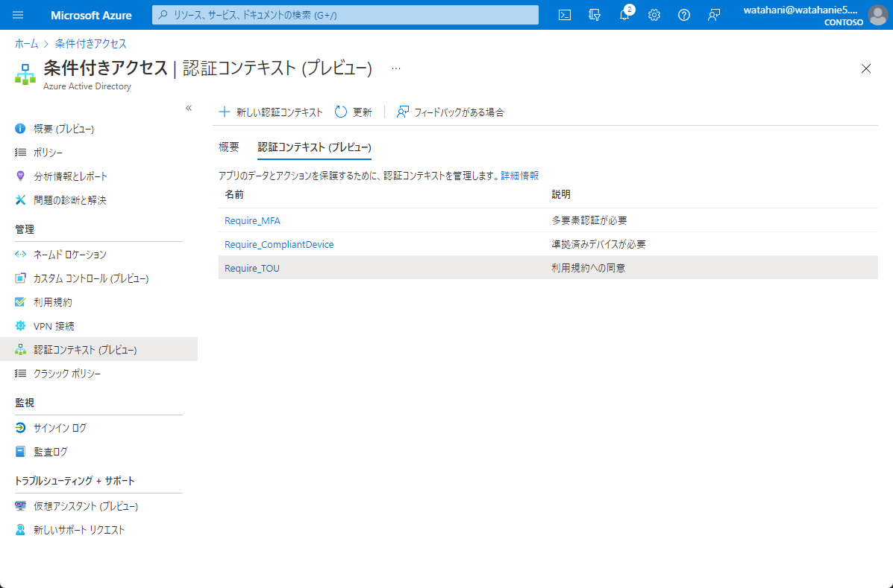

認証コンテキストは作成順に c1 ~ c25 までの ID が割り振られます。


> ![IMPORTANT]
> 認証コンテキスト機能は、現在 Public Preview での提供であり、プレビュー期間中認証コンテキストの上限は 25 個で、作成した認証コンテキストを削除できません。

### 認証コンテキストへ条件付きアクセスの適用

作成した認証コンテキストは、それのみでは何も機能しません。そのため、認証コンテキストに条件付きアクセス ポリシーを割り当てます。
認証コンテキストは「コンテキスト」の定義で合って、実際の動作は条件付きアクセス ポリシーで制御します。


通常の条件付きアクセス ポリシー同様にユーザーや適用の条件などを設定でき、緊急用の管理アカウントなどを除外することも可能です。

今回は、それぞれ C001_Require_MFA, C002_Require_CompliantDevice, C003_Require_TOU の名前でポリシー作成し、認証コンテキストに合った制御を設定しました。

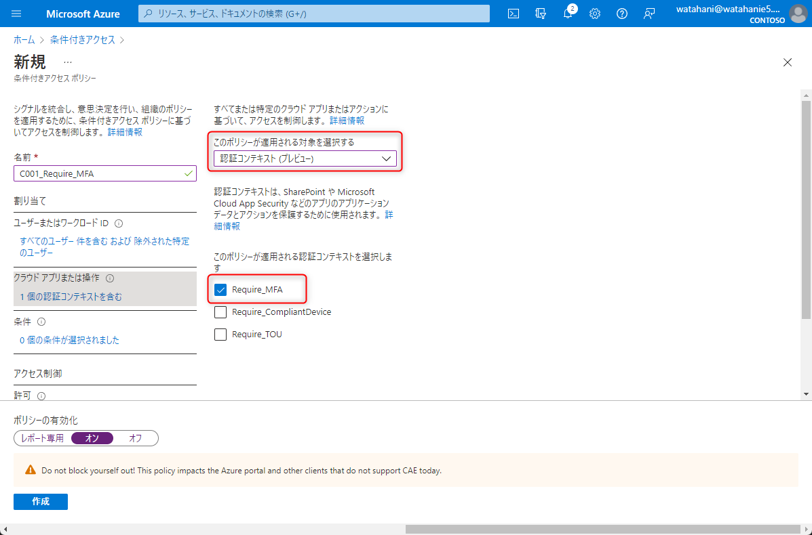

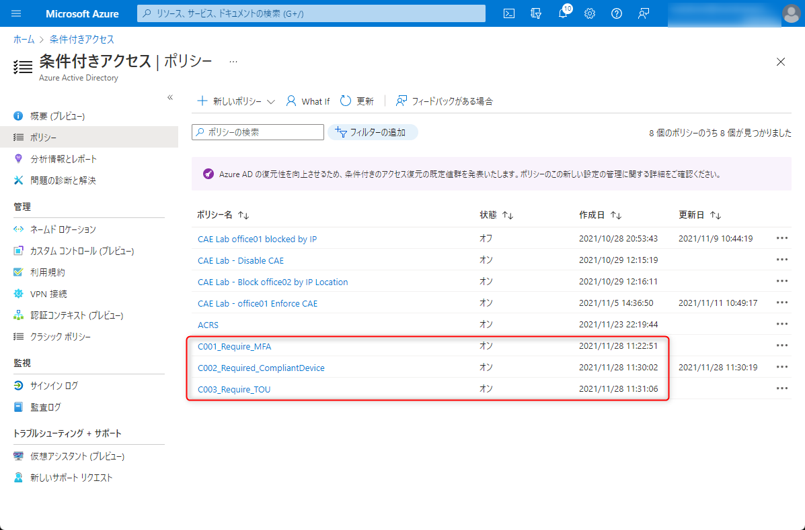

複数の条件付きアクセス ポリシーを一つの認証コンテキストに割り当てたり、逆に複数の認証コンテキストに 1 つの条件付きアクセス ポリシーを割り当てることも可能です。
たとえば、機密情報アクセス用の認証コンテキストに、社内 IP からのアクセス時のポリシーと、社外 IP からのアクセス時のポリシーをそれぞれ適用する、といった利用法が考えられます。

認証コンテキストと条件付きアクセス ポリシーの組み合わせを大量に管理するのは労力が大きくなるため、なるべく汎用的な認証コンテキストを定義し、複数のアプリで使いまわせるように設計するのが良いように思います。

### 認証コンテキストの対応サービスへの適用

作成した認証コンテキストと、そのコンテキストに対する条件付きアクセスは呼び出されない限りは機能しません。つまり、アプリが認証コンテキストを明示的に呼び出し、追加の認証を要求する必要があります。


今回は認証コンテキストを呼び出すアプリとして SharePoint Online の特定サイトを利用します。つまり、SharePoint Online の特定サイトにアクセスする際に、認証コンテキストが呼び出されるよう構成し、条件付きアクセス ポリシーにて追加の認証が要求されるか確かめます。

SharePoint Online への認証コンテキストの適用方法は、現時点では 2 つあります。一つは特定の機密度ラベルに認証コンテキストを割り当てる方法です。[公開ドキュメントの手順](https://docs.microsoft.com/ja-jp/sharepoint/authentication-context-example) では機密度ラベルに認証コンテキストを割り当てる方法が紹介されています。

機密度ラベルを利用したほうがファイルの暗号化などと組み合わせてより高度な設定が可能ですが、今回は条件付きアクセス ポリシーの動作を確認することが目的ですので、もう一つの、簡易な手順であるサイトに直接認証コンテキストを割り当てる手順にて検証します。(機密度ラベルを利用した検証はラベルの作成や展開時間を含めると丸一日かかりました)

特定のサイトに認証コンテキストを適用するには、[SharePoint Online PowerShell の Set-SPOSite コマンド](https://docs.microsoft.com/ja-jp/powershell/module/sharepoint-online/set-sposite?view=sharepoint-ps) を利用します。

```ps1
# SharePoint Online にグローバル管理者権限でサインインします。
Connect-SPOService -Uri https://<yourdomain>-admin.sharepoint.com/

# 認証コンテキストを特定のサイトを指定して割り当てます。
Set-SPOSite -Identity https://<yourdomain>.sharepoint.com/sites/confidential -ConditionalAccessPolicy AuthenticationContext -AuthenticationContextName "Require_CompliantDevice"
```

上記手順では、準拠済みデバイスが必要と設定した認証コンテキストをサイトに割り当てました。
その後、認証コンテキストを割り当てたサイトに非準拠デバイスでアクセスを実施すると、以下のように準拠済みデバイスが必要な旨が表示され、アクセスがブロックされます。もちろん、認証コンテキストを設定していないサイトには今まで通りアクセスが可能です。

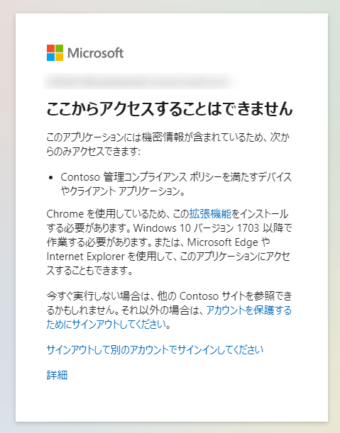

サインイン ログの条件付きアクセス ポリシーの項目を確認すると、期待通り認証コンテキストに割り当てたポリシーが適用されていることが確認できます。


> ![NOTE]
> サインインログから条件付きアクセス ポリシーの適用状況を確認する方法は、[「現時点ではこれにはアクセスできません」 エラーについて](../azure-active-directory/conditional-cannot-access-rightnow.md) を参照下さい。

## プロトコルの詳細を見てみる

機能紹介はここまでですが、今回はもう少し認証コンテキストが動作する仕組みを見てみましょう。SharePoint Online へアクセスをする際には Azure AD で OpenID Connect を利用した認証が実施されます。つまり、SharePoint Online から Azure AD に対し、ID トークンを発行するための認可リクエストが送信されています。

そこでブラウザーの F12 ツールなどを利用し、条件付きアクセス ポリシーでブロックされた際の通信トレースを取得してみます。
以下の通信は、認証コンテキストを設定した SharePoint サイトにアクセスを行った際、Azure AD に送信された認可リクエストの中身です。ここで注目してほしいのは claims パラメータの中身です。

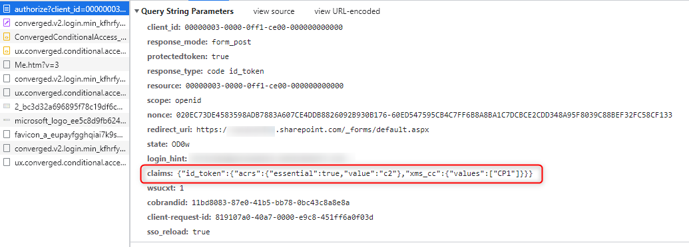

claims パラメータは [OpenID Connect Core で定義されている](https://openid.net/specs/openid-connect-core-1_0.html#ClaimsParameter) トークンに含めてほしいクレームを定義するパラメータです。ここでは id_token に acrs クレームを含めるよう、指示をしています。
acrs クレームは、OpenID Connect の [acr (Authentication Context Class Reference) クレーム](https://openid.net/specs/openid-connect-core-1_0.html#rfc.section.5.5.1.1) と同じような動作をするクレームで、以下のように認証コンテキストを指定することで、ID トークンの発行時に 指定された認証コンテキストに適用された条件付きアクセス ポリシーを完了させることを要求します。

```json
{ 
  "id_token":{
    "acrs":{
      "essential":true,
      "value":"c2" //認証コンテキストの ID
      },
    "xms_cc":{
      "values":["CP1"] //クレーム チャレンジ対応クライアントを要求
    }
  }
}
```

上記の例では、c2 つまり、Require_CompliantDevice の認証コンテキストを指定して、ID トークンの発行を要求していることがわかります。

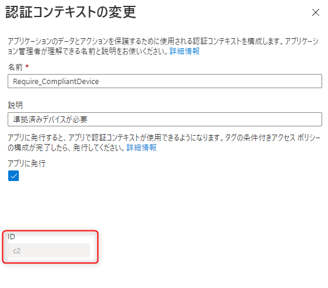

認証コンテキストに割り当てられた条件付きアクセス ポリシーを突破したかどうかは、発行される ID トークンの acrs クレームを確認することで判定が可能です。実際に条件付きアクセス ポリシーを突破した状態でアクセスを行った際には、以下のように acrs クレームが含まれる ID トークンが発行されます

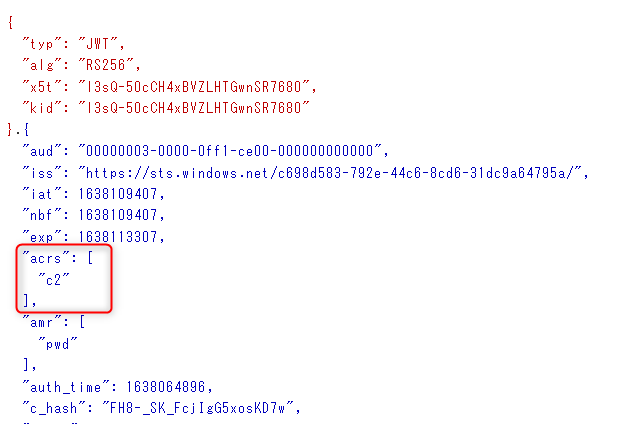

SharePoint Online 側では、acrs クレームをチェックして、本当にユーザーが認証コンテキストを満たす認証を実施したかを判定できます。

> ![NOTE]
> xms_cc オプションはクライアント アプリケーションがクレーム チャレンジに対応しており、API が返却するクレーム チャレンジ ヘッダーを適切に処理できることを示しています。
> 話の本筋からそれますのでここでは紹介しませんが、詳しくは [クレーム チャレンジ、クレーム要求、およびクライアントの機能 - Microsoft identity platform | Microsoft Docs](https://docs.microsoft.com/ja-jp/azure/active-directory/develop/claims-challenge) や、[該当の](https://github.com/Azure-Samples/ms-identity-ca-auth-context/blob/71b9d8a07de995d47b030e8449202016a9f76c41/TodoListClient/Controllers/TodoListController.cs#L44) [ソース](https://github.com/Azure-Samples/ms-identity-ca-auth-context/blob/74146a201bf28b04145d1743d4d8d52919bd5896/TodoListClient/Infrastructure/ExtractAuthenticationHeader.cs) [コード](https://github.com/Azure-Samples/ms-identity-ca-auth-context/blob/74146a201bf28b04145d1743d4d8d52919bd5896/TodoListService/Controllers/TodoListController.cs#L98) を参照ください。

## Appendix: 公式サンプルを触ってみる

ここまで SharePoint Online を例にして、実際の認証コンテキストの動作を確認してきました。
認証コンテキストの動作をまとめると、以下のようなフローになります。

1. アプリが保持する機密情報へのアクセス
1. アプリで設定した認証コンテキストを含む、認可要求
1. Azure AD の条件付きアクセス ポリシーによる認証コンテキストに応じた追加の認証要件
1. 認証コンテキスト突破済みのトークン

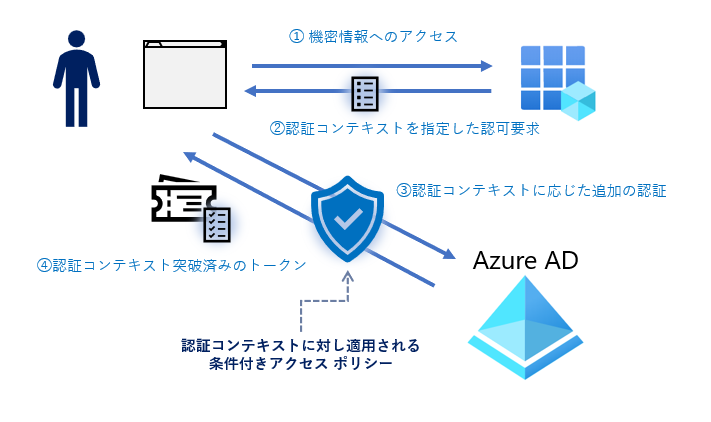

ここまでは、認証コンテキストを要求するアプリは SharePoint Online でしたが、上記のプロトコルをきちんと実装すれば、自社の OpenID Connect で実装されたアプリにも組み込むことが可能です。
MSAL ライブラリを利用し、認証コンテキストを呼び出す具体的なサンプルは、[GitHub](https://github.com/Azure-Samples/ms-identity-ca-auth-context) にあります。

認証コンテキスト利用したアプリを実装する際には、認証コンテキストの具体的な内容はアプリ側では確認できない点に注意してください。
今回の手順では認証コンテキストとして、今回の手順では認証コンテキストとして、Require_MFA (c1), Require_CompliantDevice (c2), Require_TOU (c3) の 3 つを作成しましたが、あくまでこれは私のテストテナントでの話です。
他のテナントでは c1 が CompliantDevice と MFA が必要な認証コンテキスト、といったように c1, c2, c3 という ID は認証コンテキストの内容を推定する役には立ちません。


特にマルチテナント アプリでは認証コンテキストはテナントによって異なるため、アプリ上で管理者による認証コンテキストの参照を行う機能の実装を検討ください。
上記のサンプル コードでは、管理者専用の設定ページにて Graph API で認証コンテキストの一覧を取得し、アプリケーションの動作時に要求する認証コンテキストを選択できるようなインターフェイスを実装しています。

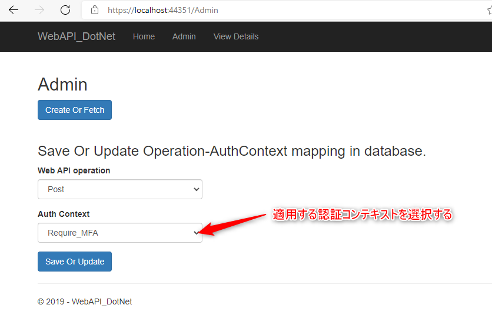

アプリを実装する際には、認証コンテキストをどのように取得するかという点にも気を付けて実装いただく必要があります。

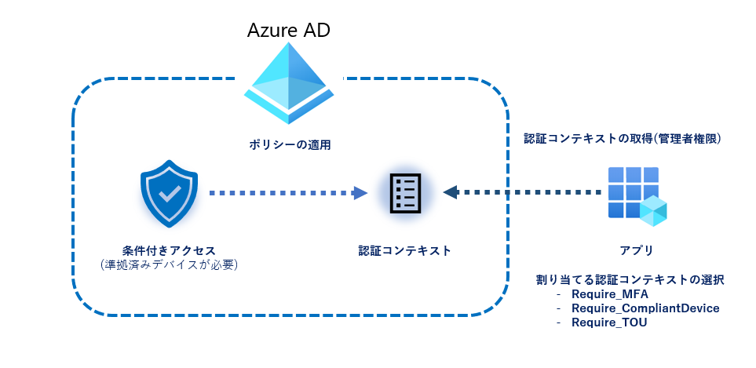

なお、Graph API で認証コンテキストの情報を取得したとしても、あくまでアプリは認証コンテキストの名前などのみが取得でき、実際に設定されている条件付きアクセス ポリシーの内容は確認できません。条件付きアクセス ポリシーの管理は引き続きテナント管理者が実施することとなります。(認証コンテキストと、適用されるポリシーの実際の動作が合致するように管理する必要があります)

さて、サンプルの動作に戻りましょう。上記の管理者ページでは、ToDo List の POST または DELETE 操作を実施時に必要な認証コンテキストを選択することが可能です。試しに TODO リストの POST に Require_TOU を、TODO リストの削除に Require_MFA を設定したところ、それぞれの操作を実施時に設定した認証コンテキストによる追加の認証が行われました。

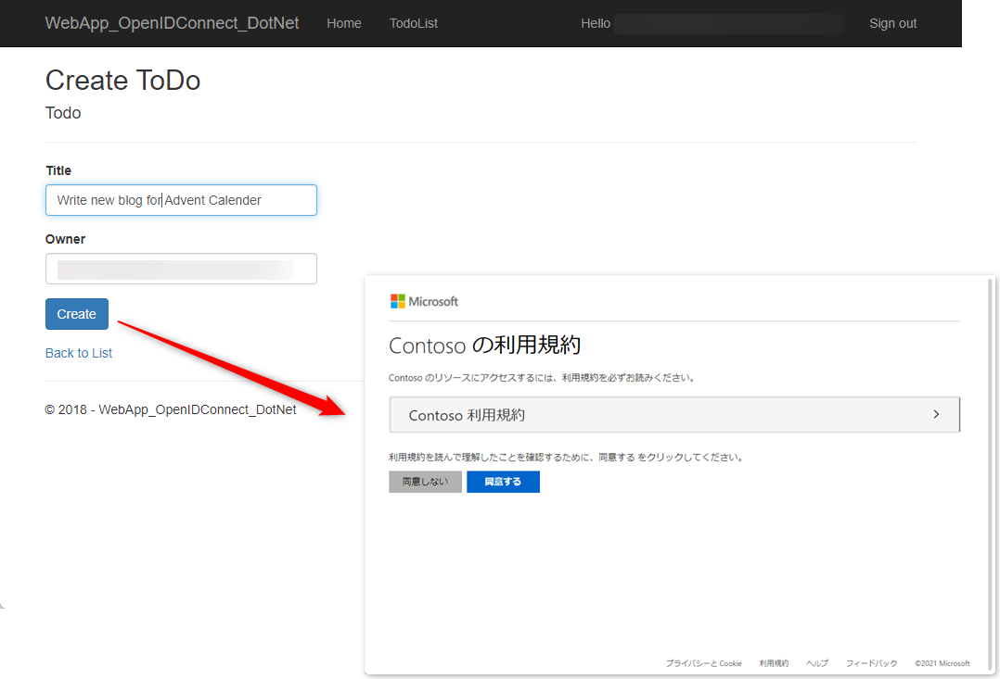


> ![IMPORTANT]
> 認証コンテキストに限りませんが、条件付きアクセス ポリシーは適用時に必ず認証を求めるものではなく、要求された条件を満たした認証を完了しているかを判定します。
> 上記のサンプルでも一度多要素認証を実施したのちは、Azure AD 側あるいはアプリの認証キャッシュが有効な間は TODO リストの削除が可能です。

## まとめ

今回は Azure AD の条件付きアクセス ポリシーのプレビュー機能である、Authentication Context を紹介しました。実際に設定をしたのは SharePoint Online のみですが、Microsoft Defender for Cloud Apps (旧 MCAS) でセッション制御に利用したり、また自作のアプリでもステップアップ認証要求を求めるよう実装したりすることが可能です。また、Azure AD Privileged Identity で、ロールの昇格の条件として認証コンテキスト利用できるようになるという発表もされており (早く Public Preview 来てくれー)、今後の展開も大変楽しみです。

皆さんもぜひこの新機能をお試しいただき何かお気づきの点などございましたらフィードバックをお待ちしております。

## 裏テーマ

今回のブログ記事は、実は「サポート エンジニアの仕事紹介」という裏テーマでお送りしました。今回の認証コンテキストの検証は新機能は発表された 5 月ごろに、実際に私が「ためしてみた」ことをなぞってブログ化しています。

Azure AD を含む弊社のクラウド サービスでは日々新機能が発表されますが、お客様をサポートできるようサポート チームでも新しい機能について学習し、日々検証を行っています。本記事は、そんな検証の様子の一コマとしてもお楽しみいただければ幸いです。
