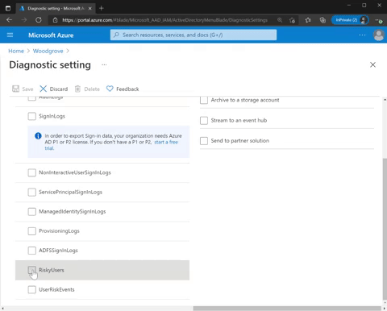
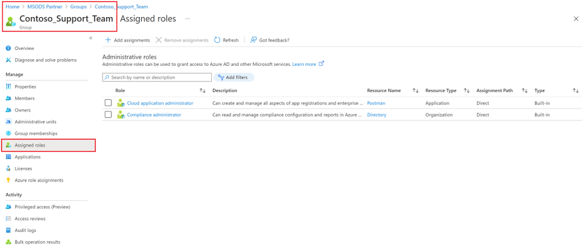

# 8 月のアップデート : Identity Protection 診断設定のご紹介

こんにちは、Azure Identity サポート チームの 村上 です。本記事は、2021 年 8 月 18 日に米国の Azure Active Directory Identity Blog で公開された [Introducing diagnostic settings for Identity Protection — August identity updates](https://techcommunity.microsoft.com/t5/azure-active-directory-identity/introducing-diagnostic-settings-for-identity-protection-august/ba-p/2464365) を意訳したものになります。ご不明点等ございましたらサポート チームまでお問い合わせください。

----

皆さん、こんにちは。

今回は、管理者や開発者、ユーザーの利便性を向上させる Active Azure Directory の最新情報や新機能をご紹介します。本アップデートは、セキュアな ID とアクセス管理をよりシンプルにし、さらにお客様が必要とするカスタマイズや操作を強化するものになります。

## 診断設定を使用して危険なユーザーとリスク検出を追跡する

Azure AD Identity Protection の診断設定がパブリック プレビューとなったことで、リスク検出や危険なユーザーのアクティビティに関するログを、ストレージ アカウントや Event Hub、Azure Monitor に送信することができます。これにより、セキュリティ リスクの追跡、そして資格情報の漏洩から組織を守ることが容易になります。また、このデータを 30 日間の既定期間を超えて保持することが可能です。診断設定を利用することで、以下のことが実現できます。

- カスタマイズした Azure Monitor ワークブックを作成し、組織内の資格情報漏洩の傾向を追跡する
- 特定の脅威に対してリスク データを参照し、リスクのトラブルシュートに利用する
- 危険なユーザーとリスク検出データをサード パーティのセキュリティ情報イベント管理 (SIEMs) に送信し、既存のセキュリティ オペレーション センターの手順に該当のデータを組み込む

[リスク保護のための診断設定](https://docs.microsoft.com/ja-jp/azure/azure-monitor/essentials/diagnostic-settings?tabs=CMD) について確認し、以下の 2 ステップで設定ください。

- **Azure ポータル** にアクセス > **[Azure Active Directory]** > **[診断設定]** > **[設定の編集]** に進みます  
(設定していない場合は、[診断設定を追加する] から設定を追加します)
- 危険なユーザーのデータは **[RiskyUsers]** を、ユーザーのリスク検出データは **[UserRiskEvents]** を選択します  
(送信先の  [宛先] を選択し、[保存] をクリックします)

## グループへのロールの割り当てをより簡単に管理する

[Azure AD グループへのロールの割り当て](https://docs.microsoft.com/ja-jp/azure/active-directory/roles/groups-assign-role) が、より簡単に設定できるようになりました。従来のように個々のユーザーにロールを割り当てる代わりに、[特権ロール管理者] または [グローバル管理者] が、グループに対してロールを割り当てることができます。既に設定しているワーク フローがある場合は、それに沿って承認および監査を行い、適切なユーザーのみがメンバーであることを確認できるようになります。このグループへのロール割り当て機能が一般提供 (GA) となりました。

また、管理者がグループのオーナーを割り当てることで、[特権ロール管理者] や [グローバル管理者] 以外のメンバーも、グループを管理することができます。グループのオーナーは、グループのメンバーシップを管理し、誰にロールを割り当てるかを管理できます。まずは Azure AD グループでご利用可能ですが、将来的にはオンプレミスのグループにもこの機能が拡張される予定です。

## オーストラリア国内で B2C ユーザー データを保管する

オーストラリアにおける Azure AD B2C の一般提供 (GA) が開始され、B2C ユーザー データをオーストラリア国内に保存できるようになりました。これによりオーストラリアでホストされているアプリケーションのレイテンシが改善されます。既に B2C テナントをお持ちのお客様は、[オーストラリアの Azure ポータル](https://azure.microsoft.com/en-au/) で B2C を検索することで、お試しいただけます。初めてご利用されるお客様は、新しい Azure AD B2C テナントの作成時に、国/地域としてオーストラリアまたはニュージーランドを選択することで、この機能を試すことができます。 

## フィードバックを共有ください

Azure AD をエンジニアやユーザーの皆様に役立つよう改善したいと考えております。製品の更新はお客様からの要望に基づいたものもよくございます。コメントや [@AzureAD](http://twitter.com/azuread) にて皆様のフィードバックや新機能及び今後の改善の提案をおお待ちしております。
 
Alex Simons (@Alex_A_Simons)  
Corporate VP of Program Management  
Microsoft Identity Division
