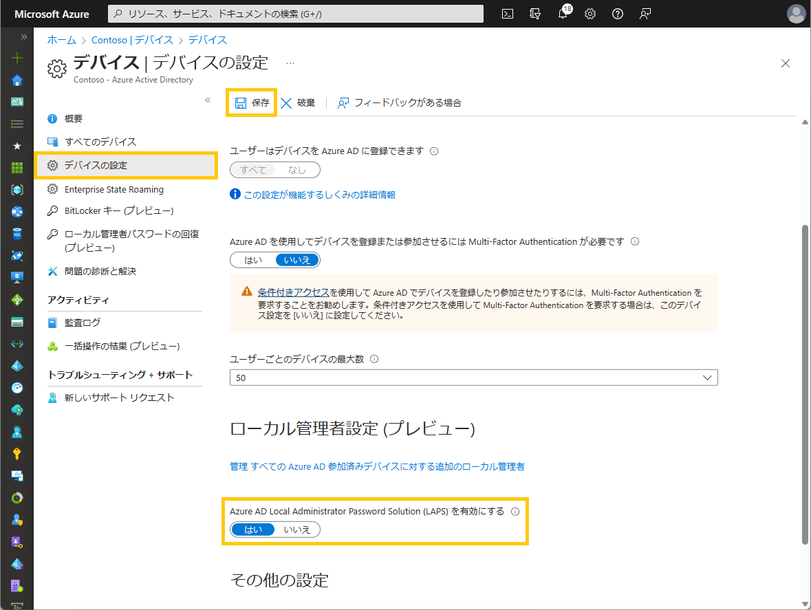
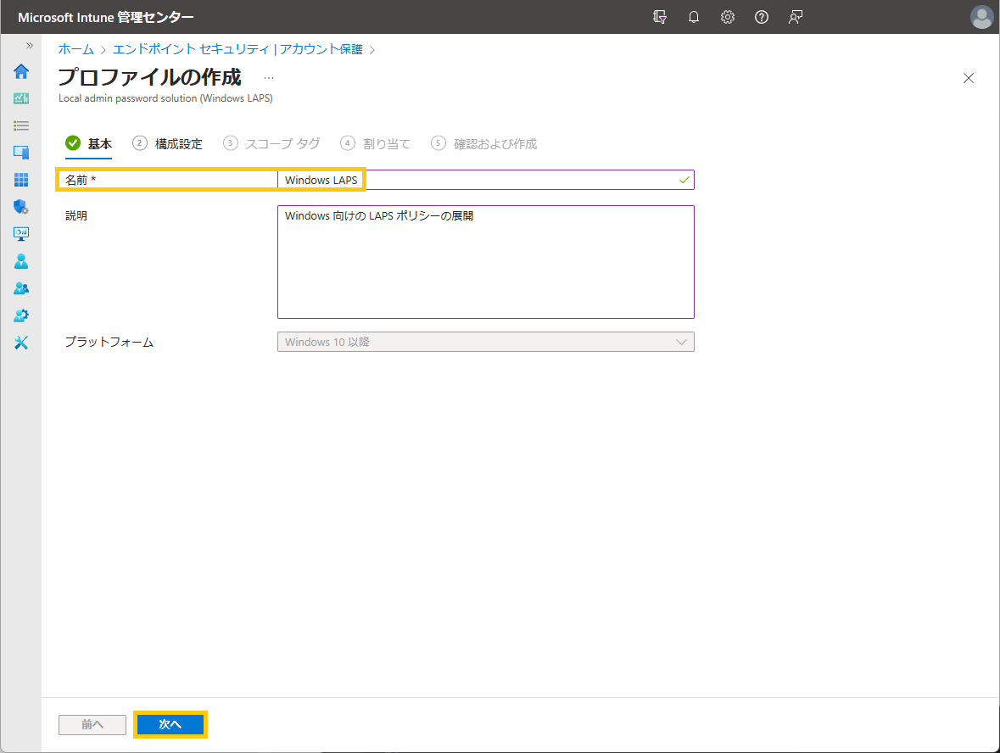
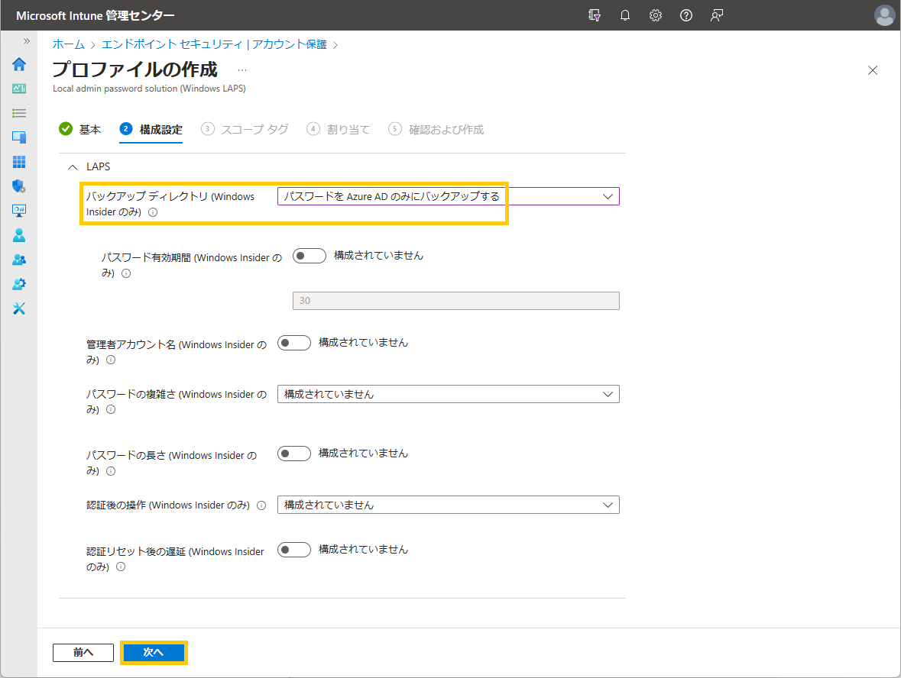
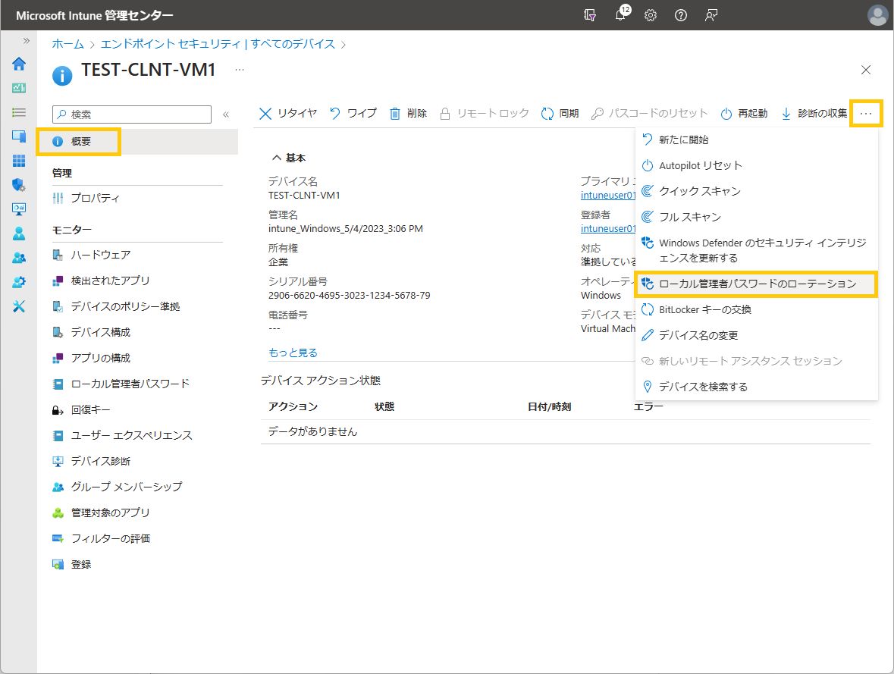
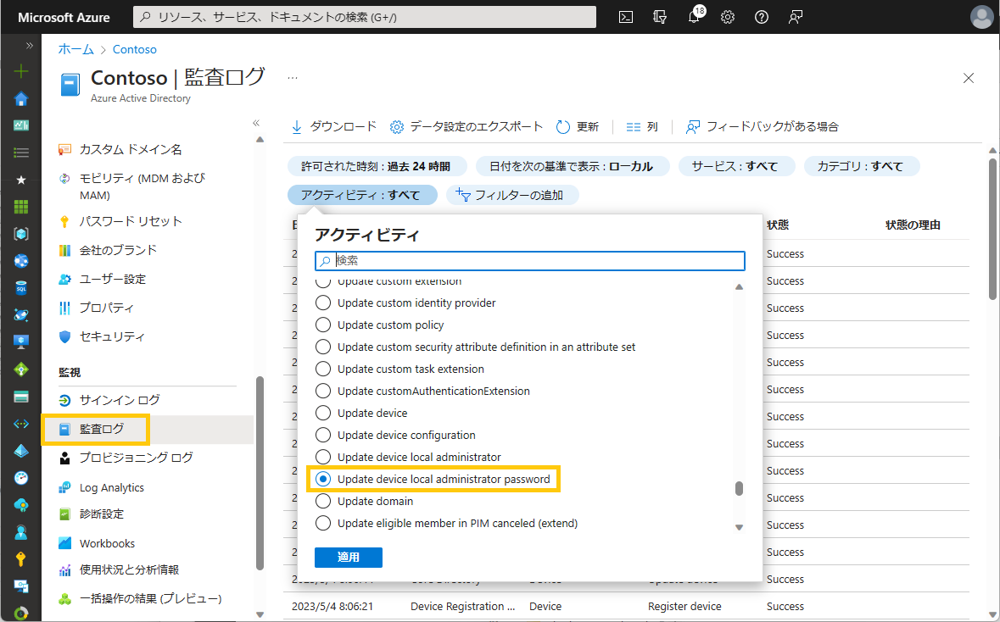
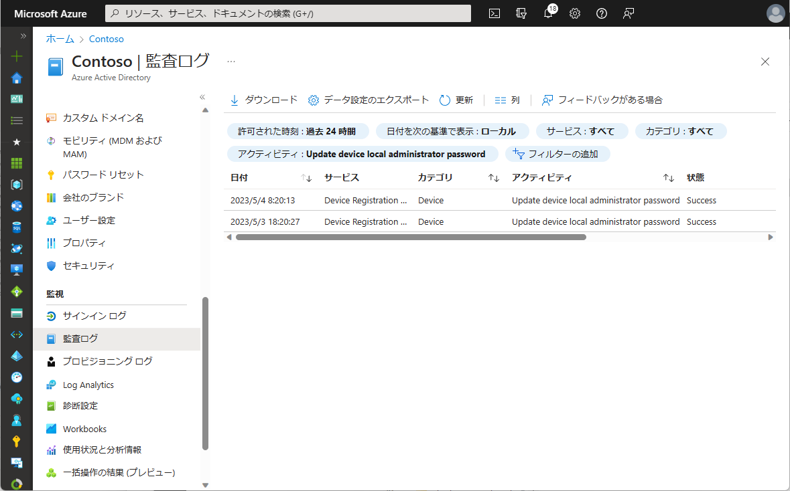
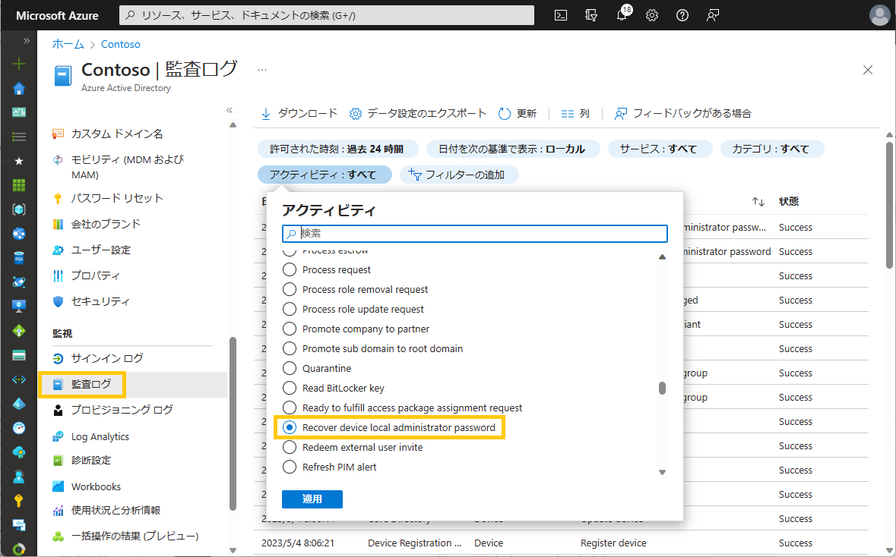
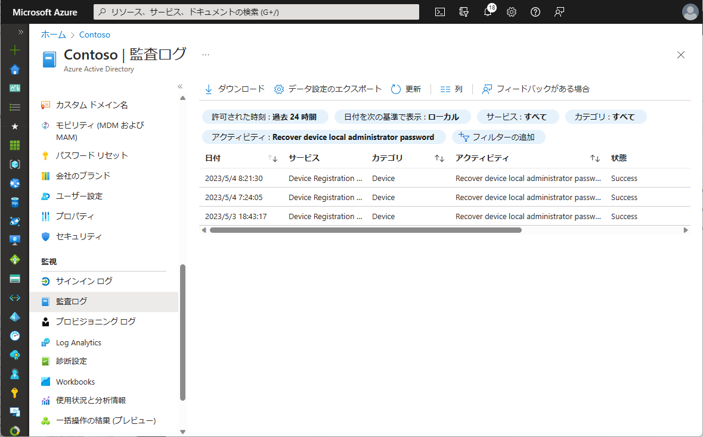

# Microsft Entra (Azure AD) 向け Windows Local Administrator Password Solution のご紹介

こんにちは、Azure Identity サポート チームの 高田 です。

本記事は、2023 年 4 月 21 日に米国の Microsoft Entra (Azure AD) の Discussion で公開された [Introducing Windows Local Administrator Password Solution with Microsoft Entra (Azure AD)](https://techcommunity.microsoft.com/t5/microsoft-entra-azure-ad-blog/introducing-windows-local-administrator-password-solution-with/ba-p/1942487) を意訳したものになります。ご不明点等ございましたらサポート チームまでお問い合わせください。

---

本日、皆様に素晴らしいニュースをお伝えしたいと思います！包括的なセキュリティソリューションを提供するという私たちのビジョンの一環として、弊社では Windows および Microsoft Intune チームと協力して、**Windows Local Administrator Password Solution (LAPS) for Azure AD** (Microsoft Entra の一部）の **パブリック プレビュー** をリリースしました。

今回は、このリリースのプロダクト マネージャーの一人である Sandeep Deo に、これらのアップデートの概要と、Microsoft Entra (Azure AD) で Windows LAPS を使い始める方法について説明してもらいます。Sandeep のブログ記事は以下からご覧いただけます。

Alex Simons (@Alex_A_Simons)  
Corporate VP of Program Management  
Microsoft Identity Division

---

皆さん、こんにちは。

今回、LAPS のアップデートと、Microsoft Entra (Azure AD) および Microsoft Intune を使用して、Azure AD に参加する Windows デバイスのセキュリティを確保する方法をご紹介します。

すべての Windows デバイスにはローカル管理者アカウントが組み込まれており、PtH (Pass-the-Hash) 攻撃や横断的なトラバーサル攻撃を軽減するためにセキュリティを確保する必要があります。多くのお客様は、ドメイン参加した Windows マシンのローカル管理者のパスワード管理に、スタンドアロン型のオンプレミス製品である LAPS を使用されていると存じます。しかし、Azure AD に直接参加するよう Windows 環境を刷新するにあたり、同様に LAPS のサポートが必要だというフィードバックを多くいただいておりました。

本日、弊社では Azure AD 参加したデバイスとハイブリッド Azure AD 参加したデバイスの両方で、Windows LAPS を利用できるようにします。さらに、[Windows 10 20H2 以降、Windows 11 21H2 以降](https://support.microsoft.com/ja-jp/topic/2023-%E5%B9%B4-4-%E6%9C%88-11-%E6%97%A5-kb5025221-os-%E3%83%93%E3%83%AB%E3%83%89-19042-2846-19044-2846-19045-2846-b00c3356-baac-4a41-8342-7f97ec83445a)、および [Windows Server 2019 以降](https://support.microsoft.com/ja-jp/topic/2023-%E5%B9%B4-4-%E6%9C%88-11-%E6%97%A5-kb5025239-os-%E3%83%93%E3%83%AB%E3%83%89-22621-1555-5eaaaf42-bc4d-4881-8d38-97e0082a6982) で、[最新のセキュリティ更新プログラム (2023 年 4 月 11 日リリース) を使用する Windows](https://support.microsoft.com/ja-jp/topic/2023-%E5%B9%B4-4-%E6%9C%88-11-%E6%97%A5-kb5025230-os-%E3%83%93%E3%83%AB%E3%83%89-20348-1668-28a5446e-6389-4a5b-ae3f-e942a604f2d3) に Windows LAPS が既定で組み込まれるようになりました。

このプレビュー内で利用可能となった重要な機能は以下のとおりです:

- Windows LAPS を有効にするには、**テナント全体のポリシーとクライアント側のポリシーを使用し、ローカル管理者パスワードは Azure AD にバックアップされる**。
- **Microsoft Intune ポータルでクライアントサイド ポリシー** を設定し、**ローカル管理者のパスワード管理のために、アカウント名、パスワードの有効期限、長さ、複雑さ、手動パスワード リセットなどを設定する**。
- **Microsoft Entra/Microsoft Intune ポータルまたは Microsoft Graph API/PowerShell を使用して保存されたパスワード** を復元する。
- **Microsoft Entra ポータルまたは Microsoft Graph API/PowerShell** を使用して、すべての LAPS 対応デバイスを確認する。
- **パスワードの回復を承認するには、カスタム ロールと管理単位で、Azure AD ロールベース アクセス コントロール (RBAC) ポリシー** を作成する。
- **Microsoft Entra ポータルまたは Microsoft Graph API/PowerShell を使用して監査ログ** を表示し、**パスワードの更新と回復のイベントを監視** します。

**パスワード回復の権限を持つディレクトリ ロールには条件付きアクセスポリシーを構成するすること** がお勧めです。

これらのシナリオを実現するための簡単な手順を以下に説明していきます。

## LAPS のセットアップ

**Azure AD のデバイス** メニューで **デバイスの設定を選択** し、**LAPS の設定で はい を選択して保存をクリック** します。

**Microsoft Intune エンドポイント セキュリティ** のメニューで、**アカウント保護** を選択し、**ポリシーの作成** を選択して、Windows 10 以降のWindows LAPS プロファイルを作成します。プロファイルの作成中、**Azure AD をバックアップ先のディレクトリ** として選択します。LAPS の他のクライアント ポリシーを構成することも可能です。**割り当て** に Azure AD のグループを指定して、最後に **確認及び作成** を選択します。

> [!NOTE]
> 本記事執筆時点では、上記スクリーンショットのとおり、(Windows Insider のみ) という文言が一部のポータル上に表示されております。しかし、本記事のとおり Windows LAPS はパブリック プレビュー状態となりますので、Windows Insider は必要ありません。最新の Windows Update を適用した通常バージョンの Windows にて Windows LAPS をご利用いただけます。

## ローカル管理者パスワードの復旧

**Azure AD のデバイスの概要** ページで、**ローカル管理者パスワードの回復** を選択します。これにより、LAPS が有効なすべてのデバイスが列挙され、デバイス名の横にある **ローカル管理者パスワードの表示** をクリックすると、パスワードを確認できます。また、デバイス名を入力してフィルタリングし、列挙されたリストから **ローカル管理者パスワードの表示** を選択するという方法もあります。

また、ローカル管理者パスワードの回復を承認するにあたっては、Azure AD で [カスタム ロール](https://learn.microsoft.com/ja-jp/azure/active-directory/roles/custom-create) または [管理単位](https://learn.microsoft.com/ja-jp/azure/active-directory/roles/administrative-units) を作成することもできます。

## ローカル管理者パスワードを手動でリセットする

**Microsoft Intune エンドポイント セキュリティのすべてのデバイス** ページで、**検索** フィールドにデバイス名を入力します。次に、特定のデバイスの概要ページで、デバイスへのアクションとして「ローカル管理者パスワードのローテーション」を選択します。

## ローカル管理者のパスワードの更新と回復を監査する

**Azure AD デバイスの概要** ページで、**監査ログ** を選び、**アクティビティのフィルター** を使用して **Update device local administrator password** または **Recover device local administrator password** を検索し、監査イベントを表示します。

個々の監査イベントをクリックすると、アクティビティ、ターゲット、変更されたプロパティなどの詳細を確認することができます。

この新しいセキュリティ機能を利用するために、Microsoft Entra (Azure AD) および Microsoft Intune で Windows LAPS を導入することを強くお勧めします。これにより、これらの機密性の高いパスワードの安全性が格段に向上します。Windows LAPS for Microsoft Entra (Azure AD) の利用を開始するには、[ここにアクセス](https://learn.microsoft.com/ja-jp/azure/active-directory/devices/howto-manage-local-admin-passwords) ください。

いつものように皆様のフィードバックと提案お待ちしております。[Microsoft Entra (Azure AD) のフォーラム](https://feedback.azure.com/d365community/forum/22920db1-ad25-ec11-b6e6-000d3a4f0789) でコメントを共有ください。皆様からのご連絡をお待ちしております。

Sandeep Deo (@MsftSandeep)  
Principal Product Manager  
Microsoft Identity Division
