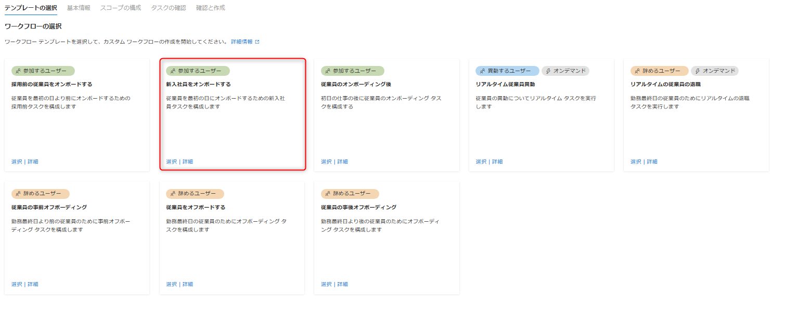
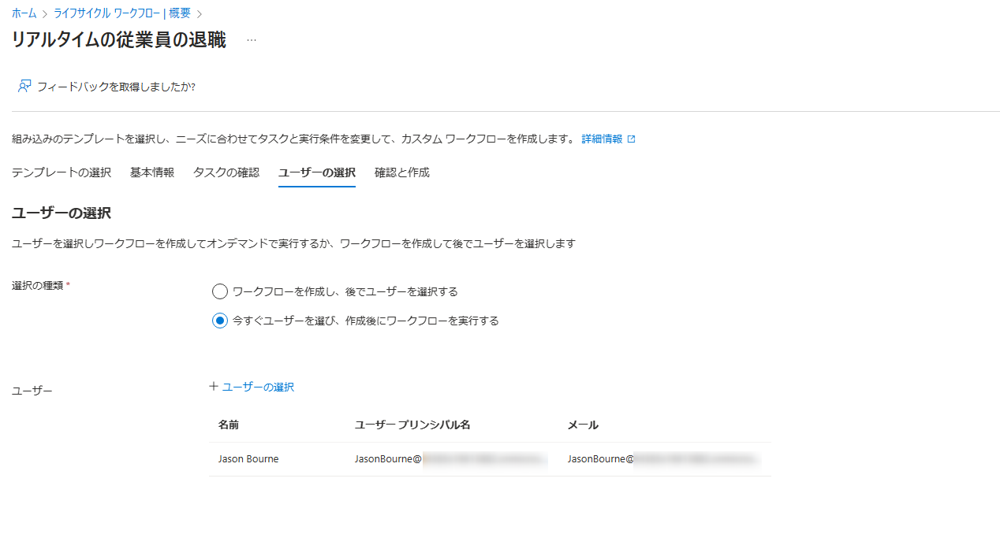

こんにちは、Azure Identity サポート チームの 中村 です。 

 
本記事は、2023 年 7 月 14 日に米国の Microsoft Entra (Azure AD) Blog で公開された [Lifecycle Workflows is now generally available!](https://techcommunity.microsoft.com/t5/microsoft-entra-azure-ad-blog/lifecycle-workflows-is-now-generally-available/ba-p/2466931) を意訳したものになります。ご不明点等ございましたらサポート チームまでお問い合わせください。

---

2023 年 6 月 7 日に発表しましたとおり、[Microsoft Entra ID Governance](https://techcommunity.microsoft.com/t5/microsoft-entra-azure-ad-blog/microsoft-entra-id-governance-is-generally-available/ba-p/2466932) が、最新の機能の1つである **ライフサイクルワークフロー (LCW)** を含め、**一般提供** を開始されました。パブリック プレビュー以降の機能強化や改良を含め、LCW の豊富な機能についてご紹介できることを嬉しく思います。

ユーザーの ID ライフサイクルは、組織のセキュリティ態勢の重要な部分であり、正しく管理されれば、新入社員 (Joiner)、異動者 (Mover)、離職者 (Leaver) (まとめて JML) のユーザーの生産性にプラスの影響を与えることができます。デジタル トランスフォーメーションが進むにつれ、優れた ID ライフサイクル管理の必要性が高まっています。しかし、IT およびセキュリティ チームは、一度に何百人もの従業員のオンボーディングとオフボーディングが必要となっており、これは複雑で時間がかかり、ミスを犯しやすい手作業のプロセスもあるため大きな課題に直面しています。これは、セキュリティ、ガバナンス、コンプライアンスの各分野でデジタル トランスフォーメーションに直面する IT 管理者が長きにわたり抱える課題です。ID ライフサイクルの課題を詳しく見てみると、以下の点が挙げられます:

1. 組織のすべての従業員が何かしらへのアクセスを必要としており、管理対象のアプリケーションの数やデータの量が著しく増加しています。これに加えて、規制要件も絶えず増加しています。IT 管理者はこれらの変化に対応するため、スクリプトを使用して JML プロセスを実施していますが、問題が発生したときのトラブルシューティングは複雑で時間を要します。
2. 新しいユーザーのオンボーディングには多くの要素が絡み合っています。初日から従業員の生産性を確保するために手動の繰り返しの作業を減らすことは、コスト削減や競争の激しい求人市場において優れた人材を確保する上で重要です。
3. サイバー犯罪が激化する中、従業員が組織を離れたり異動した際にアカウントとアクセスを適切なタイミングで削除しないと、組織がより多くのセキュリティの脅威に晒されます。IT 部門がリソースへのアクセス権の追加や削除を手動で行うと時間がかかりすぎてしまうため、遅延やエラーが発生し、コンプライアンスの問題が生じる可能性もあります。

2022 年の Ignite で、[ライフサイクル ワークフロー](https://learn.microsoft.com/en-us/azure/active-directory/governance/what-are-lifecycle-workflows) (LCW) のパブリックプレビューを発表しました。この機能では、自動化されたエンタープライズ レベルのユーザー ライフサイクル管理機能が提供され、組織は ID ライフサイクル管理を刷新し、IT 管理者がこれらの課題に対処するよう支援します。これ以来、世界中の何百もの組織がこの機能を試してフィードバックを提供くださいました。弊社では LCW をさらに改善し、IT 管理者がより多くの時間を節約し、作業ミスを減らし、損失につながる遅延を回避できるようにしました。これにより入社、異動、離職の繰り返しのタスクを自動化し、新しい従業員や役職変更のあった従業員がすぐに生産的になるよう支援できます。また、従業員が組織を離れた際にはアクセスが速やかに削除されたことを確認できるようになっています。

 

 LCW がどのように IT 管理者の重要なタスクを自動化し、時間を節約し、リスクを減らし、そして従業員がより迅速に生産性を発揮できるよう支援しているかを次に探ってみましょう。

## シナリオ 1: 新入社員のオンボーディング プロセスを自動化し初日から生産性を上げる

通常、新しい従業員のオンボーディングには、IT 部門に対して複数のチケットを手作業で作成し、IT 部門は一連のバラバラのステップを完了する必要があります。結果として、新しい従業員が一部アプリへの必要なアクセス権を得られなかったり、Microsoft Teams のグループ メンバーシップや、最初のサインインに必要な資格情報などが不足してしまうということがよくあります。サービス チケットの処理や、間違いやすく不足しがちなステップの追跡には、IT 管理者にとってかなりの時間と労力がかかるだけでなく、ユーザーの生産性にも悪影響を及ぼします。

IT 管理者として、あなたにはこのプロセスを適切に管理する責任があります。ライフサイクル ワークフローを使用すると、従業員の開始日に基づいて、ユーザー アカウントを有効にし、新しい従業員にウェルカム メールを送信するとともに、マーケティング グループに従業員を追加し、組み込みの Logic Apps の拡張機能を使用して ServiceNow のチケットを作成するまでのカスタムワークフローをわずか数ステップで作成できます。

これを実現する方法を見てみましょう！

**ステップ 1: シナリオに適した既定のワークフロー テンプレートを使用してカスタム ワークフローを設定する。**

Woodgrove の管理者である Lisa は、[Entra Identity Governance -> Lifecycle Workflows](https://entra.microsoft.com/#view/Microsoft_AAD_LifecycleManagement/CommonMenuBlade/~/overview) に移動し、[ワークフローの作成] をクリックして、シナリオに合った組み込みのワークフロー テンプレートを選択します。今回の場合、Lisa は [新入社員をオンボードする] ワークフローテンプレート を選んで、新入社員のオンボード シナリオに使用します。

*Microsoft Entra ID Governance Lifecycle Workflows を使用して、適切なシナリオに合った組み込みワークフロー テンプレートを選択します。*

Lisa は、[基本情報] タブからワークフロー名をカスタマイズし、トリガー イベントの詳細がすでに **employeeHireDate 属性**に基づいて**トリガー**されるように設定されていることを確認します。新しいライフサイクル ワークフローの機能強化により、必要に応じて代わりに**ユーザーの作成日**に基づいて**トリガー**を設定することも可能です。トリガー イベントの詳細は最大 180 日までカスタマイズできますが、新入社員のオンボーディングのシナリオでは、テンプレート値が新入社員の employeeHireDate に実行されるように設定されているため、追加の変更は必要ありません。

Lisa は、[スコープの構成] タブを使用して、ワークフローを特定のユーザーに対象を絞るようにさらにカスタマイズすることもできます。このためには、オンプレミス拡張属性やディレクトリ拡張属性を含むサポートされている Azure Active Directory（Azure AD）ユーザープロパティのコレクションを利用します。これにより、必要な場合にはアメリカとヨーロッパにいるユーザー向けに異なるワークフローを設定することができます。

**ステップ 2: 新入社員の初日に実行されるタスクをカスタマイズする。**

各ワークフローテンプレートにはシナリオに対応した**事前定義のタスク**があるため、追加のタスクを構成する必要ありません。管理者は、適切なシナリオに対して、**追加のビルトイン タスク**を使用して、ワークフローをさらにカスタマイズすることができます。また、**カスタムの拡張タスク**を利用して、Microsoft の強力なロー コード ソリューションである **Logic Apps で追加のアクション**を実行することもできます。

新しいライフサイクル ワークフローの機能強化により、アクセス パッケージの割り当てリクエストを行ったり、 企業のロゴやドメインを含む独自のブランドでカスタマイズされたメールを作成したり、カスタムされた件名、本文、言語を追加受信者を CC に追加することができるようになりました。

Woodgrove の新入社員に対してやるべきチェックリストのすべての項目を漏れなく確認できるよう、Lisa は**既存の Logic Apps** を活用して、ノート パソコンの配送を依頼する**Service Now チケット**を作成するタスクを追加します。

Lisa は、Woodgrove の企業ロゴが含まれたウェルカムメールをカスタマイズし、Woodgrove の新入社員ポータルへのリンクを追加したり、社員が Woodgrove からのメールであることを認識できるように、新入社員のチームメンバーに CC を付けることができるようになりました。

*新しくオンボードされた従業員のために、会社のロゴと関連情報が一致するようにウェルカム メールをカスタマイズできます。*

Lisa は、すべての変更を確認するために [確認と作成] タブをクリックし、次に [スケジュールの有効化] チェックボックスをクリックして、ワークフローを保存するために [作成] をクリックします。
ワークフローは、テナントのスケジュールに基づいて自動的に実行され、**実行条件**を満たしたユーザーのみに対して実行されます。

**ステップ 3: ワークフローのステータスを監視する。**

作成、更新、および処理イベントを含む、ライフサイクル ワークフローによって実行されたすべてのアクションは、監査ログレポートに保存されます。さらに、ライフサイクル ワークフローではワークフローの履歴機能を提供しているため、より**詳細なレポーティング機能**により、誰に対して何が実行され、それが成功したかを素早く確認することができます。Lisa は選択したワークフローの**ワークフロー履歴**に移動して、ユーザー、実行、タスクのビューでワークフローの処理ステータスをチェックして、トラブルシューティングやコンプライアンスの目的で利用することができます。

*ワークフロー履歴からユーザーのワークフローのステータスを確認してトラブルシューティングとコンプライアンスに活用できます。*

## シナリオ 2: タイムリーにアクセスを削除するために従業員のオフボーディング プロセスを自動化する。

もう1つの重要な ID ライフサイクルのシナリオは、従業員のオフボーディングです。退職、離職、競合他社への移籍など、従業員をオフボーディングする必要がある理由はさまざまです。オフボーディングの理由にかかわらず、IT 管理者にとって重要なのは、セキュリティ リスクを低減するために、これらのアカウントがを無効にし、すべてのリソース アクセスがタイムリーに元従業員から削除されるようにすることです。

オフボーディング プロセスが数週間前から計画されている場合でも、リアルタイムで行われる場合でも、更には従業員が退職した後のアクセス削除の場合でも、ライフサイクル ワークフローの**組み込みのオフボーディング ワークフロー テンプレート**を用いることで、プロセスを自動化して柔軟に離職処理を行うことが可能となります。

Tailspinonline 社の IT 管理者である Vance は、オフボーディング プロセスの管理を担当しています。ライフサイクル ワークフローに組み込まれたオフボーディング テンプレートを使用することで、会社のポリシーに基づいて、事前オフボーディング、リアルタイムのオフボーディング、事後オフボーディングのワークフローを事前に設定し、時間を節約することができます。このケースでは、 Vance は競合他社に移る従業員を迅速にオフボーディングする必要があるため、ユーザー アカウントを無効にしするとともに、すべての Azure AD グループと Microsoft Teams から削除して、従業員のアクセスを即座にブロックすることとなります。

それでは、どのように実現するか見てみましょう！

**ステップ 1: シナリオに適した既定のワークフロー テンプレートを使用してカスタム ワークフローを設定する。**

Vance は、[Entra Identity Governance -> Lifecycle Workflows](https://entra.microsoft.com/#view/Microsoft_AAD_LifecycleManagement/CommonMenuBlade/~/overview) に移動し、[ワークフローの作成] をクリックして、シナリオに合った組み込みのワークフローテンプレートを選択します。この場合、退職のシナリオに相当するため、[リアルタイムの従業員の退職] ワークフローテンプレートを選びます。

*ライフサイクル ワークフローには、リアルタイムの従業員解雇など、複数の退職者シナリオのテンプレートが含まれています。*

[基本情報] タブから、Vance は、ワークフロー名とをカスタマイズし、トリガー イベントの詳細がすでに**オンデマンド トリガーとしてトリガー イベント**が構成されていることを確認します。このテンプレートにより、Vance のような IT 管理者は、選択したユーザーに対してワークフローを即座に実行するか、今設定して後で実行するかを選択できるようになります。

他のオフボーディングシナリオに対しては、彼は従業員の**employeeLeaveDateTime 属性**に基づいて**トリガー**するように、他の定義済みのワークフロー テンプレートから選択できます。この属性は、人事システムから取得されるとします。

**ステップ 2: リアルタイムで従業員に対して実行するタスクをカスタマイズする。**

各ワークフロー テンプレートには、シナリオに応じたタスクが**あらかじめ定義**されているため、追加タスクは必須ではありません。しかし、管理者はニーズに合わせてタスクのリストをカスタマイズすることができます。この場合、Vance はテンプレートに、**ユーザーをすべてのグループと Teams から削除し、ユーザーアカウントを削除する**タスクがすでに定義済みであることを確認できます。Vance の会社のポリシーでは、アカウントはオフボーディング後のプロセスの一部として削除されるため、ユーザー アカウントの削除タスクをここでは削除することとします。次に、**ユーザー アカウントを無効にする**タスクを追加し、**従業員がサインインできない**ようにします。

このテンプレートは、Vance のような IT 管理者に、**今すぐユーザーを選択**し**ワークフローを実行する**か、今すぐワークフローを作成し、**後でユーザーを選択して実行する**かという選択肢を提供します。[ユーザーの選択] タブから、Vance はユーザーを選択し、[確認と作成] タブをクリックし、全ての変更点を確認した後、[作成] をクリックしワークフローを保存します。ワークフローは直ちに Vance が選択したユーザーの処理を開始します。

*リアルタイムの従業員のオフボーディング ワークフローで、必要に応じて複数のユーザーを選択します。*

**ステップ 3: ワークフローのステータスの監視します。**

Vance は、選択したワークフローの**ワークフロー履歴**にを開き、進捗状況を監視し、退職処理が処理中であるかを確認することができます。オプションとして、個々のタスクのステータスを確認して、問題をチェックすることも可能です。

*リアルタイムな従業員のオフボーディング テンプレートを活用することで、従業員の退職と同時に確実にアクセス権を削除できます。*

リアルタイムの従業員の退職テンプレートを使用することで、Vance はオフボーディング プロセスを自動化し、従業員の離職時にアクセス権が削除されるようにしました。また、オフボーディング プロセスの各タスクが正常に完了したことをワークフローの履歴で確認することで、組織の重要なデータの保護を支援をしました。

**このような新しいライフサイクル ワークフローの機能強化により、より細かいワークフローの実行監査**が可能となりました。よりきめ細かなワークフロー実行監査のための更新と改善が行われ、いつでも [ライフサイクル ワークフロー監査ログ](https://entra.microsoft.com/#view/Microsoft_AAD_LifecycleManagement/CommonMenuBlade/~/auditlogs) または [Entra Identity Governance 監査ログ](https://entra.microsoft.com/#view/Microsoft_AAD_ERM/DashboardBlade/~/Audit%20logs) に移動して、ワークフロー実行情報やその他のワークフロー管理アクティビティを確認することができます。

## お客様の声

プレビュー期間中、お客様やパートナー様から素晴らしいフィードバックをいただきました：

> 「ライフサイクル ワークフローにより、マイクロソフトの Entra プラットフォームにれまで欠けていた Identity Governance の核となる要素が追加され、顧客が望んでいた自動化な JML(Joiner, Mover and Leaver) のユース ケースの課題が解決されました。これは、Entra をクライアントのシステム内の中心的な ID 管理システムとして使用するという大きな一歩となります。」- Erik Siebler (IAM Lead, DXC) 

> 「ライフサイクル ワークフローの製品ビジョンにこれまで期待を寄せていましたが、ようやく現在の入社、異動、退社のワークフローをレガシーな IAM プ>ラットフォームからクラウド ネイティブ IAM ソリューションに移行する未来が見えてきました。すでにいくつかのワークフローをライフサイクル ワークフローに移行し、O365 ライセンス、SMS、マネージャーへのメール通知を含め、店舗やバックオフィスの従業員のオンボーディングを行っています。」- Maqsood Ali Bhatti (IAM Lead, Elkjøp Nordic AS)

> 「ライフサイクル ワークフローによって、弊社ではついに、新入社員と退職者のプロセスを自動化して、自身とお客様のビジネスをサポートできるようになりました。この強力で素晴らしい機能により、弊社とお客様は共に Azure AD のアカウントのライフサイクルをコントロールして、アカウントを自動的にプロビジョニングおよびデプロビジョニングできるようになりました。」- Pim Jacobs (Principal Consultant, InSpark)

> 「どのお客様も ID の管理を難しいと感じていますが、弊社では Logic App を使用したり、ハイブリッドな働き方をする従業員に自動化の仕組みを利用してきました。このライフサイクル ワークフローは、様々な Azure サービスと完璧に統合されており、使ったことがなくてもすでに使い慣れることができるというのが、非常に良い点です。どのお客様でも、アカウントの管理は非常に煩雑であり、ライフサイクル ワークフローを使うことで、サードパーティの ID システムやアクセス管理ソリューションを利用するよりもはるかに少ないステップで、簡単に ID ワークフローの構築を開始することができます。この機能は、今後弊社にとって非常に重要なものになるでしょう。」- Nicola Alig (IAM Lead, BaseVision) 

**新機能をぜひお試しください**

この新機能をぜひご利用いただきたいと思います。現在 Microsoft Entra ID Premium をご利用のお客様は、2 つの方法で新機能をご利用いただけます：

1. [https://aka.ms/EntraIDGovTrial](https://aka.ms/EntraIDGovTrial) で Microsoft Entra ID Governance のトライアルをセットアップする。
2. Microsoft Entra ID Governance にアップグレードする。この方法の場合、ライセンスをオンラインで購入するか、ライセンスパートナー経由で購入するか、Microsoft アカウントチームと連携している場合は Microsoft から直接購入ください。

Joseph Dadzie 
Partner Director of Product Management 
LinkedIn: @joedadzie 
Twitter: @joe_dadzie 