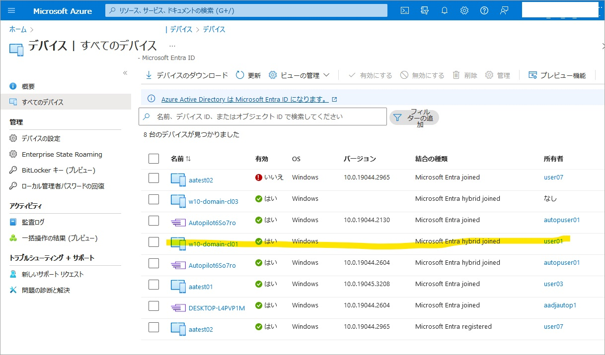

# Microsoft Entra ハイブリッド参加を再構成する (簡易版)

こんにちは、Azure & Identity サポート チームの長谷川です。

この記事では、対象デバイスの Microsoft Entra ハイブリッド参加を再構成する手順の簡易版を紹介します。

完全版は[こちら](../azure-active-directory/haadj-re-registration.md)に掲載されていますが、完全版ではオンプレミスの Active Directory サーバーへの管理アクセスが必要になります。
しかしながら Active Directory サーバーへ管理アクセスしなくても Microsoft Entra ハイブリッド参加を再構成することができる場合があるため、完全版から Active Directory サーバーへの管理アクセスを除いた簡易版の手順を作成しました。
まずこの簡易版を利用し、簡易版で状況が変わらなければ完全版を利用する、といった流れで活用いただければと思います。

## 目次

1. [注意事項](#anchor1)
2. [事前準備: Windows Hello for Business のリセット](#anchor2)
3. [事前準備: Intune の登録解除](#anchor3)
4. [Microsoft Entra ハイブリッド参加の再構成](#anchor4)
5. [事後確認: Intune の登録](#anchor5)
6. [事後作業: WHfB の再プロビジョニング](#anchor6)

<h2 id="anchor1">1. 注意事項</h2>
再度 Microsoft Entra ハイブリッド参加を構成するためには、そのデバイス上での管理者権限と、デバイスがオンプレミスの Active Directory にアクセスできる環境 (社外にデバイスがある場合は、オンプレミス AD 環境への VPN 接続) が必要です。

<h2 id="anchor2">2. 事前準備: Windows Hello for Business のリセット</h2>

**Windows Hello for Business (略称 WHfB) を利用していない場合はこの手順はスキップください。**

1. 端末にサインインします。
2. **ユーザー権限** でコマンド プロンプトを起動します (管理者として実行から起動しないようご注意ください)。
3. 以下のコマンドを実行して、WHfB の情報をリセットします。

    ```
    certutil -deletehellocontainer
    ```
    
4. 次のコマンドを実行し、`NgcSet : NO` となっていることを確認します。

    ```
    dsregcmd /status
    ```

<h2 id="anchor3">3. 事前準備: Intune の登録解除</h2>

**Intune 登録していなければスキップください。**

1. [Microsoft Intune 管理センター (intune.microsoft.com)] > [デバイス] > [すべてのデバイス] から該当デバイスを検索し、存在する場合は対象デバイスを開いて [削除] ボタンをクリックして削除します (削除完了するまでに少し時間がかかります)。
2. 対象のデバイス上で、[PowerShell] を **管理者権限** で実行します。
3. 以下のコマンドを実行し、Enrollment ID (GUID の形式となる想定) が表示されるかを確認します。 **<span style="color: red; ">(表示されない場合は以下の 4. から 7. の手順は実施しないでください)</span>**

    ```
    Get-ChildItem HKLM:\Software\Microsoft\Enrollments | ForEach-Object {Get-ItemProperty $_.pspath} | where-object {$_.DiscoveryServiceFullURL} | Foreach-Object {$_.PSChildName}
    ```

4. 以下のコマンドを実行し、Enrollment ID を変数に格納します。

    ```
    $EnrollmentGUID = Get-ChildItem HKLM:\Software\Microsoft\Enrollments | ForEach-Object {Get-ItemProperty $_.pspath} | where-object {$_.DiscoveryServiceFullURL} | Foreach-Object {$_.PSChildName}
    ```

5. 以下のコマンドを実行し削除対象のレジストリを変数に格納します。(長いですが 1 行のコマンドです)
    ```
    $RegistryKeys = "HKLM:\SOFTWARE\Microsoft\Enrollments", "HKLM:\SOFTWARE\Microsoft\Enrollments\Status","HKLM:\SOFTWARE\Microsoft\EnterpriseResourceManager\Tracked", "HKLM:\SOFTWARE\Microsoft\PolicyManager\AdmxInstalled", "HKLM:\SOFTWARE\Microsoft\PolicyManager\Providers","HKLM:\SOFTWARE\Microsoft\Provisioning\OMADM\Accounts", "HKLM:\SOFTWARE\Microsoft\Provisioning\OMADM\Logger", "HKLM:\SOFTWARE\Microsoft\Provisioning\OMADM\Sessions"
    ```
    
6. 以下のコマンドを実行し、デバイス登録情報に関するレジストリを削除します。

    ```
    foreach ($Key in $RegistryKeys) {if (Test-Path -Path $Key) {Get-ChildItem -Path $Key | Where-Object {$_.Name -match $EnrollmentGUID} | Remove-Item -Recurse -Force -Confirm:$false -ErrorAction SilentlyContinue}}
    ```

7. 以下のコマンドを実行し、デバイス登録のタスクを削除します。 **<span style="color: red; ">変数 $EnrollmentGUID がブランクの状態で以下のコマンドを実行すると必要なタスクが削除される恐れがありますため注意してください (念のため IF 文で誤削除を予防はしています)。</span>**
    ```
    if ($EnrollmentGUID -eq $null) {Write-Warning "EnrollmentGUID is NULL"} elseif ($EnrollmentGUID -eq "") {Write-Warning "EnrollmentGUID is BLANK (but it is not NULL)"} else {Get-ScheduledTask | Where-Object {$_.Taskpath -match $EnrollmentGUID} | Unregister-ScheduledTask -Confirm:$false}
    ```

<h2 id="anchor4">4. Microsoft Entra ハイブリッド参加の再構成</h2>

Microsoft Entra ID から離脱し Microsoft Entra ハイブリッド参加を解除、その後再構成します。

1. 対象のデバイスに対象のドメイン ユーザーでサインインし、 __管理者権限__ でコマンド プロンプトを起動し、次のコマンドで Microsoft Entra ハイブリッド参加を解除します。
    ```
    dsregcmd /leave
    ```

2. 次のコマンドで `AzureAdJoined : NO` となっていることを確認します。

    ```
    dsregcmd /status
    ```
3. Microsoft Entra Connect の同期 (既定では 30 分間隔) を経て [Azure Portal (portal.azure.com)] > [Microsoft Entra ID] > [デバイス] > [すべてのデバイス] に対象のデバイス オブジェクトが同期されたことを確認します。

    

4. 対象のデバイスがオンプレミスの Active Directory にアクセスできるネットワーク環境に接続していることを確認します (社内ネットワーク環境に接続するなど)。

5. **管理者権限** でタスク スケジューラを起動し [タスク スケジューラ ライブラリ] > [Microsoft] > [Windows] > [Workplace Join] を開きます。
6. [Automatic-Device-Join] を 右クリックし [実行する(R)] を選択します。

    

7. コマンド プロンプトを起動し次のコマンドを実行し `AzureAdJoined : YES` となっていることを確認します。

    ```
    dsregcmd /status
    ```

8. [Azure Portal (portal.azure.com)] > [Microsoft Entra ID] > [デバイス] > [すべてのデバイス] で対象のデバイス オブジェクトの [登録済み] の項目が日付であることを確認します。

    

9. 対象デバイスにて 画面のロック > アンロック をすることでプライマリ更新トークン (PRT) を取得します。(すぐにアンロックしていただいて問題ありません)
10. 対象のデバイスにて対象の **ユーザー権限** でコマンド プロンプトを起動し、次のコマンドを実行して `AzureAdPrt : YES` となっていることを確認します (管理者として実行から起動しないようご注意ください)。

    ```
    dsregcmd /status
    ```

<h2 id="anchor5">5. 事後確認: Intune の登録</h2>

**この手順は Intune 登録しなければ不要です。** また、反映に時間がかかることがあります。

1.  [Azure Portal (portal.azure.com)] > [Microsoft Entra ID] > [デバイス] > [すべてのデバイス] で対象のデバイス オブジェクトの [MDM] の項目に値が入り [準拠している] が「はい」となっていることを確認します。
2. [Microsoft Intune admin center (endpoint.microsoft.com)] > [デバイス] > [すべてのデバイス] から該当デバイスを検索し対象デバイスの [対応] の項目が「準拠している」となっていることを確認します。

<h2 id="anchor6">6. 事後作業: WHfB の再プロビジョニング</h2>

**WHfB を利用していなければ不要です。**

1. 端末を再起動します。
2. 対象のユーザーでサインインすると WHfB のプロビジョニングが自動的に始まりますのでウィザードに沿ってセットアップします (ウィザードの中で多要素認証が要求されます)。

## おわりに

Microsoft Entra ハイブリッド参加の再構成の簡易版を紹介しました。手順が運用の助けになると嬉しく思います。製品動作に関する正式な見解や回答については、お客様環境などを十分に把握したうえでサポート部門より提供しますので、ぜひ弊社サポート サービスをご利用ください。
