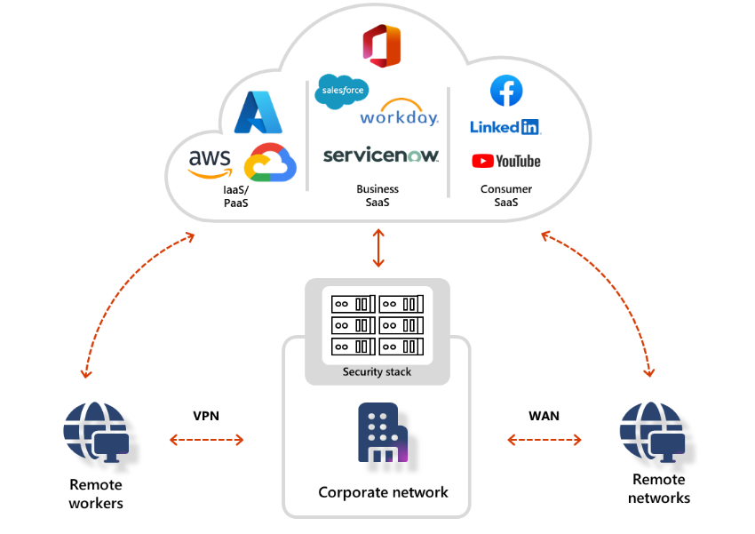
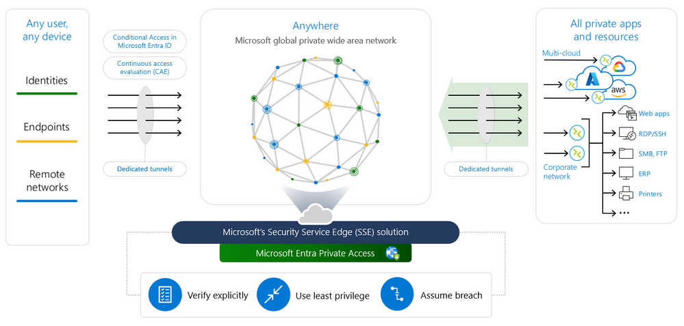
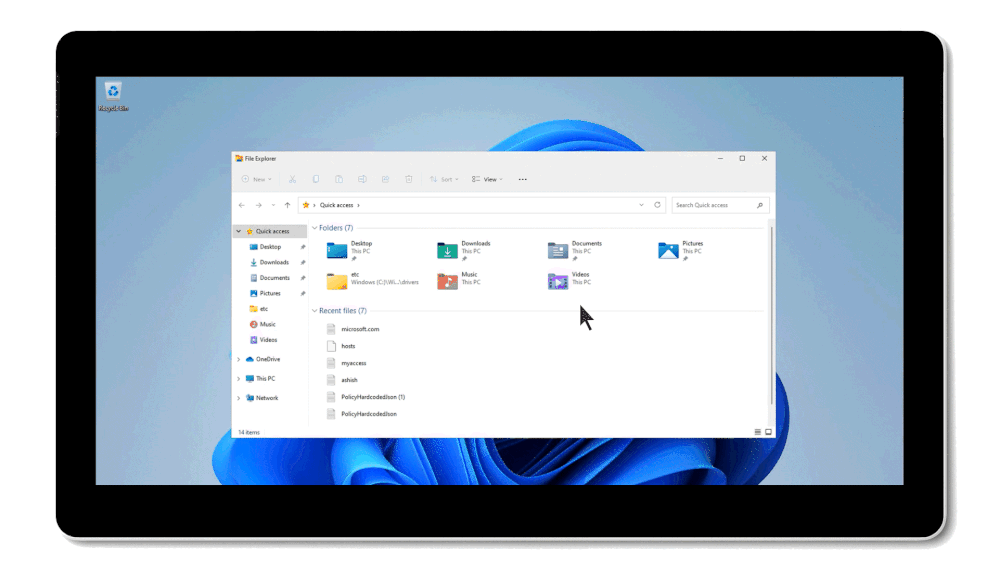
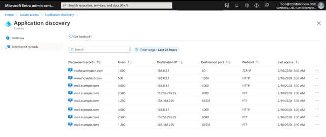
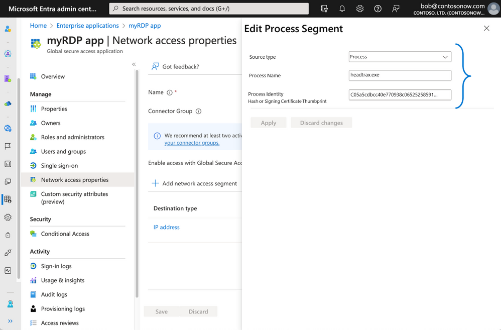
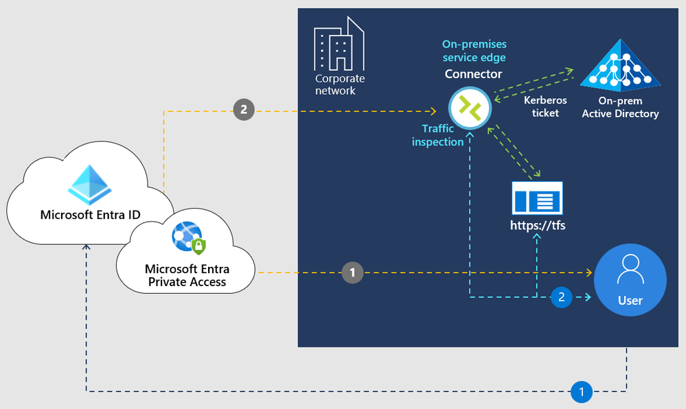
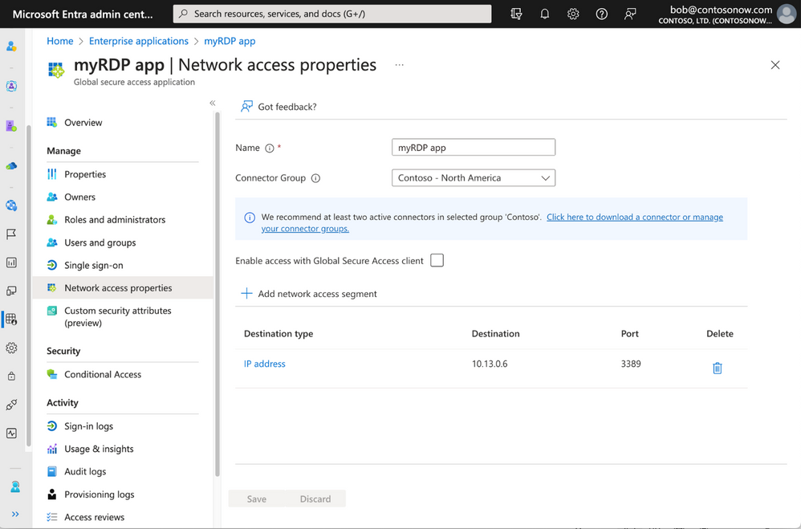

# Microsoft Entra Private Access: ID を中心としたゼロ トラスト ネットアーク アクセス ソリューション

こんにちは、Azure Identity サポート チームの 五十嵐 です。

本記事は、2023 年 8 月 28 日に米国の Azure Active Directory Identity Blog で公開された [Microsoft Entra Private Access: An Identity-Centric Zero Trust Network Access Solution](https://techcommunity.microsoft.com/t5/microsoft-entra-azure-ad-blog/microsoft-entra-private-access-an-identity-centric-zero-trust/ba-p/3905451) を意訳したものになります。ご不明点等ございましたらサポート チームまでお問い合わせください。

---

2023 年 7 月 11 日、[マイクロソフトの ID を軸とした Security Service Edge (SSE) ソリューション](https://techcommunity.microsoft.com/t5/microsoft-entra-azure-ad-blog/microsoft-entra-expands-into-security-service-edge-with-two-new/ba-p/3847829) (日本語訳したブログは [こちら](https://jpazureid.github.io/blog/azure-active-directory/microsoft-entra-expands-into-securityserviceedge-with-two-new-offerings/))と 2 つの新しいサービスをご紹介しました。それぞれ Microsoft Entra Private Access と Microsoft Entra Internet Access で、現在これらは **パブリック プレビュー** となっています。このブログでは、Microsoft Entra Private Access について詳しく説明します。

## Microsoft Entra Private Access

レガシー VPN を使用する従来のネットワーク セキュリティ アプローチでは、現代の需要に対応することはできません。リモート ユーザーが VPN 経由で企業ネットワークに接続すると、そのユーザーはネットワーク全体に対して過剰なアクセスを許可されることになります。攻撃者が一つのアカウントを侵害するかデバイスをウィルスに感染させるか、開放中のポートにアクセスさえできれば、攻撃者に侵入を許し、別デバイスなど横方向に攻撃範囲を広げ、最終的に最も重要な資産にアクセスされてしまうということになります。

Microsoft Entra Private Access は、ID を中心とした ZTNA (ゼロ トラスト ネットワーク アクセス) サービスで、従来の VPN の運用の複雑さとコストを削減し、過剰なアクセスを排除して攻撃者による横断的な攻撃を防止します。社内アプリケーションとリソースへのアクセスを刷新し、自宅、リモート、社内など、あらゆるデバイスとネットワークから社内アプリケーションに迅速かつ簡単に接続できるようにします。

## Private Access の特徴

マイクロソフトの SSE ソリューションの一部として、Private Access はゼロ トラストの原則に基づいて構築されています。Private Access は、すべてのユーザーを検証し、最小特権を適用して、ユーザーが必要な社内アプリケーションとリソースにのみアクセスできるようにします。Private Access は、Microsoft Entra の Entra ID アプリケーション プロキシの機能を大幅に拡張し、同じコネクタを使用するだけでなく、完全な ZTNA ソリューションとして、あらゆるポートとプロトコルのあらゆるプライベート リソースへのアクセスをよりシンプルかつセキュアにします。また、企業ネットワーク、オンプレミス、クラウドのすべての社内アプリケーションに対し、セキュアでセグメント化されたきめ細かなアクセスを可能にするポリシーを適用できます。すでにアプリケーション プロキシを使っているお客様は、Private Access にシームレスに移行できます。既存のすべてのユースケースと既存の社内 Web アプリケーションへのアクセスは、中断することなく機能し続けます。

ユーザー、デバイス、および場所といった要素を考慮した、きめ細かな条件付きアクセス ポリシーに基づいて、アプリごとに最小特権のアクセス制御を作成および実施できます。また、ユーザーのコンテキストやデバイス状態の異常や変化に対応して、進行中のセッションを終了させることもできます。例えば、あるユーザーが世界のある地域から接続した後、すぐに別の地域から接続した場合 (いわゆる「あり得ない移動」) に、再認証を強制したり、より強力な認証方法にステップアップしたりすることができます。

Private Access は、オンプレミスまたはクラウド ベースのあらゆるアプリケーションへのセキュアなアクセスを可能にし、RDP、SSH、SMB、FTP など、TCP または UDP を使用するあらゆるポートやプロトコルで動作します。さらに、SAML や http ヘッダーを使用したシングルサインオン (SSO)、あるいは従来の Kerberos 認証も、Web アプリケーションと非 Web アプリケーションの両方で、アプリケーションに変更を加えることなく有効にすることができます。

最大級のグローバル プライベート ネットワークであるマイクロソフトの [グローバル ネットワーク](https://learn.microsoft.com/ja-jp/azure/networking/microsoft-global-network) から提供される Private Access では、プライベート アプリケーションの安全性が高まるだけでなく、従来の VPN に比べて従業員がより迅速にアクセスできるようになります。比類のない規模と広大なグローバル ネットワークにより、特にハイブリッド ワークやリモート ワーク環境で働くユーザーやデバイスをプライベート リソースに最適に接続することができます。

## Private Access の主な機能

Microsoft Entra Private Access は、すべてのプライベート アプリケーションとリソースへのセキュアなアクセスを可能にします。主な機能は次のとおりです:

### Quick Access によるレガシー VPN からの迅速かつ簡単な移行

レガシー VPN を ID を軸とした ZTNA に置き換えることで、暗黙の信頼や横断的な攻撃のリスクを最小限に抑えることができます。Quick Access を使用すると、広範なプライベート IP 範囲と完全修飾ドメイン名 (FQDN) を簡単に構成でき、すべてのプライベート リソースに対して、ID を軸としたゼロ トラスト ベースのアクセスを迅速に実現できます。

### すべてのプライベート アプリケーションに対する ID を中心としたセキュリティ制御の強化

Private Access を使用すると、Kerberos や NT LAN Manager (NTLM) などのレガシー プロトコルを使用している場合でも、あらゆるプライベート アプリケーションへのアクセスに先進認証を必要とする条件付きアクセス ポリシーと多要素認証 (MFA) を作成できます。これにより、アプリケーションの機密性、ユーザー リスクのレベル、ネットワーク コンプライアンスなどに基づいたポリシーがレガシー アプリケーションに適用されます。例えば、リモート デスクトップ (RDP)、セキュア シェル (SSH)、SMB アプリケーションにアクセスしようとするユーザーに対して、多要素認証 (MFA) やデバイスの準拠状態のチェックを簡単に要求することができます。

### プライベート アプリケーションの自動検出とオンボーディング

アプリケーション プロキシを使用する既存の社内 Web アプリケーションを含め、プライベート アプリケーションがプライベート ネットワーク、オンプレミス データセンター、クラウドのいずれでホストされていても自動的に検出可能となります。その後、アプリケーションを Microsoft Entra ID に組み込み、グループ化し、きめ細かなアクセス ポリシーを定義できます。

### きめ細かくセグメント化されたアプリケーション アクセス

従来の VPN のように、リモート ユーザーにネットワーク全体へのアクセスを許可するのではなく、ユーザーやデバイス、各デバイス上で実行されているプロセスに基づいて、各アプリケーションまたはアプリケーションのグループごとにきめ細かくセグメント化されたアクセス ポリシーを定義することができます。

### インテリジェント ローカル アクセス

従業員は、プライベート アプリケーションにリモートからアクセスする場合でも、社内からでアクセスする場合でも、一貫したセキュリティ体制を必要としています。インテリジェント ローカル アクセス機能は、ユーザーが企業ネットワーク内にいても、企業ネットワーク外のどこかからリモート接続しても、迅速かつシームレスな ZTNA (ゼロトラストでのネットワークアクセス) を可能にします。例えば、企業ネットワーク内にいるユーザーは、MFA などの CA ポリシーが適用されたまま、RDP や SMB などのオンプレミスの社内アプリケーションに接続でき、アプリケーション トラフィックは企業ネットワーク上から外部に出ることはありません。

## Microsoft Entra Private Access をはじめる

[グローバル セキュア アクセス](https://entra.microsoft.com/#view/Microsoft_Azure_Network_Access/Welcome.ReactView) (プレビュー) は、Microsoft Entra Private Access を構成および管理できる Microsoft Entra 管理センター内の設定ポータルです。グローバル セキュア アクセス クライアントがインストールされていれば、リモート ワーカーはこれらのリソースにアクセスするために VPN を使用する必要はありません。クライアントは、必要なリソースにシームレスに接続します。クライアントの最新バージョンは、Microsoft Entra 管理センターからダウンロードできます。クライアントは、対話的にインストールすることも、/quiet スイッチを使ってサイレントにインストールすることも、もしくは [Microsoft Intune のようなモバイルデバイス管理プラットフォームを使って](https://learn.microsoft.com/ja-jp/mem/intune/apps/apps-win32-app-management) デバイスにインストールすることもできます。

Quick Access を使用すると、特にレガシー VPN から ZTNA への移行を計画している場合、Private Access を最小構成で非常に簡単に開始できます。[初期設定](https://learn.microsoft.com/ja-jp/azure/global-secure-access/how-to-get-started-with-global-secure-access) を完了し、オンプレミスにコネクター エージェントを展開した後、Quick Access を有効にするために必要なのは、IP アドレス、IP アドレス範囲、または FQDN とポート番号を指定することだけです。その後、特定の条件付きアクセス ポリシーを割り当てることができ、これにより設定したすべてのアプリ セグメントに Quick Access が適用されます。たとえば、「myRDPアプリ」を作成し、IP アドレスベースのアプリ セグメントを割り当てます。プライベート アプリの名前を指定し、アプリで使用するコネクタを選択して、IP アドレス/範囲とポート番号を指定するだけです。その後、リモート クライアント マシンから RDP セッションを起動するだけで、接続先にアクセスできます。

さまざまなユースケースやシナリオ、設定の前提条件、クライアントやリモート ネットワーク接続および Quick Access などを通じてプライベート ネットワーク上のリソースへのセキュアなアクセスを有効にする方法については、グローバル セキュア アクセスの [ドキュメント](https://learn.microsoft.com/ja-jp/azure/global-secure-access/how-to-get-started-with-global-secure-access) をご覧ください。

オンデマンドの Tech Accelerator 製品 deep dive セッションで、Private Access の実際についてさらに詳しく学ぶことも可能です。
