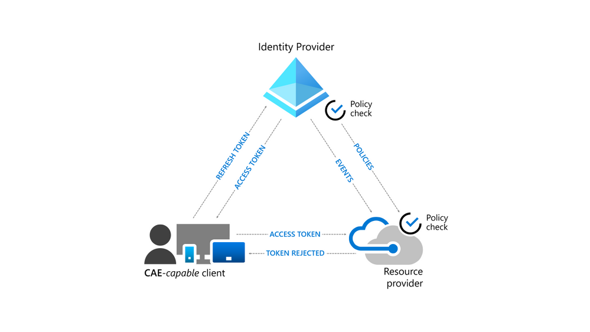

> 本記事は、 2020 年 4 月 21 日に Azure Active Directory Identity Blog に公開された記事 (Moving towards real time policy and security enforcement) を翻訳したものです。原文は [こちら](https://techcommunity.microsoft.com/t5/azure-active-directory-identity/moving-towards-real-time-policy-and-security-enforcement/ba-p/1276933) より参照ください。

# ポリシーとセキュリティのリアル タイムな適用に向けて

皆さんこんにちは。

はじめに、世界中でセキュリティおよび ID を担当する皆さんが情報セキュリティを強化しつつ、新しい働き方を実現するために大変な活躍をされていることに驚かされるばかりです。今まさにゼロ トラストのモデルが急激に導入されつつあり、その一端を担えることを本当に光栄に思います。本日は、セッションの有効期間を最小限に抑えるための重要な新機能についてお知らせします

Azure Active Directory や Office 365 などの Microsoft のサービスでは、オープンな標準やプロトコルを使用して相互運用性を最大限に高めています (以前にも述べたように、標準はセキュリティの観点でも非常に重要です)。今回のお話では、認証のための OpenID Connect (OIDC) と認可のための OAuth 2.0 が重要になります。Outlook のようなクライアント アプリケーションが Exchange Online のようなサービスに接続する場合、API リクエストは OAuth 2.0 のアクセス トークンを使用して認証されます。既定ではこれらのアクセス トークンの有効期限は 1 時間です。有効期限が切れると、クライアントは Azure AD にリダイレクトされ、トークンを更新します。これによりユーザーによるアクセスをポリシーで再評価することが可能となります。例えば、条件付きアクセス ポリシーの構成によりトークンを更新しないようにしたり、ユーザーがディレクトリ内で無効になっている場合は、トークンを更新されないようにすることが可能です。

トークンの失効と更新のメカニズムは、業界でも試行錯誤されてきた経緯があります。というのも、ユーザーのリスク条件が変化 (例えば会社のオフィスから地元のコーヒー ショップに移動したり、ブラック マーケットにユーザーの資格情報が漏洩) したタイミングから、その変化に関連したポリシーが適用されるまでの間にはタイムラグが生じるため、お客様としてはその時間差に懸念が生じてしまいます。我々は、トークンの有効期間を短くするという直接的なアプローチで実験を行ったこともありましたが、ユーザー体験や信頼性を低下させる結果となり、リスクを低下させることもできませんでした。

ポリシー違反やセキュリティの問題にタイムリーに対応するためには、トークンの発行元 (例: Azure AD) とリライング パーティー (例: Exchange Online) との間で「会話」が必要です。この双方向の会話により、2 つの重要な機能が実現できます。リライング パーティーは、状況が変わったとき (クライアントが新しい場所から接続に来るなど) にそれを認識でき、トークン発行元に通知できます。また、トークンの発行元は、アカウントの侵害、無効化、またはその他の懸念が生じた際に、そのユーザーに対するトークンの受け入れをやめるようリライング パーティーに伝えることができます。この会話のメカニズムを、CAE (Continuous Access Evaluation: 継続的なアクセス評価) と呼びます。

マイクロソフトは、OpenID Foundation における [Shared Signals and Events](https://openid.net/wg/sse/) ワーキング グループのメンバーとして、Continuous Access Evaluation Protocol (CAEP) イニシアティブに早期から参加してきました。ID プロバイダとリライング パーティーは、このワーキング グループで定義されたセキュリティ イベントとシグナルを活用して、アクセスの再認証や停止を行うことができるようになります。これは素晴らしいことで、多くのプラットフォームやアプリケーションで全体のセキュリティが向上します。

セキュリティ上のメリットが非常に大きいため、マイクロソフトでは標準化団体内での継続的な作業と並行して、マイクロソフト固有の初期実装を展開中です。マイクロソフトのサービス全体にこれら CAE の機能を展開していく中で多くの教訓が得られており、この情報を標準化コミュニティと共有しています。当社の展開における経験が、よりよい業界標準を策定するうえで有益な情報となることを願っており、また標準が承認された際にはそれを実装し、連携するすべてのサービスが恩恵を受けられるようコミットしています。

## CAE に関するマイクロソフトの取り組み

マイクロソフトでは、Exchange と Teams で CAE への最初の取り組みを進めています。Windows、iOS、MacOS、Android 上の Outlook と Teams アプリケーションの最新バージョンが CAE に対応しており、これらのクライアントを使用していれば、お客様でのアクションは必要ありません。対応クライアントの一覧は今後順次拡大していく予定です。

今回の初期 CAE の展開では、以下のイベントに対応しています。

- ユーザー アカウントが削除または無効化される
- ユーザーのパスワードが変更またはリセットされる
- ユーザーの MFA が有効になる
- 管理者がユーザーのすべてのリフレッシュ トークンを明示的に無効にする
- Azure AD Identity Protection によってユーザー リスクの上昇が検知される

将来的には、位置情報やデバイスの状態変化含むより多くのイベントが瞬時に評価されるようにする予定です。我々の目標は評価が即時に行われるようにすることですが、場合によってはイベントの伝播に時間がかかり最大 15 分の遅延が生じることも考えられます。

## Microsoft のサービスにおける CAE の挙動

CAE は以下のように実装されています:

**Azure AD によるリライング パーティーとの通信:** Exchange Online や Teams などのリライング パーティーは、Azure AD からの重要なイベント受け取れるようサブスクリプションを作成します。Azure AD からイベントを受信すると、そのリライング パーティーは、イベントの影響をうけるクライアントから今後リクエストが来た際に、そのクライアントに対して Azure AD から新しいトークンを取得するように要求します。このように動作するためには、クライアントが新しい応答タイプを認識し、適切に処理する必要があります。このため、この動作の恩恵を受けるには、クライアント アプリに一連のフローを実装する必要があります。

**リライング パーティーによる Azure AD との通信:** さらに、リライング パーティーは主なポリシーを Azure AD から自身に同期し、クライアントがそのポリシーの条件と異なる場合に Azure AD に通知します。例えば、クライアントが存在すべきネットワークについてポリシーが定義されており、クライアントの IP アドレスがそのネットワークのものから変更された場合であれば、リライング パーティーは、トークンの再発行のためにクライアントを Azure AD にリダイレクトするかどう判断できます。

まずは、条件付きアクセス ポリシーが構成されていないテナントに対してのみ CAE を有効にする予定です。リスクとポリシーがリアルタイムに評価されるため、CAE に対応したセッションで通信するクライアントは、既存の静的なアクセス トークン ライフタイム ポリシーではなく、CAE に依存することになります。このアプローチの最初の段階として、CAE が有効化されたセッションでのアクセス トークンの有効期限を 24 時間に延長します。トークンの失効は任意の時間枠ではなく、リスクとポリシーの評価に基づいて行われます。これにより、セキュリティに影響を与えることなく、アプリケーションの安定性を向上させることが可能です。今後別のマイクロソフトのサービスを継続的に展開していく際に、CAE のこのフェーズで得た学びを活用していくつもりです。

リアルタイムでのポリシーの反映は、業界で何年にもわたって議論し取り組んできたものであり、組織とユーザーのセキュリティ強化に向けた重要な一歩であることから、この新機能には非常に期待しています。

この機能についてご質問などありましたら、いつものように [@alex_t_weinert](http://twitter.com/alex_t_weinert) までご連絡ください。

皆さまお気をつけて！
