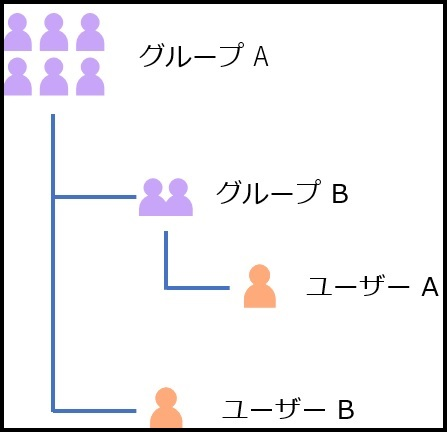

> [!NOTE]
> 本記事は Technet Blog の更新停止に伴い [TechNet Blog](https://blogs.technet.microsoft.com/jpazureid/2019/02/06/nesting-group/) の内容を移行したものです。元の記事の最新の更新情報については、本内容をご参照ください。

> [!NOTE]
> 2019-02-06: 本記事の初版を投稿  
> 2023-04-07: 最新の公開情報リンクへの差し替えなど更新

# Azure AD における入れ子 (ネスト) グループへの権限付与について

こんにちは、 Azure Identity の平形です。

今回は Azure AD における入れ子 (ネスト) グループの対応状況についてお伝え致します。本記事は記事はは当初 2019 年 2 月に公開されましたが、その後 Azure ポータルのメニューなどが変更されたため、内容を最新版に更新いたしました。

## 入れ子のグループとは

そもそも入れ子のグループとは、グループの中にグループを所属させているグループを指します。以下の図をご覧ください。

この場合はグループ A が入れ子のグループです。グループ A の中にはグループ B とユーザー B が含まれています。そしてユーザー A はグループ B に含まれている状態ですが、実際の挙動としてユーザー A はグループ A に含まれていると考えて良いかどうかが今回のテーマです。

例えば、アクセス権限をグループ A に割り当てた場合、ユーザー A に対してもアクセス権限が割り当てられることが期待されますが、 Azure AD の機能によっては必ずしもそうならず、いくつかの制限事項があります。ここではよくお問い合わせ頂く制限事項についてご紹介します。

## Azure AD における入れ子グループの制限

主にお問い合わせ頂く機能の中で、現時点では以下の機能については入れ子グループに対応していません。

- グループ ベースのライセンス付与
- エンタープライズ アプリケーションのユーザーおよびグループの割り当て

上記はグループに直接所属しているユーザーにのみ機能が割り当てられます。一方、条件付きアクセスの機能でグループを条件として設定した場合、入れ子のグループにも対応しており、上の例でいえばグループ A を対象とした条件付きアクセス ポリシーは、ユーザー A も対象になります。

実際のシナリオを考えてみましょう。グループ A に対して例えば Office 365 E3 のライセンスを割り当てた場合、先程の図のパターンに当てはめると以下のような結果になります。

例: グループ A に権限を割り当てた場合

ユーザー A はグループ A の直属のメンバーでは無いため、グループ A にライセンスを割り当てても、配下のグループ B に所属しているユーザー A に対してはライセンスが付与されません。ユーザー B はグループ A の直接のメンバーであるため、問題なく権限が割り当てられます。このシナリオは Office 365 E3 のライセンスを割り当てた場合としましたが、エンタープライズ アプリケーションの割り当ての場合にも同様の動作となります。

## 参考情報

Azure Active Directory のライセンス管理にグループを使用する際のシナリオ、制限、および既知の問題  
https://docs.microsoft.com/ja-jp/azure/active-directory/users-groups-roles/licensing-group-advanced

SaaS アプリケーションへのアクセスをグループで管理する  
https://docs.microsoft.com/ja-jp/azure/active-directory/users-groups-roles/groups-saasapps

Azure AD サービスの制限と制約 (表内グループの項目でも、本記事に記載の内容を確認できます。)  
https://learn.microsoft.com/ja-jp/azure/active-directory/enterprise-users/directory-service-limits-restrictions

## 備考

グループの入れ子については多くのお客様よりフィードバックをいただいており、弊社開発部門も実装を検討しています。

https://feedback.azure.com/d365community/idea/fa8991c1-b125-ec11-b6e6-000d3a4f0789

上記のフィードバックサイトは開発部門が閲覧しており、フィードバックが多い機能や要望は今後の Azure 機能拡張の参考にしています。

グループの入れ子については、階層が深い場合や、グループの入れ子構造がループしている場合の検出など技術的に考慮すべき部分もあり現状はサポートされていない機能が多い状況です。グループの入れ子に対応していないことで不便さを感じられている方は、是非上記のフィードバック サイトから投票ください。
