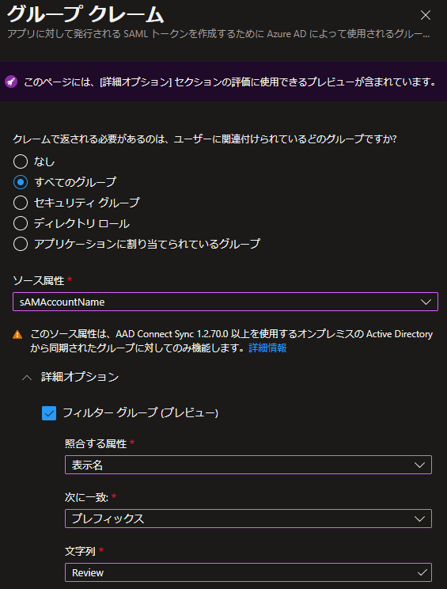
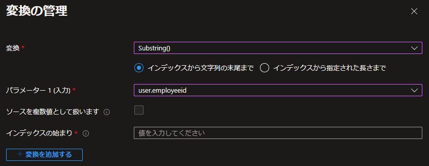
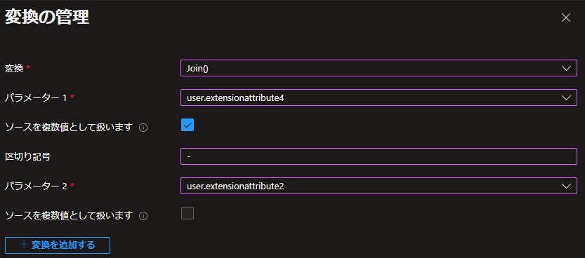

---
title:  AD FS 上のアプリをさらに Azure AD に移行するための新機能の提供

date: 2022-05-07 12:00
tags:
  - Azure AD
  - US Identity Blog
---

#  AD FS 上のアプリをさらに Azure AD に移行するための新機能の提供

こんにちは、Azure Identity サポート チームの 竜 です。

本記事は、2022 年 04 月 25 日に米国の Azure Active Directory Identity Blog で公開された [New capabilities that empower you to migrate more of your apps on AD FS to Azure AD](https://techcommunity.microsoft.com/t5/azure-active-directory-identity/new-capabilities-that-empower-you-to-migrate-more-of-your-apps/ba-p/3282145) を意訳したものになります。

----

皆さん、こんにちは。

Microsoft のグループ プロダクト マネージャーで、認証プラットフォームを担当している Samuel Devasahayam です。過去数年の間で、何千ものお客様が、何百万ものアプリとユーザーを Active Directory Federation Services (AD FS) から Azure AD に移行しました。あらゆる規模のお客様が、アプリを Azure AD に移行することでビジネスを変革し、その結果、AD FS 環境に関連する基盤の監視やサポート、ならびにパッチの適用に悩みから解放されました。また、コストの削減やセキュリティ体制の強化も実現できています。このような移行の取り組みにより、多要素認証やリスク ベースの条件付きアクセス、 Identity Protection など、業界をリードする Azure AD のセキュリティ機能を最大限に活用できるようになり、組織をより保護できるようになりました。  

本日、お客様がほぼすべてのアプリケーションを AD FS や他の ID プロバイダーから Azure AD に容易に移行するための重要な新機能をご紹介できることを嬉しく思います。お客様からの要望に応え、弊社ではトークンに含まれるクレームの改善や変換機能など、Azure AD へのアプリケーションの移行を阻んでいた要素について対応を進めていました。これらの新機能により、お客様は AD FS に関連するコストを削減し、Azure AD にて業界をリードするセキュリティ機能を利用できるようになります。お客様がすべてのアプリを AD FS から Azure AD に簡単に移行できるようにする弊社の取り組みについて、ぜひ以下をご覧ください。  

## [部分文字列の一致を用いて、トークンに含まれるグループをフィルターする](https://docs.microsoft.com/ja-jp/azure/active-directory/develop/reference-claims-mapping-policy-type#group-filter-preview)

初期のオンプレミス AD では、多くのお客様が何百ものグループに所属するユーザーを抱えていたため、Kerberos トークンが肥大化し、特定のアプリケーションにおいて認証に失敗してしまうことがありました。AD FS とフェデレーション アプリケーションの登場により、SAML トークン内のすべてのグループをよりスマートに発行できるよう「グループ フィルタリング」が提供されるようになりました。グループ フィルタリングにより、お客様はアプリケーションが認可の決定を下すために必要なグループのみを指定することができるようになりました。AD FS を導入するお客様が増えるにつれ、複数の入力文字列を用いたより複雑なフィルタリングが行われるようになりました。また、グループ フィルタリングを使用して、AD グループを AWS のロールにマッピングするお客様も多くいらっしゃいました。 

 
今回、この機能を Azure AD にも導入しました。これにより、「グループ オブジェクトの表示名」または「 onPremisesSAMAccountName 属性」の文字列の部分一致により、SAML トークンに含まれるグループのフィルタリングが可能になりました。この機能は現在パブリック プレビューであり、複数のグループ メンバーシップを持つ組織は、アプリケーションに関連するグループを指定し、ユーザーがメンバーであるグループのみがトークンに含まれるようにすることができます。  

  

## [追加のユーザー属性をクレームとして構成する](https://docs.microsoft.com/ja-jp/azure/active-directory/develop/reference-claims-mapping-policy-type)

お客様がより多くの SaaS アプリケーションを採用するにつれて、SAML トークンで送信する必要のあるユーザー属性 (クレーム) の要件がアプリケーションごとに 異なることに気付くと思います。たとえば、Box を使用している一部のお客様は、すべてのユーザーの proxyAddresses を SAML トークンに含めるという要件があります。しかし、このように複数の値を持つ属性は、これまで Azure AD のクレーム発行の仕組みでは利用できませんでした。  

今回、新たなユーザー属性を Azure AD のクレームとして追加しました。これらの新しい属性は、Azure Portal にて、「属性およびクレーム」の設定もしくは Microsoft Graph のクレーム マッピング ポリシーにおいてソースとして使用することができます。これにより、より多くのアプリケーションを AD FS や他の ID プロバイダーから、Azure AD に移行することができます。 現在サポートされている新しい属性をすべて確認するには、弊社の[クレーム マッピングの公開情報](https://docs.microsoft.com/ja-jp/azure/active-directory/develop/reference-claims-mapping-policy-type)をご覧ください。  

## [新しい変換機能で SAML トークンのクレームをカスタマイズする](https://docs.microsoft.com/ja-jp/azure/active-directory/develop/reference-claims-mapping-policy-type#claims-transformation) 

多くのお客様は、AD FS 上に SaaS アプリケーションを追加し、ユーザー クレームに対して追加の情報を付け加えるよう構成しています。例えば、一部のお客様では Salesforce のユーザー名にインスタンス名 (例: user@domain.com.stage) を含めるように構成しており、AD FS が NameID クレームを発行する際には、末尾に適切な値を付け加えてます。これまで、Azure AD では、NameID にテナントで確認されていない UPN ドメイン (@domain.com) を含めることができなかったため、このようなことはできませんでした。今回パブリック プレビューとなったこの新機能では、確認されていないドメインにおいても、NameID に情報を追加できるようになりました。

加えて、ドメインの検証を行わずとも、NameID のクレームに対して結合の変換機能を使用することが可能です。結合の変換も、他のクレームと同じように NameID クレームで使用できるようになり、より柔軟な変換が可能になりました。

[部分文字列の関数](https://docs.microsoft.com/ja-jp/azure/active-directory/develop/active-directory-saml-claims-customization)についても、クレーム設定 UI にて一般提供が開始されました。ソース属性から特定の文字を抽出して作成されたクレームを必要とするアプリケーションでは、この部分文字列の関数を使用可能です。  

上述のとおり、一部のお客様においては、SAML トークンを用いて Box などのアプリケーションを利用する際に、すべてのユーザーの proxyAddresses の送信が必要な場合があります。同様の状況として、これらの proxyAddress をまず変換し、その後 SAML トークンに含めたいというお客様が多くいらっしゃるということもわかりました。

そこで、複数の値を持つ属性に対してもクレームの変換をできるようにし、複数の値を持つクレームの発行も可能としました。今回パブリック プレビューとなったこの新機能により、複数要素の最初の項目だけでなく、複数の値を持つクレームのすべての項目に対して変換を適用できるようになりました。

## [正規表現言語 (regex) を使用して、グループ クレームを作成および変換する](https://docs.microsoft.com/ja-jp/azure/active-directory/hybrid/how-to-connect-fed-group-claims)

上述のとおり、多くのお客様はグループ フィルタリングを使用して、AD グループを AWS ロールにマッピングしていますが、その中でも、RegEx または RegExReplace を使用してグループ名を AWS ロールの命名規則と一致するように編集している方も多くいらっしゃいます。 

Azure AD でもグループ名に対して同様の RegEx または RegExReplace 変換を実行できるようになりました。この機能は、複数の入力文字列に基づくグループ フィルタリングを実行するために利用できます。複数の文字列に基づくグループ フィルタリングと RegEx の柔軟性により、あるお客様は最近、AD FS アプリケーションのいくつかを直接 Azure AD に移行させることができました。また、とあるヨーロッパの大企業からは「この機能は大変素晴らしく、弊社では Azure AD を唯一の SSO プロバイダーとして利用しているため、この正規表現機能が使用できることはとても有益です。」とフィードバックをいただきました。 

これらのアプリの Azure AD への移行を容易にするための新たなアップデートを有効的にご活用ただけますと幸いです。AD FS から Azure AD へのアプリの移行においては、以下のガイダンスも併せてご参照ください。

- [アプリケーション認証を Azure Active Directory に移動する](https://docs.microsoft.com/ja-jp/azure/active-directory/manage-apps/migrate-adfs-apps-to-azure)
- [AD FS to Azure AD Migrations: Notes from the Field - Microsoft Tech Community](https://techcommunity.microsoft.com/t5/core-infrastructure-and-security/ad-fs-to-azure-ad-migrations-notes-from-the-field/ba-p/2635847)

Azure AD ですべてのアプリケーションをより簡単に管理できるようにするよう弊社が進めているアップデートや取り組みについては近日中にさらに発表される予定です。 

いつものように、フィードバックや提案をお待ちしています。以下のコメントまたは Twitter (@AzureAD) でご意見をお聞かせください。

Samuel Devasahayam (@MrADFS)  
Group Product Manager  
Microsoft Identity Division 