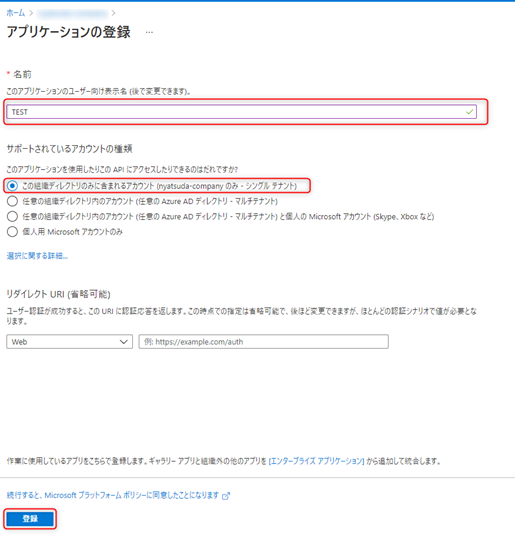
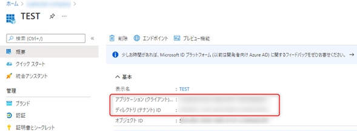
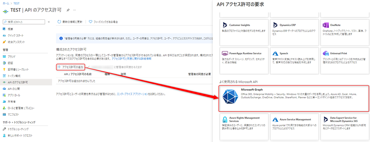
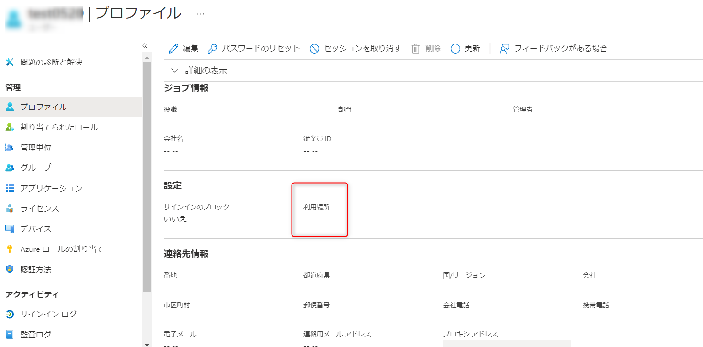

# Microsoft Graph PowerShell  を使用したライセンス管理操作の紹介

こんにちは、Azure Identity サポート チームの中井です。

先日、以下にて 米国の Azure Active Directory Identity Blog で公開された [Migrate your apps to access the license managements APIs from Microsoft Graph](https://techcommunity.microsoft.com/t5/azure-active-directory-identity/migrate-your-apps-to-access-the-license-managements-apis-from/ba-p/2464366) の翻訳ブログを公開いたしました。

[Azure AD Graph および MSOnline での従来のライセンスの割り当て方法が廃止され Microsoft Graph によるライセンス管理に変わります | Japan Azure Identity Support Blog (jpazureid.github.io)](https://jpazureid.github.io/blog/azure-active-directory/migrate-your-apps-to-access-the-license-managements/)

上記記事では、Azure AD Graph エンドポイント廃止に伴い、MSOnline および Azure AD PowerShell モジュールでの従来のライセンス割り当て操作が利用できなくなることがアナウンスされています。

そこで本記事では、今後利用が推奨される Microsoft Graph PowerShell （正式名称は Microsoft Graph PowerShell SDK）を使用したライセンス管理の方法をご紹介いたします。

# はじめに：Microsoft Graph PowerShell とは？

[Microsoft Graph PowerShell](https://docs.microsoft.com/ja-jp/powershell/microsoftgraph/overview?view=graph-powershell-1.0) は、Microsoft Graph API を コマンドを実行して呼び出せるようにした PowerShell モジュールです。

では Microsoft Graph API とは何かというと、 Azure AD だけでなく SharePoint, Outlook, Teams などの Microsoft 各サービスにアクセスし、データを取得できる統一のエンドポイントを提供しています。

Azure AD テナントにおける情報取得は、これまで[MSOnline および Azure AD PowerShell モジュール](https://jpazureid.github.io/blog/azure-active-directory/powershell-module/)を用いてきました。
Azure AD PowerShell では、2022 年 7 月以降にサポート終了予定の Azure AD Graph API を呼び出しており、上述の翻訳記事では、Set-AzureADUserLicense を中心とするライセンス管理のコマンドが廃止となる予定であることをアナウンスいたしました。

**ライセンス管理操作以外のコマンドは従来通りレスポンスを受け取れる予定であり、現時点では今後も利用可能ですが、利用するコマンドの移行をご検討いただくようお願いします。**

(Azure AD Graph API を呼び出すアプリケーションを作成されている場合、[公開情報](https://docs.microsoft.com/ja-jp/graph/migrate-azure-ad-graph-overview)を参考に、Microsoft Graph API への移行をお願いいたします。)

--------

さて、前置きが長くなってしまいましたが、以下より、Microsoft Graph PowerShell を用いたライセンス管理操作についてご紹介いたします！

非常にボリュームのある内容となっていますので、目次「3. ライセンス情報の取得」から、知りたい操作のリンクの内容を参照いただくだけでもコマンドを確認可能です。（もちろん、初めての操作の場合は 1 や 2 の事前準備が必要です）

本記事で紹介する Microsoft Graph PowerShell メソッドの参考情報は、以下の通りとなっております。

- [Set-MgUserLicense](https://docs.microsoft.com/ja-jp/powershell/module/microsoft.graph.users.actions/set-mguserlicense?view=graph-powershell-1.0)
- [Set-MgUserGroupLicense](https://docs.microsoft.com/ja-jp/powershell/module/microsoft.graph.groups/set-mggrouplicense?view=graph-powershell-1.0)

## 目次

1. [Microsoft Graph PowerShell のインストール](#idx1)
2. [Connect-MgGraph による Azure AD へのサインイン](#idx2)
   - [管理者の資格情報を利用する場合](#idx2-1)
   - [サービス プリンシパル（アプリケーション）を利用する方法](#idx2-2)
3. [ライセンス情報の取得](#idx3)
   - [テナントに紐づくライセンス情報を確認する](#idx3-1)
   - [ユーザーに割り当て済みのライセンスを確認する](#idx3-2)
4. [シナリオ1：ユーザーにライセンスを割り当てる](#idx4)
   - [すべてのサービス プランを有効にして特定のライセンスを割り当てる](#idx4-1)
   - [特定のサービス プランを無効にして特定のライセンスを割り当てる](#idx4-2)
   - [複数のサービス プランを無効にして特定のライセンスを割り当てる](#idx4-3)
   - [[新機能] グループにライセンスを割り当てる](#idx4-4)
5. [シナリオ2： ユーザーから特定のライセンスを削除する](#idx5)
   - [ユーザーから特定のライセンスを削除する](#idx5-1)
6. [シナリオ3：割り当て済みライセンスの無効にするサービスプランを変更する](#idx6)
   - [割り当て済みライセンスの無効にするサービス プランを変更する](#idx6-1)
   - [割り当て済みライセンスの無効にしているサービス プランをすべて有効にする](#idx6-2)
   - [すでに一部のサービス プランを無効にしているライセンスに対して、追加で特定のサービス プランを無効にする](#idx6-3)
   - [すでに 1 つ以上のサービス プランを無効にしているライセンスに対して、特定のサービス プランのみを無効から有効に変える](#idx6-4)
7. [シナリオ4：ライセンスを変更する](#idx7)
8. [操作完了後のサインアウト](#idx8)
9. [[補足] Set-MgUserLicense : License assignment cannot be done for user with invalid usage location. が出力される場合](#idx9)

<h1 id="idx1">1. Microsoft Graph PowerShell のインストール</h1>

PowerShell を管理者権限で開き、以下コマンドで、Microsoft Graph PowerShell SDK を操作端末にインストールします。

※ インストール先をローカル ユーザーのみに限定する場合は、`-Scope CurrentUser` パラメーターを付けます。

```bash
Install-Module Microsoft.Graph
```

公開情報：[Install the Microsoft Graph PowerShell SDK - Microsoft Graph | Microsoft Docs](https://docs.microsoft.com/en-us/graph/powershell/installation)

<h1 id="idx2">２. Connect-MgGraph による Azure AD への認証</h1>

Azure AD への認証方法として、**管理者の資格情報を使用する方法**と、**サービス プリンシパル**を利用する方法があります。

サービス プリンシパルを利用する方法とは、簡単に言うと証明書を発行したアプリケーションにアクセス許可を付与し、アプリケーション経由で Azure AD の認証および操作を行う方法です。

管理者自身が操作してライセンスの管理を行う場合は管理者の資格情報を使用する方法でも構いません。バッチ処理など、無人化や自動化を行う場合はサービス プリンシパルを使用します。

<h2 id="idx2-1"> 管理者の資格情報を使用する場合</h2>

以下のコマンドを実行して、サインインと、ライセンスの管理に必要なアクセス許可への同意を行います。

認証画面がポップアップしますので、管理者アカウントでサインします。アクセス許可の同意を求められたら [承諾] をクリックします。[組織の代理として同意する] はオフのままで問題ありません。

```bash
Connect-MgGraph -Scopes "Organization.Read.All","User.ReadWrite.All"
```

テナントに紐づくライセンスの情報を確認するために Organization.Read.All のアクセス許可が必要です。またライセンスの付与などのために User.ReadWrite.All のアクセス許可が必要です。

その後、シナリオ1以降の操作を行うために必要なモジュールをインポートしておきます。

```bash
Import-Module -Name Microsoft.Graph.Users
```

<h2 id="idx2-2">サービス プリンシパル（アプリケーション）を使用する方法</h2>

基本的な内容は以下の公開情報となります。

公開情報：[Microsoft の PowerShell SDK でアプリGraphを使用する - Microsoft Graph | Microsoft Docs](https://docs.microsoft.com/ja-jp/graph/powershell/app-only?tabs=azure-portal)

まず、Azure AD にてアプリケーションの登録を行い、サービス プリンシパルを作成します。

1. グローバル 管理者で Azure Portal にサインインし、[Azure Active Directory] – [アプリの登録] – [新規登録] をクリックします。
2. [名前] に任意のアプリの名前を入力します。(例 : App01)
3. [サポートされているアカウントの種類] から [この組織ディレクトリのみに含まれるアカウント] を選択します。
4. [リダイレクト URI] で [Web] を選択し、テキスト ボックスは空欄のままにし、[登録] をクリックします。
   
5. 表示された [アプリケーション (クライアント) ID] と [ディレクトリ (テナント) ID] の値を控えておきます。
   
6. [API のアクセス許可] – [+アクセス許可の追加] をクリックします。
[Microsoft Graph] – [アプリケーションの許可] をクリックし、[Organization.Read.All] と [User.ReadWrite.All] を選択して [アクセス許可の追加] をクリックします。

7. [<テナント名> に管理者の同意を与えます] をクリックします。確認が表示されるので [はい] をクリックします。

続いて、証明書を発行します。

8. PowerShell を起動し、以下のようにコマンドを実行します。
   
   ```bash
    $mycert = New-SelfSignedCertificate -Subject "CN=SelfSignedCert" -CertStoreLocation "Cert:\CurrentUser\My"  -KeyExportPolicy Exportable -KeySpec Signature

    # ".\SelfSignedCert.cer" は、エクスポート先のパスを適宜変更ください。
    $mycert | Export-Certificate -FilePath ".\SelfSignedCert.cer"  
    $mycert | Select Thumbprint
    ```

9. Azure Portal で先ほど登録したアプリのページに戻り、[証明書とシークレット] をクリックします。
10. [証明書のアップロード] をクリックし、9 にて出力された SelfSignedCert.cer をアップロードします。

以上で、準備は完了となります。

以下コマンドにて、サービス プリンシパルを使用して Azure AD に接続することができます。また、管理者の資格情報を使用する場合と同様、シナリオ1以降の操作を行うために必要なモジュールをインポートします。

```bash
Connect-MgGraph -Clientid "<登録したアプリのアプリケーション (クライアント) ID>" -TenantId "<アプリを登録したテナントのディレクトリ (テナント) ID>" -CertificateThumbprint "<証明書の拇印>"
Import-Module -Name Microsoft.Graph.Users
```

▼ 実行例

```bash
Connect-MgGraph -Clientid "89a531e4-38a8-41b3-9a5f-xxxxxxx" -TenantId "a818a9d9-4bf7-4316-b8bb-xxxxxx" -CertificateThumbprint "F683EBBE56184C197699930xxxxxxxxxx"
Import-Module -Name Microsoft.Graph.Users
```

<h1 id="idx3">3. ライセンス情報の取得</h1>

<h2 id="idx3-1">テナントに紐づくライセンス情報を確認する</h2>

以下のコマンドを実行し、テナントに紐づくライセンス情報を確認します。

※ -Wrap 引数は、出力結果を途切れず折り返し表示するためのパラメーターです。

```bash
Get-MgSubscribedSku | ft Id, SkuId, SkuPartNumber -Wrap
```
出力例


ライセンスの付与の際には SkuId の値を使用します。そのため、どの SkuId がこれから管理したいライセンスなのかを判別する必要があります。

SkuPartNumber の値から推測できるものもありますが、詳細は以下の公開情報に記載されていますのでそちらをご参照ください。例えば Microsoft 365 E5 の SkuPartNumber は SPE_E5 で SkuId は 06ebc4ee-1bb5-47dd-8120-11324bc54e06 です。

公開情報：[Product names and service plan identifiers for licensing](https://docs.microsoft.com/en-us/azure/active-directory/enterprise-users/licensing-service-plan-reference)

さらにライセンスの中の一部のサービス プランを無効にしたいというシナリオの場合、サービス プランの情報も確認しておく必要があります。その場合は以下のようにコマンドを実行します。

```bash
Get-MgSubscribedSku -SubscribedSkuId "<Get-MgSubscribedSku コマンドで確認した、サービス プランを確認したいライセンスの Id>" | Select-Object -ExpandProperty ServicePlans | ft ServicePlanId, ServicePlanName
```

▼ 実行例

```bash
Get-MgSubscribedSku -SubscribedSkuId "a818a9d9-4bf7-4316-b8bb-e0f1a52ce5ea_184efa21-98c3-4e5d-95ab-d07053a96e67" | Select-Object -ExpandProperty ServicePlans | ft ServicePlanId, ServicePlanName
```
出力例


<h2 id="idx3-2"> ユーザーに割り当て済みのライセンスを確認する</h2>

ユーザーに割り当てられているライセンスを確認するには、 `Get-MgUser` コマンドを使用する方法と、`Get-MgUserLicenseDetail` コマンドを使用する方法があります。

- `Get-MgUser` コマンド

Get-MgUser コマンドを使用することで、Set-MgUserLicense コマンドでも使用する MicrosoftGraphAssignedLicense の内容を確認することができます。（出力例は次のコマンド例と一緒に掲載します）

```bash
Get-MgUser -UserId <対象ユーザーの UPN> -Property AssignedLicenses | Select-Object -ExpandProperty AssignedLicenses
```

- `Get-MgUserLicenseDetail` コマンド

Get-MgUserLicenseDetail コマンドを使用することで、ユーザーに割り当てたライセンスやサービス プランのプロビジョニング状況を確認することができます。以下のように実行するとユーザーに割り当てたライセンスの情報を確認できます。

```bash
Get-MgUserLicenseDetail -UserId <対象ユーザーの UPN>
```
出力例


サービス プランの情報を確認するには以下のようにコマンドを実行します。

```bash
Get-MgUserLicenseDetail -UserId <対象ユーザーの UPN> | Select-Object -ExpandProperty ServicePlans
```
出力例


<h1 id="idx4">シナリオ1：ユーザーにライセンスを割り当てる</h1>

ユーザーにライセンスを割り当てます。まだライセンスが何も割り当てられていない場合であっても、既に割り当てられており追加する場合でも、どちらも手順は同じです。
<h2 id="idx4-1"> すべてのサービス プランを有効にして特定のライセンスを割り当てる</h2>

割り当てるライセンスの SkuId を指定した MicrosoftGraphAssignedLicense オブジェクトを作成し、`Set-MgUserLicense` コマンドの AddLicenses パラメーターに配列として指定します。

```bash
$License1 = New-Object -TypeName Microsoft.Graph.PowerShell.Models.MicrosoftGraphAssignedLicense -Property @{SkuId = "<割り当てるライセンスの SkuId>"}

Set-MgUserLicense -UserId <対象ユーザーの UPN> -AddLicenses @($License1) -RemoveLicenses @()
```

▼ 実行例

```bash
$License1 = New-Object -TypeName Microsoft.Graph.PowerShell.Models.MicrosoftGraphAssignedLicense -Property @{SkuId = "06ebc4ee-1bb5-47dd-8120-11324bc54e06"}

Set-MgUserLicense -UserId TestGraphUser01@contoso.onmicrosoft.com -AddLicenses @($License1) -RemoveLicenses @()
```

複数のライセンスを割り当てる場合はそれぞれの MicrosoftGraphAssignedLicense オブジェクトを作成し、`Set-MgUserLicense` コマンドの AddLicenses パラメーターに、以下のようにカンマ区切りで指定します。

▼ 実行例
```bash
Set-MgUserLicense -UserId TestGraphUser01@contoso.onmicrosoft.com -AddLicenses @($License1, $License2) -RemoveLicenses @()
```

<h2 id="idx4-2"> 特定のサービス プランを無効にして特定のライセンスを割り当てる</h2>

ライセンス割り当て時に無効にするサービス プランがある場合は DisablePlans に ServicePlanId を配列として指定します。

```bash
$License1 = New-Object -TypeName Microsoft.Graph.PowerShell.Models.MicrosoftGraphAssignedLicense -Property @{SkuId = "<割り当てるライセンスの SkuId>"; DisabledPlans = @("<無効にするサービス プランの ServicePlanId>")}

Set-MgUserLicense -UserId <対象ユーザーの UPN> -AddLicenses @($License1) -RemoveLicenses @()
```

<h2 id="idx4-3"> 複数のサービス プランを無効にして特定のライセンスを割り当てる</h2>

無効にするサービス プランが複数ある場合も、「複数のライセンスを割り当てる」 同様、 DisablePlans に ServicePlanId をカンマ区切りで指定します。

<h2 id="idx4-4">[新機能] グループにライセンスを割り当てる</h2>

Microsoft Graph PowerShell では、`Set-MgGroupLicense` コマンドにより、グループに対するライセンス割り当てを行うことが可能となりました。

使い方は、ライセンス割り当て対象として UserId ではなく GroupId パラメーターを用います。その他の引数は `Set-MgUserLicense` と同様です。

▼ すべてのサービス プランを有効にして特定のライセンスを割り当てる場合の実行例
```bash
Set-MgGroupLicense -GroupId <対象グループの ObjectId> -AddLicenses @($License1) -RemoveLicenses @()
```

<h1 id="idx5">シナリオ 2 : ユーザーからライセンスを削除する</h1>

<h2 id="idx5-1"> ユーザーから特定のライセンスを削除する</h2>

ユーザーからライセンスを削除するには `Set-MgUserLicense` コマンドの RemoveLicenses パラメーターに削除したいライセンスの SkuId を配列として指定します。

```bash
Set-MgUserLicense -UserId <対象ユーザーの UPN> -AddLicenses @() -RemoveLicenses @("<削除するライセンスの SkuId>")
```

<h1 id="idx6"> シナリオ 3. 割り当て済みライセンスの無効にするサービス プランを変更する</h1>

ライセンスを割り当てる場合と同じ方法で、DisabledPlans の内容を変更してコマンドを実行することにより、無効にするサービス プランを変更することができます。上書きになるので、元々無効だったサービス プランを引き続き無効にしたいのであれば DisabledPlans に改めて指定する必要があります。

<h2 id="idx6-1"> 割り当て済みライセンスの無効にするサービス プランを変更する</h2>

以下の例では、割り当て済みのライセンスに関して指定した 2 つのサービス プランだけを無効にします。指定していないサービス プランは有効になります。

```bash
$License1 = New-Object -TypeName Microsoft.Graph.PowerShell.Models.MicrosoftGraphAssignedLicense -Property @{SkuId = "<無効にするサービス プランを変更する割り当て済みライセンスの SkuId>"; DisabledPlans = @("<無効にするサービス プランの ServicePlanId (1 つ目)>", "<無効にするサービス プランの ServicePlanId (2 つ目)>")}

Set-MgUserLicense -UserId <対象ユーザーの UPN> -AddLicenses $License1 -RemoveLicenses @()
```

<h2 id="idx6-2">割り当て済みライセンスの無効にしているサービス プランをすべて有効にする</h2>

割り当て済みライセンスの無効にしているサービス プランをすべて有効にするには、DisabledPlans に何も指定をせずにコマンドを実行します。

```bash
$License1 = New-Object -TypeName Microsoft.Graph.PowerShell.Models.MicrosoftGraphAssignedLicense -Property @{SkuId = "<すべてのサービス プランを有効にする割り当て済みライセンスの SkuId>"; DisabledPlans = @()}

Set-MgUserLicense -UserId <対象ユーザーの UPN> -AddLicenses $License1 -RemoveLicenses @()
```

<h2 id="idx6-3"> すでに一部のサービス プランを無効にしているライセンスに対して、追加で特定のサービス プランを無効にする</h2>

すでに一部のサービス プランを無効にしているライセンスに対して、追加で特定のサービス プランを無効にする場合、現在の DisablePlans の内容を取得した上で追加を行います。

```bash
$License1 = Get-MgUser -UserId <対象ユーザーの UPN> -Property AssignedLicenses | Select-Object -ExpandProperty AssignedLicenses | ?{$_.SkuId -eq "<対象の割り当て済みライセンスの SkuId>"}

$License1.DisabledPlans += "<追加で無効にするサービス プランの ServicePlanId>"

Set-MgUserLicense -UserId <対象ユーザーの UPN> -AddLicenses $License1 -RemoveLicenses @()
```

<h2 id="idx6-4"> すでに 1 つ以上のサービス プランを無効にしているライセンスに対して、特定のサービス プランのみを無効から有効に変える</h2>

すでに 1 つ以上のサービス プランを無効にしているライセンスに対して、特定のサービス プランのみを無効から有効に変える現在の DisablePlans の内容を取得した上で有効にするサービス プランを取り除きます。

```bash
$License1 = Get-MgUser -UserId <対象ユーザーの UPN> -Property AssignedLicenses | Select-Object -ExpandProperty AssignedLicenses | ?{$_.SkuId -eq "<対象の割り当て済みライセンスの SkuId>"}

$License1.DisabledPlans = @($License1.DisabledPlans | ?{$_ -ne "<無効から有効に変えるサービス プランの ServicePlanId>"})

Set-MgUserLicense -UserId <対象ユーザーの UPN> -AddLicenses $License1 -RemoveLicenses @()
```

<h1 id="idx7">シナリオ4：ライセンスを変更する</h1>

現在割り当て済みのライセンスを削除して別のライセンスを割り当てるには、現在割り当て済みのライセンスは RemoveLicenses に指定し、新しく割り当てるライセンスを AddLicenses に指定します。

```bash
$License1 = New-Object -TypeName Microsoft.Graph.PowerShell.Models.MicrosoftGraphAssignedLicense -Property @{SkuId = "<新しく割り当てるライセンスの SkuId>"}

Set-MgUserLicense -UserId TestGraphUser01@contoso.onmicrosoft.com -AddLicenses @($License1) -RemoveLicenses @("<現在割り当て済みのライセンス>")
```

<h1 id="idx8">4. 操作完了後のサインアウト</h1>
以下のコマンドを実行し、Azure AD よりサインアウトします。

```bash
Disconnect-MgGraph
```

<h1 id="idx9">[補足] Set-MgUserLicense : License assignment cannot be done for user with invalid usage location. が出力される場合</h1>

`Set-MgUserLicense` を実行し、以下のようなエラーが出力される場合は、ライセンス付与対象のユーザーに UsageLocation（利用場所）属性が設定されていないことが原因です。

エラー例

```bash 
Set-MgUserLicense -UserId TestGraphUser01@contoso.onmicrosoft.com -AddLicenses @($License1) -RemoveLicenses @()
Set-MgUserLicense : License assignment cannot be done for user with invalid usage location.
At line:1 char:1
+ Set-MgUserLicense -UserId TestGraphUser01@contoso.onmicrosoft.com -AddLicenses @ ...
+ ~~~~~~~~~~~~~~~~~~~~~~~~~~~~~~~~~~~~~~~~~~~~~~~~~~~~~~~~~~~~~~~~~~~~~
    + CategoryInfo          : InvalidOperation: ({ UserId = test...ionJsonSchema }:<>f__AnonymousType10`2) [Set-MgUserLice
   nse_AssignExpanded], RestException`1
    + FullyQualifiedErrorId : Request_BadRequest,Microsoft.Graph.PowerShell.Cmdlets.SetMgUserLicense_AssignExpanded
```

ライセンスを割り当てるユーザーは、事前に UsageLocation 属性が設定されている必要があるため、もし、上記エラーが出た場合は、以下のようなコマンドで UsageLocation を設定します。

この例ではユーザーの UsageLocation を ”JP”（日本） に設定します。
その後、ライセンスの割り当てなどのコマンドを再実行ください。

```bash
Update-MgUser <対象ユーザーの UPN> -UsageLocation "JP"
```

また、UsageLocation 属性が設定されているかどうかは、[Azure Active Directory] > [すべてのユーザー] > [<ライセンス付与対象のユーザー>] より、プロファイルの「利用場所」項目から確認可能です。



本記事が皆様の参考となれば幸いです。
