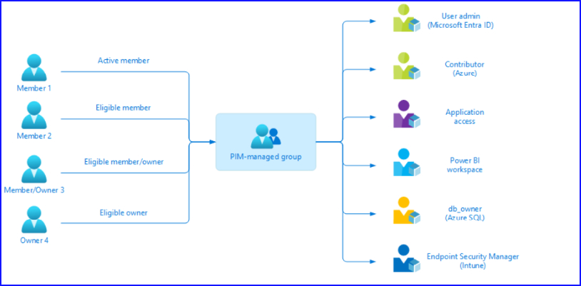
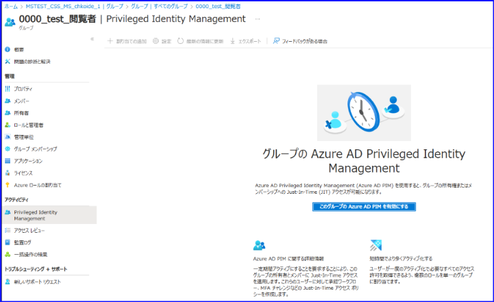
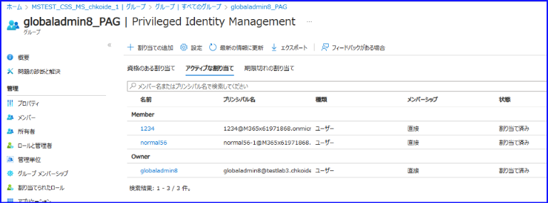
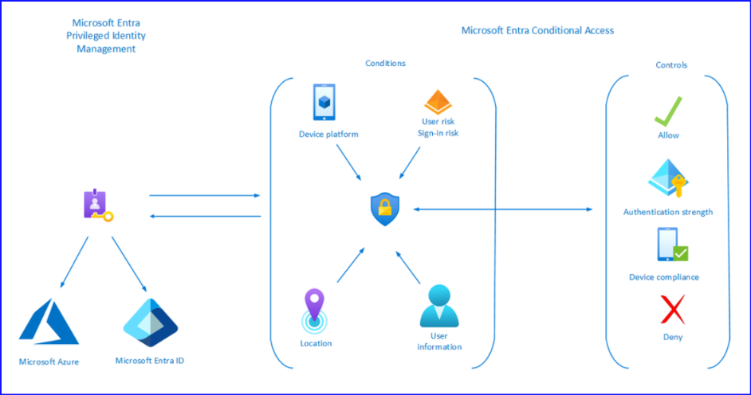
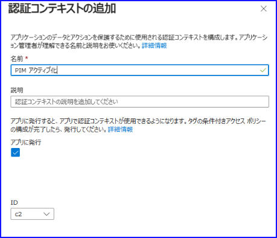
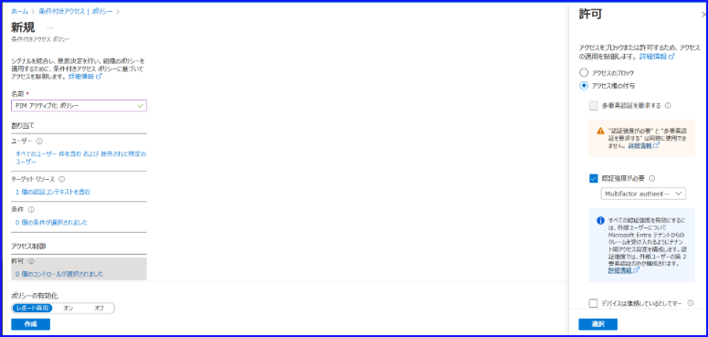
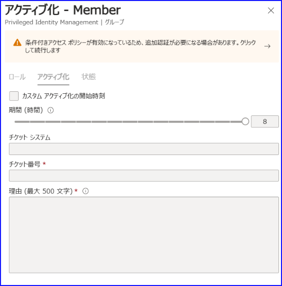
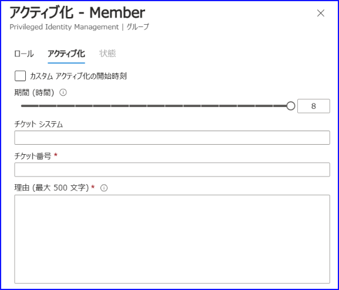
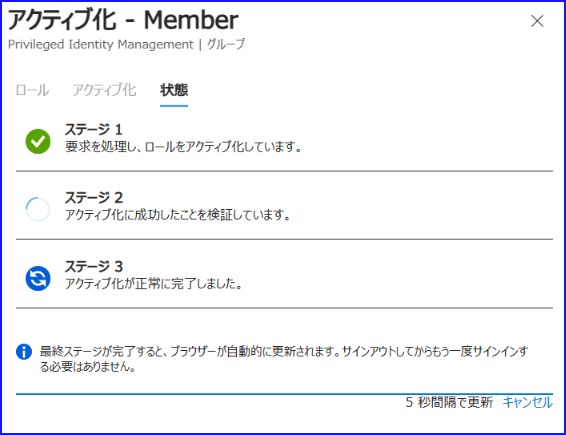

# グループ向けの PIM と条件付きアクセスとの統合機能が一般公開されました！

こんにちは、 Azure ID チームの小出です。

本記事は、2023 年 10 月 3 日に公開された [Just-in-time access to groups and Conditional Access integration in Privileged Identity Management](https://techcommunity.microsoft.com/t5/microsoft-entra-azure-ad-blog/just-in-time-access-to-groups-and-conditional-access-integration/ba-p/2466926) の記事を日本語に分かりやすくおまとめしなおした記事となります。ご不明点などございましたら、お気軽にサポートまでお問い合わせをいただけますと幸いです。

---

今回、 PIM の機能に 2 つの新しい機能が追加され、下記 2 つの機能が一般公開 (GA) されました。

- グループ向けの PIM
- PIM における条件付きアクセスとの統合

今回は新しく一般公開された機能について、詳細をご紹介いたします。

## グループ向けの PIM

グループ向けの  PIM は、グループの所有者ロールおよびメンバー ロールを必要な時に必要な時間だけ付与するという JIT (Just-In-Time) アクセスの機能です。長らくプレビューとして利用可能だった機能で、当時は特権アクセス グループと呼ばれていましたが、現在の名称は「グループ向けの PIM」 です。

通常の PIM では、Azure AD ロールや RBAC をベースに、ユーザーもしくはグループに資格のある割り当てを付与し、必要な時だけアクティブ化すると、そのロールの機能を利用できるようになるといった考え方をします。グループ向けの PIM は、上記のようにロールの有無を制御するのではなく、グループの所属状況を制御する方法です。

具体的に、下記図を利用して説明します。

 

上記の図において PIM-managed group と記載されているのが、グループ向けの PIM を利用しているグループです。通常のグループの所有者やメンバーは、以下の画面にある [メンバー] や [所有者] のメニューを使用して管理されます。グループ向けの PIM を利用したい場合、下記画面からグループごとに有効化します。

 

グループに対してこの「グループ向けの PIM」機能を有効にすると、下記のような画面が表示され、通常の PIM の画面と同じように割り当ての追加や設定を行うことができます。

 

 PIM-managed group と記載されている上の図に戻ります。図の内に表示されているユーザーはそれぞれ下記のとおりです。

- Member1 は、PIM-managed group のメンバーです。アクティブなメンバーのため、いつでもグループのメンバーとして、グループ画面の [メンバー] に表示されます。
- Member2 と 3 は、資格のあるメンバーです。そのため、グループ画面の [メンバー] には通常表示されません。このグループの正式なメンバーとなりたいときにだけ、 PIM でグループのアクティブ化を行うと、正式なメンバーに一時的になることができます。これらのメンバーのグループへの割り当てを管理したい場合は、[Privileged Identity Management] の画面からおこなう必要があります。
- Member3 と 4 は、資格のある所有者です。 PIM でグループのアクティブ化を行うと、所有者の権限を得ることが可能となります。上記メンバー ロールと同様に、所有者ロールも JIT で管理することができるようになります。

通常の PIM では、Azure AD ロールと RBAC のみ管理できましたが、グループ向けの PIM はグループのメンバーと所有者を管理 (JIT アクセスの付与) を行えます。このため、Microsoft Intune や Microsoft 以外のアプリケーションのロールやサービスなど、グループを権限の付与に使用しているものであればグループ向けの PIM を活用することができます。

この度 GA したグループ向けの PIM では:

- ロール割り当て可能なグループおよびロール割り当て不可能なグループの両方がサポートされます (プレビュー時代、ロール割り当て可能なグループのみ利用できる機能でしたが、現在はロール割り当て可能なグループかどうかにかかわらず利用できます。)
- セキュリティ グループと Microsoft 365 グループがサポートされます。
- 以前に存在していた 500 グループの上限は撤廃されました。

グループ向けの PIM については、[こちらの公開情報](https://learn.microsoft.com/ja-jp/azure/active-directory/privileged-identity-management/concept-pim-for-groups) も併せてご確認ください。

## 条件付きアクセス認証コンテキストを利用した PIM の管理

これまで PIM のアクティブ化においては、 MFA や承認を要求することはできましたが、それ以上の細かいポリシーを適用することができませんでした。今回用意された条件付きアクセス認証コンテキストを利用すると、PIM の動作に対して条件付きアクセスが提供する細やかなポリシーを適用することができます。

 

具体的には、下記のような制御を実施可能です。

- 条件付きアクセスの機能を利用して、強力な最新の認証方法 (高い認証強度) を要求する
- ロールのアクティブ化に際し、準拠したデバイスからの操作を必須にする
- GPS ベースのネームド ロケーションを利用し、位置情報を検証する
- Identity Protection の機能を活用し、危険なユーザーはアクティブ化できないようにする

具体的な活用方法を紹介します。この機能は Azure AD ロール、Azure RBAC、グループ向けの PIM すべてで利用可能です。

1. Azure ポータルより、[条件付きアクセス] - [認証コンテキスト] の画面を開き、新しい認証コンテキストを追加します。

     

2. 条件付きアクセス ポリシーを構成し、ターゲット リソースの項目にて、作成した認証コンテキストを選択します。

     

3. 条件付きアクセス ポリシーで要求させたい操作を [許可] の画面で選択します。

     

4. PIM の設定画面を開き、[アクティブ化で必要] の項目にて [Azure AD 条件つきアクセス認証コンテキスト] を選択し、作成した認証コンテキストを指定します。

     

5. この状態で資格のある割り当てを持つユーザーがアクティブ化をしようとすると、下記のように追加認証が要求されます。

     

6. 警告部分をクリックすると、 MFA 等が要求されるので操作を行います。MFA など追加認証が完了すると、アクティブ化操作を行えるようになります。

     

7. アクティブ化をクリックすると、他の設定項目などにもよりますが、アクティブ化を行うことが可能です。

     

認証コンテキストの詳細は、[こちらの公開情報](https://learn.microsoft.com/ja-jp/azure/active-directory/conditional-access/concept-conditional-access-cloud-apps#configure-authentication-contexts) も併せてご確認ください。
