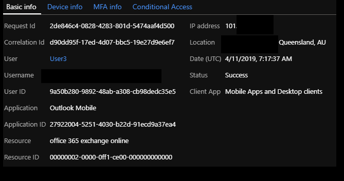
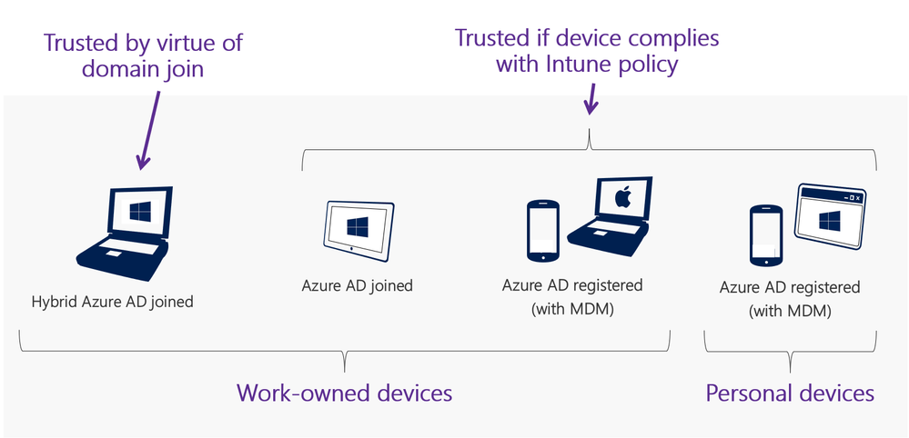
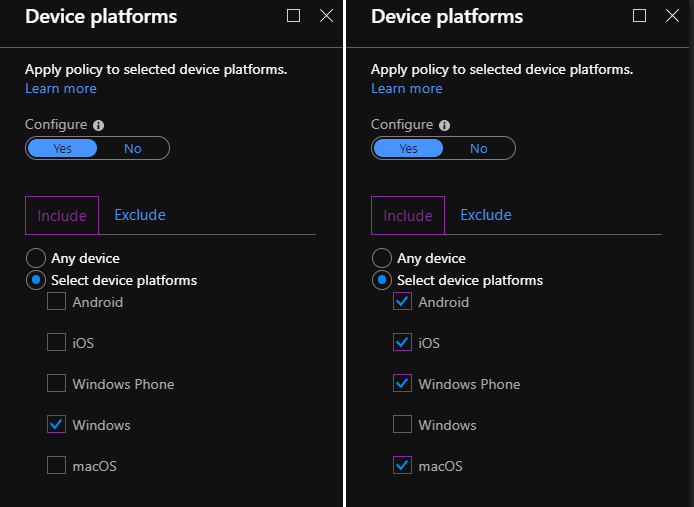
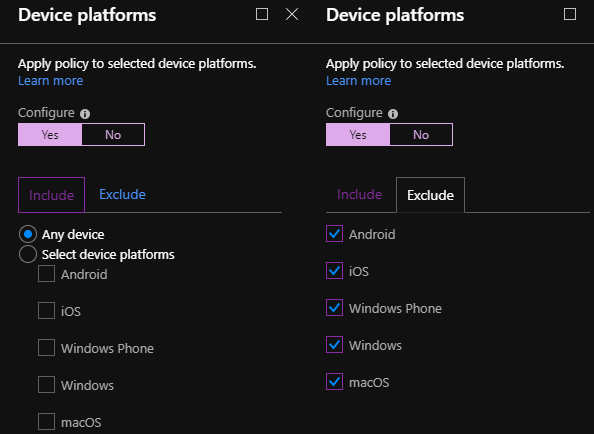
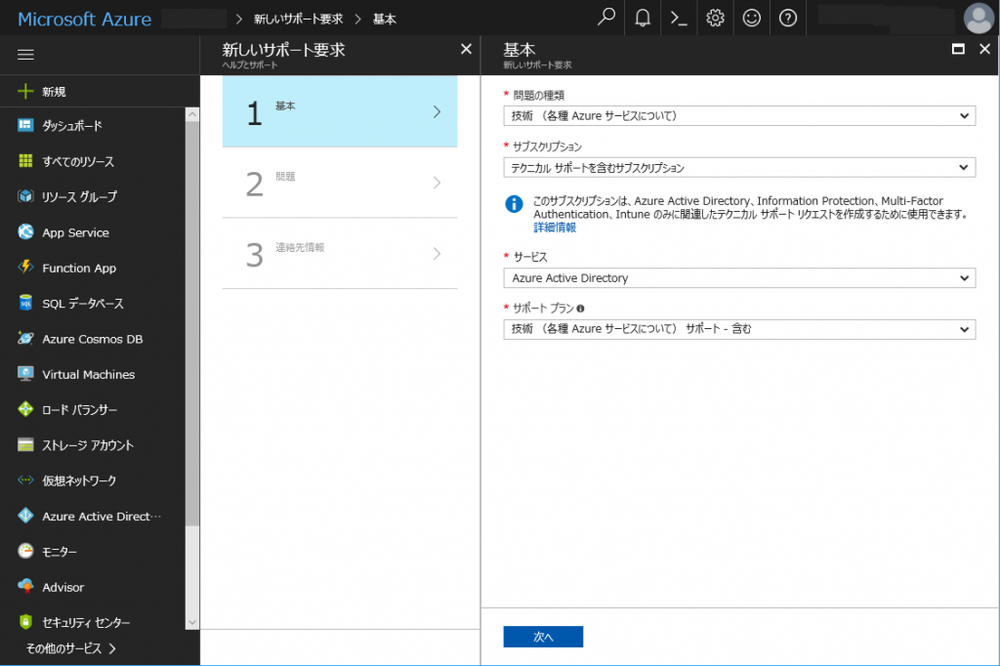
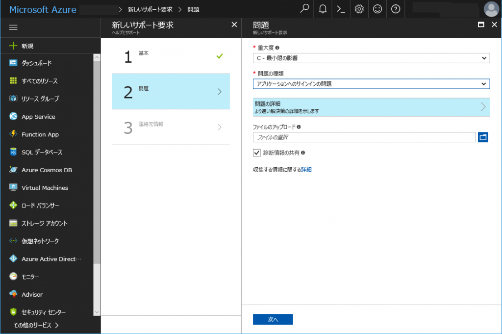

> [!NOTE]
> 本記事は Technet Blog の更新停止に伴い https://blogs.technet.microsoft.com/jpazureid/2017/12/04/conditional-access-qa/ の内容を移行したものです。
> 元の記事の最新の更新情報については、本内容をご参照ください。

# Azure AD の条件付きアクセスに関する Q&A

こんにちは、Azure & Identity サポート チームの高田です。

今回はお問い合わせをよくいただく、Azure AD の条件付きアクセスについてです。

> 2019/07/02 条件付きアクセスの動作の考え方やアクセス制御の適用順序など [Azure Active Directory Identity Blog](https://techcommunity.microsoft.com/t5/Azure-Active-Directory-Identity/Azure-AD-Mailbag-Conditional-Access-Q-amp-A/ba-p/566492) に投稿された内容を追記しました。

お問い合わせの多いご質問について、Q&A 形式でおまとめいたしました。既存のドキュメントではカバーされていない動作や質問について今後も適宜内容を拡充していきますので、ご参照いただければと思います。

---

Q. Office 365 を利用しているが、条件付きアクセスを利用できますか？

A. はい、利用可能です。Office 365 をご利用いただいているお客様は、認証基盤として Azure AD をご利用いただいている状態となります。そのため、追加で Azure AD Premium のライセンスを購入いただくことで、利用可能になります。

---

Q. 条件付きアクセスはどのように動作しますか？

A. 条件付きアクセスは、トークンの発行を保護する仕組みです。条件付きアクセス ポリシーが評価されるのは初回の認証の後、もしくは新しいアクセス トークンを取得するためにリフレッシュ トークンが利用された時です。考え方として重要な点は、条件付きアクセスは "クラウド アプリ" に選択されているものをトークンの消費者 (オーディエンス) と考え、各ポリシーはこのトークンの消費者を保護するものであるということです。

例えば、新しく条件付きアクセスポリシーを作成して "クラウド アプリ" として Exchange Online を選択し、アクセス制御で "多要素認証を要求する" を選択したとします。これにより、条件付きアクセスは、何らかのアプリが Exchange Online のトークンを要求した時に多要素認証を強制します。この場合、トークンの消費者 (オーディエンス) は Exchange Online となります。

トラブルシューティングの参考となるよう、Azure AD のサインイン ログにはリソースとリソース ID が表示されます。リソースの値がトークンの消費者 (オーディエンス) を示します。この例では、User3 が Outlook Mobile アプリを利用して Office 365 Exchange Online のトークンを要求し、正常にトークンが発行されたことを示します。

全ての "アクセス権の付与" の制御が行われた後で、セッションの制御が適用されます。

---

Q. アプリケーションにユーザーとグループの割り当てを行うことと、条件付きアクセスポリシーを利用することはどう違いますか？

A. Azure AD では、ユーザーがアプリにアクセスすることを許可するのに 2 つの方法があります。一つは、アプリの設定である "ユーザー割り当てが必要ですか？" を "いいえ" にして、ゲスト ユーザーを含むすべてのユーザーにアクセスを許可する方法で、もう一つは、上記設定を "はい" にして、アクセス可能なユーザーとグループを明示的に指定する方法です。アプリにアクセスできるユーザーを制御するのであればこれがベストな方法です。

Azure AD はアプリに許可されたユーザーにトークンを発行します。しかし、アクセス リクエストが条件付きアクセス ポリシーの適用対象となった場合、ユーザーがアプリケーションに割り当てられている場合でも、トークンを発行してもらうためには個別のアクセス リクエストに対するアクセス制御を満たさなければなりません。これにより、アプリケーションへの割り当てだけではなく、アクセス リクエストの条件に応じてトークンの発行をより細かく制御できるようになります。

---

Q. 条件付きアクセスのポリシーを複数作成し、適用の優先順位をつけることは可能でしょうか。

A. いいえ、優先順位を作成することはできません。条件付きアクセスではそれぞれのポリシーが独立しており、条件に合致したものが適用されます。複数のポリシーが適用される場合、対応するすべてのアクセス制御が強制されます。

---

Q. どのような順序でアクセス制御が適用されますか。

A. ブロックが常に優先されます。これに次いで、次のような順序でアクセス制御が強制されます。

1. 多要素認証
2. 承認されたクライアント アプリ / アプリの保護ポリシー
3. マネージド デバイス (準拠済み / Hybrid Azure AD Join)
4. カスタム コントロール (利用規約を含む)
5. セッション制御 (ブラウザー セッションの有効期限など)

---

Q. デバイスが信頼されているとどのようにして判断していますか。

A. 信頼されたデバイスというのは、Azure AD に登録されたマネージド デバイスであり、Intune のようなサポートされる MDM ソリューションで準拠済みとしてマークされたものか、オンプレミス Active Directory フォレストのメンバーであるものです。マネージド デバイスとして認識されるためには、Azure AD に登録されていることが前提となりますが、これだけでは条件付きアクセスでアクセスの制御を行うには不十分です。

どのようにマネージド デバイスが条件付きアクセスにより信頼されたと認識されるかについて、以下に図にまとめております。

---

Q. クライアント アプリがブラウザーであるか、モバイル アプリであるか、デスクトップ クライアントであるかをどのように識別していますか。

A. Azure AD 上にあるアプリケーションの登録状況をもとに判断しています。アプリケーションが、コンフィデンシャル クライアントもしくは SAML を利用するアプリとして登録されている場合、クライアントをブラウザーと判断します。アプリケーションがパブリック クライアントとして登録されている場合、クライアントをモバイルもしくはデスクトップ アプリと判断します。

コンフィデンシャル クライアントおよびパブリック クライアントの定義については、[こちら](https://tools.ietf.org/html/rfc6749#section-2.1) の OAuth 2.0 仕様をご覧ください。

---

Q. クライアント アプリが動作しているデバイス プラットフォームをどのようにして認識していますか。

A. 条件付きアクセスポリシーでは、特定のデバイス プラットフォームを対象にすることが可能です。この機能はポリシーの構成により柔軟性を提供するとともに、条件を満たすデバイス プラットフォームにのみアクセス制御を強制できるようにするためです。

デバイス プラットフォームは、User Agent の文字列を解析することで判定されます。この User Agent 文字列は、クライアント アプリケーション側で指定され、Web のプロトコルでのみ利用されます。User Agent の文字列は、POP3 や SMTP など条件付きアクセスがサポートするいくつかのプロトコルには存在しません。このため、User Agent の文字列は存在しないことや不正確である場合があり、この文字列に依存しないようにすることが重要です。多くのブラウザーでは、開発者ツールを用いることで User Agent の文字列を任意の値に変更することが可能です。

お客様が最初にポリシーを展開しようとする際、iOS や Android など特定の対象デバイス プラットフォームを指定されることがよくあります。これはわかりやすいアプローチではありますが、プラットフォームの判定は上述のとおり確実ではないことにご注意いただく必要があります。最終的に、条件付きアクセスの選択肢にないデバイス プラットフォームが出てきたときにどうするかも含め、すべてのデバイス プラットフォームをカバーするよう条件付きアクセスのポリシーを構成ください。

以下に例を挙げます。ここに 2 つのポリシーが存在しているとします。

1. Windows を対象とし、Hybird Azure AD Join を強制するポリシー
2. Android, iOS, Windows Phone, macOS を対象とし、準拠しているとしてマーク済みであることを強制するポリシー

一見問題なく見えますが、仮に User Agent 文字列が不正 (意図的に値が変更されているか、通常ではありえない値) となっているリクエストを受信すると、上記二つのポリシーは適用されず、ユーザーにはアクセスが許可されます。

不明なデバイスプラットフォームもカバーする形でポリシーを定義するには以下のようにします。

- 新しいポリシーを作り、すべてのクラウド アプリを対象とする (ユーザーについてはまずは一部のみ選択して、問題なければその後すべてのユーザーに適用する)
- デバイス プラットフォームの条件を以下のように構成する  
(全てのデバイス プラットフォーム) - (Android, iOS, WP, Windows, macOS) = 不明なデバイス プラットフォーム

- 強制したいアクセス制御を選択する (まずは多要素認証かブロックを選択する)

不正に値が設定された User Agent の例では、上記のようにすることで、デバイス プラットフォームが判別されなくても、最低一つのアクセス制御が適用されるようにできます。加えて、このように構成することでサインインの監視ができるようになり、必要があれば、正規のユーザーを条件付きアクセスの除外対象にするということも可能となります。

---

Q. Azure AD Application Proxy を利用して公開しているアプリケーションなども条件付きアクセスで制御可能でしょうか。

A. はい、条件付きアクセスで制御可能です。Azure AD 上に登録されているアプリケーションであれば、条件付きアクセスで制御できます。Azure AD Application Proxy を利用して公開しているアプリケーションやご自身で開発し Azure AD 上に登録したアプリケーションも制御対象とすることが可能です。

---

Q. Azure AD B2B コラボレーション機能により招待されたゲスト ユーザーに対して条件付きアクセスのルールを適用する場合には、Azure AD Premium のライセンスを購入する必要があるのでしょうか。

A. いいえ、テナントに割り当てられている Azure AD Premium ライセンス数の 5 倍までのアカウントであれば、ゲスト ユーザーに対して条件付きアクセスを含む Azure AD Premium の機能を利用させることが可能です。詳細は下記公開情報を参照ください。

Azure Active Directory B2B コラボレーションのライセンスに関するガイダンス

https://docs.microsoft.com/ja-jp/azure/active-directory/active-directory-b2b-licensing

---

Q. Azure AD Premium のライセンスを対象人数分購入すれば、該当ユーザーに割り当てる必要はないでしょうか。

A. いいえ、要件として人数分購入いただくだけでなく、ユーザーに対して割り当てる必要がございます。

---

Q. 条件付きアクセスを利用するためには、Azure AD Premium のライセンス数を何個購入すればよいでしょうか？

A. 条件付きアクセスの機能を利用してアプリケーションへのアクセス可否の評価が行われるユーザーに対して、Azure AD Premium (P1 以上) を割り当てる必要があります。現時点の実装では、Azure AD Premium ライセンスを割り当てていないユーザーであっても、ポリシーの対象であれば条件付きアクセス ポリシーの内容に従ってアクセス制限が行われますが、このような状態での利用はライセンス違反となります。

---

Q. 条件付きアクセスの [場所] の条件にクライアントの IP アドレス範囲を入れましたが制御されません。どうしてでしょうか？

A. 条件付きアクセスの [場所] の条件では、組織が外部と通信する際のグローバル IP アドレス (Azure AD から見た送信元グローバル IP アドレス) を利用します。例えば、社内のクライアントがプライベート IP アドレスを保持しており、外部ネットワークと通信する際にはグローバル IP アドレスを持つゲートウェイを経由して Azure AD と通信する環境があるとします。この場合、Azure AD から見ると、送信元 IP アドレスはグローバル IP アドレスを持つゲートウェイとなります。このような時は、件付きアクセスの [場所] の条件には、ゲートウェイのグローバル IP アドレスを指定ください。

---

Q. 条件付きアクセスで、X-Forwarded-For HTTP ヘッダーを利用して、組織内のクライアントの送信元 IP アドレスを判断可能ですか？

A. いいえ、X-Forwarded-For HTTP ヘッダーを使用し、条件付きアクセスで組織内のクライアントの送信元 IP アドレスを判定することはできません。条件付きアクセスの [場所] の条件では、組織が外部と通信する際のゲートウェイが持つグローバル IP アドレス (Azure AD から見た送信元グローバル IP アドレス) が制御に利用されます。Azure AD には、このグローバル アドレスを場所として利用します。

X-Forwarded-For HTTP ヘッダーは HTTP ヘッダー フィールドの 1 つです。ロード バランサーなどでクライアントの送信元 IP アドレスが変換された場合でも、HTTP ヘッダーに接続元のクライアント IP アドレスの情報を付加することで、接続先サーバーが接続元クライアント IP アドレスを特定できるようにするために利用されます。しかしながら、この X-Forwarded-For HTTP ヘッダーで指定された情報は組織内の IP アドレスであり、場所を示すものではありません。このような理由から、現状 Azure AD では、組織が外部と通信する際のゲートウェイのグローバル IP アドレス (Azure AD から見た送信元グローバル IP アドレス) を制御に利用しています。

---

Q. クレームルールと条件付きアクセスは併用は可能ですか？

A. はい、技術的には可能です。AD FS を利用したフェデレーション環境であれば、クレーム ルールが判定された後、条件付きアクセスが動作します。クレーム ルールで認証が拒否された場合は、その後の条件付きアクセスの処理は動作しません。ただし、類似機能であるため運用の複雑さなどを考慮すると、どちらか一方の機能をメインでご利用いただくのがよいかと存じます。

---

Q. 条件付きアクセスの設定において、全てユーザーがアクセスできない設定になってしまいました。設定を解除可能でしょうか。

A. このような状況の場合は、残念ながらお客様側での解除はできません。そのため、設定の解除をご希望の場合は、お手数ですが弊社サポート サービスをご利用いただけますと幸いです。Azure ポータルにもアクセスができない状況と存じますので、ほかにお持ちのテナントからお問い合わせを発行ください。
サポート サービスをご利用いただくには、Azure ポータル上から、Azure Active Directory を選択し、[新しいサポート要求] を選択ください。以下のような画面からお問い合わせいただければと思います。

上記内容が少しでもお客様の参考となりますと幸いです。
